# 알고리즘(Algorithm)

## 알고리즘

- 문제를 해결하기 위해 수행해야 하는 절차나 방법
- 컴퓨터 과학에서의 알고리즘 → **원하는 결과를 얻기 위해 수행해야 하는 절차**

## APS (Algorithm Problem Solving)

- **프로그래밍을 이용**하여 주어진 **문제**(또는 알고리즘 문제)**를** **해결하는 과정  
  *→** 다양한 방식으로 사고할 수 있는 사고력을 기르기 위함*
- 자료구조, 알고리즘 기법, 등을 익히는 과정
- 온라인 저지 플랫폼(SWEA)를 통해 학습할 수 있음

## 알고리즘 맛보기 (1~100 까지의 합을 구하는 문제)

- 알고리즘1 (실제로 더하기)
- 알고리즘2 (공식 활용하기)

⇒ n의 값이 작을 때 는 별 차이가 없지만 공식을 알고있을 때, n의 크기가 클 때 2번의 활용이 훨씬 더 좋

## 무엇이 좋은 알고리즘인가?!

- 정확성 : 얼마나 **정확하게 동작**하는가
- 작업량 : 얼마나 **적은 연산으로 원하는 결과**를 얻어내는가
- 메모리 사용량 : 얼마나 **적은 메모리를 사용**하는가
- 단순성 : 다른 사람이 **이해하기 쉬운**가
- 최적성 : 더 이상 **개선할 여지없이 최적화**되었는가

## 알고리즘을 표현하는 방법

1. 자연어  
   → *사람의 말, 글, 등*
2. 순서도  
   → *마름모 : 분기(조건)문*
3. 의사코드(pseudocode)  
   → 작성하는 방법이 다양하다. (의사 코드에 대해 깊게 공부할 필요 없다)
4. Programming Language  
   →

## 알고리즘 성능

- 문제를 해결하기 위해 **다양한 알고리즘을 적용해 볼 수 있음** → **성능 분석이 필요!**

## 시간 복잡도(Time Complexity)

- 알고리즘이 문제를 해결하기 위해 **얼마나 많은 연산(또는 단계)를 수행**하는지를 나타내는 **척도**
- 입력 크기가 커졌을 때 알고리즘의 **처리 시간이 어떻게 증가하는지**를 파악함으로써 향후 대규모 데이터에 대해서도 **효율적으로 동작할지 예측 가능**

## 빅-오(O) 표기법

- **시간 복잡도를 표현**할 때 주로 사용되는 방법
- 시간 복잡도의 **최댓값 (최악의 경우)를 나타냄**  
  → 입력 크기 **N이 매우 커졌을 때**, 연산 횟수가 **어느 정도로 증가하는지를 나타내는 방식**
- 시간복잡도 함수 중에서 **가장 큰 영향력을 주는 n에 대한 항만을 표시**
- **계수(Coefficient)는 생략**하여 표시

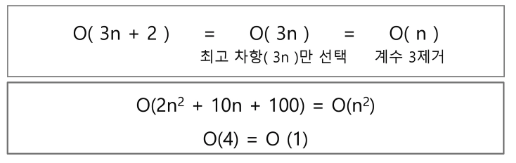

## 자주 사용되는 빅-오(O) 표기

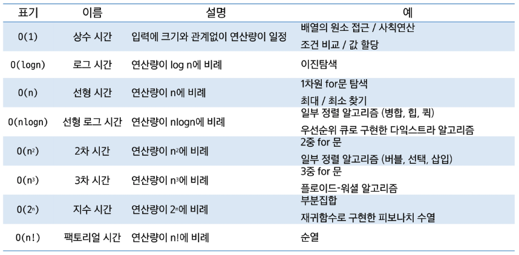

→ log : 절반..?

## 다양한 시간 복잡도의 비교

- 요소 수의 증가함에 따라 각기 다른 시간 복잡도의 알고리즘은 아래와 같은 연산 수를 보임

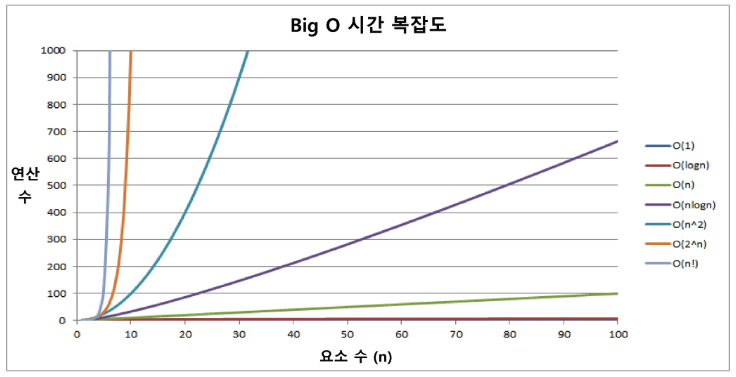

## 시간 복잡도 별 실제 실행 시간 비교

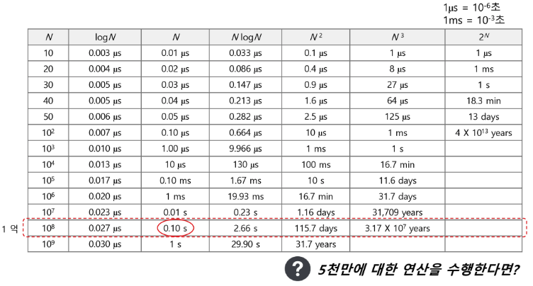

좋은 알고리즘으로 컴퓨터의 성능을 올릴 수 있다..

## SW 문제를 완벽하게 풀기 위한 5단계

1. 지문을 읽는다             → 지문을 읽고 **핵심 부분을 파악**한다
2. 문제를 이해한다         → 핵심 부분에서 정확히 **요구하는 것이 무엇인지 분석**한다
3. 문제를 풀어본다         → 노트에 **손으로 문제를 풀어본다**
4. 풀이를 코딩한다         → 노트로 풀어본 내용을 **소스코드로 코딩**한다
5. 디버깅하고 검증한다 → **디버깅**을 하고 예외가 발생하지 않는지 **검증**한다

## APS 기본 과정

- **자료구조 학습** (배열, 문자열, 스택, 큐, 연결리스트, 트리, 힙)
- 간단한 **정렬 기법**
- **코딩 체력**을 기르는 단계
- **문제풀이와 친해**지는 단계

## APS 응용 과정

- 알고리즘 **기법 학습** (부분집합, 조합, 순열, DFS, BFS, …)
- **고급 정렬 기법**
- **컴퓨팅 사고력**을 기르는 단계
- **문제풀이에 익숙**해지는 단계

---

# 1차원 배열

## 배열(Array)

- 동일한 **데이터 타입의 값**(0개 이상)들을 **저장하기 위한 자료구조**

## 배열의 필요성

- 프로그램 내에서 **여러 개의 변수**가 필요할 때, 전부 다른 변수명을 이용하여 접근하는 것은 **비효율적  
  *→** 변수를 선언할 때 변수명을 최대한 유의미한 변수명으로 작성*
- 배열을 사용하면 **한 번의 선언을 통해서 여러 개의 데이터를 다룰 수 있음**
- 여러 개의 변수를 편하게 사용하는 것이 아닌 **다수의 변수로 하기 힘든 작업**을 배열을 통해 **쉽게 활용**할 수 있음

## 1차원 배열의 선언 필요한 요소 3가지

1. **자료형 :** 배열을 이루는 자료형 (기초자료형, 참조자료형 모두 가능)  
   → 클래스를 직접 선언해서 사용 가
2. **배열 이름 :** 프로그램에서 사용할 배열의 이름 (주소 값 저장)
3. **길이 :** 배열을 이루는 요소의 값 (배열의 **고정된 길이**)
- `자료형 [] 배열이름 = new 자료형 [길이];`

## 1차원 배열의 요소 접근

- **인덱스의 값은 0 부터** 시작
- 배열의 길이를 벗어나는 값을 사용할 수 없음(**N개의 크기 → 0 ~ N-1 활용**)
- `nums[0] = 10;`  // 배열 nums의 0번째 원소에 10을 저장
- `nums[idx] = 20;`  // 배열 nums의 idx번째 원소에 20을 저장

## 1차원 배열의 순회

- 배열의 요소를 빠짐 없이 탐색하는 방법

```java
int[] arr = { 0, 1, 2, 3, 4, 5, 6 }; //길이는 7
int N = arr.length; //7

System.out.println("정방향순회 ->");
for (int i = 0; i < N; i++) {
	System.out.print(arr[i] + " ");
}
System.out.println();

System.out.println("역방향순회 <-");
//2-1. 반복문의 조건을 건드리는 방법
for (int i = N -1; i >= 0; i--) {
	System.out.print(arr[i] + " ");
}
System.out.println();
//2-2. 인덱스를 건드리는 방법(주의 요망!)
for (int i = 0; i < N; i++) {
	System.out.print(arr[N - 1 - i] + " ");
}
```

- 특정 인덱스를 기준으로 양쪽으로 이동

```java
// 특정 인덱스를 기준으로 양쪽으로 퍼지게 순회
// 이거는 직접 생각해서 작성해보자 (마음의 숙제)
// 0 1 2 [3] 4 5 6

// 0 1 [2] 3 4 5 6
```

## Scanner

- **표준 입력(주로 콘솔)으로 부터** 데이터를 쉽게 읽어오기 위해 사용되는 클래스
- `import java.util.Scanner;`
- `Scanner sc = new Scanner(System.in);`

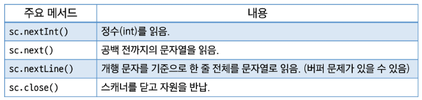

- **익숙해지면** `BufferedReader`를 사용하기도 함(초보자는 추천X, 코드가 길어짐)

자바에서 문자 1개를 입력 받는 방법은 없다. (무조건 문자열)

`sc.nextInt()` 와 `sc.nextLine()`을 **같이 쓰려고 할 때 문제 발생!**  
→ \n 을 입력 받는 경우가 생김

## 1차원 배열의 입력

- 1차원 배열의 길이 N이 주어지고, 다음 줄에는 1차원 배열의 값이 주어진다.

## 연습문제

### Gravity

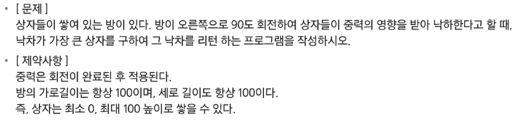

```java

```

---

# 버블 정렬(Bubble Sort)

## 정렬 (Sort)

- 데이터(**숫자, 문자, 객체** 등)들을 일정한 규칙(오름차순, 내림차순 등)에 따라 **순서대로 재배열** 하는 것
- 다양한 알고리즘에서 선행 작업으로 활용되기도 함 (데이터 처리 속도 향상)
- 자바에서는 Arrays 클래스와 Collections 클래스에서 **sort()메서드를 지원**함

## 정렬의 종류

- 버블 정렬 (Bubble Sort)
- 선택 정렬 (Selection Sort)
- 카운팅 정렬 (Counting Sort)
- 삽입 정렬 (Insertion Sort)
- 힙 정렬 (Heap Sort)
- 병합 정렬 (Merge Sort)
- 퀵 정렬 (Quick Sort)
- …

## 버블 정렬(Bubble Sort)

- 인접한 **두 개의 원소를 비교**하여, **크기가 순서에 맞지 않는다**면 **서로 교환(Swap)** 하는 과정을 **반복하여 정렬하는 알고리즘**
- 한 사이클이 끝날 때 마다 **가장 큰(또는 작은) 원소가 끝에 위치하게 되는 모습**이 거품이 올라오는 것과 유사하다고 하여 ‘버블 정렬’이라고 부름
- 시간 복잡도 : **O(N^2)**

## 버블 정렬 과정

- 배열의 처음부터 끝까지 **인접 원소를 짝지어 비교**
- 비교한 두 원소의 **순서가 잘못** 되어 있다면 교환 (Swap) → 오름차순, 내림차순
- 한 사이클이 끝나면 배열의 마지막 인덱스에서 가장 큰(작은) 원소가 위치
- 범위를 줄여 나가며 N-1번 정도 반복 수행하면 정렬 완료

## 버블 정렬 과정 {55, 7, 78, 12, 42} (오름차순)

- 첫번째 사이클

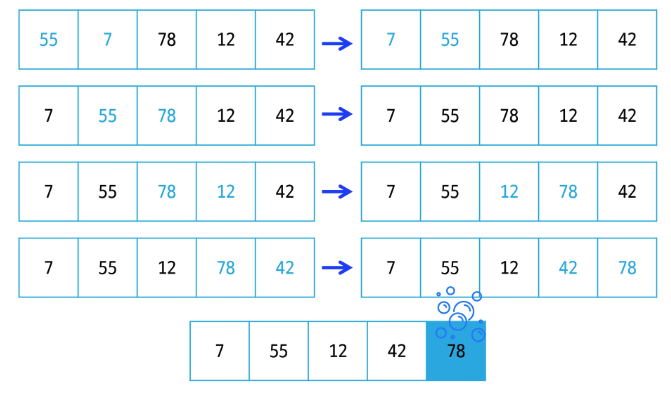

- 두번째 사이클

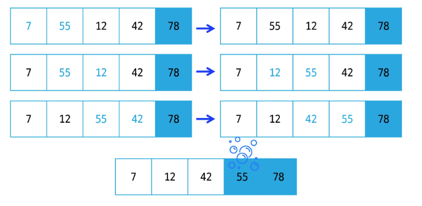

- 세번째 사이클

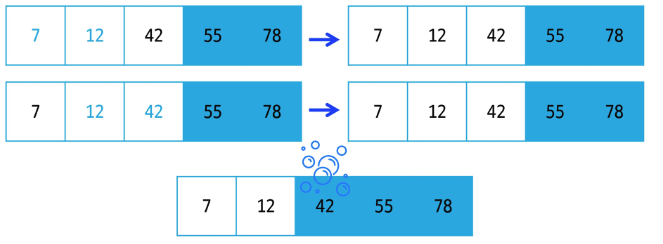

- 네번째 사이클

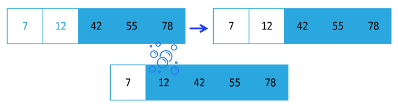

- 다섯번째 사이클
    - 남은 원소가 하나이므로 이미 정렬된 것으로 볼 수 있음
      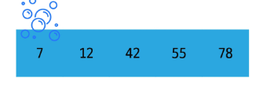
```java
public class Array03_버블정렬 {
		public static void main(String[] args) {
				int[] arr = {55, 7, 78, 12, 42};
		
				System.out.println("사이클 정렬 전");
				System.out.println(Arrays.toString(arr));
				//함수로 만들어도 좋다
				int N = arr.length;
				
				// for문 2개
				for (int i = N-1; i > 0; i--) {
						for (int j = 0; j < i; j++) {
								//오름차순(이슈 발생)
								if(arr[j] > arr[j+1]) {
										int tmp = arr[j];
										arr[j] = arr[j+1];
										arr[j+1] = tmp;
								}
						}//인접한 두개를 비교하는 반복문
						System.out.println("사이클이 끝난 뒤 모습");
						System.out.println(Arrays.toString(arr));
				}//N-1번만 반복문 수행! (i 위치는 각 사이클에서 최대 데이터가 저장될 위치)		
				System.out.println(Arrays.toString(arr));
		}
}
```

## 버블 정렬 의사 코드

```java
bubbleSort(array A, n):
		for i in range from 0 to n-2:
				// i번째 패스 (맨 끝 i개는 이미 정렬 됨)
				for j in range from 0 to (n-2 - i):
						if A[j] > A[j+1]:
								swap A[j] and A[j+1]
```