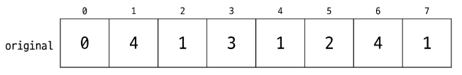
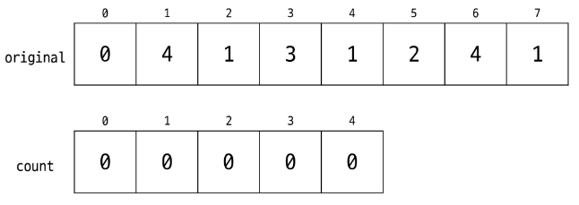
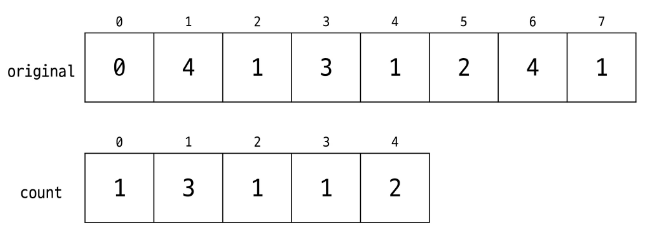
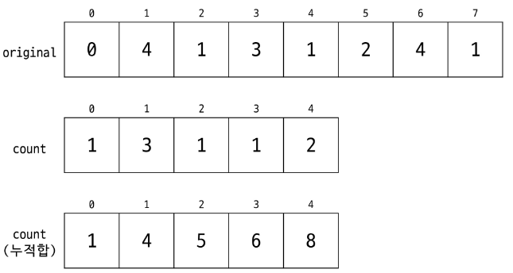
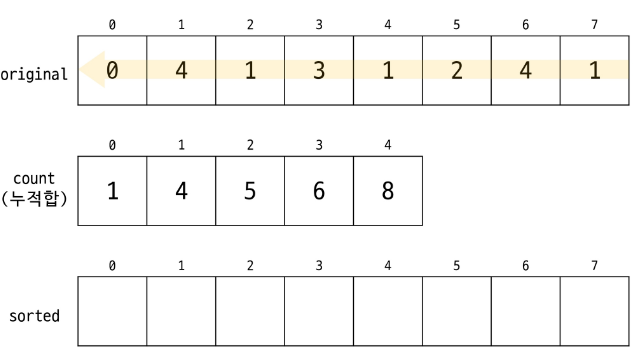
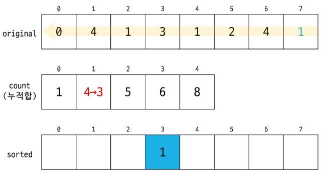

# 검색(Search)

- 데이터 구조 안에서 **특정한 값**을 빠르고 효율적으로 찾기 위해 사용되는 알고리즘
- **데이터 베이스**에서 원하는 정보를 찾을 때
- **특정한 값(아이템)이** 배열 또는 리스트에 **존재하는지를 확인**할 때
- 그래프에서 **특정 노드에 도달 가능한지**를 탐색할 때
- …

## 검색의 종류

- 선형 검색(Linear Search) / 순차 검색(Sequential Search)
- 이진 검색 (Binary Search)
- 인덱싱 (Indexing)
- 탐색 (DFS, BFS)

## 순차 검색(Sequential Search)

- **앞에서부터 자료를 순서대로 검색**하는 방법
- **가장 간단하고 직관적**인 검색 방법
- 배열이나 연결 리스트 등 **순차 구조로 구현된 자료구조에서** 원하는 값을 찾을 때 **유용함**
- 구현은 간단하지만 **검색 대상의 수가 많은 경우**에는 수행시간이 급격히 증가하여 **비효율적임**
- **정렬 여부와 관계없이** 적용가능 함

## 순차 검색 : 정렬 X

- 첫 번째 원소부터 순서대로 검색
- 해당 원소와 **키 값이 일치하는지 비교**하여 **일치하면 해당 위치 반환**
- 자료구조의 마지막에 도달할 때 까지 키 값을 찾지 못하면 검색 실패

> **키(Key)** → **탐색하고자 하는 값**(검색 대상)  
검색 실패 시 -1 반환 하기도 함
>
- 찾고자 하는 **원소의 순서에 따라 비교 횟수가 결정됨**
- 첫 번째 위치에서 원소를 찾으면 1번 비교, 두 번째 위치에서 원소를 찾으면 2번 비교, …
- 정렬되지 않은 자료구조에서 순차 검색의 평균 비교 횟수  
  → (n + 1) / 2
- 시간 복잡도 : O(n)
- 의사 코드 예시

```java
//a : 1차원 배열, n : 배열 크기, key : 찾고 싶은 값
sequentialSearch(int[] a, int n, int key)
		i <- 0
		while (i<n and a[i]!=key)
				i <- i+1;
		if (i<n) return i;
		else return -1;
```

## 순차 검색 : 정렬 O

- 자료가 **오름차순으로 정렬된 상태라고 가정**
- 첫 번째 원소부터 순서대로 검색
- 해당 원소와 키 값이 일치하는지 비교하여 일치하면 해당 위치 반환
- 해당 **원소의 값이 키 값보다 크다면** 찾는 원소가 없다는 것이므로 **검색 종료**
- 찾고자 하는 원소의 순서에 따라 비교 횟수가 결정됨
- 정렬이 되어있으므로, 검색 실패를 반환하는 경우 평균 비교 횟수가 반으로 감소
- 시간 복잡도 : O(n)
- 의사 코드 예시

```java
//a : 1차원 배열, n : 배열 크기, key : 찾고 싶은 값
sequentialSearch2(int[] a, int n, int key)
		for i in range from 0 to n-1:
				if a[i] == key: return i;
				else if a[i] > key: break;
		return -1
```

## 이진 검색(Binary Search)

- 키 값을 찾을 때까지 데이터의 **범위를 절반씩 줄이면서 검색**하는 방식
- 자료가 **정렬된 (오름차순, 내림차순) 상태여야 함**
- 시간 복잡도 : O(log n )
    1. 자료의 중앙에 있는 원소를 고른다
    2. 중앙 원소의 값과 찾고자 하는 목표 값을 비교한다
    3. 목표 값이 중앙 원소의 값보다 작으면 자료 구간의 범위를 왼쪽으로 축소  
       목표 값이 중앙 원소의 값보다 크다면 자료 구간의 범위를 오른쪽으로 축소
    4. 찾고자 하는 값을 찾을 때까지 **1~3의 과정을 반복**한다.
- 반복문을 이용한 구현
- 검색 범위의 시작점과 종료점을 이용하여 검색을 반복 수행
- 자료의 삽입이나 삭제가 발생했을 때 배열의 상태를 항상 정렬된 상태로 유지해야 함

```java
binartSearch(int[] a, int key)
		left <- 0;
		right <- length(a)-1;
		while (left <= right){
				mid = (left + right)/2;
				if (a[mid] == key) return true;           //검색 성공
				else if (a[mid] ? key) right = mid - 1;   //왼쪽
				else left = mid + 1;                      //오른쪽
		}
		return false; //검색 실패
```

- 재귀함수를 이용한 구현
- 추후에 학습 예정

```java
binarySearch2(int[] a, int left, int right, int key) :
		if (left > right) return false;                  //검색실패
		
		mid = (left + right) / 2;
		if (key == a[mid]) return true                   //검색 성공
		else if (key < a[mid])                           // 왼쪽
				return binarySearch2(a, left, mid - 1, key)
		else if (key > a[mid])                           // 오른쪽
				return binarySearch2(a, mid + 1, right, key)
```

---

# 선택 정렬(Selection Sort)

## 셀릭션 알고리즘 (Selection Algorithm)

- **정렬이 되어 있지 않은** 배열이나 리스트에서 **K번째 작은(또는 큰) 원소를 찾아내는** 알고리즘
- **최솟값, 최댓값, 중간 값, 임의의 k번째 작은 값**을 빠르게 구하고 싶을 때 사용

## 대표적인 셀렉션 알고리즘

- 정렬 후 선택
- 퀵 셀렉트
- Median of Medians

## 셀렉션 알고리즘

- 1번부터 k번째 까지의 작은 원소들을 찾아 배열의 앞쪽으로 이동시키고, 배열의 k번째를 반환
- k가 비교적 작을 때 유용하며 O(kn)의 수행시간을 필요로 함

```java
Select(int[] nums, int k) {
		for i from 1 to k {
				minIndex = i;
				for j from i+1 to n {
						if nums[minIndex] > nums[j] {
								minIndex = j;
						}
				}
				swap(nums[i], nums[minIndex]);
		}
		return nums[k]
}
```

## 선택 정렬 (Selection Sort)

- 정렬되어 있지 않은 배열 혹은 리스트에서 **가장 작은(또는 가장 큰) 원소를 찾아 맨 앞(또는 맨 뒤)으로 옮기는 과정을 반복**하여 **전체를 정렬하는 과정**
- 시간 복잡도 : O(N^2)

## 정렬 과정

- **주어진 리스트 중에서 최솟값**을 찾는다
- **맨 앞의 원소**와 **가장 작은 값**을 **swap**한다
- 맨 앞의 원소를 제외한 **나머지 구간에 반복 수행**한다

## 선택 정렬(Selection Sort) 과정

1. 주어진 리스트에서 최솟값을 찾는다  
   [64 25 **10** 22 11]
2. 리스트의 맨 앞에 위치한 값과 교환한다  
   [**10** 25 **64** 22 11]
3. 정렬되지 않은 리스트에서 최솟값을 찾는다  
   [**10** 25 64 22 **11**]
4. 정렬되지 않은 리스트의 맨 앞에서 위치한 값과 교환한다  
   [**10** **11** 64 22 25]
5. 정렬되지 않은 리스트에서 최솟값을 찾는다  
   [**10** **11** 64 **22** 25]
6. 정렬되지 않은 리스트의 맨 앞에 위치한 값과 교환한다  
   [**10** **11** **22** 64 25]
7. 정렬되지 않은 리스트에서 최솟값을 찾는다  
   [**10** **11** **22** 64 **25**]
8. 정렬되지 않은 리시트의 맨 앞에 위치한 값과 교환한다  
   [**10** **11** **22** **25** 64]
9. 마지막 원소는 정렬된 것으로 간주한다

## 선택 정렬 (Selection Sort) 의사 코드

```java
SelectionSort(int[] nums, int N){ //nums : 정렬할 배열, N : 배열크기
		for i from 0 to N-1 {
				minIdx <- i;
				for j from i+1 to N {
						if (nums[minIdx] > nums[j]) {
								minIdx <- j;
						}
				}
				swap(nums[i], nums[minIdx]);
		}
}
```

---

# 카운팅 정렬(Counting Sort)

- 항목들의 순서를 결정하기 위해 **집합에 각 항목이 몇 개씩** 있는지 **세는 작업**을 하여, 선형 시간에 정렬하는 효율적인 알고리즘
- **안정적(Stable) 정렬로 구현** 가능 (원본 순서 보존)
- **정수나 정수로 표현할 수 있는 자료**에 대해서 정렬 가능  
  → 각 항목의 발생 횟수를 기록하기 위해 **정수 항목으로 인덱스 되는 카운트들의 배열을 사용하기 때문**
- 카운트들을 위한 **충분한 공간을 할당하려면** 집합 내의 **가장 큰 정수를 알아야 한다    
  →** 가장 작은 값도 알면 좋음
- 시간 복잡도 : O(n + k) → **n은 배열의 길이**, **k는 정수의 최댓값**

## 카운팅 정렬(Counting Sort) 과정

1. 데이터가 들어갈 수 있는 범위 확인
    1. 데이터의 범위가 항상 0부터 시작한다는 보장은 없음  
       → 문제를 잘 읽고 판단할 것



1. 0 ~ k (데이터 범위)까지의 배열을 생성



1. 데이터를 순회하면서 해당 인덱스의 값을 증가 시킴



1. 카운트 배열의 누적합을 구함 → **정렬된 결과를 어느 위치에 배치해야 하는지 알 수 있게 됨**



1. 원본 배열의 뒤에서부터 순회하며 원소를 배치





## 카운팅 정렬 의사 코드

```java
countingSort(A, n, k):
		// A: 길이 n인 배열, 값의 범위: 0..k (정수)
		// 결과를 담을 배열 B 준비 (길이 n)
		// 카운트 배열 count (길이 k+1) 0으로 초기화
		
		for i in range 0 to n-1:
				count[A[i]]++
				
		// count[x]를 0부터 x까지의 등장 횟수를 누적합 형태로 변경
		for x in range 1 to k:
				count[x] = count[x] + count[x-1]
				
		// 뒤에서부터 A를 확인하며 결과 B에 배치
		for i in range n-1 downto 0:
				val = A[i]
				count[val]--
				newIndex = count[val]
				B[newIndex] = val
				
		return B
```

## 카운팅 정렬

- 카운팅 정렬을 항상 사용하는 것이 좋은가?  
  → **{1, 2, 10억, 1} 을 정렬하려고 할 때 낭비 발생**
- 안정 정렬은 무슨 뜻인가?  
  → 같은 값을 가지는 복수의 원소들이 **정렬 후에도 정렬 전과 같은 순서를 가짐**

- 복수의 원소 카운팅 정렬(두 번째 기준 정렬)

- 복수의 원소 카운팅 정렬 (첫 번째 기준 정렬)

- 복수의 원소 카운팅 정렬 (정렬 완료)