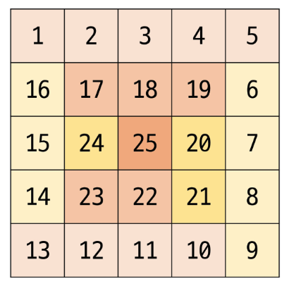

# 2차원 배열(Array)

## 2차원 배열

- 배열의 각 요소가 또 다른 1차원 배열을 가리킴 (**크기가 일정하지 않아도 OK**)  
  *→ 보통의 문제에서는 크기가 일정…*
- 행(row)과 열(column)의 구조 / 테이블 구조 / 좌표 평면 구조 등

## 2차원 배열의 선언

- `데이터타입[][] 배열이름` / `int[][] arr = new int[2][4];`
  `new int[행][열]`

  


> 기초자료형은 필드에 선언했을 때 초기값을 가지고 있는데 8가지 초기값?  
`int`          : 0  
`long`        : 0L  
`float`      : 0.0f  
`double`    : 0.0d  
`char`        : ‘\u0000’ (또는 0)  
`boolean`  : false  
`byte`        : 0  
`short`      : 0  
>

## 2차원 배열 인덱스

- 인덱스를 이용하여 요소에 접근
- arr[**행 인덱스**][**열 인덱스**]

```java
int[][] scores = {{90, 80, 85, 100},
                  {100, 80, 75, 60},
                  {50, 90, 100, 100}}
```


## 2차원 배열 순회

- **N x M 크기의 배열**의 모든 요소를 처음부터 끝까지 (또는 일부 구간) 확인하는 방법

## 행 우선 순회(Row-major traversal)

- **행을 고정** 시킨 뒤 열을 순회하는 방법

```java
int i; //행의 좌표
int j; //열의 좌표

for i from 0 to n-1
		for j from 0 to m-1
				Array[i][j] //필요한 연산 수행
```


**실습코드**

```java
int[][] arr = { { 1, 2, 3, 4 }, { 5, 6, 7, 8 }, { 9, 1, 2, 3 } };
//행우선순회 방식(Row-major traversal) / 정방향
System.out.println("행우선순회 방식(Row-major traversal) / 정방향");
for (int i = 0; i < arr.length; i++) {
	for (int j = 0; j < arr[i].length; j++) {
		System.out.print(arr[i][j] + " ");
	}
	System.out.println();
}

//행우선순회 방식(Row-major traversal) / 역방향
System.out.println("행우선순회 방식(Row-major traversal) / 역방향");
//1. for문 조건 건드리는 방식
System.out.println("1. for문 조건 건드리는 방식");
for (int i = 0; i < arr.length; i++) {
	for (int j = arr[i].length - 1; j >= 0; j--) {
		System.out.print(arr[i][j] + " ");
	}
	System.out.println();
}

//2. index를 건드리는 방식
System.out.println("2. index를 건드리는 방식");
for (int i = 0; i < arr.length; i++) {
	for (int j = 0; j < arr[i].length; j++) {
		System.out.print(arr[i][arr[i].length-j-1] + " ");
	}
	System.out.println();
}
```

## 열 우선 순회(Colum-major traversal)

- **열을 고정** 시킨 뒤 행을 순회하는 방법  
  *→ 가변길이 배열일 땐 위험!!!*

```java
int i; //행의 좌표
int j; //열의 좌표

for j from 0 to m-1
		for i from 0 to n-1
				Array[i][j] //필요한 연산 수행
```


**실습코드**

```java
int[][] arr = { { 1, 2, 3, 4 }, { 5, 6, 7, 8 }, { 9, 1, 2, 3 } };
//열 우선순회(Colum-major traversal) / 정방향 -> N x M 일때... (가변길이 배열이면 고정은 위험하다.)
System.out.println("열 우선순회(Colum-major traversal) / 정방향");
for (int j = 0; j < arr[0].length; j++) {
	for (int i = 0; i < arr.length; i++) {
		System.out.print(arr[i][j] + " ");
	}
	System.out.println();
}

//열 우선순회(Colum-major traversal) / 역방향
System.out.println("열 우선순회(Colum-major traversal) / 역방향");
//1. for문 조건 건드리는 방식
System.out.println("1. for문 조건 건드리는 방식");
for (int j = 0; j < arr[0].length; j++) {
	for (int i = arr.length - 1; i >= 0; i--) {
		System.out.print(arr[i][j] + " ");
	}
	System.out.println();
}

//2. index를 건드리는 방식
System.out.println("2. index를 건드리는 방식");
for (int j = 0; j < arr[0].length; j++) {
	for (int i = 0; i < arr.length; i++) {
		System.out.print(arr[arr.length-i-1][j] + " ");
	}
	System.out.println();
}
```

### 행/열 우선순회 실습 전체 코드

- **행 / 열 우선 순회 전체 코드**

    ```java
    
    public class Array08_2차원배열순회 {
    	public static void main(String[] args) {
    		// 문제 행/열 크기가 주어지고 다음 줄 부터 입력이 주어진다.
    //		2 4
    //		1 2 3 4
    //		5 6 7 8
    
    //		3
    //		ABC
    //		DEF
    //		GHI
    
    		int[][] arr = { { 1, 2, 3, 4 }, { 5, 6, 7, 8 }, { 9, 1, 2, 3 } };
    		// 행우선순회 방식(Row-major traversal) / 정방향
    		System.out.println("행우선순회 방식(Row-major traversal) / 정방향");
    		for (int i = 0; i < arr.length; i++) {
    			for (int j = 0; j < arr[i].length; j++) {
    				System.out.print(arr[i][j] + " ");
    			}
    			System.out.println();
    		}
    		System.out.println();
    
    		// 행우선순회 방식(Row-major traversal) / 역방향
    		System.out.println("행우선순회 방식(Row-major traversal) / 역방향");
    		// 1. for문 조건 건드리는 방식
    		System.out.println("1. for문 조건 건드리는 방식");
    		for (int i = 0; i < arr.length; i++) {
    			for (int j = arr[i].length - 1; j >= 0; j--) {
    				System.out.print(arr[i][j] + " ");
    			}
    			System.out.println();
    		}
    		System.out.println();
    
    		// 2. index를 건드리는 방식
    		System.out.println("2. index를 건드리는 방식");
    		for (int i = 0; i < arr.length; i++) {
    			for (int j = 0; j < arr[i].length; j++) {
    				System.out.print(arr[i][arr[i].length - j - 1] + " ");
    			}
    			System.out.println();
    		}
    		System.out.println();
    
    		System.out.println("=====================================================");
    		System.out.println();
    		// 열 우선순회(Colum-major traversal) / 정방향 -> N x M 일때... (가변길이 배열이면 고정은 위험하다.)
    		System.out.println("열 우선순회(Colum-major traversal) / 정방향");
    		for (int j = 0; j < arr[0].length; j++) {
    			for (int i = 0; i < arr.length; i++) {
    				System.out.print(arr[i][j] + " ");
    			}
    			System.out.println();
    		}
    		System.out.println();
    		// 열 우선순회(Colum-major traversal) / 역방향
    		System.out.println("열 우선순회(Colum-major traversal) / 역방향");
    		// 1. for문 조건 건드리는 방식
    		System.out.println("1. for문 조건 건드리는 방식");
    		for (int j = 0; j < arr[0].length; j++) {
    			for (int i = arr.length - 1; i >= 0; i--) {
    				System.out.print(arr[i][j] + " ");
    			}
    			System.out.println();
    		}
    		System.out.println();
    		// 2. index를 건드리는 방식
    		System.out.println("2. index를 건드리는 방식");
    		for (int j = 0; j < arr[0].length; j++) {
    			for (int i = 0; i < arr.length; i++) {
    				System.out.print(arr[arr.length - i - 1][j] + " ");
    			}
    			System.out.println();
    		}
    
    	}
    }
    
    ```


## 지그재그 순회

- 짝수 행 : 왼 → 오
- 홀수 행 : 왼 ← 오

```java
int i; //행의 좌표
int j; //열의 좌표

//index를 건드는 방법
for i from 0 to n-1
		for j from 0 to m-1
				Array[i][j+(m-1-2*j)*(i%2)] //필요한 연산 수행
```


## 달팽이 순회



```java
//
```

**규칙 :**

수평 → 수직 :  입력하는 칸이 **1칸 씩** 줄어든다

수직 → 수평 : 행 증가 / 열 감소 → 행 감소 / 열 증가 … **증/감**

## 가변 길이(Jagged) 2차원 배열 순회

- 1차원 배열의 길이가 다른 배열 순회


```java
//행 우선 순회
for i 0 -> n-1
		for j 0 -> arr[i].length-1
				arr[i][j]
				

//열 우선 순회
//가장 긴 열의 길이 구함 --> for문을 돌면서 열의 길이보다 작다면 continue
max = 0
for i 0 -> n-1
		if arr[i].length-1 > max
				max = arr[i].length-1
				
for j  0 -> max - 1
    //행(row)을 기준으로 순회
    for i  0 -> n-1
        //현재 행(i)에 현재 열(j)이 존재하는지 확인
        if j < arr[i].length
            // 존재하면 접근 또는 처리
            process(arr[i][j])
```

---

# 2차원 배열 응용

## 델타를 활용한 이동(매우 중요 ★)

- 2차원 배열에서 **상하좌우** 또는 **대각선** 등 여러 방향으로 위치를 옮길 때, 규칙적으로 변하는 변화량을 정의하여 활용하는 방식


```java
array[0...n-1][0...n-1]     // 2차원 배열
dr[] <- {-1, 1, 0, 0}       // 상 하 좌 우
dc[] <- {0, 0, -1, 1}

//dr[] <- {-1, -1, 1, 1}     //좌상 우상 우하 좌하
//dc[] <- {-1, 1, 1, -1}

for r in from 0 to n-1
		for c in from 0 to n-1
				for d from 0 to 3
						nr <- r + dr[d];
						nc <- c _ dc[d];
						//조건(맵의 경계에 대한 조건!)
						array[nr][nc]; //필요한 연산 수행
```

- **실습 전체 코드**

    ```java
    public class Array09_델타 {
    	// 상하좌우 정리를 해보자(static 키워드를 사용하는 경우가 많다!)
    	static int[] dr = { -1, 1, 0, 0 }; // 행의 변화량 dy | dx | di
    	static int[] dc = { 0, 0, -1, 1 }; // 열의 변화량 dx | dy | dj
    	// 2 차원 배열로..
    	static int[][] drc = { { -1, 0 }, { 1, 0 }, { 0, -1 }, { 0, 1 } }; // 2차원 배열 [dir][0]행, [dir][1]열
    
    	public static void main(String[] args) {
    		int N = 3;
    		int[][] arr = new int[N][N];
    		// 0 0 0
    		// 0 [0] 0
    		// 0 0 0
    
    		int r = 2;
    		int c = 1;
    
    		for (int d = 0; d < 4; d++) {
    			int nr = r + dr[d];
    			int nc = c + dc[d];
    
    //			System.out.println(nr + "," + nc + " : " +arr[nr][nc]);
    
    			// 거기 갈 수 있나요?
    			// 1. 내 안에 들어오면 진행해
    //			if(nr >= 0 && nr < N && nc >= 0 && nc < N) {
    //				System.out.println(arr[nr][nc]);
    //			}
    			// 2. 내 밖이면 넘어가~
    //			if(nr < 0 || nr >= N || nc < 0 || nc >= N) {
    //				continue;
    //			}
    //			System.out.println(arr[nr][nc]);
    		}
    
    	}
    }
    
    ```


## 전치 행렬(Transposed Matrix)

- 행렬의 **행과 열을 서로 바꾼** 형태의 행렬
    1. 직사각행렬

  

    1. 정방행렬

  


## 배열 회전

- 시계 방향으로 90도 회전

    ```java
    for(int i = 0; i < n; i++) {
    		for (int j = 0; j < rArr[i].length; j++){
    				rArr[i][j] = arr[n-1-j][i];
    		}
    }
    ```


- 시계 방향으로 180도 회전

    ```java
    for(int i = 0; i < n; i++) {
    		for (int j = 0; j < rArr[i].length; j++){
    				rArr[i][j] = arr[n-1-i][n-1-j];
    		}
    }
    ```


- 시계 방향으로 270도 회전

    ```java
    for(int i = 0; i < n; i++) {
    		for (int j = 0; j < rArr[i].length; j++){
    				rArr[i][j] = arr[j][n-1-i];
    		}
    }
    ```


---

# 다차원 배열(Multidimensional Array)

- 배열 안에 또 다른 배열을 포함하는 구조
- 일반적으로 2차원 배열(행렬 형태)가 많지만 3차원 이상도 가능
- 표 형태 혹은 복잡한 계층 구조를 표현할 때 유용

- *배열 객체의 참조 값을 요소로 갖는 배열*
- *2차원 배열은 요소로 1차원 배열의 참조를 가지는 배열*
- *3차원 배열은 요소로 2차원 배열의 참조를 가지는 배열*
- *…*
- *n차원 배열은 배열의 요소로 n-1차원 배열의 참조를 가지는 배열*
- *n차원 배열의 요소에 접근하기 위해서는 n개의 인덱스가 필요*

## 3차원 배열

### 3차원 배열의 선언

`int[][][] TreeDimArr = new int[3][2][3]`

⇒ 2행 3열 2차원 배열 3개를 담을 수 있는 배열

