# 문자표현

## 컴퓨터에서의 문자표현

⇒ txt 파일을 입출력 할 때 인코딩이 잘 못 돼 있을 때…(개념적으로 받기)

- 1960년대 초에 다양한 약속(지역적, 회사별, 분야별 등)을 통일하는 **표준안 제시**  
  → ASCII(American Standard Code for Information Interchange)
- **7 bit** 인코딩으로 128종류의 문자를 표현 / **1bit** (오류 검출 or 국가별 확장용)
    - **33개**의 **제어 문자**
    - **95개**의 **출력 문자 (영어문자, 숫자, 기호)  
      → ‘0’(48) ‘A’(65) ‘a’(97)** 은 외우면 좋다!

## ASCII 코드 일부

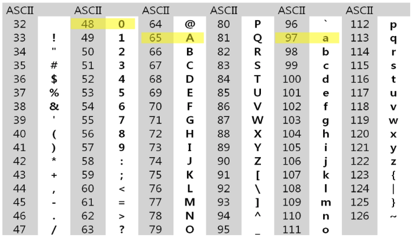

## 확장 ASCII 코드 일부

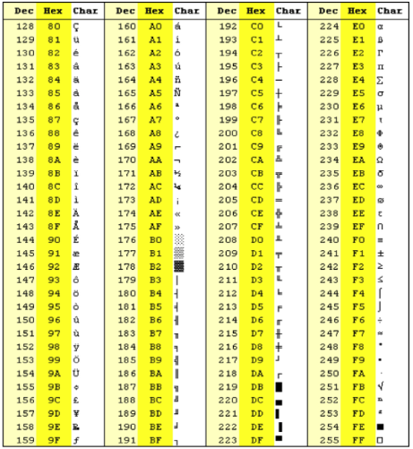

## 유니코드(Unicode)

- ASCII 확장만으로는 **전 세계 모든 문자**를 표현하기 어려움
- 한글, 한자, 아랍어, 등 **여러 언어를 단일 체계에서 처리할 필요성**이 대두
- 각 문자를 표현하는 숫자 값으로 **U+XXXX(16진수) 형태로 표기**

## 유니코드 인코드(UTF : Unicode Transformation Format)

- **UTF-8** [UFT-8 위키피디아 링크](https://ko.wikipedia.org/wiki/UTF-8)
    - **가변길이** (1~4 byte) : **ASCII 영역은 1바이트** 동일하게 표현 / **그 밖의 문자**들 사용시 **2~4 바이트**
    - 영어권 텍스트에서 효율적, **인터넷/웹 표준으로 널리 사용됨**
    - 현대 시스템에서 가장 많이 사용되는 인코딩 방식
    - min 8bit  max 32bit
- **UTF-16**
    - **가변길이** (2byte) : 기본 **다국어 평면 문자는 2바이트**로 표현 / 그 밖의 벗어난 문자는 4바이트
    - **Java, C#, Windows 내부** 등에서 **문자열 처리** 시 사용
    - min 16bit  max 32bit
- **UTF-32**
    - 4바이트 **고정 길이**
    - **인덱스 계산이 단순** / **메모리 사용량 증가**

---

# 문자열

- 문자(Character)들의 나열 → **문자를 순서대로 저장**한 **자료 구조**
- 문자열의 구체적 표현 방식(**메모리 구조**)은 **언어/환경에 따라 다름**
- Java에서는 java.lang.String 클래스

## String 클래스에 대한 메모리 배치 예

- java.lang.String 클래스에는 기본적인 객체 메타 데이터 외에도 **네 가지 필드들이 포함**되어 있음
    - **hash값**(hash)
    - **문자열의 길이**(count)
    - 문자열 데이터의 **시작점**(offset)
    - 실제 문자열 **배열에 대한 참조**(value)

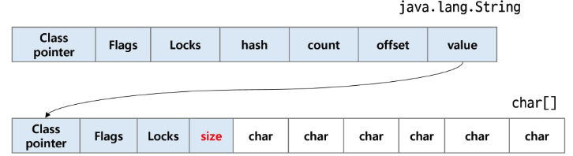

## String 클래스 특징

- 불변(Immutable) : **한 번 생성된 String 객체**는 내부 내용을 **변경할 수 없음  
  →** 바꿔야하면 새로 만들어서 재할당 해야함.
- **힙(Heap)에 저장** + **String Pool**  
  → 동일 리터럴(내용이 같고, 코드 상 동일한 “Hello”)이면 이미 존재하는 객체를 재사용
- 내부 구조(**UTF-16** 기반)

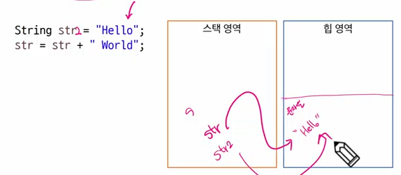

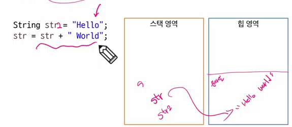

## String 생성

1. 리터럴(Literal) 사용  
   → 값
2. 생성자 사용

```java
//1. 리터럴 사용 -> String Pool 생성
String str1 = "Hello";
String str1 = "Hello";
System.out.println(str1 == str2); //true

//2. 힙에 생성
String str3 = new String("Hello");
System.out.println(str1 == str3); //false
byte[] bytes = {65, 66, 67}; // 'A', 'B', 'C'
String str4 = new String(bytes, StandardCharsets.UFT_8); //"ABC"
```

## String 메서드

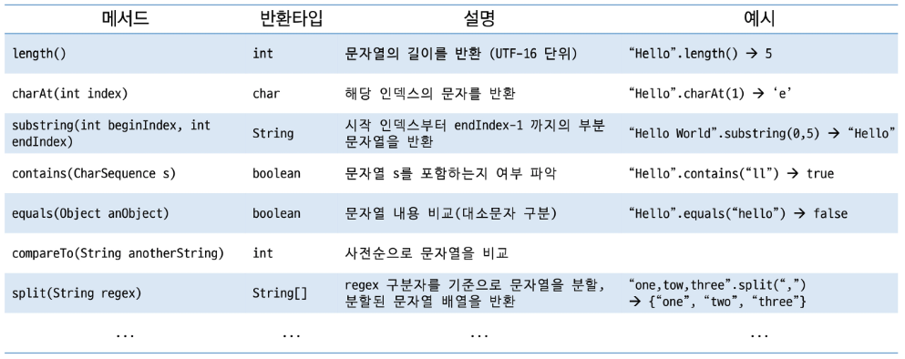

## 회문(回文, Palindrome)

- **앞에서부터** 읽는 것과 **뒤에서부터** 읽는 것이 **동일한 문자열**
- 회문 판별을 위해서는 문자열을 뒤집을 수 있어야 함
  1. 반복문을 통해 **뒤에서부터 읽어 오기**
  2. StringBuilder 또는 StringBuffer 클래스의 **revers() 메서드 활용**하기
  3. 양쪽 끝에서 시작하여 **swap을 통해 뒤집기**

## 문자열 → 정수, 정수 → 문자열 변환

- Java에서 제공하는 **메서드를 통해 손쉽게 변환 가능**하지만 구현해보자
- atoi() / itoa()

```java
public static int atoi(String strNumber) {
	int value = 0;
	for(int i = 0; i < strNumber.length(); i++) {
		value = (value * 10) + strNumber.charAt(i) - '0';
	}
	return value;
}
```

---

# 패턴 매칭(Pattern Matching)

- **문자열(또는 다른 자료)**에서 **특정 규칙(패턴)**을 찾아내거나, 해당 **패턴의 일치 여부를 검사**하는 과정
- 특정 키워드를 **검색**
- 사용자 입력이 **형식에 맞게 작성하였는지** 검사
- **데이터 추출** 등에서 활용할 수 있음
- **정규 표현식**으로 이용할 수 있음

## 패턴 매칭 알고리즘

- Brute Force 알고리즘 (코드까지 본격적으로)
- Boyer-Moore 알고리즘 (소개 정도~)
- Rabin-Karp 알고리즘 (나중에~)
- KMP(Knuth-Morris-Pratt) 알고리즘 (나중에~)
- …

## Brute Force 알고리즘…(.indexOf())

- 본문 문자열을 **처음부터 끝까지** 차례대로 순회하면서 **패턴 내의 문자들을 전부 비교하는 방식**으로 동작

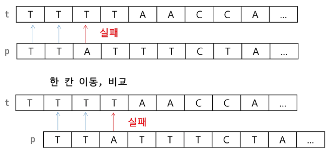

## Brute Force 알고리즘 동작 과정

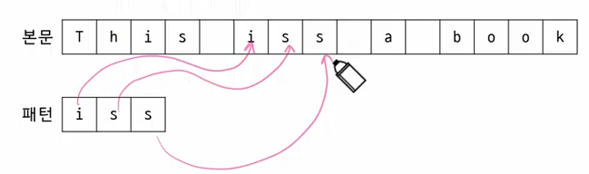

## Brute Force 알고리즘 의사코드

```java
// p[] : 찾을 패턴 - iss
// t[] : 전체 텍스트 - This iss a book
// M : 찾을 패턴의 길이
// N : 전체 텍스트의 길이
// i : t의 인덱스
// j : p의 인덱스

BruteForce(char[] p, char[] t) {
	i <- 0, j <- 0
	while(j < M and i < N) {
		if(t[i] != p[j])
			i <- i - j;
			j <- -1;
		i <- j + 1, i <- j + 1
	}
	if (j == M) return i - M;
	else return -1;
}
```

## Brute Force 알고리즘 시간 복잡도(★)

- 최악의 경우 **시간 복잡도**는 텍스트의 모든 위치에서 패턴을 비교해야 하므로 **O(MN)**이 됨(★)
- 본문의 길이 10,000 / 패턴의 길이 80 이라면  
  최악의 경우 약 10,000 * 80 = 800,000 번의 비교가 일어 남
- 비교횟수를 줄일 수 있는 방법은 없는가?

## Boyer-Moore 알고리즘

- 오른쪽에서 왼쪽으로 비교
- 오른쪽 끝에 있는 문자가 불일치 하고, 해당 문자가 패턴 내에 존재하지 않는 경우에는 패턴의 길이만큼 이동하여 검사

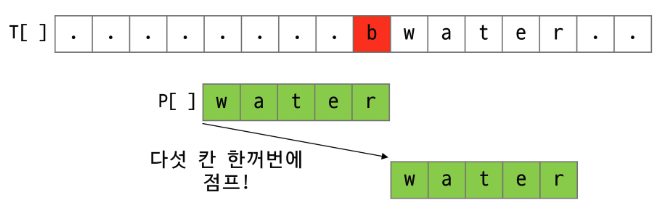

- 문자가 불일치 했을 때 해당 글자가 패턴 내에 존재할 경우

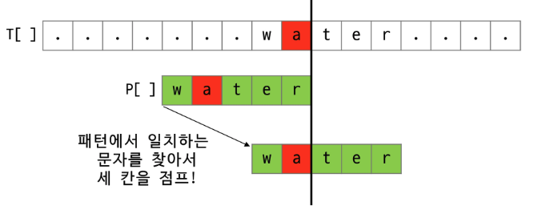

## Boyer-Moore 알고리즘 동작과정

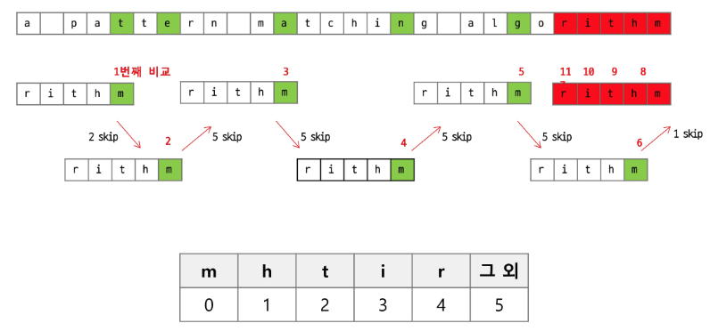

### 특징

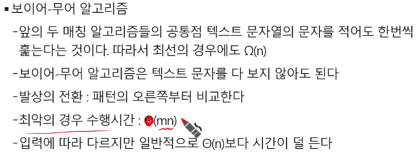

---

# 부록

## 문자열 암호화

### 시저암호(Caesar cipher)

- 줄리어스 시저가 사용했다고 하는 암호이다
- 시저는 기원전 100년경에 로마에서 활약했던 장군이었다
- 시저 암호에서는 평문에서 사용되고 있는 알파벳을 일정한 문자 수만큼 [평행이동] 시킴으로써 암호화를 행한다
- 1만큼 평행했다는 카이사르 암호화의 예

  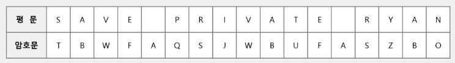

- 1만큼 평행 했을 때 1을 키 값이라고 함
- 시저 암호문에 대한 전사 공격

  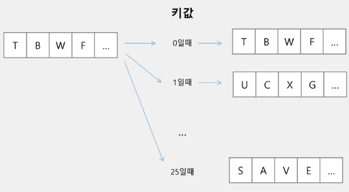


### 문자 변환표를 이용한 암호화(단일 치환 암호)

- 단순한 카이사르 암호화보다 훨씬 강력한 암호화 기법

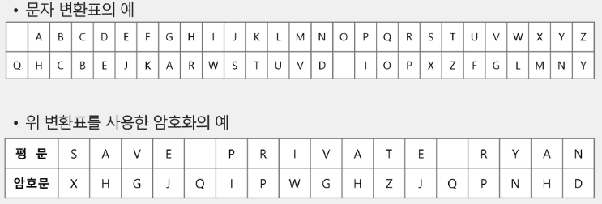

- 단일 치환 암호의 복호과
    - 복호화 하기 위해서는 모든 키의 조합(key space)가 필요하다
- 단일 치환 암호의 키의 총수는
    - 26 x 25 x 24 x 23 x … x 1 = 26!

### bit열의 암호화

- 배타적 논리합(exdusive-or) 연산 사용

  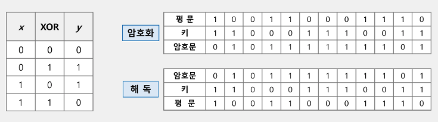

  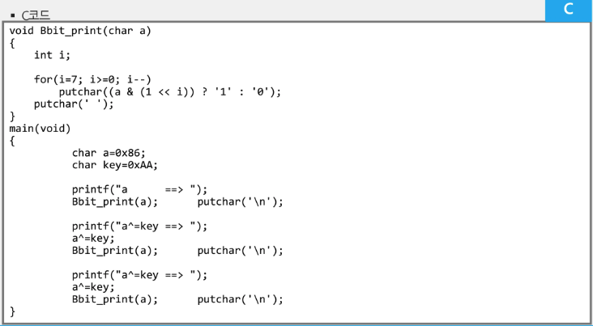


---