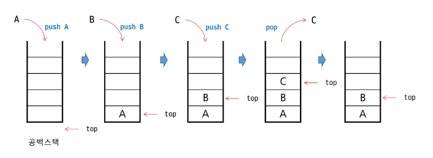
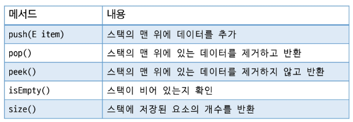
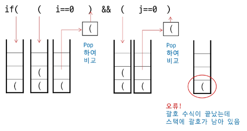
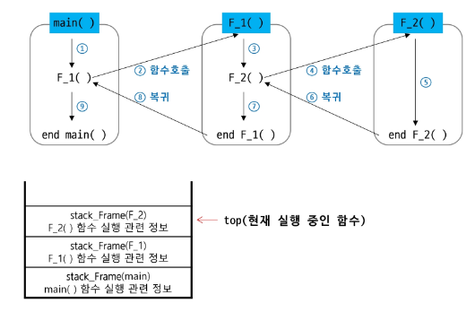

# 스택 개념

## 스택(Stack)

- [정의] 무더기, 쌓다, 쌓이다, 채우다
- 자료를 쌓아 올린 형태의 자료구조
- 선형 자료구조 (**1:1 관계**)
- **후입선출**(**LIFO**, Last-In First-Out)
- **top 이라는 변수**를 이용하여 **마지막에 삽입된 원소**를 가리킴

## 스택의 주요 연산

- **삽입(Push):** 스택의 맨 위에 원소를 삽입
- **삭제(Pop):** 스택의 맨 위 원소를 꺼내서 반환 (**공백인 경우 예외 상황**)
- **공백상태 확인(Empty):** 스택이 비어 있는지 확인
- **마지막 원소 확인(Peek):** 스택의 맨 위 원소를 반환 (삭제X)

## 스택의 삽입/삭제 과정

- 빈 스택에 원소 ‘A’, ‘B’, ‘C’를 차례로 삽입 후 한번 삭제하는 과정

  

## 스택 구현

- **배열(Array)** 활용
- **연결리스트(LinkedList)** 활용
- **구현 클래스 (java.util.Stack)**

---

# 스택 활용

## 괄호 짝 검사

- 괄호의 종류: 대괄호 [], 중괄호 {}, 소괄호()
- 여는 괄호와 닫는 괄호가 올바르게 짝을 이루는지 확인하는 과정
    1. 여는 괄호와 닫는 괄호의 **개수는 일치**해야 한다.
    2. 같은 괄호에서 **여는 괄호는 닫는 괄호보다 먼저** 나와야 한다
    3. 괄호 사이에는 **포함 관계만 존재**한다

## 올바른 괄호 예시

- ()()
- {(())}
- [{}()]

## 잘못된 괄호 예시

- (()
- )(
- ([)]

## 스택을 활용한 괄호 짝 검사

## 괄호 짝 검사 알고리즘(★)

- 문자열을 왼쪽부터 오른쪽으로 순회하며 한 글자씩 검사
- **여는 괄호**가 나오면 **스택에 Push**
- **닫는 괄호**가 나오면
    - 스택이 **공백상태**라면 **False**
    - 스택에서 **맨 위 여는 괄호를 Pop 해온 뒤** 현재 닫는 괄호와 **같은 쌍인지 확인**
- 전체 순회가 끝난 뒤 **스택이 공백상태이면 올바른 괄호 문자열** (아니라면 짝이 맞지 않다는 뜻)

## Function Call(시스템 스택)

- 프로그램에서 **함수 호출에 따른 순서**를 관리
- **가장 마지막에 호출된 함수가 가장 먼저 실행**을 완료하고 복귀하는 후입선출 구조
- 함수 호출 시 함수 수해에 필요한 지역변수, 매개변수, 복귀 주소 등의 정보를 **스택 프레임(Stack Frame)**에 **저장**하여 **시스템 스택에 삽입**
- 함수의 실행이 끝나면 시스템 스택의 **top 원소를 pop하여 복귀 주소로 복귀**
- **프로그램 종료 시 시스템 스택은 공백**이 됨

