# 계산기 실습

## 컴퓨터의 수 계산

- 사람이 일반적으로 사용하는 중위 표기법(infix Notation)을 사용하지 않고, **보다 처리하기 쉬운 형태(후위표기법 등)로 변환하여 계산함**
- 연산자의 **우선순위와 괄호 처리 문제를 해결**할 수 있음

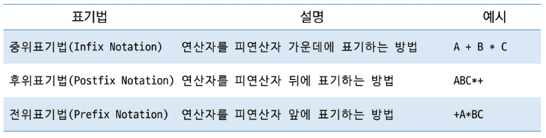

## 문자열로 된 계산기

- 스택을 활용하여 계산식의 값을 계산할 수 있음
    1. 중위 표기법의 수식을 **후위 표기법**으로 스택을 이용하여 변경
    2. **후위 표기법**의 수식을 스택을 이용하여 계산

## 중위 표기법 → 후위  표기법 변환 방법1

- **수식**의 각 연산자에 대해서 우선 순위에 따라 **괄호를 사용하여 다시 표현**
- 각 연산자를 그에 대응하는 **오른쪽 괄호 뒤로 이동시킨 뒤 괄호를 제거**

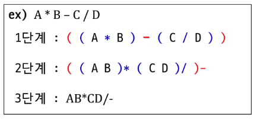

## 중위 표기법 → 후위 표기법 변환 방법2 (스택 이용)

- 입력 받은 중위 표기식을 한 글자(토큰)씩 읽으면서 진행
- **피연산자(숫자)**이면 **출력**
- **연산자이면** 스택에 **저장**
    - **현재 연산자**의 우선순위가 **스택의 연산자보다 높으면 Push**  
      높지 않다면 스택에서 **기존 연산자를 Pop 하여 출력** 후 **현재 연산자를 Push**
    - ‘(’ 여는 괄호라면 스택에 push → 우선 순위가 가장 높음
    - ‘)’ 닫는 괄호라면 여는 괄호까지 연산자를 꺼내어 출력
- 과정 종료 후 **스택에 남아 있는 모든 연산자 Pop하여 출력**

## 중위 표기법 → 후위 표기법 변환 방법2 과정

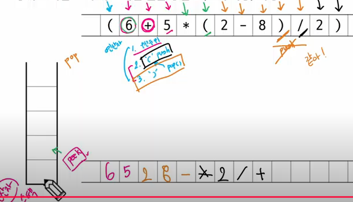

## 후위 표기법의 수식을 스택을 이용하여 계산

1. **피연산자를 만나면** 스택에 **push**
2. 연산자를 만나면 필요한 만큼의 **피연산자**를 스택에서 **pop하여 연산하고 결과를 다시 push**
3. 수식이 끝나면, **마지막으로 스택을 pop하여 출력**

## 후위 표기법의 수식을 스택을 이용하여 계산 과정

(사진)

---

# 재귀함수(Recursive Function)

- **자기 자신을 호출**하여 **순환 수행**되는 것  
  → 똑같지만 다른 자신
- 반복을 대신할 수 있음
- 함수 호출은 메모리 구조에서 **스택을 사용** (이름만 같은 다른 메서드)
- 간단한 문제에 대해서는 반복문에 비해 메모리 및 속도에서 **성능저하가 발생**

## 재귀함수 구조

- 일반적으로 **기본 부분(Base case)**, **재귀 부분(Recursive)**로 구성
- **Base case** : 재귀 호출에서 **빠져 나가기 위한 조건**
- Recursive : 자신을 호출하는 부분 (Base case로 유도한다)
- 재귀적 프로그램을 작성하는 것은 **반복 구조에 비해 간결하고 이해하기 쉬움**

## 재귀함수 예시

- 함수에서 실행해야 하는 **작업의 특성에 따라** 일반적으로 호출방식 보다 **재귀호출 방식을 사용하여** 함수를 만들면 **프로그램의 크기를 줄이고 간단하게 작성 가능**

### 팩토리얼(Factorial)

: 1부터 N까지의 모든 자연수를 곱하여 구하는 연산

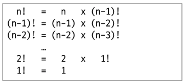

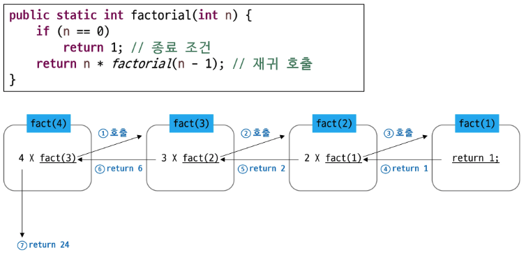

### 피보나치 수 (Fibonacci Numbers)

: 0과 1로 시작하고, **이전의 두 수 합을** **다음 항으로 하는 수열**

- 0, 1, 1, 2, 3, 5, 8, 13 …
- 재귀함수를 이용한 구현

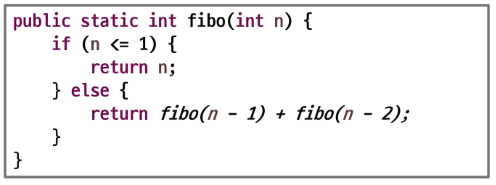

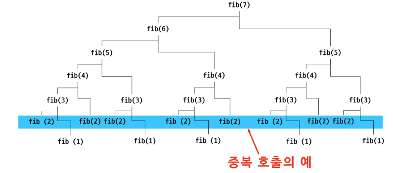

- 계산 결과를 저장하여 이를 해결할 수 있음

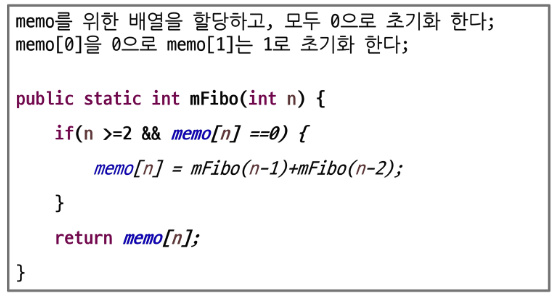

### 하노이의 탑(Tower of Hanoi)

1. 한 번에 한 개의 원판만 옮길 수 있다
2. 가장 위에 있는 원판만 이동할 수 있다
3. 큰 원판이 작은 원판 위에 있어서는 안된다

---

# 오프라인 수업

## 중위 표기법 → 후위 표기법

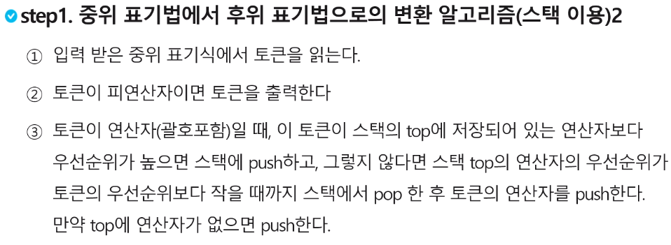

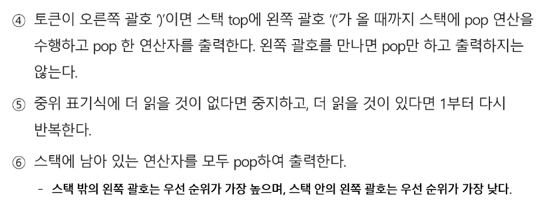

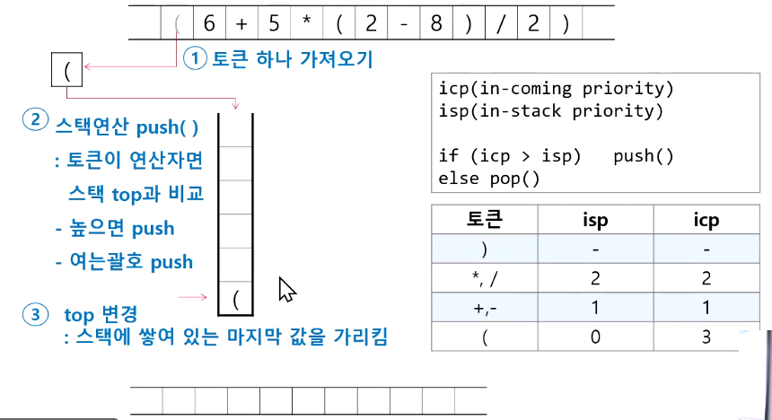

---

## 후위 표기법 → 연산

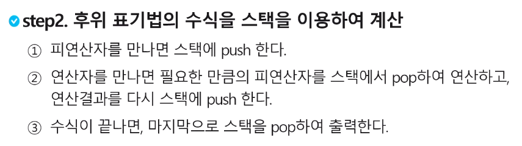

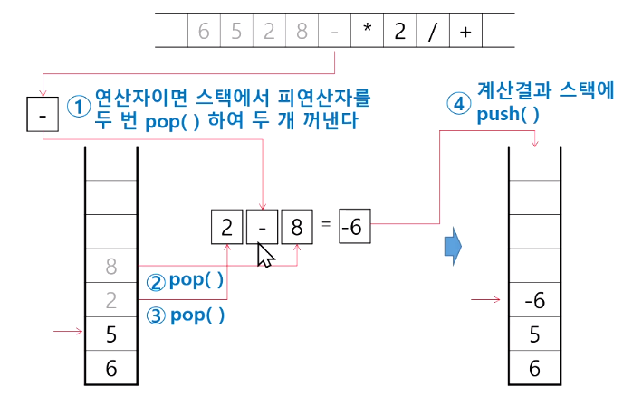

---

## 재귀함수

**정의:** 자기 자신을 호출하여 순환 수행하는 것  
(반복에 대한 처리를 대행하게 할 때 → 점화식의 형태를 띄는 문제들!)

**구조:** **기저조건**과 **재귀조건** 으로 구성된다.

- **기저조건(base case):** 재귀호출을 빠져나가게 하기 위한 조건(=종료조건)
- **재귀조건:** 자신을 호출하는 부분

팩토리얼(factorial): 1부터 N까지 모든 자연수를 더하는 연산!

```java
5! = 5 x 4 x 3 x 2 x 1 = ??

n! = n x (n-1)!         ->  점화식: f(n) =  n x f(n-1)
(n-1)! = (n-1) x (n-2)!
(n-2)! = (n-2) x (n-3)!
...
2! = 2 x 1
```

```java
static int factorial(int n){
	if(n == 0) return 1;       // 기저조건(종료조건)
	return n * factorial(n-1); // 재귀호출
}

factorial(5); // 5 * 4 * 3 * 2 * 1 = 120
```

### 피보나치 수열(fibonacci numbers)

0과 1로 시작하고, 이전에 두 항의 합을 다음 항으로 하는 수열

- 0,1,1,2,3,5,8,13,…
- 점화식 : fibo(n) = fibo(n-1) + fibo(n-2)

```java
static int fibo(int n){
	if(n == 0) return 0;
	if(n == 1) return 1;
	return fibo(n-1) + fibo(n-2); // 재귀조건
}
```

**문제점:** 재귀 호출 (중복) 너무 많이 발생하게 된다… 비효율적 (→ 시간복잡도 $O(2^n)$)

## 하노이의 탑(★★★★★) → 한번 구현해보자..

재귀적인 해결 방법

1. n-1개의 원판을 A→B
2. 가장 큰 원판 A → C
3. n-1개의 원판 B → C

```java
public static void hanoi(int n, char from, char to, char via) {
    if (n == 1) {
        System.out.println(from + " -> " + to);
    } else {
        hanoi(n-1, from, via, to);    // n-1개를 경유지로
        System.out.println(from + " -> " + to);  // 가장 큰 원판 이동
        hanoi(n-1, via, to, from);    // n-1개를 목적지로
    }
}
```