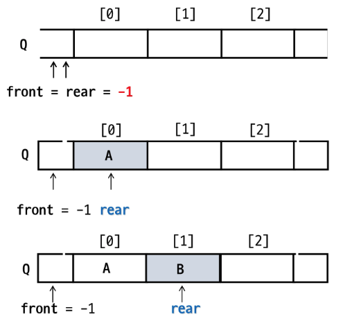
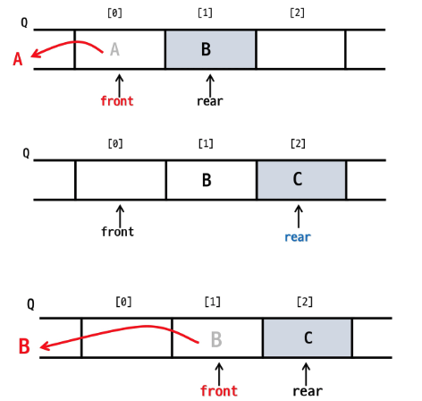
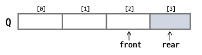
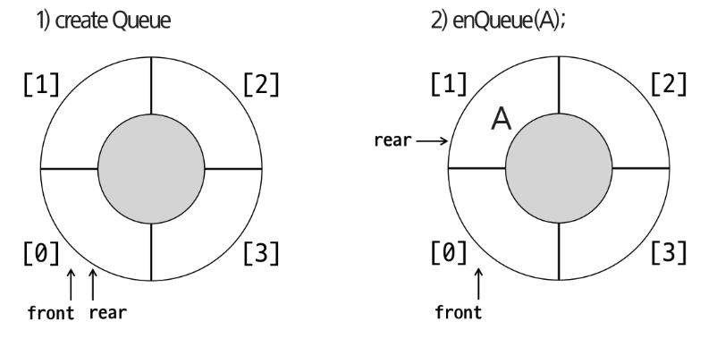
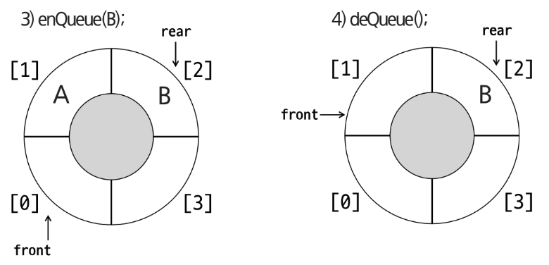
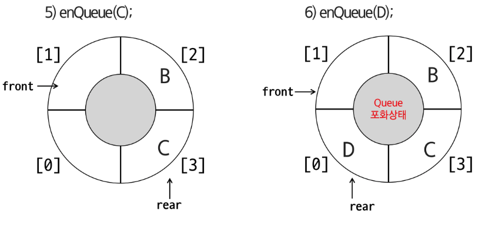

# 큐(Queue)

- [정의] 줄, 줄을 서서 기다리다, 대기 행렬을 만든다
- 자료를 통로에 넣어 **대기 줄과 같은 형태**의 자료구조
- **선형 자료구조** (1:1의 관계)
- **선입선출**(**FIFO**, First-In Frist-Out)
- **front, rear** 변수를 활용

## 큐의 주요 연산

- **삽입(enQueue):** 큐의 **맨 뒤쪽으로 원소를 삽입**하는 연산
- **삭제(deQueue):** 큐의 **맨 앞쪽에서 원소를 꺼내서 반환** (공백인 경우 예외 상황)
- **공백상태 확인(Empty):** 큐가 비어 있는지 확인
- **포화상태 확인(Full):** 큐가 가득 차 있는지 확인  
  → 꼭 항상 필요한건 아니다.

## 큐의 삽입/삭제 과정(배열 예제)

1. 공백 큐 생성: creteQueue();

2. 원소 A 삽입: enQueue(A);

3. 원소 B 삽입: enQueue(B);



1. 원소 반환/삭제: deQueue();

2. 원소 C 삽입: enQueue(C);

3. 원소 반환/삭제: deQueue();



## 큐의 종료

- 선형 큐 (Linear Queue)
- 원형 큐 (Circular Queue)  
  → 선형 큐에 대한 단점 보완
- 연결 큐 (Linked Queue)
- 우선순위 큐 (Priority Queue)  
  → 데이터를 넣었을 때 내부적으로 순서를 조정한다.
- 덱 (Deque, Double-Ended Queue)

---

# 선형 큐(Linear Queue)

- 배열을 사용하여 구현된 **기본적인 큐**
- 큐의 크기 → 배열의 크기
- **front:** 큐에서 데이터를 제거하는 위치
- **rear:** 큐에서 데이터를 삽입하는 위치

## 선형 큐 - enQueue(item) / deQueue()

- 마지막 원소 뒤에 새로운 원소를 삽입

```java
enQueue(item) {
	if (isFull()) print("Queue_Full")
	else {
		rear <- rear + 1;
		Q[rear] <- item;
	}
}
```

- 가장 앞에 있는 원소를 삭제

```java
deQueue(item) {
	if (isEmpty()) print("Queue_Empty")
	else {
		front <- front + 1;
		return Q[front];
	}
}
```

## 선형 큐 - isEmpty() / isFull()

- 공백 상태: front == rear

```java
isEmpty() {
	if (rear == n-1) return true;
	else return false;
}
```

- 포화 상태: rear == n-1 (n : 배열의 크기)

```java
isFull() {
	if (rear == n-1) return true;
	else return false;
}
```

## 선형 큐 문제점

- **잘못된 포화상태 인식 :** 데이터의 삽입/삭제가 발생했을 때 배열의 **앞 부분에 공간이 있어도 활용 X**

  

- 해결 방법
    1. 앞으로 밀착!  
       → $O(N)$만큼 시간이 더 걸림
    2. 처음과 끝이 연결되어 있다!(논리적으로 연결)
- 배열을 이용하여 크기가 고정되어 있으므로 동적으로 키울 수 없음  
  → **연결 리스트 기반의 큐를 사용해야 함**

---

# 원형 큐(Circular Queue)

- 선형 큐의 **공간 낭비 문제를 해결한 자료구조**
- 논리적으로 **처음과 끝이 연결**하여 **원형처럼 순환 동작**하도록 만든 큐(나머지 연산)
- **front:** 가장 먼저 들어온 데이터의 위치
- **rear:** 가장 최근에 들어온 데이터의 위치

## 원형 큐 연산과정







## 원형 큐 - isEmpty() / isFull()

- 공백 상태: front == rear

```java
isEmpty() {
	if(front == rear) return true;
	else return false;
}
```

- 포화 상태 : **삽입할 다음 rear의 위치 == 현재 front**  
  (rear + 1) mod n = front

```java
isFull() {
	if ((rear+1) mod n == front) return true;
	else return false;
}
```

## 원형 큐 - enQueue(item) / deQueue()

- 마지막 원소 뒤에 새로운 원소를 삽입

```java
enQueue(item) {
	if (isFull()) print("Queue_Full")
	else {
		rear <- (rear + 1) mod n;
		cQ[rear] <- item;
	}
}
```

- 가장 앞에 있는 원소를 삭제

```java
deQueue() {
	if (isEmpty()) print("Queue_Empty")
	else {
		front <- (front + 1) mod n;
		return cQ[front];
	}
}
```

---

# 큐의 활용

## 버퍼(Buffer)

- 데이터를 한 곳에서 **다른 한 곳으로 전송**하는 동안 **일시적으로 데이터를 보관하는 메모리 영역**
- 버퍼링 : **버퍼를 활용하는 방식** 또는 **버퍼를 채우는 동작**을 의미

## 버퍼의 자료구조

- 버퍼는 일반적으로 입출력 및 네트워크와 관련된 기능에서 이용
- **입력과 출력이 순서대로 전달되어야 하므로** FIFO 방식의 자료구조인 **큐가 활용**됨