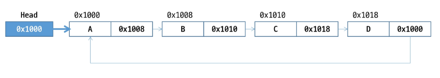

# 연결 리스트(Linked List)

- **노드(Node)**가 **데이터**와 **다음 노드의 참조**를 포함하는 방식으로 구성된 자료구조
- 연속된 메모리 공간에 저장하는 배열과 달리 **비연속적인 위치에 저장 가능**
- 자료구조의 **크기를 동적으로 조정할 수 있어** 메모리 효율적
- 처음 노드의 위치를 저장하는 **Head** 가 필요함  
  *→ Head. 1. 처음노드 2. Dummy Node*


## 노드(Node)

- 자료구조에서 **데이터를 저장**하는 기본 단위
- 연결 리스트(Linked List), 트리(Tree), 그래프(Graph) 등의 자료구조에서 사용
- 노드의 구성 요소
    1. **데이터 필드:** 노드가 저장하는 값 (숫자, 문자열, 객체 등)
    2. **링크 필드:** 다음 노드를 가리키는 참조 (reference)
- 사용하는 자료구조에 따라 링크 필드가 여러 개 존재할 수 있음

## 연결 리스트 vs 배열


---

# 단일 연결 리스트 (Sigly Linked List)

- **각 노드가** 하나의 링크 필드에 의해 **다음 노드와 연결되**는 구조
- **Head는 가장 앞의 노드**를 가리키고, **각 노드는 다음 노드**를 가리킴
- **마지막 노드**의 링크 필드는 null (다음 노드가 없음)
- 단순 연결 리스트(Simple Linked List) 라고도 함

> Dummy Head를 사용할 수도 있음  
→ 데이터 X / 링크 필드 (첫 번째 노드)
>


## 단일 연결 리스트 삽입

- [HEAD] → [ ’A’ | * ] → [ ’C’ | * ] →[ ’D’ | null ]
- 리스트의 두 번째에 ‘B’노드를 삽입 할 때
    1. **노드를 생성**하여 **데이터 필드에 값을 저장**

       

    2. **삽입될 위치의 바로 앞**에 위치한 노드를 찾아 **링크 필드의 값을 new 노드의 링크에 저장**

       

    3. 삽입될 위치의 바로 **앞에 위치한 노드의 링크 필드에 new 노드의 주소를 저장**

       


- 첫 번째 노드로 삽입하는 경우

```java
addtoFirst(L, item){      // 리스트 포인터 L, 원소 item
		new <- createNode();  // 새로운 노드 생성
		new.data = item;      // 데이터 필드 작성
		L = new;              // 리스트의 처음으로 지
}
```

- 중간 노드에 삽입하는 경우 (index로 주어진 경우 반복문을 통해 찾아야 함)

```java
add(L, pre, item)             // 리스트 L, 삽입 이전 노드 pre, 원소 item
		new <- createNode();      // 새로운 노드 생성
		new.data = item;          // 데이터 필드 작
		if(L == NULL) {
				L = new;
		} else {
				new.link = pre.link;
				pre.link = new;
		}
```

- 마지막 노드로 삽입하는 경우

```java
addtoLast(L, item)                // 리스트 L, 원소 item
		new <- createNode();          // 새로운 노드 생성
		new.data = item;              // 빈 리스트일 때, 최초 노드 추가
		if (L == NULL) {
				L = new;
				return;
		}
		temp = L;                     // 노드 링크 이용하여 리스트 순회
		while (temp.link != NULL) {   // 마지막 노드 찾을 때까지 이동
				temp = temp.link;
		}
		temp.link = new;              // 마지막 노드 추가

```

## 단일 연결 리스트 삭제

- [HEAD] → [ ’A’ | * ] →  [ ’B’ | * ] → [ ’C’ | * ] →[ ’D’ | null ]
- 리스트의 두 번째에 ‘B’노드를 삭제 할 때
    1. 삭제할 노드의 선행 노드(pre) 탐색

       

    2. 삭제할 노드의 **링크 필드**를 선행 노드의 **링크 필드에 저장**

       


- pre 노드 다음의 위치의 노드 삭제

```java
delete(L, pre) {                   // 리스트 L, 노드 pre
		if(L == NULL) error;
		else {
				target = pre.link;         // 삭제 노드 지정
				if(target == NULL) return;
				pre.link = target.link;
		}
		freeNode(target)               // 할당된 메모리 반
}
```

---

# 연결 스택(Linked Stack)

- 연결 리스트를 이용하여 스택을 구현해보자
- Push : 리스트의 첫번째 요소에 노드를 삽입
- Pop : 리스트의 첫번째 요소 삭제
- Head 대신에 **Top으로 대체**하여 작성 (Top이 Null이면 초기 값)


## 연결 스택 연산 과정

1. null 값을 가지는 노드를 만들어 스택 초기화


1. 원소 A 삽입 : push(A)


1. 원소 B 삽입 : push(B)


1. 원소 C 삽입 : Push(C)


1. 원소 반환 : Pop


## 연결 스택 의사코드


---

# 연결 큐 (Linked Queue)

- 연결 리스트를 이용하여 큐를 구현해보자
- enQueue : 리스트의 마지막 요소에 노드를 삽입
- deQueue : 리스트의 첫번째 요소 삭제
- front : 첫 번째 노드를 가리키는 링크
- rear : 마지막 노드를 가리키는 링크


## 연결 큐 연산 과정

1. 공백 큐 생성 : createLinkedQueue()


1. 원소 A 삽입 : enQueue(A)


1. 원소 B 삽입 : edQueue(B)


1. 원소 삭제 : deQueue()


1. 원소 C 삽입 : enQueue(C)


1. 원소 삭제 : deQueue()


1. 원소 삭제 : deQueue()


## 연결 큐 의사코드

- 초기 공백 큐 생성 : creatLinkedQueue()
- 리스트 노드 없이 포인터 변수만 생성 (front, rear)

```java
createLinkedQueue() {
		front <- null;
		rear <- null;
}
```

- 공백 상태 검사 : isEmpty()

```java
isEmpty(){
		if(front == null) return true;
		else return false;
}
```

- 삽입

  

  


---
# 이중 연결 리스트 (Doubly Linked List)

- 각 노드가 이전(prev) 노드와 다음(next) 노드를 모두 가리키는 연결되는 구조
- **두 개의 링크필드**와 **한 개의 데이터 필드**로 구성


## 이중 연결 리스트 삽입

- cur 가 가리키는 노드 다음으로 ‘D’값을 가진 노드를 삽입 하는 과정
    1. 메모리를 할당하여 새로운 노드 new 를 생성하고 데이터 필드에 ‘D’를 저장한다

       

    2. **cur의 next를** new의 next에 저장하여 연결한다

       

    3. **cur의 주소**를 new의 prev에 저장하여 연결한다

       

    4. new의 주소를 **cur의 next에 저장**하여 연결한다

       

    5. new의 주소를 **new의 오른쪽 노드(next)의 prev에 저장**하여 연결한다

       


## 이중 연결 리스트 삭제

- cur 가 가리키는 노드를 삭제하는 과정
    1. 현재 상태

       

    2. **삭제할 노드 cur의 오른쪽 노드의 주소**를 cur의 왼쪽 노드에 next에 저장하여 연결한다

       

    3. **삭제할 노드 cur의 왼쪽 노드의 주소**를 cur의 오른쪽 노드의 prev에 저장하여 연결한다

       

    4. cur가 가리키는 **노드의 할당된 메모리를 반환**한다

       


---

# 원형 연결 리스트 (Circular Linked List)

- **마지막 노드가** **첫 번째 노드**를 가리켜 **원형으로 연결**되는 구조  
  → null이 아니라 Head를 가리킴
- 시작 점을 임의로 지정할 수 있어 **회전 큐에 활용**



---

# 데크 (Deque, Double-Ended Queue)

- 양쪽 끝에서 **삽입과 삭제가 모두 가능**한 자료구조
- 중간에 있는 데이터는 직접 접근할 수 없고, 양 끝을 통해서만 접근
- `java.util.Deque` , `java.util.ArrayDeque` 지원

## 데크 주요 연산


---

# 삽입 정렬 (Insertion Sort)

- 리스트의 각 요소를 **차례대로 정렬된 부분에 삽입**하면서 정렬하는 방식
- 데이터를 정렬된 부분과 정렬되지 않은 부분으로 나누어 **정렬된 부분을 늘려 나가는 방식**
- 추가적인 메모리 공간이 필요 없음
- **안정 정렬**
- 시간 복잡도(최악) : $O(N^2)$
- 시간 복잡도(최선) : $O(N)$

## 삽입 정렬 과정

- 정렬할 자료를 두 개의 **부분집합 S와 U**로 가정
    - 부분집합 S : 정렬된 앞 부분의 원소들
    - 부분집합 U : 아직 정렬되지 않은 나머지 부분의 원소들
- 정렬되지 않은 부분집합의 U의 원소를 하나씩 꺼내어 S의 마지막 원소부터 비교하며 위치를 찾아 삽입
- U가 공집합이 되면 정렬이 완성된다

- {69, 10, 30, 2, 16, 8, 31, 22}를 삽입 정렬하는 과정
    - 초기상태 : 첫 번째 원소는 정렬된 부분 집합 S로 생각하고 나머지 원소를 정렬되지 않은 집합 U로 생각

  

  

  

  

  

  

  

  


## 삽입 정렬 의사 코드

```java
InsertionSort(A, n)
		for i <- 1 to n - 1 do
				key <- A{i}           // 삽입할 요소 선택
				j <- i - 1
				
				// key를 앞쪽의 정렬된 부분에 삽입할 위치 찾기
				while j >= 0 and A[j] > key do
						A[j + 1] <- A[j]      // 현재 요소를 오른쪽으로 이동
						j <- j - 1
				
				A[j + 1] <- key       // 올바른 위치에 key 삽입
```