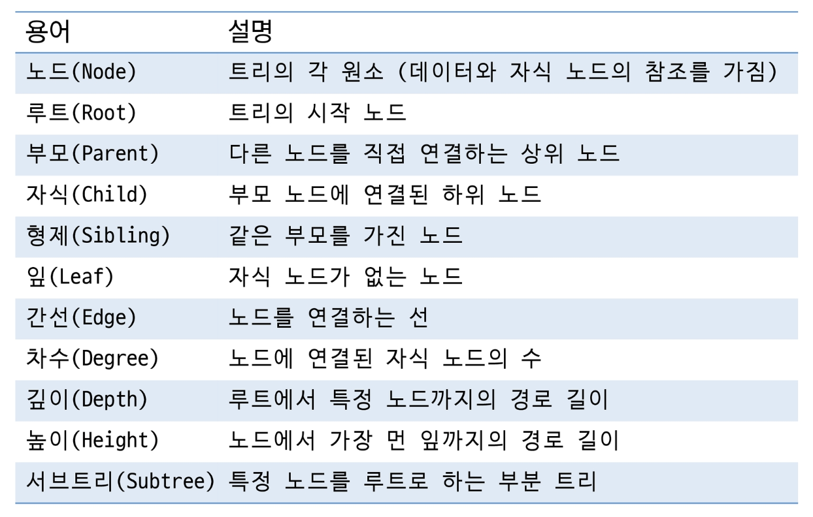
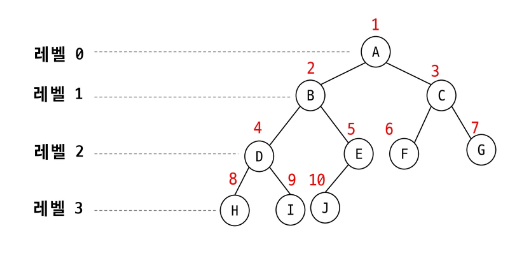
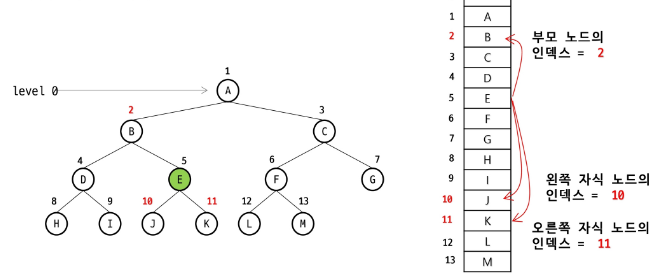
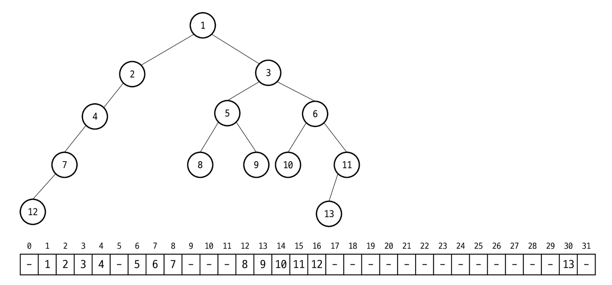
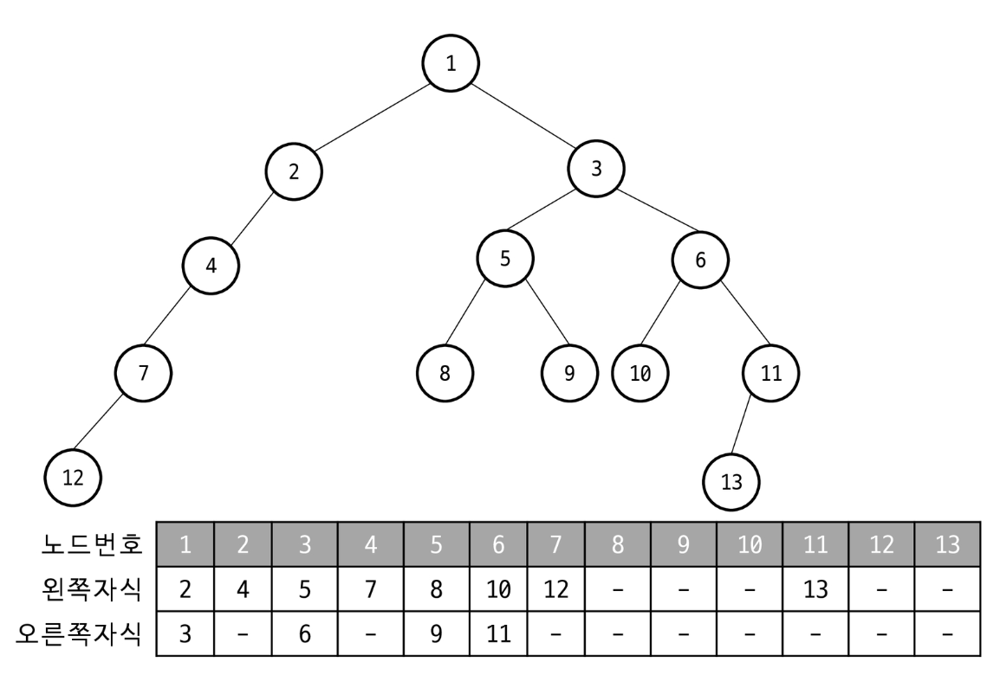
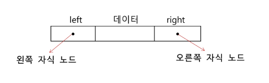
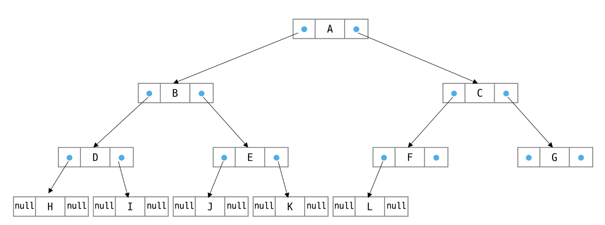
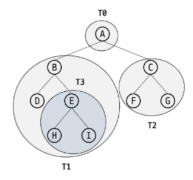

# 트리(Tree)

- **계층적 구조**를 표현하는 **비선형** **자료구조**
- **1 : N** 의 관계를 가지는 자료구조
- 한 개 이상의 노드로 이루어진 유한 집합
- 상위 원소에서 하위 원소로 **내려가면서 확장**되는 트리(나무)모양의 구조
- **사이클 (순환) 없음**

## 트리 용어



---

# 이진 트리 (Binary Tree)

- 각 노드가 **최대 2개의 자식**(왼쪽, 오른쪽)을 가지는 트리  
  → 자식 노드는 **0 / 1 / 2 개**
- **특정 레벨 i** 에서의 노드의 최대 개수는 **$2^i$개**
- **높이가 h**인 이진 트리가 가질 수 있는 노드의 **최소 개수는 (h+1)**개, **최대 개수는 ( $2^{h+1} - 1$ )** 개

## 포화 이진 트리 (Perfect Binary Tree)

- **모든 레벨**에 노드가 포화 상태로 차 있는 이진 트리
- 리프 노드의 깊이**가 같음**
- 높이가 h일 때, 최대 노드 개수인 **( $2^{h+1} - 1$ ) 개 노드를 가진 이진 트리**

## 정 이진 트리 (Full Binary Tree)

- 모든 노드가 **0개 또는 2개의 자식을 가진 이진 트리**
- 자식 노드가 1개인 노드는 존재하지 않음
- 리프 노드의 깊이는 **다를 수 있음**

## 완전 이진 트리 (Complete Binary Tree) (★★★★★)

- 마지막 레벨을 제외한 **모든 레벨이 꽉 차 있고**, 마지막 레벨의 노드는 **왼쪽부터 채워지는 트리**

## 편향 이진 트리(Skewed Binary Tree)

- 모든 노드가 **한쪽 자식 노드만 가짐**
- 왼쪽 편향 이진 트리
- 오른쪽 편향 이진 트리

## 이진 탐색 트리 (Binary Search Tree, BST)

- **왼쪽 자식 < 부모 < 오른쪽 자식 의 규칙**을 따르는 이진 트리  
  → 중위순회 하면 오름차순으로 정렬 가능!

## 균형 이진 트리 (Balanced Binary Tree)

- 모든 서브 트리의 높이 차이가 일정 이하로 유지되는 트리
- AVL 트리, 레드-블랙 트리 등이 균형 이진 트리에 속함

## 배열을 이용한 이진 트리 표현

? → 완전 이진 트리여야 하는가?  
⇒ 맞다! 근데 가상의 노드로 처리할 수 도 있다!!

- 이진 트리에 **각 노드 번호를** 다음과 같이 **부여** (루트 노드 : 1번)
- 레벨 N에 있는 노드에 대하여 왼쪽부터 오른쪽으로 **$2^n$ 부터 $2^{n+1}-1$ 까지 번호를 차례로 부여**

  

- 노드 번호가 i 인 노드가 부모 노드인 번호 : $[i/2]$  
  → [ ] 는 내림처리
- 노드 번호가 i 인 노드가 왼쪽 자식 노드인 번호 : $2 * i$
- 노드 번호가 i 인 노드가 오른쪽 자식 노드인 번호 : $2 * i + 1$
- 레벨 n의 노드 시작 번호 : $2^n$



- 1차원 배열을 이용한 저장 방식

  

- 2차원 배열을 이용한 왼쪽 자식, 오른쪽 자식 저장 방식 (부모의 정보를 저장할 수도 있음)

  


## 배열을 이용한 이진 트리 표현 단점

- 편향 이진 트리의 경우에 사용하지 않는 **배열 원소에 대한 메모리 공간 낭비 발생**
- 트리의 중간에 새로운 노드를 삽입하거나 기존의 노드를 삭제할 경우 배열의 크기 변경이 어려움

## 연결 리스트를 이용한 이진 트리 표현

- 배열의 단점을 보완하기 위해 **연결리스트를 이용**하여 트리를 표현할 수 있음
- 이진 트리의 모든 노드는 **최대 2개의 자식 노드를 가지므로 일정한 구조의 노드를 활용**

  

- 완전 이진 트리 예시

  


---

# 이진 트리 순회(Traversal)

## 순회(Traversal)

- 트리의 노드들을 **중복되지 않게 전부 방문하는 것을 말함**
- 트리는 비선형 구조 이므로 선형 구조와 같이 선후 연결 관계를 알 수 없음!

## 기본 순회(Traversal)

BFS, DFS … good!

- 전위 순회(preorder traversal) : **V→L→R**  
  → 부모 노드 방문 후, 자식 노드를 좌, 우 순서로 방문
- 중위 순회(inorder traversal) : **L→V→R**  
  → 왼쪽 자식 노드, 부모 노드, 오른쪽 자식 노드 순으로 방문
- 후위 순회(postorder traversal) : **L→R→V**  
  → 자식 노드를 좌, 우 순서로 방문한 후, 부모 노드를 방문
- **변하지 않는 것 : L → R**

## 전위 순회(preorder traversal)

1. **현재 노드** n을 **방문하여 처리**한다 → V
2. **현재 노드** n의 **왼쪽 서브 트리로 이동**한다 → L
3. **현재 노드** n의 **오른쪽 서브 트리로 이동**한다 → R
- 전위 순회 알고리즘

```java
preorder_traverse(T) {
		if (T is not null) {
				visit(T)
				preorder_traverse(T.left)
				preorder_traverse(T.right)
		}
}
```



## 중위 순회(inorder traversal)

1. **현재 노드** n의 **왼쪽 서브 트리로 이동**한다 → L
2. **현재 노드** n을 **방문하여 처리**한다 → V
3. **현재 노드** n의 **오른쪽 서브 트리로 이동**한다 → R
- 중위 순회 알고리즘

```java
inorder_traverse(T) {
		if (T is not null) {
				preorder_traverse(T.left)
				visit(T)
				preorder_traverse(T.right)
		}
}
```

## 후위 순회(postorder traversal)

1. **현재 노드** n의 **왼쪽 서브 트리로 이동**한다 → L
2. **현재 노드** n의 **오른쪽 서브 트리로 이동**한다 → R
3. **현재 노드** n을 **방문하여 처리**한다 → V  
- 후위 순회 알고리즘

```java
postorder_traverse(T) {
		if (T is not null) {
				preorder_traverse(T.left)
				preorder_traverse(T.right)
				visit(T)
		}
}
```

---

# 오프라인

## 트리

### 트리의 개념

- **비선형 구조**
- 원소들 간에 **1:n 관계**를 가지는 자료구조
- 원소들 간에 **계층관계**를 가지는 계층형 자료구조
- 상위 원소에서 하위 원소로 내려가면서 확장되는 **트리(나무)모양**의 구조

### 트리의 정의

> 한 개 이상의 노드로 이루어진 유한 집합이며 다음 조건을 만족한다.
>
- 노드 중 **최상위 노드**를 **루트(root)**라 한다
- 나머지 노드들은 n(≥0)개의 분리 집합 T1,…,TN으로 분리될 수 있다
- 이들 T1, …, TN은 각각 하나의 트리가 되며(**재귀적 정의**) 루트의 **서브트리(subtree)**라 한다

### 트리 용어 정리

| 용어 | 설명 |
| --- | --- |
| **노드(node)** | 트리의 원소 |
| **간선(edge)** | 노드를 연결하는 선. 부모 노드와 자식 노드를 연결 |
| **루트 노드(root node)** | 트리의 시작 노드 |
| **형제 노드(sibling node)** | 같은 부모 노드의 자식 노드들 |
| **조상 노드** | 간선을 따라 루트 노드까지 이르는 경로에 있는 모든 노드들 |
| **서브 트리(subtree)** | 부모 노드와 연결된 간선을 끊었을 때 생성되는 트리 |
| **자손 노드** | 서브 트리에 있는 하위 레벨의 노드들 |

### 차수와 높이

### 차수(degree)

- **노드의 차수**: 노드에 연결된 자식 노드의 수
- **트리의 차수**: 트리에 있는 노드의 차수 중에서 가장 큰 값
- **단말 노드(리프 노드)**: 차수가 0인 노드. 자식 노드가 없는 노드

### 높이(height)

- **노드의 높이**: 루트에서 노드에 이르는 간선의 수. 노드의 레벨
- **트리의 높이**: 트리에 있는 노드의 높이 중에서 가장 큰 값. 최대 레벨

---

## 이진 트리

### 이진 트리의 정의

- 모든 노드들이 **2개의 서브트리**를 갖는 특별한 형태의 트리
- 각 노드가 자식 노드를 **최대한 2개까지만** 가질 수 있는 트리
    - **왼쪽 자식 노드(left child node)**
    - **오른쪽 자식 노드(right child node)**

### 이진 트리의 특성

- 레벨 i에서의 노드의 최대 개수는 **2^i개**
- 높이가 h인 이진 트리가 가질 수 있는 노드의 개수
    - **최소 개수**: (h+1)개
    - **최대 개수**: (2^(h+1)-1)개

### 이진 트리의 종류

### 1. 포화 이진 트리(Full Binary Tree)

- 모든 레벨에 노드가 **포화상태**로 차 있는 이진 트리
- 높이가 h일 때, 최대의 노드 개수인 **(2^(h+1)-1)**의 노드를 가진 이진 트리
- 루트를 1번으로 하여 **2^(h+1)-1까지 정해진 위치**에 대한 노드 번호를 가짐

### 2. 완전 이진 트리(Complete Binary Tree)

- 높이가 h이고 노드 수가 n개일 때 (단, h+1 ≤ n < 2^(h+1)-1)
- **포화 이진 트리의 노드 번호 1번부터 n번까지 빈 자리가 없는** 이진 트리

### 3. 편향 이진 트리(Skewed Binary Tree)

- 높이 h에 대한 최소 개수의 노드를 가지면서 **한쪽 방향의 자식 노드만**을 가진 이진 트리
- **왼쪽 편향 이진 트리**, **오른쪽 편향 이진 트리**

---

## 이진 트리의 표현

### 배열을 이용한 표현

### 노드 번호 부여 규칙

- 루트의 번호를 **1**로 함
- 레벨 n에 있는 노드에 대하여 왼쪽부터 오른쪽으로 **2^n부터 2^(n+1)-1까지** 번호를 차례로 부여

### 노드 번호의 성질

- 노드 번호가 i인 노드의 **부모 노드 번호**: $⌊i/2⌋$
- 노드 번호가 i인 노드의 **왼쪽 자식 노드 번호**: $2*i$
- 노드 번호가 i인 노드의 **오른쪽 자식 노드 번호**: $2*i+1$
- 레벨 n의 **노드 번호 시작 번호**: $2^n$

### 배열 크기

- 높이가 h인 이진 트리를 위한 배열의 크기: **2^(h+1)-1**

### 배열 표현의 단점

- **편향 이진 트리**의 경우 사용하지 않는 배열 원소에 대한 **메모리 공간 낭비** 발생
- 트리의 중간에 새로운 노드를 삽입하거나 기존의 노드를 삭제할 경우 **배열의 크기 변경이 어려워** 비효율적

### 배열을 이용한 순회 구현

```java
// 배열로 구현된 이진 트리의 순회
class ArrayBinaryTree {
    private int[] tree;
    private int size;

    public ArrayBinaryTree(int capacity) {
        this.tree = new int[capacity + 1]; // 1부터 시작
        this.size = 0;
    }

    // 전위 순회 (배열 버전)
    public void preorderTraversal(int index) {
        if (index <= size && tree[index] != 0) {
            System.out.print(tree[index] + " "); // 방문
            preorderTraversal(index * 2);        // 왼쪽 자식
            preorderTraversal(index * 2 + 1);    // 오른쪽 자식
        }
    }

    // 중위 순회 (배열 버전)
    public void inorderTraversal(int index) {
        if (index <= size && tree[index] != 0) {
            inorderTraversal(index * 2);         // 왼쪽 자식
            System.out.print(tree[index] + " "); // 방문
            inorderTraversal(index * 2 + 1);     // 오른쪽 자식
        }
    }

    // 후위 순회 (배열 버전)
    public void postorderTraversal(int index) {
        if (index <= size && tree[index] != 0) {
            postorderTraversal(index * 2);       // 왼쪽 자식
            postorderTraversal(index * 2 + 1);   // 오른쪽 자식
            System.out.print(tree[index] + " "); // 방문
        }
    }
}
```

### 연결리스트를 이용한 표현

- 배열을 이용한 이진 트리 표현의 단점을 보완하기 위해 사용
- 이진 트리의 모든 노드는 최대 2개의 자식 노드를 가지므로 **일정한 구조의 단순 연결 리스트 노드**를 사용하여 구현

```
노드 구조: [left | 데이터 | right]
             ↓               ↓
    왼쪽 자식 노드       오른쪽 자식 노드
```

---

## 이진 트리의 저장 방법

### 1. 부모 번호를 인덱스로 자식 번호를 저장

```java
// 부모 → 자식 관계 저장
int[] c1 = new int[N+1];  // 첫 번째 자식
int[] c2 = new int[N+1];  // 두 번째 자식

for (int i = 1; i <= N; i++) {
    int p = scanner.nextInt();  // 부모
    int c = scanner.nextInt();  // 자식

    if (c1[p] == 0) {
        c1[p] = c;
    } else {
        c2[p] = c;
    }
}
```

### 2. 자식 번호를 인덱스로 부모 번호를 저장

```java
// 자식 → 부모 관계 저장
int[] par = new int[N+1];  // 부모 배열

for (int i = 1; i <= N; i++) {
    int p = scanner.nextInt();  // 부모
    int c = scanner.nextInt();  // 자식
    par[c] = p;
}
```

### 3. 루트 찾기, 조상 찾기

```java
// 루트 찾기 및 조상 노드 찾기
import java.util.ArrayList;

int c = 5;  // 예시: 5번 노드의 조상 찾기
ArrayList<Integer> anc = new ArrayList<>();

while (par[c] != 0) {  // 루트인지 확인
    c = par[c];
    anc.add(c);  // 조상 목록에 추가
}
int root = c;
```

---

## 이진 트리 순회

### 순회(traversal)의 정의

> 트리의 각 노드를 중복되지 않게 전부 방문(visit)하는 것
>

트리는 비선형 구조이기 때문에 선형구조에서와 같이 선후 연결 관계를 알 수 없어 **특별한 방법**이 필요하다.

### 3가지 기본적인 순회 방법

### 1. 전위순회(preorder traversal): VLR

- **부모노드 방문 후**, 자식노드를 좌, 우 순서로 방문

```java
// 트리 노드 클래스 정의
class TreeNode {
    int data;
    TreeNode left;
    TreeNode right;

    TreeNode(int data) {
        this.data = data;
        this.left = null;
        this.right = null;
    }
}

// 전위순회 메서드
public void preorderTraverse(TreeNode node) {
    if (node != null) {
        visit(node);  // System.out.print(node.data + " ");
        preorderTraverse(node.left);
        preorderTraverse(node.right);
    }
}
```

### 2. 중위순회(inorder traversal): LVR

- **왼쪽 자식노드, 부모노드, 오른쪽 자식노드** 순으로 방문

```java
// 중위순회 메서드
public void inorderTraverse(TreeNode node) {
    if (node != null) {
        inorderTraverse(node.left);
        visit(node);  // System.out.print(node.data + " ");
        inorderTraverse(node.right);
    }
}
```

### 3. 후위순회(postorder traversal): LRV

- **자식노드를 좌우 순서로 방문한 후**, 부모노드로 방문

```java
// 후위순회 메서드
public void postorderTraverse(TreeNode node) {
    if (node != null) {
        postorderTraverse(node.left);
        postorderTraverse(node.right);
        visit(node);  // System.out.print(node.data + " ");
    }
}

// visit 메서드
private void visit(TreeNode node) {
    System.out.print(node.data + " ");
}
```

### 수식 트리에서의 순회

수식을 표현하는 이진 트리에서:

- **중위 순회**: A / B * C * D + E (식의 중위 표기법)
- **후위 순회**: A B / C * D * E + (식의 후위 표기법)
- **전위 순회**: + * * / A B C D E (식의 전위 표기법)

---

## (참고) 이진 탐색 트리

### 이진 탐색 트리의 정의

- **탐색작업을 효율적으로** 하기 위한 자료구조
- 모든 원소는 서로 다른 **유일한 키**를 갖는다
- **key(왼쪽 서브트리) < key(루트 노드) < key(오른쪽 서브트리)**
- 왼쪽 서브트리와 오른쪽 서브트리도 **이진 탐색 트리**다
- **중위 순회하면 오름차순으로 정렬된 값**을 얻을 수 있다

### 탐색 연산

1. 루트에서 시작한다
2. 탐색할 키 값 x를 루트 노드의 키 값과 비교한다
    - **(키 값 x = 루트노드의 키 값)**: 원하는 원소를 찾았으므로 탐색연산 성공
    - **(키 값 x < 루트노드의 키 값)**: 루트노드의 **왼쪽 서브트리**에 대해서 탐색연산 수행
    - **(키 값 x > 루트노드의 키 값)**: 루트노드의 **오른쪽 서브트리**에 대해서 탐색연산 수행
3. 서브트리에 대해서 **순환적으로** 탐색 연산을 반복한다  
- (코드 작성 방법에 대해서는 참고만 하세요 ^^;;)

    ```java
    // 완전한 이진 탐색 트리 클래스
    public class BinarySearchTree {
        private TreeNode root;
    
        public BinarySearchTree() {
            this.root = null;
        }
    
        // 탐색 연산
        public TreeNode search(int key) {
            return search(root, key);
        }
    
        private TreeNode search(TreeNode node, int key) {
            if (node == null || node.data == key) {
                return node;
            }
    
            if (key < node.data) {
                return search(node.left, key);
            }
            return search(node.right, key);
        }
    
        // 삽입 연산
        public void insert(int key) {
            root = insert(root, key);
        }
    
        private TreeNode insert(TreeNode node, int key) {
            if (node == null) {
                return new TreeNode(key);
            }
    
            if (key < node.data) {
                node.left = insert(node.left, key);
            } else if (key > node.data) {
                node.right = insert(node.right, key);
            }
    
            return node;
        }
    
        // 삭제 연산
        public void delete(int key) {
            root = delete(root, key);
        }
    
        private TreeNode delete(TreeNode node, int key) {
            if (node == null) {
                return node;
            }
    
            if (key < node.data) {
                node.left = delete(node.left, key);
            } else if (key > node.data) {
                node.right = delete(node.right, key);
            } else {
                if (node.left == null) {
                    return node.right;
                } else if (node.right == null) {
                    return node.left;
                }
    
                node.data = findMin(node.right);
                node.right = delete(node.right, node.data);
            }
    
            return node;
        }
    
        private int findMin(TreeNode node) {
            while (node.left != null) {
                node = node.left;
            }
            return node.data;
        }
    
        // 중위 순회 (정렬된 순서로 출력)
        public void inorderTraversal() {
            inorderTraversal(root);
            System.out.println();
        }
    
        private void inorderTraversal(TreeNode node) {
            if (node != null) {
                inorderTraversal(node.left);
                System.out.print(node.data + " ");
                inorderTraversal(node.right);
            }
        }
    }
    ```


### 삽입 연산

1. **먼저 탐색 연산을 수행**
    - 삽입할 원소와 같은 원소가 트리에 있으면 삽입할 수 없으므로 확인
    - **탐색에서 탐색 실패가 결정되는 위치가 삽입 위치**가 된다
2. **탐색 실패한 위치에 원소를 삽입**한다

```java
// 사용 예제
public class BSTExample {
    public static void main(String[] args) {
        BinarySearchTree bst = new BinarySearchTree();

        // 노드 삽입
        int[] values = {9, 4, 12, 3, 6, 15, 13, 17};
        for (int value : values) {
            bst.insert(value);
        }

        System.out.print("중위 순회 결과: ");
        bst.inorderTraversal(); // 정렬된 순서로 출력

        // 탐색
        TreeNode found = bst.search(13);
        if (found != null) {
            System.out.println("13을 찾았습니다.");
        }

        // 삭제
        bst.delete(13);
        System.out.print("13 삭제 후: ");
        bst.inorderTraversal();
    }
}
```

### 성능 분석

- **탐색, 삽입, 삭제** 시간은 트리의 높이만큼 시간이 걸린다: **O(h)**

### 평균의 경우

- 이진 트리가 **균형적으로 생성**되어 있는 경우: **O(log n)**

### 최악의 경우

- **한쪽으로 치우친 경사 이진트리**의 경우: **O(n)**
- 순차탐색과 시간복잡도가 같다

### 검색 알고리즘 비교

| 알고리즘 | 시간복잡도 | 특징 |
| --- | --- | --- |
| 배열에서의 순차 검색 | O(N) |  |
| 정렬된 배열에서의 순차 검색 | O(N) |  |
| 정렬된 배열에서의 이진탐색 | O(logN) | 고정 배열 크기, 삽입/삭제 시 추가 연산 필요 |
| 이진 탐색트리에서의 평균 | O(logN) | 최악의 경우: O(N) |
| 해쉬 검색 | O(1) | 추가 저장 공간 필요 |

---

## 힙

### 힙의 정의

- **완전 이진 트리**에 있는 노드 중에서 키값이 가장 큰 노드나 키값이 가장 작은 노드를 찾기 위해서 만든 자료구조
- 이러한 힙의 정의를 만족하는 완전 이진 트리를 **‘heap하다’(=heapify)**라고 표현한다.

### 힙의 종류

### 최대 힙(max heap)

- 키값이 가장 **큰** 노드를 찾기 위한 완전 이진 트리
- **{부모노드의 키값 > 자식노드의 키값}**
- **루트 노드**: 키값이 가장 큰 노드

### 최소 힙(min heap)

- 키값이 가장 **작은** 노드를 찾기 위한 완전 이진 트리
- **{부모노드의 키값 < 자식노드의 키값}**
- **루트 노드**: 키값이 가장 작은 노드

### 힙의 연산

### 삽입 연산

1. 완전 이진 트리 구조를 유지하기 위해 **마지막 위치에 삽입**
2. **부모 노드와 비교**하여 힙 조건을 만족할 때까지 **위로 이동**(부모와 자리 교환)

```java
// 최대 힙 구현
class MaxHeap {
    private int[] heap;
    private int size;
    private int capacity;

    public MaxHeap(int capacity) {
        this.capacity = capacity;
        this.size = 0;
        this.heap = new int[capacity + 1]; // 1부터 시작하기 위해
    }

    // 삽입 연산
    public void insert(int value) {
        if (size >= capacity) {
            throw new RuntimeException("Heap is full");
        }

        // 마지막 위치에 삽입
        size++;
        heap[size] = value;

        // 위로 이동하며 힙 조건 만족시키기
        heapifyUp(size);
    }

    private void heapifyUp(int index) {
        while (index > 1 && heap[index] > heap[index / 2]) {
            // 부모와 자리 교환
            swap(index, index / 2);
            index = index / 2;
        }
    }

    private void swap(int i, int j) {
        int temp = heap[i];
        heap[i] = heap[j];
        heap[j] = temp;
    }
}

```

### 삭제 연산

- 힙에서는 **루트 노드의 원소만을 삭제**할 수 있다
- 루트 노드의 원소를 삭제하여 반환한다
- 힙의 종류에 따라 **최대값 또는 최소값**을 구할 수 있다
1. **루트 노드의 원소 삭제**
2. **마지막 노드를 루트로 이동**
3. **자식 노드와 비교**하여 힙 조건을 만족할 때까지 **아래로 이동**(자식과 자리 교환)

```java
// 삭제 연산 (최대값 추출)
public int extractMax() {
    if (size == 0) {
        throw new RuntimeException("Heap is empty");
    }

    int max = heap[1]; // 루트 노드 값 저장

    // 마지막 노드를 루트로 이동
    heap[1] = heap[size];
    size--;

    // 아래로 이동하며 힙 조건 만족시키기
    heapifyDown(1);

    return max;
}

private void heapifyDown(int index) {
    while (index * 2 <= size) { // 왼쪽 자식이 존재하는 동안
        int leftChild = index * 2;
        int rightChild = index * 2 + 1;
        int largest = index;

        // 왼쪽 자식과 비교
        if (leftChild <= size && heap[leftChild] > heap[largest]) {
            largest = leftChild;
        }

        // 오른쪽 자식과 비교
        if (rightChild <= size && heap[rightChild] > heap[largest]) {
            largest = rightChild;
        }

        // 힙 조건을 만족하면 종료
        if (largest == index) {
            break;
        }

        // 자식과 자리 교환
        swap(index, largest);
        index = largest;
    }
}
```

### 힙을 이용한 우선순위 큐

- 힙의 키를 **우선순위로 활용**하여 우선순위 큐를 구현할 수 있다
- **완전 이진 트리로 구현된 자료구조**로서, 키값이 가장 큰 노드나 가장 작은 노드를 찾기에 용이한 자료구조

---

## 📝 연습 문제

### 이진 트리 순회 연습

주어진 트리에서 전위, 중위, 후위 순회 결과를 구해보세요.

```java
// 예제: 트리 구성 및 순회 테스트
public class TreeTraversalExample {
    public static void main(String[] args) {
        // 트리 구성: A(1) - B(2), C(3) - D(4), E(5), F(6), G(7)
        TreeNode root = new TreeNode(1);
        root.left = new TreeNode(2);
        root.right = new TreeNode(3);
        root.left.left = new TreeNode(4);
        root.left.right = new TreeNode(5);
        root.right.left = new TreeNode(6);
        root.right.right = new TreeNode(7);

        System.out.print("전위 순회: ");
        preorderTraverse(root);
        System.out.println();

        System.out.print("중위 순회: ");
        inorderTraverse(root);
        System.out.println();

        System.out.print("후위 순회: ");
        postorderTraverse(root);
        System.out.println();
    }
}
```

### 이진 탐색 트리 연산 연습

주어진 이진 탐색 트리에서 13, 12, 9를 차례로 삭제해보는 알고리즘을 생각해보세요.

```java
// 이진 탐색 트리 삭제 연산
public TreeNode delete(TreeNode node, int key) {
    if (node == null) {
        return node;
    }

    // 삭제할 키가 현재 노드보다 작으면 왼쪽 서브트리에서 삭제
    if (key < node.data) {
        node.left = delete(node.left, key);
    }
    // 삭제할 키가 현재 노드보다 크면 오른쪽 서브트리에서 삭제
    else if (key > node.data) {
        node.right = delete(node.right, key);
    }
    // 삭제할 노드를 찾은 경우
    else {
        // 경우 1: 자식이 없거나 한 개만 있는 경우
        if (node.left == null) {
            return node.right;
        } else if (node.right == null) {
            return node.left;
        }

        // 경우 2: 자식이 두 개 있는 경우
        // 오른쪽 서브트리에서 최솟값 찾기 (중위 후계자)
        node.data = findMin(node.right);

        // 중위 후계자 삭제
        node.right = delete(node.right, node.data);
    }

    return node;
}

private int findMin(TreeNode node) {
    while (node.left != null) {
        node = node.left;
    }
    return node.data;
}
```