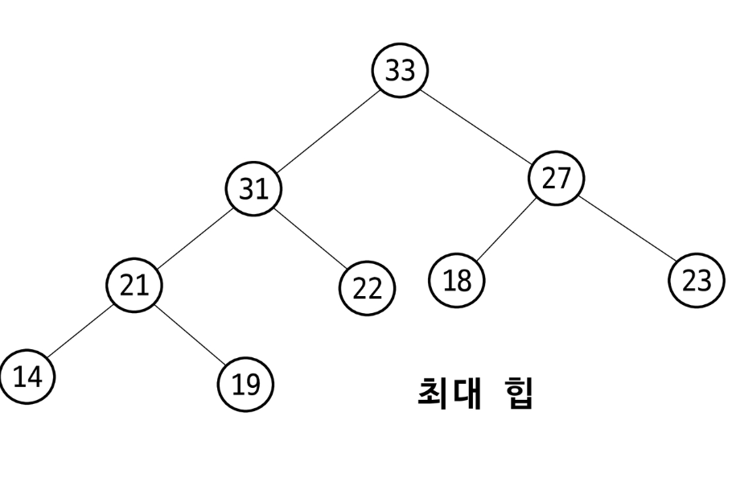
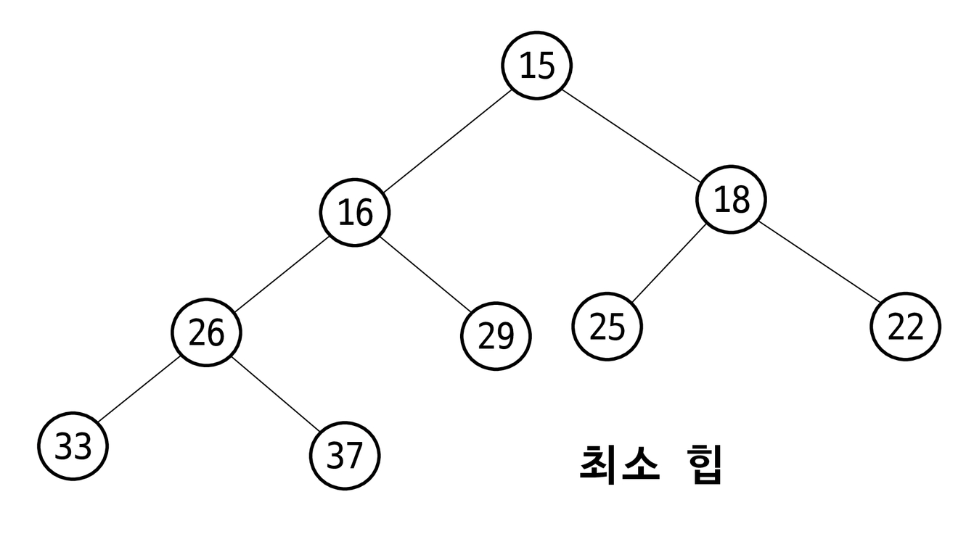
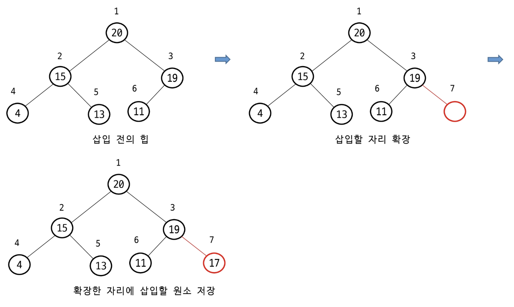
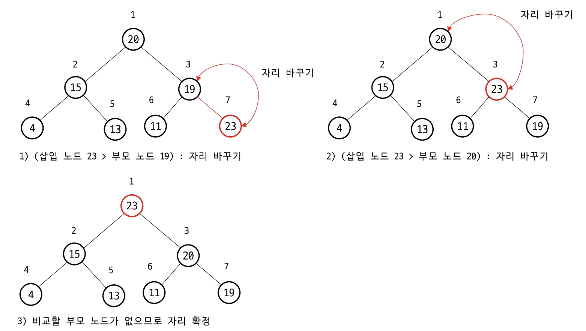
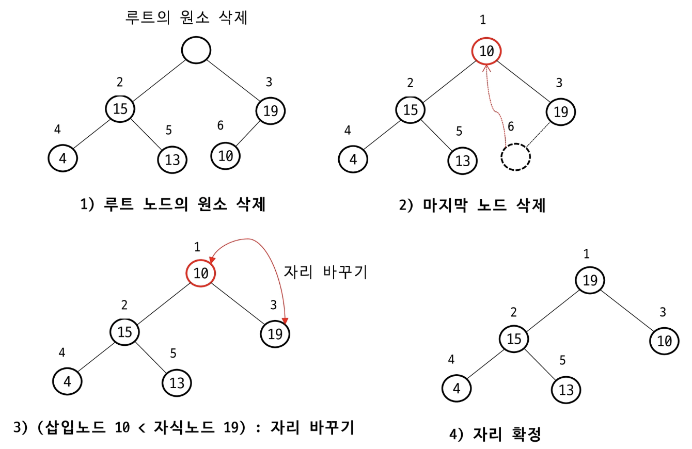

# 힙 (Heap)

- **완전 이진 트리**를 기반으로 하는 **특수한 트리 기반의 자료구조**
- 부모-자식 간의 **특정한 순서(규칙)**을 따르는 자료구조
- 최댓값 또는 최솟값을 빠르게 찾을 수 있는 특성을 가짐
- **우선순위 큐를 구현**하는데 주로 사용
- **삽입, 삭제, 탐색** 연산을 **효율적**으로 수행

## 최대 힙(Max Heap)

- **키 값**이 가장 큰 노드를 찾기 위한 완전 이진 트리
- 부모 노드의 키 값 ≥ 자식 노드의 키 값
- 루트 노드 : 키 값이 가장 큰 노드

  


## 최소 힙(Min Heap)

- **키 값**이 가장 작은 노드를 찾기 위한 완전 이진 트리
- 부모 노드의 키 값 ≤ 자식 노드의 키 값
- 루트 노드 : 키 값이 가장 작은 노드

  


## 힙의 삽입 연산 (★★★)

1. **새 요소**를 트리**(배열)**의 끝에 삽입
2. 부모 노드와 비교
3. 힙 속성이 위반된 경우, **부모와 교환**
4. 힙 속성이 **만족될 때 까지 2, 3 반복 수행**
- 시간복잡도 : $O(log N)$

### 최대 힙 - 삽입 연산

→ 배열이 어디 까지 차있는지 size? length? 를 알고 있어야함





## 힙의 삭제 연산

1. **루트 노드(최대값/최소값)를 제거**
2. 마지막 노드를 루트로 이동
3. 자식 노드와 비교
4. 힙 속성 위반 시, 자식과 교환
5. 힙 속성이 만족될 때까지 3, 4 반복 수행
- 시간복잡도 : $O(log N)$

### 최대 힙 - 삭제 연산



---

# 힙 구현

- 힙 삽입

```java
Insert(heap, value)
	1. heap.size <- heap.size + 1
	2. heap[heap.size] <- value   // 새 요소를 배열 끝에 삽입
	3. i <- heap.size             // 삽입한 요소의 인덱스
	
	4. while i > 1 and heap[parent(i)] < heap[i] do
		5. Swap(heap[i], heap[parent(i)])    // 부모 노드와 교환
		6. i <- parent(i)                    // 인덱스를 부모로 이동
		
	7. End while
```

- 힙 삭제

```java
Delete(heap)
	1. if heap.size == 0 then
		2. return "Heap is empty"
		
	3. maxValue <- heap[1]              // 루트(최댓값) 저장
	4. heap[1] <- heap[heap.size]       // 마지막 요소를 루트로 이동
	5. heap.size <- heap.size - 1       // 힙 크기 감소
	
	6. i <- 1                           // 루트 인덱스
	7. while left(i) <= heap.size do
		8. largerChild <- left(i)
		
		9. if right(i) <= heap.size and heap[right(i)] > heap[left(i)] then
			10. largerChild <- right(i)
			
		11. if heap[i] >= heap[largerChild] then
			12. break                        // 힙 속성 만족 시 종료
			
		13. Swap(heap[i], heap[largerChild])  // 자식 노드와 교환
		14. i <- largerChild                  // 인덱스를 자식으로 이동
		
	15. end while
	
	16. rethrn maxValue                     // 삭제한 최댓값 반환
```

## 우선순위 큐

- 선입 선출이 아닌 자료의 우선순위에 따라 출력이 달라짐
- **배열을 이용한 구현**
- **연결리스트를 이용한 구현**
- **Heap 자료구조**를 활용한 구현
- `java.util.PriorityQueue` 를 활용

## 힙 정렬(Heap sort)

- 힙 자료구조를 활용한 비교 기반 정렬 알고리즘
    1. **정렬하고 싶은 모든 요소를 힙에 삽입**(반복)
    2. 힙에서 **순차적으로** 값을 삭제하여 **출력**
- 중간에 값을 다시 넣었다가 빼면 정렬이 틀어질 수 있음
- 시간복잡도 : $O(Nlog N)$