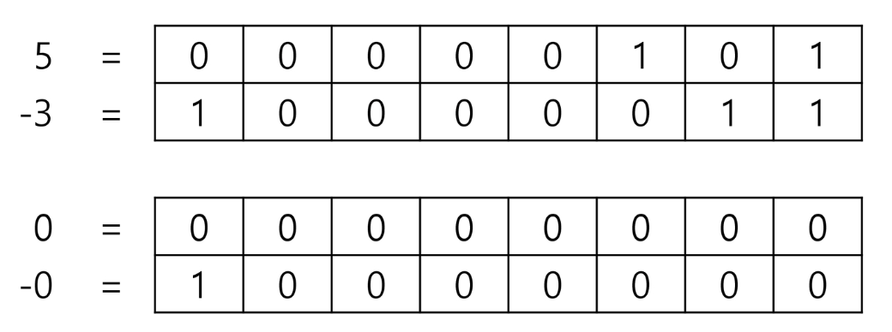

# 컴퓨터 수 표현

## 진법

- **수를 표기하는 기수법**의 하나
- 특정 숫자 기호의 개수에 따라 다양한 형태가 있음
- 일반적으로 사용하는 10진법, 컴퓨터에서 사용하는 이진법 등이 있음

## 10진법 (Decimal)

- **기수가 10**인 진법
- **0 ~ 9 까지의 10개 숫자**를 사용
- 일상 생활에서 많이 사용하는 진법

## 2진법 (Binary)

- **기수가 2**인 진법
- **0 과 1 두 숫자**를 사용
- 컴퓨터 내부에서 데이터를 처리하는 데 주로 사용

## 8진법 (Octal)

- **기수가 8**인 진법
- **0 ~ 7 까지의 8개의 숫자**를 사용
- 과거 컴퓨터 시스템에서 메모리 주소를 간략하게 표현하기 위해 사용

## 16진법 (Hexadecimal)

- **기수가 16**인 진법
- **0 ~ 9 까지의 숫자와 A ~ F 까지의 문자**를 사용 ( A : 10, B : 11, C : 12, D : 13, E : 14, F : 15 )
- 컴퓨터 과학에서 메모리 주소나 색상 코드 등을 표현할 때 사용

## 10진수 → 2진수로 변환

- **나머지 연산**을 반복하여 2진수를 얻을 수 있음
- ex) $(149)_{10} = (10010101)_2$
    
    
    

## 2진수, 8진수, 16진수의 관계

- 10진수 697을 각각의 진수로 변경하면 다음과 같다

## 8진수 → 10진수로 변환

- $(135)_8 = 1 * 8^2 + 3 * 8^1 + 5 + 8^0 = 93_{10}$
- $(135.12)_8 = 1 * 8^2 + 3 * 8^1 + 5 * 8^0 + 1 * 8^{-1} + 2 * 8^{-2} = 93.15625_{10}$
- 기타 다른 진법도 변환하는 방법은 같음 (해당 진법의 거듭제곱을 활용하여 계산)

## 음의 정수 표현 방법 (부호 비트)

- **최상위 비트** (Most Significant Bit, MSB)를 **부호 비트로 사용**하고 나머지 비트는 숫자의 크기를 표현  
양수 → 0, 음수 → 1
- 양수와 음수의 표현이 **직관적**
- **+0, -0이 모두 존재**하게 되어, 계산 시 비효율적
- 두 수의 덧셈이나 뺄셈이 복잡해짐

## 음의 정수 표현 방법 (1의 보수)

- 보수 : 수학과 컴퓨터 과학에서 **숫자나 비트의 값을 반전시켜**, 주어진 숫자를 **다른 형태로 표현하는 방법**
- 양수와 음수의 표현이 서로 반대 (비트 반전을 통해 표현 가능)
- **+0, -0이 존재**
- **덧셈, 뺄셈 연산 시 캐리 비트를 고려**해야 함

## 음의 정수 표현 방법 (2의 보수)

- **1의 보수에 1을 더한 값**
- 컴퓨터 시스템에서 음수를 표현하는 가장 일반적인 방법
- **단 하나의 0만 존재**
- 덧셈과 뺄셈을 동일한 방식으로 처리 가능

## 실수의 표현

- 2진수 소수점 이하 4자리의 값을 10진수로 변환해보면 다음과 같다

- 실수 2진수를 10진수로 변환하는 방법은 다음과 같다
- ex) $1001.0011_2$
    
    
    

## 실수의 표현 (고정 소수점, Fixed_Point)

- **소수점 위치**가 고정된 상태로 숫자를 표현
- 정수부와 소수부의 비트 수가 고정
- **구현이 간단하고 빠르**지만, 나타낼 수 있는 **숫자 범위가 제한적**임
- ex) 32비트
    
    
    

## 실수의 표현 (부동 소수점, Floating_Point)

- **가수**(mantissa)와 **지수**(exponent)로 분리하여 숫자를 표현
- 소수점의 위치를 이동시켜 표현  
소수점의 위치를 **왼쪽의 가장 유효한 숫자 다음으로 고정**시키고 **밑 수의 지수 승으로 표현**
    
    
    
- 부호 비트 : 0(양수) or 1(음수)
- 지수 비트 : **실제 소수점의 위치를 지수 승으로 표현**한 것 (익세스 표현법 사용)
- 가수 비트 : **실수의 유효 숫자 부분**을 나타내고, 정규화 표현

- 단정밀도 (Single Precision) : 32비트 → 부호 1비트, 지수 8비트, 가수 23비트, 유효 자릿수 6자리
- 배정밀도 (Double Precision) : 64비트 → 부호 1비트, 지수 11비트, 가수 52비트, 유효 자릿수 15자리
- 컴퓨터는 실수를 **근사적으로 표현(★★★)**
    - 이진법으로 표현할 수 없는 형태의 실수는 정확한 값이 아니라 근사 값으로 저장이 되는데 **이때 생기는 작은 오차가 계산 과정에서 다른 결과를 가져온다**
- IEEE 754 표준

## 실수의 표현 (부동 소수점, Floating_Point) → 단정도 실수 만들기

ex) $1001.0011_2$

- 가수 부분 만들기
    - 정수부의  첫 번째 자리가 1이 되도록 오른쪽으로 시프트 연산하고 소수점 이하 23비트를 저장  
    1.00100110000000000000000
- 지수 부분 만들기
    - 8비트 (**256개의 상태**를 나타낼 수 있음)
    - 익세스 표현법을 활용함 (실제 값을 기준 값에서 이동시킨 값으로 저장하여 양수와 음수를 쉽게 표현하게 도움을 줌)
    - bias 상수 $2^{n-1} - 1$ (32비트 : 127, 64비트 : 1023)
    - $2^3$은 3이 아닌 127 + 3 = 130 → $1000$ $0010_2$ 을 저장해야 함
- 단정도 표현에서의 지수부 익세스 표현
    
    
    

---

# 비트연산자

- 주어진 숫자를 **2진수로 표현**한 후, **각 비트를 개별적으로 연산**하는 방식
- 컴퓨터 내부에서 기본적으로 사용

## 비트 연산자 종류

- AND 연산자 (&)
- OR 연산자 (|)
- XOR 연산자 (^)
- NOT 연산자 (~)
- shift 연산자 (<< ,>>, >>>)

### AND 연산자 → & (앤퍼센드)

- 두 숫자 간의 AND 연산을 통해 **특정 비트가 모두 1인지 확인**
- 5 & 3 = 1
    
    
    

### OR 연산자 → | (버티컬 바, 파이프)

- 두 숫자 간의 OR 연산을 통해 **특정 비트가 1인지 확인**
- 5 | 3 = 7
    
    
    

### XOR 연산자 → ^ (캐럿)

- 두 숫자 간의 XOR 연산을 통해 **특정 비트가 다를 때만 1이 됨**
- 5 ^ 3 = 6
    
    
    

### NOT 연산자 → ~ (틸드)

- 숫자의 **모든 비트를 반전**시키는 예시 (1의 보수와 같음)
- ~5 = -6
    
    
    

### shift 연산자

- 왼쪽 쉬프트 연산 <<
    - 비트를 왼쪽으로 이동시키고, 오른쪽에 0을 채워 넣는 연산
    - 5 << 1 → 10
- 오른쪽 쉬프트 연산 >>
    - 비트를 오른쪽으로 이동시키고, 왼쪽에 부호 비트를 채워 넣는 연산
    - 5 >> 1 → 2
- ~~논리적 오른쪽 쉬프트 연산 >>>~~
    - ~~비트를 오른쪽으로 이동시키고, 왼쪽에 0을 채워 넣는 연산~~

## 비트연산자

---

# 부분집합 (Powerset)

- 주어진 집합의 원소 중 **일부 또는 전체를 포함하는 집합**
- 공집합 또한 부분집합의 일부
- 집합의 원소가 **N개 일 때, 부분집합의 수는 $2^N$개** (각각의 원소를 포함 or 미포함 2가지의 경우)

## 부분집합 구현 (반복문)

- 원소 수에 따라 중첩 반복문이 필요함

## 부분집합 구현 (비트 마스킹)

- 비트 연산을 통해 부분집합을 구할 수 있음

## 부분집합 구현 (재귀 함수)

- 재귀적 접근을 통하여 부분집합을 구할 수 있음

