# 조합 (Combination)

: 순서에 상관없이 주어진 **집합**에서 **일부 원소를 선택**하는 방법의 수

- 서로 다른 **n개의 원소를 가지는 집합**에서 **r개를 뽑아 나열하는 경우**를 다음과 같이 표현할 수 있음

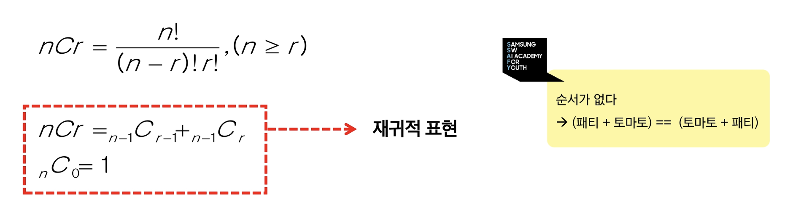

## 조합의 성질

- 대칭성 : $C(n, r) = C(n,n-r)$
- 항등식 : $C(n,0) = C(n,n) = 1$
- 파스칼의 법칙 : $C(n,r) = C(n-1,r-1)+C(n-1,r)$
    
    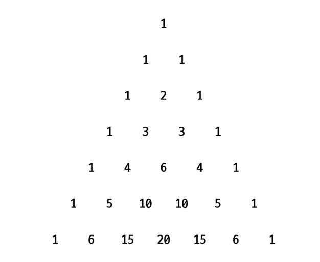
    

---

# 조합 구현

## 조합 구현 (재귀 함수)

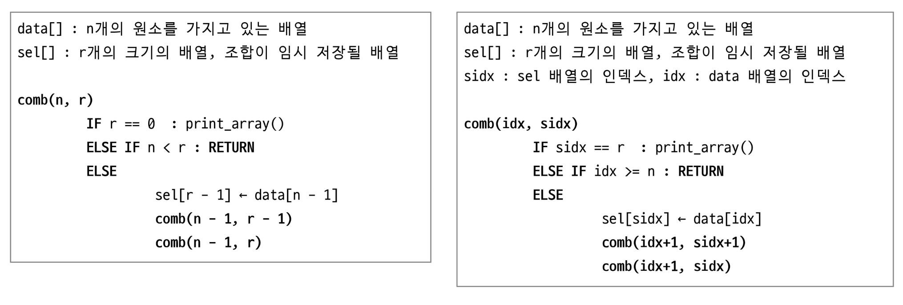

## 조합 구현 (반복문)

- 원소의 개수가 고정적일 때 사용 용이

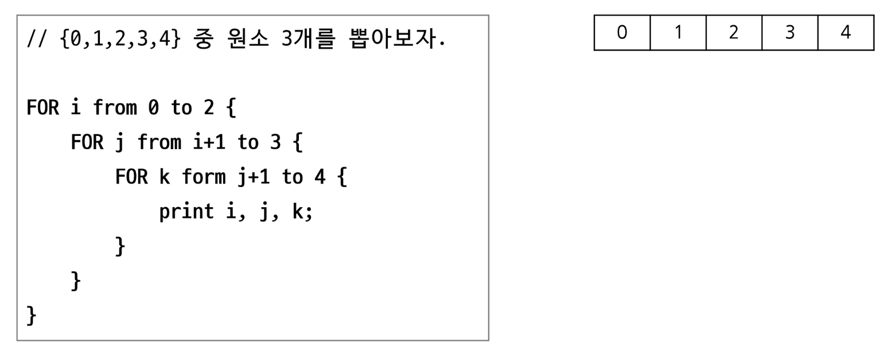

## 조합 구현 (반복문 + 재귀함수)

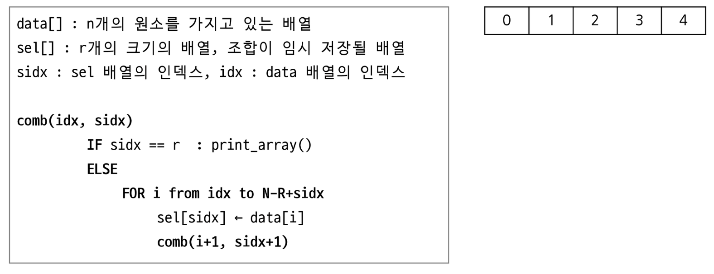

---

# 중복 조합

- n개의 항목 중에서 r개를 선택할 때, 중복을 허용하고, 순서를 고려하지 않는 경우의 수

## 중복 조합 의사코드

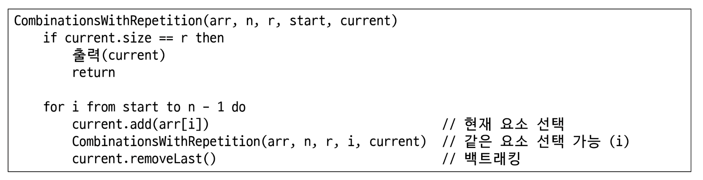

---

# 완전검색!

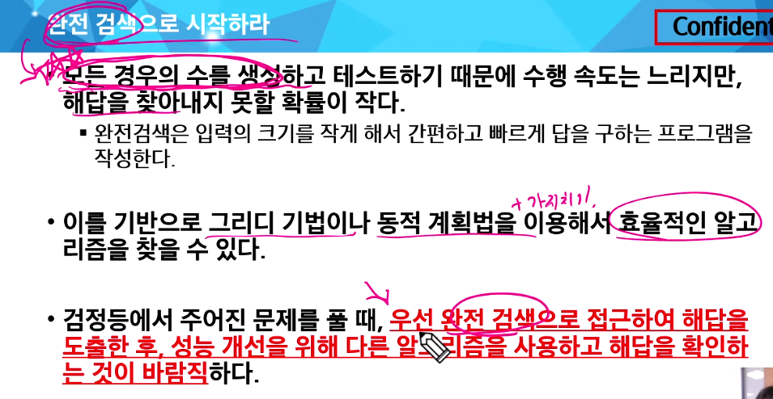

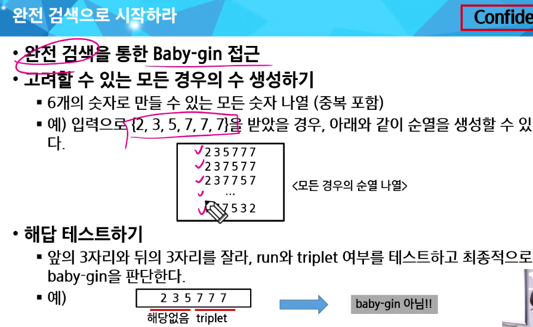

## 완전검색이나

- 만흥ㄴ 종류의 문제들이 특정 조건을 만족하는 경우나 요소를 찾는 것이다
- 또한 순열, 조합, 부분집합 과 같은 조합적 문제와 연관된다
- 완전검색은 조합적 문제에 대한 brute-force 방법이다.

# 순열

- 서로 다른 것 중 몇 개를 뽑아서 한 줄로 나열하는 것
- 서로 다른 n개 중 r개를 택하는 순열은 아래와 같이 표현

- 다수의 알고리즘 문제들은 순서화된 요소들의 집합에서 최선의 방법을 찾는 것과 관련 있다.  
예 ) TSP(Traveling Salesman Problem)
- N개의 요소들에 대해서 n!개의 순열들이 존재한다.
    - 12! = 479,001,600
    - n > 12인 경우 시간 복잡도 폭발적으로 상승
- 

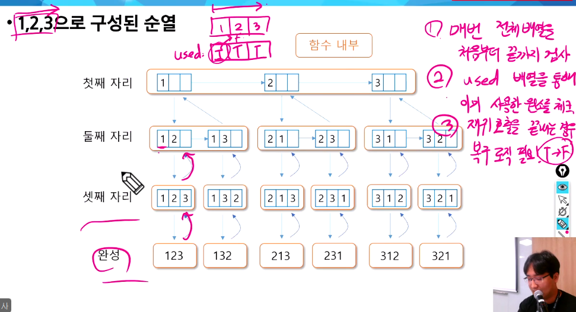

# 탐욕(Greedy) 알고리즘

- 단순하며, 제한적인 문제들에 적용됨 → 한번 선택된 것은 번복하지 않음
- 최적화 문제 : 가능한 해들 중에 가장 좋은(최대 또는 최소) 해를 찾는 문제
- 배낭 짐싸기 (knapsack)

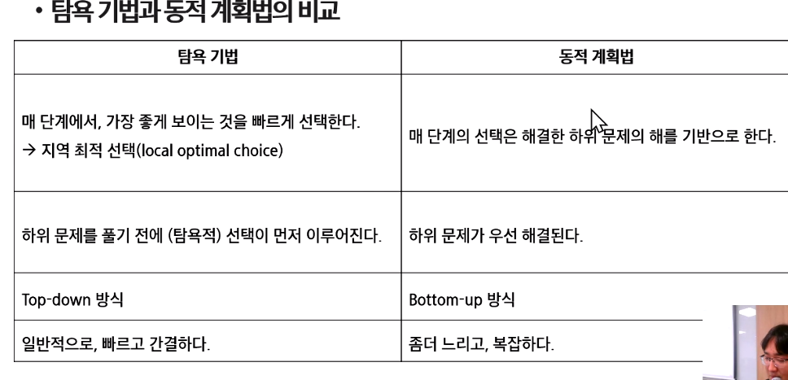

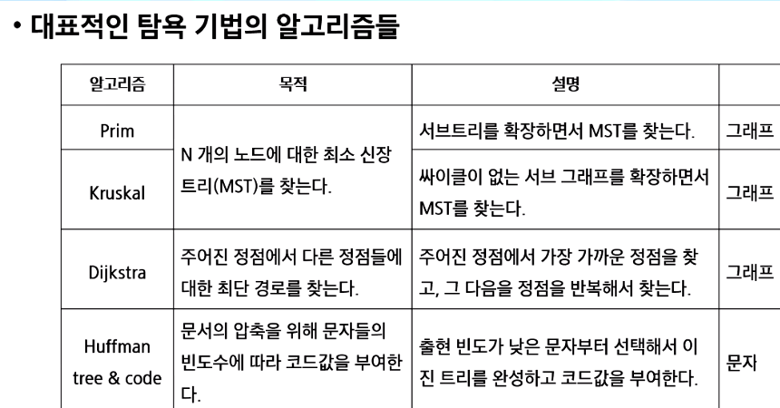

### Baby-gin

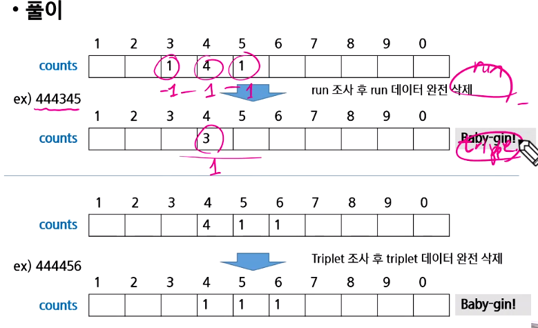