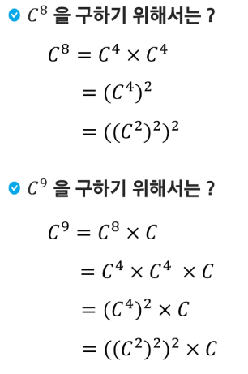
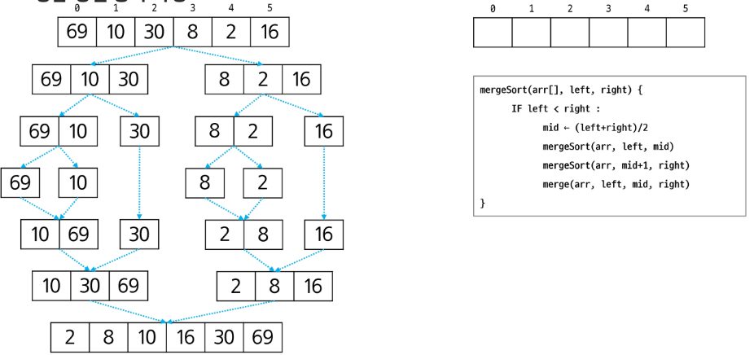
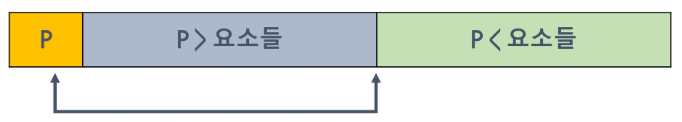

# 분할 정복 (Divide and Conquer)

- **큰 문제를 작은 하위 문제로 나누어** 해결하는 방식
- 과거의 군사적인 유래부터 현대의 컴퓨터과학에서 응용까지 활용되는 개념

## 설계 전략

- 분할(Divide) : 해결할 문제를 **여러 개의 작은 부분으로 나눈다.**
- 정복(Conquer) : 나눈 작은 문제를 **각각 해결**한다.
- 결합(Combine) : (필요하다면) **해결된 해답을 모은다**.

## Top-down approach


## 거듭제곱



## $C^n$을 구하기 위해서는?

- 반복문을 이용한 거듭제곱 $O(N)$
- **분할정복을 이용한 거듭제곱 $O(log N)$**


```java
Recursive_Power(x, n)
	IF n == 1 : RETURN x
	IF n is even
		y <- Recursive_Power(x, n/2)
		RETURN y * y
	ELSE
		y <- Recursive_Power(x, (n-1)/2)
		RETURN y * y * x
```

---

# 이진 검색

- **정렬된 배열에서** 특정한 값을 빠르게 찾기 위한 알고리즘
- 검색 범위를 **반으로 줄여가면서** 보다 빠르게 검색을 수행함

## 검색 과정

1. 중앙 값 찾기
2. 목표 값과 **중앙 값 비교**
    1. 목표 값과 중앙 값이 같은 경우 : 검색 종료
    2. 목표 값이 중앙 값 보다 작을 경우 : 왼쪽 절반 검색 수행
    3. 목표 값이 중앙 값 보다 클 경우 : 오른쪽 절반 검색 수행
3. 탐색 범위가 한 개의 원소가 될 때 까지 반복 수행

## 이진 검색 구현 (반복문)

```java
binarySearch(S[], n, key)
low <- 0
high <- n - 1

WHILE low <= high
		mid <- (low + high) / 2
		
		IF S[mid] == key
				RETURN mid
		ELSE IF S[mid] > key
				high <- mid - 1
		ELSE
				low <- mid + 1
RETURN -1 
```

## 이진 검색 구현 (재귀함수)

```java
binarySearch(S[], low, high, key)
		IF low > high
				RETURN -1
		ELSE
				mid <- (low + high) / 2
						IF key == S[mid]
								RETURN mid
						ELSE IF key < S[mid]
								RETURN binarySearch(S[], low, mid-1, key);
						ELSE
								RETURN binarySearch(S[], mid+1, high, key);
```

## 이진 검색 정리

- 시간 복잡도 $O(log N)$ → 1000개의 원소를 대략 10번 정도의 비교로 값을 찾을 수 있음.
- **미리 정렬이 되어 있어야 함**. (데이터 **삽입, 삭제가 자주 일어나면** 정렬해야 하므로 **비효율적**)
- 크기가 작은 배열에서는 크게 이점이 없을 수 있음

- 심화
    - java.util.Arrays.binarySerach 메서드 공부
    - BST (Binary Search Tree)
    - 이진 검색 응용 → Lower Bound, Upper Bound

---

# 병합 정렬 (Merge Sort)

- **분할 정복**(Divide and Conquer) 기법을 활용한 **안정적인 정렬 알고리즘**
- 배열을 **절반으로 분할**하고, 각 부분을 **재귀적으로 정렬**한 뒤, **정렬된 부분 배열을 다시 병합**하는 정렬 방식
- 시간 복잡도 $O(NlogN)$
- **추가적인 공간 필요**

## 단계 별 동작

- 분할(Divide) : 주어진 배열을 **반으로 나눈다.**
- 정복(Conquer) : 각 부분 배열을 **재귀적으로 병합 정렬을 사용해 정렬**한다.
- 결합(Combine) : 정렬된 **부분 배열들을 합쳐 전체 배열을 정렬**한다.

## 병합 정렬 과정 (분할)


## 병합 정렬 과정 (정복 & 병합)


## 병합 정렬 의사코드


## 병렬 정렬 동작 과정



---

# 퀵 정렬

- 분할 정복(Divide and Conquer) 기법을 활용한 효율적인 정렬 알고리즘
- 피벗(Pivot)이라는 기준 요소를 선택하여 배열을 두 부분으로 분할하고, 재귀적으로 정렬하는 방식
- 시간 복잡도 $O(NlogN)$, 최악에는 $O(N^2)$
- 추가적인 공간은 필요치 않아 함

## 단계 별 동작

- Pivot 결정 (여러 개의 선정하는 방법이 존재)
- 분할(Divide) : Pivot 보다 작은 요소는 왼쪽에, 큰 요소는 오른쪽에 위치하도록 배열을 나눈다.
- 정복(Conquer) : 분할된 배열을 다시 재귀적으로 정복한다.
- 결합(Combine) : 따로 필요치 않습니다. (이미 정렬 완료)

## 퀵 정렬 아이디어

- P(피벗)값들 보다 큰 값은 오른쪽, 작은 값들은 왼쪽 집합에 위치하도록 한다.

  

- 피벗을 두 집합의 가운데에 위치시킨다.

  


## 퀵 정렬 과정

```java
quickSort(A[], l, r)
		if l < r
				pivot <- partition(A[], l, r)
				quickSort(A[], l, pivot - 1)
				quickSort(A[], pivot + 1, r)
```

## 퀵 정렬 과정 (Hoare 파티션)

- 피벗 선택 하기
    1. 첫 번째 요소 선택
    2. 마지막 요소 선택
    3. 중간 요소 선택
    4. 랜덤 요소 선택
    5. 세 값의 중앙 값 선택


## 퀵 정렬 과정 (Hoare 파티션) 의사코드

```java
Hoare-Partition(arr[], left, right) {
		pivot <- arr[left] // 제일 왼쪽 값 pivot
		L <- left+1 , R <- right
		while( L <= R ) {
				while(L <= R and arr[L] <= pivot) L++
				while(arr[R] > pivot) R--
				if (L < R)
						swap(arr[L], arr[R])
		}
		swap(arr[left], arr[R])
		return R
}
```

## 퀵 정렬 과정 (Lomuto 파티션)


## 퀵 정렬 과정(Lomuto 파티션) 의사코드

```java
Lomuto-Partition(arr[], left, right) {
		pivot <- arr[right]
		i <- left - 1
		
		FOR j in left -> right - 1
				IF arr[j] <= pivot
						i++
						swap(arr[i], arr[j])
		swap(arr[i+1], arr[right])
		RETURN i + 1
}
```