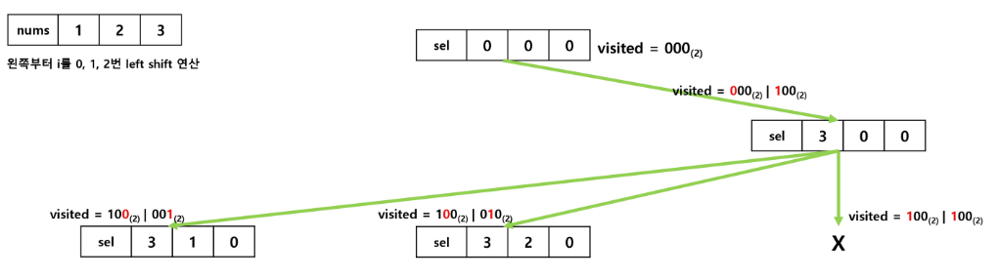
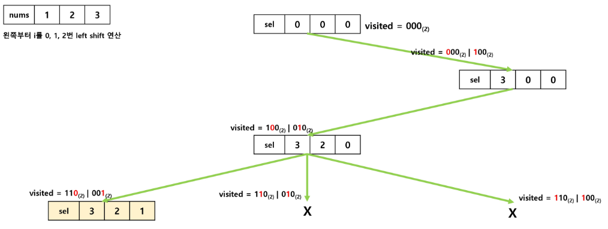

# 백트래킹 (Backtracking)

- **가능한 모든 경우를 탐색하는 중** 해답으로 **이어지지 않은 경우에 대해서는 탐색하지 않고** 되돌아가며 해결하는 알고리즘 기법
- 유망(promising) : **현재 상태(노드, 경로)가** 문제의 **해답으로 발전할 가능성이 높은지를 판단**하는 기준
- 가지치기(pruning) : 탐색 중 **불필요한 경로를 제거**하여 **탐색의 효율성을 높이는 방법**

## 완전 탐색 vs 백트래킹

- 모든 경우의 수를 고려하는 완전 탐색(브루트 포스)과는 달리 **모든 경우의 수를 고려하지 않음**
- 일반적으로 경우의 수가 줄어들지만 최악의 경우에는 **여전히 지수함수 시간을 요하므로 해결이 불가능**
    1. 가지치기가 거의 이루어지지 않은 상황
    2. 문제가 매우 큰 입력을 가지는 상황
    3. 유효한 해답이 거의 없는 상황
    4. …

## N-Queen 문제

- N x N 크기의 체스 판 위에 N개의 Queen 들을 서로 위협하지 않게 배치하는 문제

## 8-Queen 문제

- 8 x 8 크기의 체스 판 위에 8개의 Queen 들을 서로 위협하지 않게 배치하는 모든 경우의 수를 구하는 문제
- 모든 경우의 수 속에서 최대한 효율적으로 찾아내는 것이 관건

## 4-Queen 문제

- 모든 경우의 수를 탐색하였을 때 해답이 될 가능성이 전혀 없는 경우의 수들도 검색해야 하므로 비효율적
- 해당 노드의 유망성을 판단하고 백트래킹을 적용해 해결해 보자

```java
NQueen (node V)
 IF promising(V)
	 IF ther is a solution at V
		 write the solution
	 ELSE
		 FOR each child u of V
			 NQueen( u )
```

---

# 순열 (Permutation)

- 서로 다른 원소들을 **특정한 순서로 나열**하는 것
- **서로 다른 n개의 원소**를 가지는 집합에서 **r개를 뽑아 순서 있게 나열하는 경우**를 다음과 같이 표현할 수 있음
- $nPr = n \times (n-1) \times (n-2) \times ... \times(n-r+1)$
- 서로 다른 n개의 원소 집합에서 n개를 뽑아 나열하는 경우를 팩토리얼 (Factorial)이라함
- $n! = n \times (n-1) \times (n-2) \times ... \times2 \times 1$

## N의 범위에 따른 순열의 수

- n > 12 인 경우, 시간 복잡도 폭발적으로 증가
    
    
    

## 순열을 활용하는 문제

- 0~9 까지의 숫자를 활용하여 4자리의 비밀번호를 만드는 경우 만들 수 있는 경우의 수를 구하시오
- 5명의 사람을 줄을 세우려고 할 때 경우의 수
- A, B, C, D 도시가 있다. 방문할 수 있는 경우의 수
- 등등

## 순열 구현 (반복문)

- 3개의 원소를 가진 배열이 있을 때 모든 순열을 생성해 보시오
- ex) arr = {1,2,3}

```java
FOR i1 in arr
	FOR i2 in arr
		IF i2 != i1
			FOR i3 in arr
				IF i3 != i1 AND i3 != i2
					print( i1, i2, i3 )
```

## 순혈 구현 (swap)

```java
// arr[] : 데이터가 저장된 배열
// swap(i, j): arr[i] <-- 교환 -- > arr[j]
// n: 원소의 개수, k: 현재까지 교환된 원소의 개수
perm( n, k )
	IF k == n
		print array // 원하는 작업 수행
	ELSE
		FOR i in k -> n-1
			swap(k, i);
			perm(n, k + 1);
			swap(k, i);
```

## 순혈 구현 (방문체크)

```java
nums : 데이터
result : 결과 저장 배열
check : 해당 원소 사용했는지 체크하기 위한 배열

permutation(idx) {
	if idx == N
		(순열 생성완료)
		return
	for i from 0 to N-1
		if check[i] { continue }
		result[idx] = nums[i]
		check[i] = true
		permutation(idx+1)
		check[i] = false
}
```


## 순혈 구현 (비트마스킹)

```java
nums : 데이터
sel : 결과 저장 배열
visited : 해당 원소 사용했는지 체크
permutation(idx, visited) {
	if idx == N
		(순열 생성완료)
		return
	for i from 0 to N-1
		if visited & (1 << i) != 0 { continue }
		sel[idx] = nums[i]
		permutation(idx+1, visited | 1 << i)
}
```







## 순열의 확장 개념 (생각해볼 필요가 있는 문제)

- 중복 순열 → 원소를 뽑을 대 중복을 허용하는 경우
- 원형 순열 → 배열 할 때 원형으로 배열하는 경우