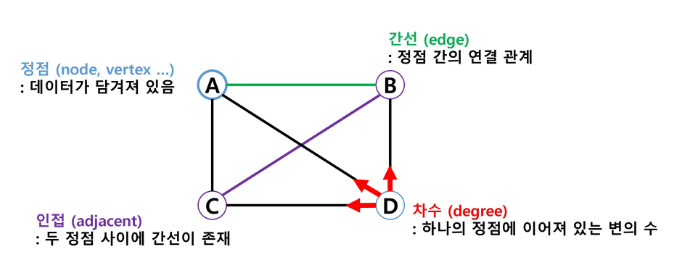
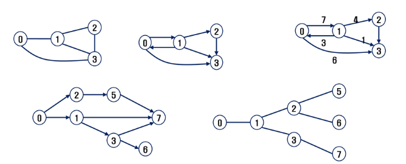
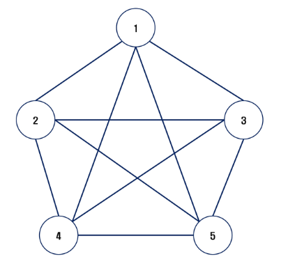
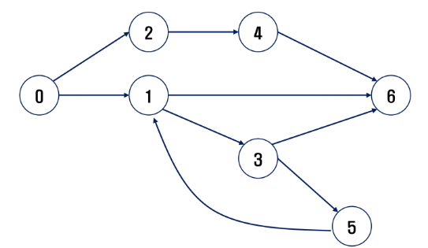
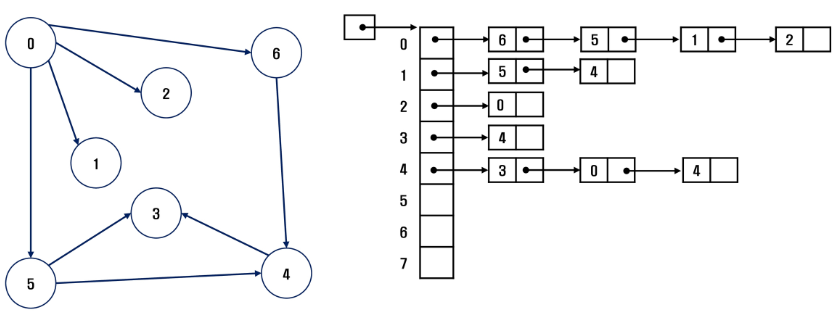
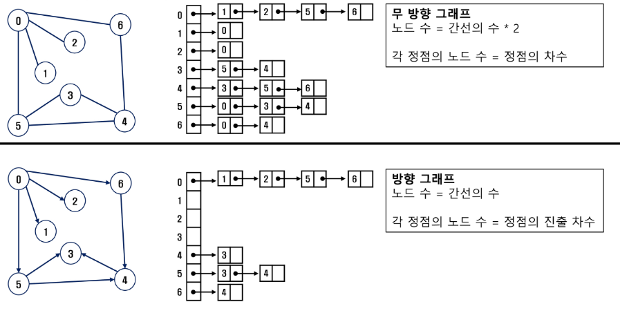
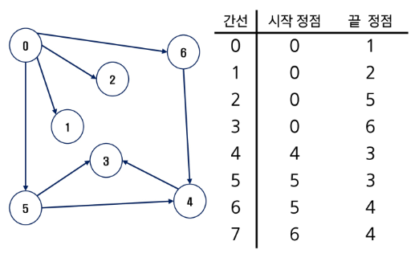

# 그래프 기본

## 그래프

- **아이템(사물 또는 추상적 개념)**들과 이들 사이의 연결 관계 표현
- **정점**들의 집합과 이들을 연결하는 간선들의 집합으로 구성된 자료구조
- 선형자료구조나 트리로 표현하기 어려운 **M : N 의 관계를 표현**한 것
- V개의 정점을 가지는 그래프는 최대 V \* ( V - 1 ) / 2 간선이 가능

## 그래프 종류

- **무향** 그래프(Undirected Graph) & **유향** 그래프 (Directed Graph)
- **가중치** 그래프 (Weighted Graph)
- 순환 그래프 (Cycle Graph)
- 비 순환 방향 그래프(DAG, Directed Acycle Graph)
- …

## 완전 그래프 & 부분 그래프

- 정점들에 대해 가능한 **모든 간선들을 가진 그래프**
- **일부 간선들을 가진 그래프**

## 경로(Path)

- **간선들을 순서대로 나열**한 것
- 하나의 정점을 한번만 지나는 경로를 **단순 경로**라고 한다
- 시작 정점에서 끝나는 경로를 **사이클 (Cycle)**이라고 한다

# 그래프 표현방법

- 간선의 정보를 저장하는 방식 메모리나 성능을 고려하여 결정
  1. 인접 행렬(Adjacent Matrix)
  2. 인접 리스트 (Adjacent List)
  3. 간선 배열 (Edge Array)

## 인접 행렬 (Adjacent Matrix)

- 두 정점을 연결하는 간선의 유무를 행렬로 표현
- V \* V 개의 2차원 배열  
  → V : 정점의 개
- 행 번호와 열 번호는 **그래프의 정점 번호**
- 두 정점이 인접되어 있으면 1, 그렇지 않으면 0으로 표현 (**가중치가 있다면 해당 값으로 작성**)
- **무향** 그래프 → i 번째 행의 합 = i 번째 열의 합 = $V_i$의 차수
  
- **유향** 그래프 → i 번째 행의 합 = $V_i$의 진출 차수, i번째 열의 합 = $V_i$의 진입 차수
  

## 인접 리스트 (Adjacent List)

- **각 정점에 대한** 인접 정점들을 순차적으로 표현
- 하나의 정점에 대한 **인접 정점들을 각 노드로 하는 연결리스트로 저장**

## 간선 배열 (Edge Array)

- 정점과 정점의 연결 정보인 간선을 배열에 저장
- 간선을 표현하는 두 정점의 정보를 배열 혹은 객체로 저장할 수 있음

