# 서로소 집합 (Disjoint sets)

## 상호 배타 집합

- **중복 포함된 원소가 없는** 집합 → 교집합이 없음
- 각 집합은 대표자를 통해 구분

## 상호 배타 집합 표현 방법

- 연결 리스트 → 이론만
- **트리**

## 상호 배타 집합 연산

- Make-set(x)
- Find-set(x)
- Union(x, y)

## 상호 배타 집합 실습

- Make-Set(x)
- Make-Set(y)
- Make-Set(a)
- Make-Set(b)
- Union(x, y) → 합치기
- Union(a, b)
- Find-Set(y) → y가 속한 그룹의 대표 찾기
- Find-Set(b)
- Union(x, a)

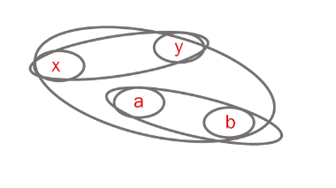

## 연결리스트 표현

- 같은 집합의 원소들을 **하나의 연결리스트 관리**
- 연결리스트의 **맨 앞의 원소를 집합의 대표자**로 설정
- 각 원소는 **집합의 대표 원소를 가리키는 링크를 갖는다**

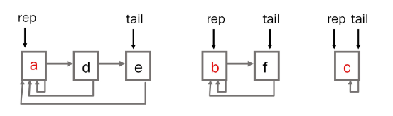

### 예제

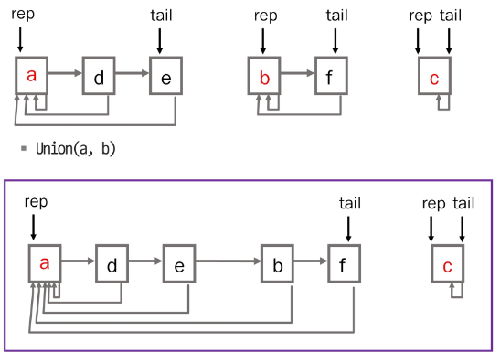

## 트리 표현

- 하나의 집합을 하나의 트리로 표현
- **자식 노드가 부모 노드를 가리키며** 루트 노드가 **대표자**가 된다

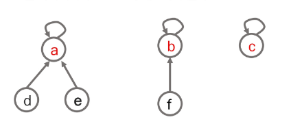

### 예제

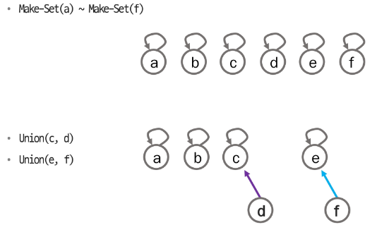

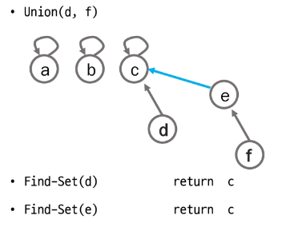

## 상호 배타 집합 트리를 배열에 저장

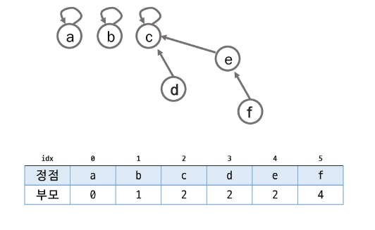

## Make-Set(x): 유일한 멤버 x를 포함하는 새로운 집합을 생성하는 연산

```java
Make-Set(x)
		p[x] <- x
```

## Find-Set(x): x를 포함하는 집합을 찾는 연산

```java
Find-Set(x)
		IF x == p[x] : RETURN x
		ELSE         : RETURN Fund-Set(p[x])
```

## Union(x, y): x와 y를 포함하는 두 집합을 통합하는 연산

```java
Union(x, y)
		p[Find-Set(y)] <- Find-Set(x)
```

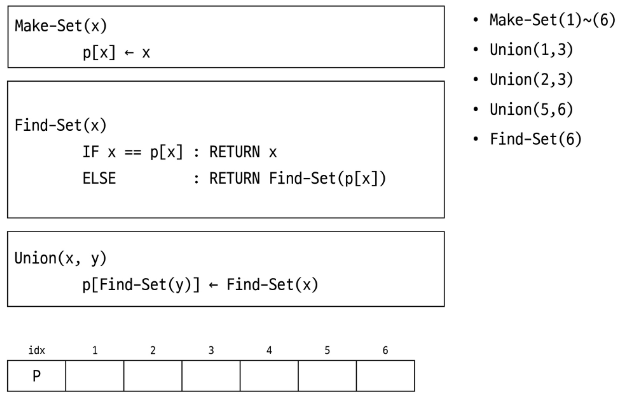

## 연산의 효율을 높이는 방법

- **Rank를 이용한 Union**
    - 각 노드는 자신을 루트로 하는 subtree의 높이를 랭크(rank)라는 이름으로 저장
    - 두 집합을 Union 할 때 rank가 낮은 집합을 높은 집합에 붙인다
- **Path Compression**
    - Find-Set 을 행하는 과정에서 만나는 모든 노드들이 직접 대표를 가리키도록 수정한다.

## Rank를 이용한 Union

- 두 대표자의 rank가 다를 경우

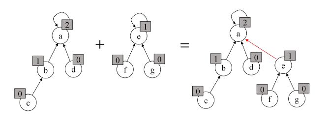

- 두 대표자의 rank가 같을 경우

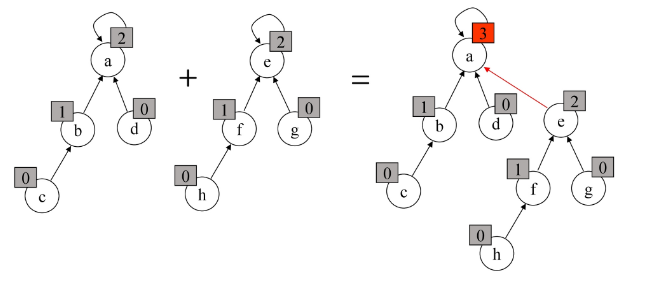

## Path Compression

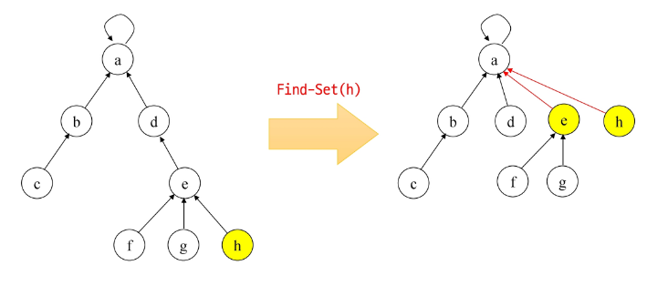

## Make-Set() 연산

- 유일한 멤버 x를 포함하는 새로운 집합을 생성하는 연산
- 반복문을 이용하여 간소화

```java
p[x] : 노드 x의 부모 저장
rank[x] : 루트 노드가 x인 트리의 랭크 값 저장

Make-Set(x)
		p[x] <- x
		rank[x] <- 0
```

## Find-Set 연산

- Find-Set(x) : x를 포함하는 집합을 찾는 연산
- 특정 노드에서 루트 노드까지의 경로를 찾아 가면서 노드 부모의 정보를 갱신

```java
Find-Set(x)
		IF x != p[x] :     // x가 루트가 아닌 경우
				p[x] <- Find-Set(p[x])
		RETURN p[x]
```

## Union 연산

- Union (x, y): x와 y를 포함하는 두 집합을 합하는 연산

```java
Union(x, y)                  // x, y는 대표자
		IF rank[x] > rank[y] :   // rank는 트리의 높이
				p[y] <- x
		ELSE
				p[x] <- y
				IF rank[x] == rank[y] :
						rank[y]++
```

---

# 최소 비용 신장 트리 (Minimum Spanning Tree)

## 신장 트리

- 그래프의 모든 정점과 간선의 부분 집합으로 구성되는 트리

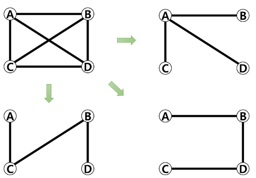

## 최소 신장 트리

- 신장 트리 중에서 사용된 간선들의 **가중치 합**이 **최소인 트리**
- 무 방향 가중치 그래프
- N개의 정점을 가지는 그래프에 대해 **반드시 (N-1)개의 간선을 사용**
- **사이클을 포함 X**

## 왜 사용하는 가?

- 도로망, 통신망, 유통망 등등 여러 분야에서 비용을 최소로 해야 이익을 볼 수 있다.
- 대표적인 알고리즘으로 **크루스칼, 프림**이 있음

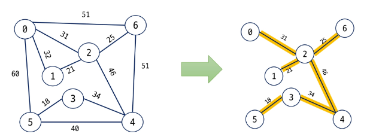

---

# KRUSKAL Algorithm

## 크루스칼 알고리즘

1. 최초, **모든 간선을 가중치에 따라 오름차순으로 정렬**
2. 가중치가 **가장 낮은 간선부터 선택하면서 트리를 증가**시킴  
   → 사이클이 존재하면 **다음으로** 가중치가 **낮은 간선 선택**
3. N-1개의 간선이 선택될 때 까지 **2. 반복**

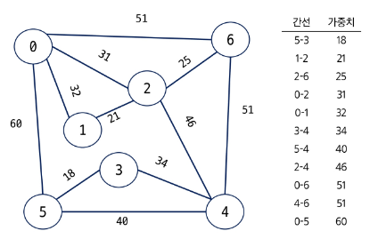

## 크루스칼 알고리즘 의사코드

```java
MST-KRUSKAL(G)
	A <- 0                  // 0: 공집합
	FOR v in G.V            // G.V: 그래프의 정점 집합
		Make-Set(v)           // G.E: 그래프의 간선 집합
		
	G.E에 포함된 간선들을 가중치 w에 의해 정렬
	
	FOR 가중치가 가장 낮은 간선 (u, v) ∈ G.E 선택(n-1개)
		IF Find-Set(u) != Find-Set(v)
			A <- A ∪ {(u, v)}
			Union(u, v);
	
	RETURN A
```

### 실습

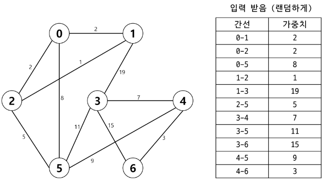

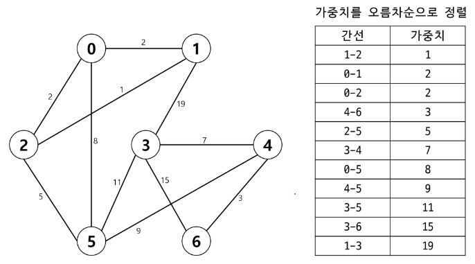

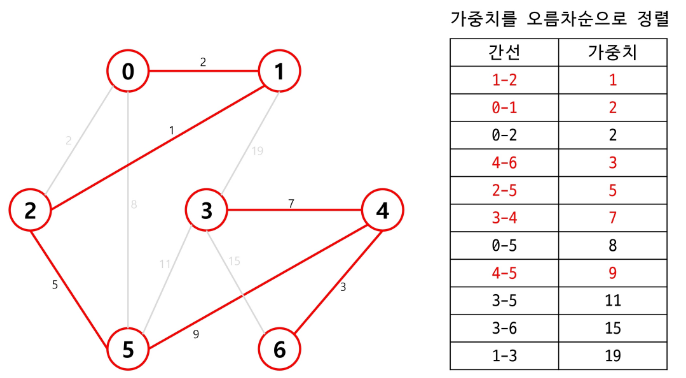