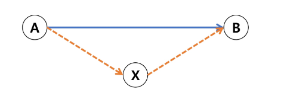

# Prim Algorithm

## 프림 알고리즘

- 하나의 정점에서 연결된 **간선들 중**에 하나씩 선택하면서 MST를 만들어가는 방식
    1. 임의 정점을 선택하여 시작 → 보통 첫번째..
    2. 선택한 정점과 인접하는 정점들 중의 **최소 비용의 간선**이 존재하는 정점을 선택
    3. 모든 정점이 선택될 때 까지 2. 과정을 반복
- 서로소인 2개의 집합 정보를 유지
    - **트리 정점 :** MST를 만들기 위해 선택된 정점들
    - **비트리 정점들 :** 선택 되지 않은 정점들

## 프림 알고리즘 의사코드

```java
MST-PRIM(G, r)                              // G : 그래프, r : 시작 정점
    FOR u in G.V                            // G.V : 그래프의 정점 집합
        u.key <- ∞                          // u.key : u에 연결된 간선 중 최소 가중치
        u.p <- NULL                         // u.p : 트리에서 u의 부모
				
		r.key <- 0
		Q <- G.V                                // 우선순위 Q에 모든 정점 넣기
		WHILE Q != 0                            // 빈 Q 가 아닐 동안 반복
            u <- Extract-MIN(Q)                 // key 값이 가장 작은 정점 가져오기
            FOR v in G.Adj[u]                   // u의 인접 정점들 v
                IF v ∈ Q AND w(u, v) < v.key   // Q에 있는 v의 key값 갱
                    v.key <- w(u, v)
                    v.p <- u
```

---

# Dijkstra Algorithm

## 최단 경로 정의

- 가중치가 있는 그래프에서 **두 정점 사이의 경로들 중** 간선의 가중치의 합이 최소인 경로

## 하나의 시작 정점에서 끝 정점까지의 최단 경로

- 다익스트라(Dijkstra) 알고리즘 **(음의 가중치 허용X)**
- 벨만-포드(Dellman-Ford)알고리즘 **(음의 가중치 허용O)**

## 모든 정점들에 대한 최단 경로

- 플로이드-워셜(Floyd-Warshall) 알고리즘

## 다익스트라 알고리즘

- 시작 정점에서 **거리가 최소인 정점을 선택**해 나가면서 최단 경로를 구하는 방식
- 탐욕 알고리즘 중 하나이고, **프림 알고리즘과 유사함**
- 정점 A에서 정점 B까지의 최단 경로 (A → X + X → B)



## 다익스트라 알고리즘 동작 과정

1. 시작 정점 입력
2. 거리 저장 배열을 ∞로 초기화
3. 시작점에서 갈 수 있는 곳의 값 갱신
4. 아직 방문하지 않은 점들이 가지고 있는 **거리 값**과 현재 정점에서 방문하지 않은 정점끼리의 **가중치의 합이 작다면 갱신**  
→ 이게 프림과 다르다!
5. 모든 정점을 방문할 때 까지 반복

## 다익스트라 의사코드

```java
G : 그래프, r : 시작 정점 , S : 선택된 정점 집합
D : 출발점에서 각 정점까지 최단 경로 가중치 합을 저장
P : 최단 경로 트리 저장, ADJ(u) 정점 u 인접 정점 집합

Dijkstra(G, r)
		S <- Ø
		FOR ALL v ∈ V
				D[v] <- ∞
				P[v] <- NULL
		D[r] <- 0
		
		WHILE S != V
				D[u]가 최소인 정점 u ∈ V - S를 선택
				S <- S u {u}
				FOR ALL v ∈ ADJ(u)
						IF v ∈ V - S AND D[v] > D[u] + weight(u, v)
								D[v] = d[u] + weight(u, v)
								P[v] = u
```