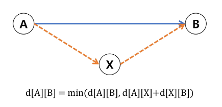
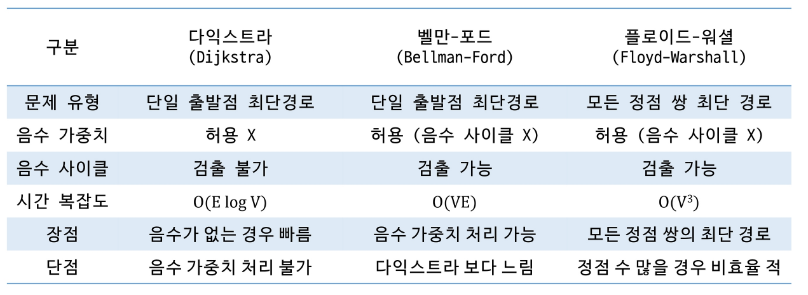

# 벨만 포드 알고리즘 (Bellman-Frod)

- 단일 출발점 최단 경로 문제를 해결할 수 있음
- **음의 가중치**를 포함하는 그래프에서 최단 경로 구할 수 있음  
→ 다익스트라 보단 조금 느림!
- **음수 사이클(negative cycle)탐지** 가능 → 최단 경로가 **‘무한대로 줄어드는 경우’ 방지**
- 모든 간선을 순회하면서 알려진 최단 경로보다 더 짧은 경로가 있다면 **값을 갱신하는 과정**을 진행함 **(최대 V - 1 번)**
- 시간 복잡도 $O(VE)$// V : 정점의 수, E : 간선의

## 벨만 포드 알고리즘 동작과정

1. 초기화 → **시작 정점** 거리 **0**, 다른 **모든 정점 거리 ∞**
2. Relaxation 과정 (**V - 1번 반복**) → 모든 간선 갱신(업데이트)
3. 음수 사이클 검사
    - 최단 거리 갱신 O → 음의 사이클 존재 O
    - 최단 거리 갱신 X → 음의 사이클 존재 X

## 벨만 포드 알고리즘

- 사이클을 진행할 수록 최단 경로가 작아지는 것을 볼 수 있음
- V - 1번의 사이클 후에 한번 더 Relaxation 단계를 진행하면 값이 작아짐 → 음의 사이클 발생

## 벨만 포드 알고리즘 의사코드

```java
BellmanFord(verices, edges, start):
	//1. 초기화
	for each vertex v in vertices:
		distance[v] = ∞
	distance[start] = 0
	
	//2. V-1번 반복하며 완화 수행
	for i from 1 to |vertices| - 1:
		for each edge (u, v, weight) in edges:
			if idstance[u] + weight < distance[v]:
				distance[v] = distance[u] + weight
				
	//3. 음수 사이클 검사
	for each edge (u, v, weight) in edges:
		if distance[u] + weight < distance[v]:
			return "음수 사이클 존재"
			
	return distance
```

---

# 플로이드 워셜 알고리즘(Floyd-Warshall)

- **모든 정점 쌍**에 대한 **최단 경로** → 단일 출발점 X / 모든 정점 쌍에 대한 최단 경로 계산
- **음의 가중치를 포함**하는 그래프에서 최단 경로 구할 수 있음 (단, 음의 사이클 x)
- 경유지를 하나씩 추가하면서, 각 정점 쌍의 경로를 **점진적으로 개선**함
- 시간 복잡도 $O(V^3)$ // V : 정점의 수



## 플로이드 워셜 알고리즘 동작 과정

1. **초기화** → **직접 연결된 간선**이 있으면 **해당 가중치로 갱신**, **간선이 없는 경우 ∞**, **자기 자신은 0**
2. 중간 정점 (경유지) 추가 (3중 for문)
    - 중간 정점 k를 경유지로 사용했을 때 i에서 j로 가는 경로의 거리를 갱신
3. 음수 사이클 검사
    - 어떤 정점 i 에 대해 d[i][i] < 0 인 경우가 발생하면 음수 사이클 존재

## 플로이드 워셜 알고리즘 의사코드

```java
FloydWarshall(V, d):
	// V: 정점의 집합 (크기 n)
	// d: n x n 행렬, d[i][j]는 i에서 j로 가능 가중치
	// (연결이 없으면 ∞, 자기 자신은 0)
	
	for k from 1 to n:
		for i from 1 to n:
			for j from 1 to n:
				if d[i][k] + d[k][j] < d[i][j]:
					d[i][j] = d[i][k] + d[k][j]
					
	// (옵션) 음수 사이클 검충
	for i from 1 to n:
		if d[i][i] < 0:
			report "음수 사이클 존재"
			
	return d
```

---

# 최단 경로 알고리즘 비교 분석

