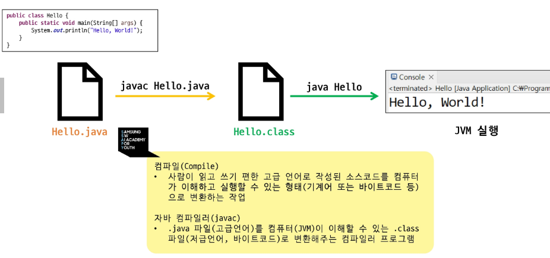
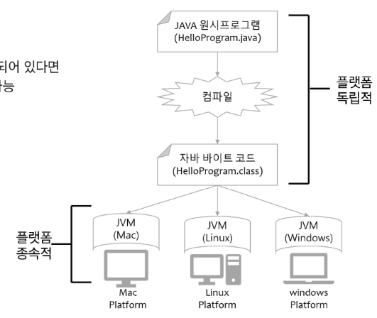
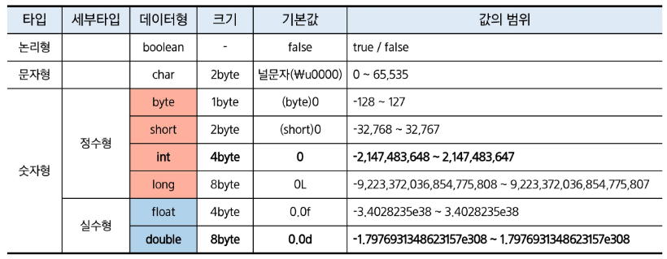
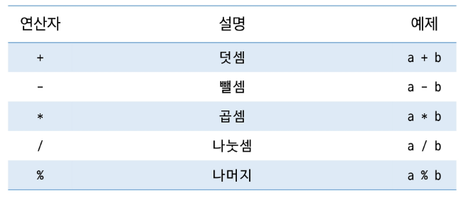
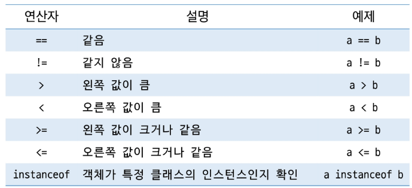
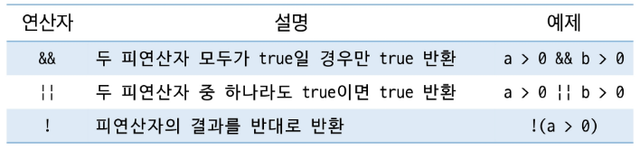
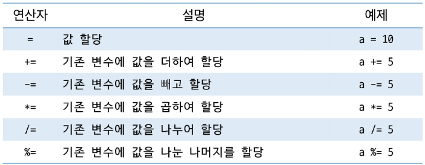
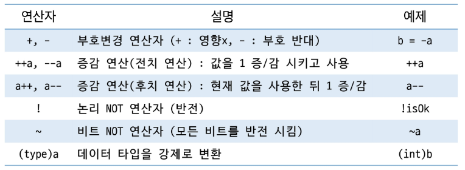
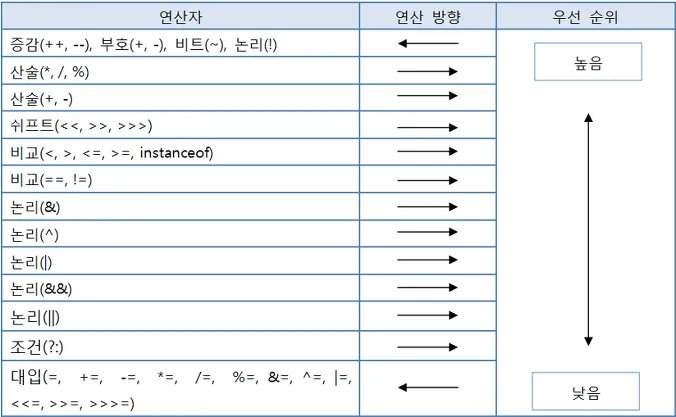

# 미리 알아두기

**JVM (Java Virtaul Machine)**
- 자바 프로그램이 실행되는 환경

**JRE (Java Runtime Environment)**
- 자바 프로그램을 실행하기 위한 환경 제공

**JDK (Java Development Kit)**
- 자바 애플리케이션을 개발하고 실행하기 위한 모든 도구를 제공

### 수업 전 코드 공유 & 실습

- MM(MatterMost)
- lab SSAFY
- 온라인 실습실(수업 후 과제 제공)

# Hello Java

## 프로그램(Program)

- 컴퓨터의 명령어들의 집합
- 프로그래밍(Programming) → 컴퓨터에게 명령을 내리는 과정
- 저급언어(기계어, 어셈블리어) / 고급언어(Java, Python)
- 운영체제(Operating System, OS) 역시 프로그램

## 컴퓨터의 자료표현

- 비트 : 0 또는 1의 값만 가질 수 있음 → 2진수 사용
- 바이트 : 8개의 비트로 구성된 정보단위, 컴퓨터 메모리의 기본 단위
- 10진수 기반 단위 : B → KB → MB → GB → TB → PB → EB → ZB → YB
- 2진수 기반 단위 : KiB → MiB → GiB → TiB → PiB → EiB → ZiB → YiB

> 8bit = 1byte

STS 실행 → 워크스페이스 설정

- 설치 한 JDK 설정
- 메뉴 → window → Preferences → Java → Installed JREs 확인
- Compiler 확인
- Java 프로젝트 생성 (Module : Create module-info.java file 해제)
- Class 파일 생성 및 코드 작성
- 실행 해서 확인

### 주석(Comment)

- `// 내용` : 한 줄 주석, 해당 기호가 있는 위치부터 그 주 끝까지 주석처리
- `/*내용*/` : 여러 줄 주석, 해당 범위의 내용 주석 처리
- `/**내용*/` : 문서화 주석, Documentation API를 위한 주석 처리

### 출력 메서드

- System.out.print(데이터)
    - 전달된 데이터를 줄 바꿈 없이 출력
- System.out.println(데이터)
    - 전달된 데이터를 출려한 뒤 줄 바꿈을 추가
- System.out.printf(형식 문자열, 데이터1, 데이터2 ..)
    - 문자열을 형식화(formatting) 하여 출력
    - %d : 정수
    - %f : 실수
    - %s : 문자열
    - %c : 문자
    - %n : 줄 바꿈

### 무슨 일이 일어나는가?



**컴파일(Complie)**

- 사람이 읽고 쓰기 편한 고급 언어로 작성된 소스코드를 컴퓨터가 이해하고 실행할 수 있는 형태로 변환하는 작업

### Write Once, Run Anywhere

- 자바 언어의 슬로건
- 플랫폼에 독립적이고, JVM만 설치되어 있다면 다양한 OS에서 동일한 코드 실행 가능



# 변수와 자료형

### 정의

- 컴퓨터 메모리의 데이터 저장소
- 데이터에 이름을 부여하여 해당 데이터를 관리
- 자료형에 따라 값 또는 참조 값을 저장
- ‘=’ 를 통해서 CPU에게 연산작업을 의뢰
    - 컴퓨터에서 ‘=’ 는 대입의 의미
    - 같다, 동일하다는 ‘==’

### 변수 작명 규칙

- 변수명은 대/소문자를 구분 (공백X)
- 숫자로 시작할 수 없음
    - 리터럴 타입 밸류? 숫자에 대해서 구분하기 어렵기 때문에 (ex long 타입의 경우 0L이 붙기 때문에)
- 특수문자 중 $, _ 만 사용가능
- 자바 예약어(키워드)를 사용할 수 없음
    - public, private, import, for, if 등
- 의미를 담아서 지을 것(관례)
- 합성어의 경우 주로 camelCase 표기법 사용

### 자료형(데이터 타입, Date Type)

- 기본 자료형(8개, Primitive Type)과 참조 자료형(Reference Type, 기본 자료형 외 모든 것)
- 기본 자료형 : 변수 자체에 값(리터럴, literal)이 직접 저장됨
- 참조 자료형 : 변수에 참조(레퍼런스, 주소)를 저장, 기본 값은 null(아무것도 참조하지 않음)



컴퓨터에서 실수형은 명확하게 표현 안될 수도 있다..

### 변수의 선언

- 데이터를 저장할 수 있는 공간을 확보하고 이름을 부여하는 작업
- 자료형과 이름으로 선언
  `int a;`
  `int b;`
  `double c, d;`

### 변수의 초기화

- 변수에 값을 저장하는 과정
- 선언과 동시에 초기화 가능
  `a = 10;`
  `b = 100;`
  `int f = 1000;`

### 변수의 종류

- 지역 변수(Local Variable)
    - 메서드나 블록 내부에서 선언되며, 해당 범위 내에서만 유효
    - 초기화하지 않으면 사용할 수 없음
- 멤버 변수(Instance Variable)
    - 클래스 내부에 선언
    - 객체가 생성될 때 메모리에 할당
    - 초기화하지 않으면 자료형의 기본 값으로 자동 초기화
- 클래스 변수(Static Variable)
    - static 키워드를 사용하여 선언
    - 모든 객체가 공유하는 변수
    - 클래스 로드 시 메모리에 한번만 생

### 묵시적 형 변환(Implicit Casting, 자동 형변환)

- 작은 데이터 타입을 큰 데이터 타입으로 변환
- 데이터의 손실이 없음
- 따라서 자동으로 변환  
  `int a = 10;`  
  `double b = a; // int → double (자동 변환)`

> byte → short /char → int → long → float → double → “String”


### 명시적 형 변환(Explicit Casting)

- 큰 데이터 타입을 작은 데이터 타입으로 변환
- 데이터 손실 가능성 있음
- 따라서 직접 명시해 주어야 변환  
  `douvle x = 9.99;`  
  `int y = (int) x; // double → int (명시적 변환)`

>💡 작은 데이터 타입 / 큰 데이터 타입은 메모리 할당 크기가 아닌 해당 자료형이 **표현 할 수 있는 수의 범위**

# 연산자

### 연산자

- 연산자(operator) : 계산이나 처리를 수행하는 기호
- 피연산자(operand) : 해당 연산의 대상이 되는 값 (또는 변수)
- 연산자가 여러 개 있을 때, 우선순위에 따라 계산 → 모르면 소괄호() 쓰기

### 연산자 종류

- 산술 연산자
- 증감 연산자
- 비교 연산자
- 논리 연산자

### 산술 연산자

- 수학적 계산에 사용
- 정수와 정수의 연산 → 정수
- 정수와 실수의 연산 → 실수



### 비교 연산자

- 두 값을 비교하여 참 또는 거짓 (boolean) 반환
- 문자열 비교에서는 ‘==’ 연산 보다는 equals() 활용 → 차후 깊게 소개
- ‘=’ 연산은 같다는 의미가 아니라 대입연산자
- 객체 타입 비교 연산은 instanceof



### 논리 연산자

- 조건을 조합하여 참 또는 거짓(boolean)을 반환
- 작성 순서에 따라 효율적인 연산 가능 (Short-Circuit Evaluation)



>💡**단락평가(Short-Circuit Evaluation) 연산**  
> - 결과를 더 이상 확인할 필요가 없을 경우 남은 조건을 연산하지 않고 넘어가는 방식

### 대입(복합) 연산자

- 변수에 값을 할당하는 연산자
- 복합 대입연산자를 통해 산술 연산자와 대입 연산자를 축약해서 사용할 수 있음 (순서 생각)



### 단항 연산자

- 하나의 피연산자에만 작용하는 연산자
- 변수의 값이 상태를 변경하거나 체크하는 데 사용



### 기타 연산자

- 삼항 연산자 (조건식) ? (참) : (거짓)
- new 연산자
- [인덱스] 배열 접근 연산자
- . (객체 멤버 접근 연산자)
- 비트 연산자
- …

### 연산자 우선순위

- 괄호 → 산술 → 비교 → 논리 → 대입 순 (대략적으로)
- 소괄호를 사용하여 표현하는 경우 가독성이 올라갈 수 있음



# 제어문

### 제어문

- 프로그램의 흐름을 제어하기 위한 문법 구조
- 코드의 논리적 흐름 관리와 반복 작업의 효율성을 위해서 필요

### 제어문의 종류

- 조건문(Conditional Statements) : 특정 조건에 따라 코드 실행 여부를 결정
- 반복문(Loops) : 특정 조건이 참일 때 코드 블록을 반복 실행
- 분기문(Branching Statements) : 반복문 또는 조건문 내에서 코드 흐름을 변경

### if 문

- 조건식의 결과에 따라 코드 블록을 실행
- 조건식 : true / false 값을 산출할 수 있는 연산식 또는 boolean 타입 변수가 올 수 있음

```java
if (조건식) {
    // 조건식이 참(true) 일 때 실행될 코드 블록
}
```

- 조건식이 참일 경우 코드 블록을 실행하고, 거짓일 경우 실행하지 않음
- 실행할 문장이 하나라면 중괄호 생략 가능

### if-else 문

- 조건식의 결과에 따라 실행할 블록 결정

```java
if (조건식) {
	// 조건식이 참(true)일 때 실행될 코드 블록
} else {
	// 조건식이 거짓(false)일 때 실행될 코드 블록
}
```

- 조건식이 참일 경우 if 블록을 실행하고, 거짓일 경우 else 블록을 실행
- 실행할 문장이 하나라면 중괄호 생략 가능

### 중첩 if 문

- 조건문 안에 조건문을 넣어 사용

```java
if (조건식A) {
	// 조건식 A가 참일 때 실행
	if (조건식B) {
		// 조건식 A, B 모두 참일 때 실행
	} else {
		// 조건식 A는 참, B는 거짓일 때 실행
	}
} else {
	// 조건식 A가 거짓일 때 실행
}
```

- 중첩의 횟수에는 제한이 없음

### if-else if-else 문

- 조건식의 결과에 따라 실행할 블록 결정

```java
if (조건식1) {
	// 조건식1이 참(true)일 때 실행 될 코드 블록
} else if (조건식2) {
	// 조건식2이 참(true)일 때 실행 될 코드 블록
} else if (조건식3) {
	// 조건식3이 참(true)일 때 실행 될 코드 블록
} else {
	// 모든 조건식이 거짓(false)일 때 실행 될 코드 블록
}
```

- else if 블록은 여러 개가 올 수 있음
- 조건식이 참일 경우 해당 블록의 문장들을 실행하고, 거짓일 경우 다음 조건식을 확인
- 조건식이 참일 경우 해당 블록의 문장을 실행하고 끝, 그 다음 조건식은 검사하지 않음

### switch 문

- 인자로 선택변수를 받아 변수의 값에 따라서 실행 블록이 결정
- 값이 일치하는 case 부터 시작해서 break를 만나면 종료
- 일치하는 값이 없다면 default에서 시작

```java
switch () {
	case 값1:
		// 변수의 값이 값1과 일치할 때 실행 될 코드 블록
		break;
	case 값2:
		// 변수의 값이 값2과 일치할 때 실행 될 코드 블록		
		break;
	default :
		// 변수의 값이 모든 case와 일치하지 않을 때 실행 될 드 블록
}
```

>💡 변수 자리에 올 수 있는 값
> - byte, short, char, int
> - String (java 7 이상)
> - enum ( java 7 이상)
> - Wrapper Class

### switch expressions 문 (Java 14 ~)

- 표현식을 통해 값을 반환할 수 있음 (break 불필요)
- 동일한 case 묶어서 처리

```java
int grade = 2;

String result = switch (grade) {
	case 1 -> "1등급";
	case 2 -> "2등급";
	case 3 -> "3등급";
	default -> "등급없음";
};

System.out.println(result); // 2등급

int num = 4;

String result = switch (num) {
	case 1, 2, 3 -> "작은 수";
	case 4, 5, 6 -> "중간 수";
	default -> "큰 수";
};

System.out.println(result); // 중간 수
```

### for 문

```java
for (1. 초기화; 2. 조건식; 4. 증감식) {
	// 3. 반복할 코드 블록
}
```

- 초기화는 반복문이 시작될 때 딱 한 번 실행
- 조건식이 false이면, 반복문 종료
- 증감식은 반복문의 반복이 끝나면 실행
- 초기화식, 증감식은 (,)를 이용하여 둘 이상을 작성할 수 있음
- 필요하지 않은 부분은 생략가능 / for(;;) 무한루프
- 반복횟수를 알고 있을 때 유용
- 중첩으로 작성할 수 있음

### while 문

```java
while (조건식) {
	// 반복할 코드 블록
}
```

- 조건식이 true일 경우 계속해서 반복 (조건식이 거짓이 될 때까지 문장을 반복 수행)
- 조건식 생략 불가능
- 반복 횟수를 명확히 알 수 없는 경우

### do-while 문

```java
do {
	// 반복할 코드 블록
} while (조건식); // <- 세미콜론 필수~
```

- 블록 내용을 먼저 수행 후 조건식 판단 (최소 한번은 수행)
- 조건식이 true일 경우에 계속해서 반ㅂ고 (조건식이 거짓이 될 때까지 문장을 반복 수행)
- 조건식 생략 불가능

### break 문

- switch, while, do-while, for 문의 블록에서 빠져나오기 위해서 사용
- 가장 가까운 반복문을 빠져나감
- 중첩된 반복문 구조에서 반복문에 이름(라벨)을 붙여 한번에 빠져 나올 수 있음

### continue 문

- 현재 반복의 나머지 부분을 건너뛰고 다음 반복으로 감
- 중첩된 반복문에서 이름(라벨)을 붙여 특정 반복을 건너 뛸 수 있음

---

오프라인 강의

# 프로그램과 운영체제

### 프로그램(Program)

- 컴퓨터가 특정 작업(specific task)을 수행하도록 지시하는 일련의 명령어들의 집합
- 컴퓨터가 이해할 수 있는 형태(기계어)로 변환되어 실행됨
- 명령은 CPU에서 실행됨
- ex) 응용 프로그램, 운영체제

### 운영체제(Operating System, OS)

- 시스템 하드웨어를 관리할 뿐 아니라 응용 프로그램을 실행하기 위하여 하드웨어 추상화 플랫폼과 공통 시스템 서비스(프로세스 관리, 메모리 관리, 파일 시스템 관리 등)를 제공하는 시스템 소프트웨어

> 💡 **Java = 문법 + 컴퓨터적** **사고력** 이 필요하다.

**컴퓨터적 사고력** ⇒ **순차적**이면서 **논리적**으로 명령

**입력 스트림**

키보드로 입력을 하면 OS안에 버퍼라는 임시 저장소에 담겼다가 Sytem.in (JAVA)로 흘러감

입력된 값은 bytes(바이트)로 넘어감

그럼 이 입력된 값이 넘어올 때 데이터 형식에 따라 변환해줘야 하는데 이걸 Scanner 가 해줌