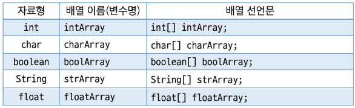
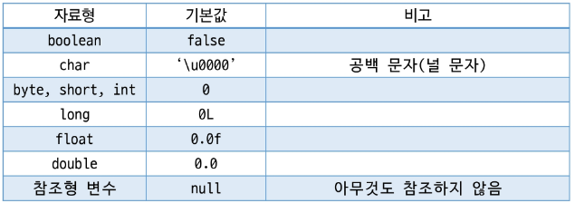
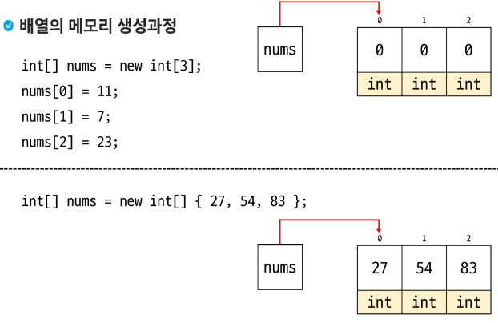
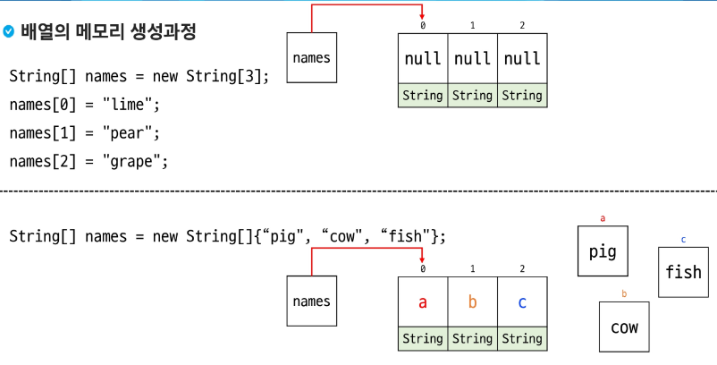
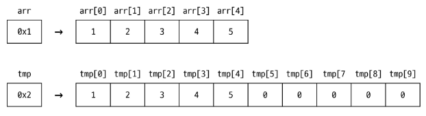
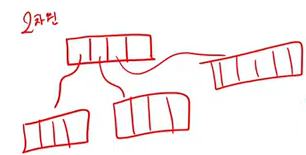
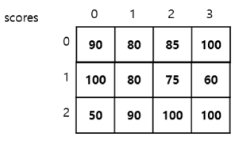
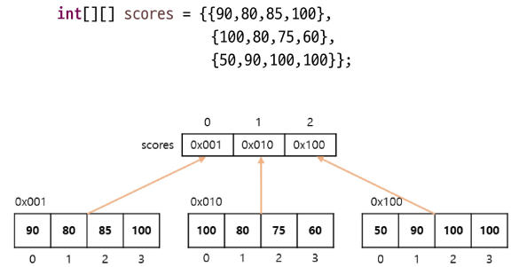
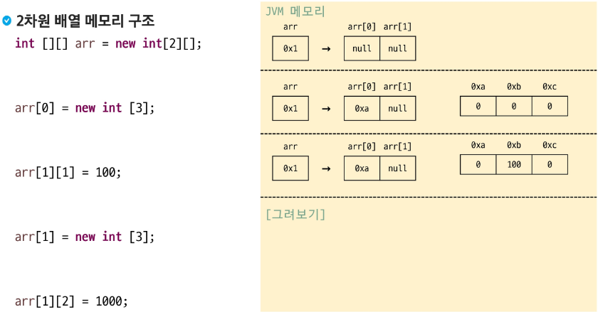

# 배열

---

## 배열의 이해

### 배열(Array)

- **동일한** 데이터 타입의 값(0개 이상)들을 저장하기 위한 자료구조
- **인덱스**를 이용하여 각 요소에 접근할 수 있음
- 고정된 크기 (생성된 배열의 크기를 바꿀 수는 없음, 미리 결정!)
- 메모리에 연속적으로 저장이 됨
  → 목요일에 다뤄볼 예정

>💡 배열은 **참조 자료형** ⇒ 참조 자료형은 주소 값을 가지고 있다.

### 배열 선언

- `데이터타입[ ] 배열이름 // (배열이름 = 변수이름)`
- `데이터타입 배열이름[ ]`



### 배열의 생성과 초기화

- `자료형[ ] 배열이름 = new 자료형[길이];` → 배열 생성(자료형의 초기값으로 초기화) “**가장 많이 사용!”**
- `자료형[ ] 배열이름 = new 자료형[] {값1, 값2, 값3, 값4};` → 배열 생성 및 값 초기화  
  “**[ ]안에 길이 값을 넣으면 Exception 발생**” → 길이를 직접 명시할 수 없음
- `자료형[ ] 배열이름 = {값1, 값2, 값3, 값4};` → 선언과 동시에 초기



### 배열의 메모리 생성과정

- 기본 자료형



- 참조 자료형



### 배열의 인덱스

- []사이에 숫자를 넣으면 해당 위치의 요소에 접근할 수 있음
- 인덱스는 **0부터** 시작 → 길이가 5인 배열의 인덱스 : 0, 1, 2, 3, 4
- 음수를 사용할 수 없음
- 접근 가능한 인덱스 범위를 벗어나면 오류 발생 → `java.lang.ArrayIndexOutOfBoundsException`발생
- `.length` 를 이용하여 배열의 길이를 구할 수 있음

### 배열의 순회

- 반복문을 이용하여 배열의 요소를 순회할 수 있음

```java
int intArray[] = {1, 3, 5, 7, 9};

for(int i = 0; i < intArray.length; i++) {
	System.out.println(intArray[i]);
}
```

### 배열의 순회 (for-each)

- 가독성이 개선된 반복문으로, 배열 및 Collections 에서 사용가능
- index 대신 직접 요소(elements)에 접근하는 변수를 제공
- naturally ready only (copied value)

```java
//for-each
//for(요소 : 반복할 것)
for(int x : intArray) {
	System.out.println(x);
}
```

### 배열의 출력

- 반복문을 이용하여 출력
- java.util.Arrays 클래스의 메서드 toString() 활용
    - Arrays.toString(배열명) → [요소1, 요소2, 요소3, …] 식으로 출력

```java
int[] numbers = {10, 20, 30};
System.out.println(Arrays.toString(numbers)); // 출력: [10, 20, 30]
```

### 얕은 복사(Shallow Copy)

- 객체 내부의 참조형 변수는 원본 객체의 **참조**를 복사
- 원본 객체와 복사본이 같은 참조를 가리키므로, 하나를 수정하면 다른 객체에도 영향을 미침

```java
int[] original = { 1, 2, 3 };
int[] shallowCopy = original; // 얕은 복사 (참조 공유)

shallowCopy[0] = 10;

System.out.println("원본 배열: " + Arrays.toString(original)); // [10, 2, 3]
System.out.println("복사본 배열: " + Arrays.toString(shallowCopy)); // [10, 2, 3]
```

### 깊은 복사(Deep Copy)

- 객체의 모든 필드 값을 새로 복사하여 **독립적인 객체**를 생성
- 원본 객체와 복사본은 완전히 별개의 메모리 공간을 가지므로, 한 객체의 변경이 다른 객체에 영향X

```java
int[] original = { 1, 2, 3 };
int[] deepCopy = new int[original.length];

for(int i  = 0 ; i<original.length; i++) {
	deepCopy[i] = original[i];
}
deepCopy[0] = 10;

System.out.println("원본 배열: " + Arrays.toString(original)); // [1, 2, 3]
System.out.println("복사본 배열: " + Arrays.toString(deepCopy)); // [10, 2, 3]
```

### 배열의 복사

- 배열은 고정된 크기이므로 배열의 크기를 변경하고 싶다면 새로운 배열을 생성하여 복사 해야함



### 배열의 복사 메서드

- Arrays.copyOf() : 배열을 복사하여 새로운 배열을 생성

```java
int[] tmp1 = Arrays.copyOf(nums, nums.length * 2);
tmp1[0] = 1001;
System.out.println(Arrays.toString(tmp1));
```

- Arrays.copyOfRange() : 배열의 특정 범위를 복사하여 새로운 배열을 생성

```java
int[] tmp2 = Arrays.copyOfRange(nums, 0, nums.length * 2);
tmp2[0] = 1002;
System.out.println(Arrays.toString(tmp2));
```

- System.arraycopy(Object src, int srcPos, Object dest, int destPos, int length)

```java
int[] tmp3 = new int[nums.length * 2];
System.arraycopy(nums, 0, tmp3, 0, nums.length);
tmp3[0] = 1003;
System.out.println(Arrays.toString(tmp3));
```

---

## 다차원 배열

### 다차원 배열(Multidimensional Array)

- 배열 안에 **또 다른 배열**을 포함하는 구조
- 일반적으로 2차원 배열(행렬 형태)가 많지만 3차원 이상도 가능
- 표 형태 혹은 복잡한 계층 구조를 표현할 때 유용

- 배열 객체의 참조 값을 요소로 갖는 배열
- 2차원 배열은 배열 요소로 1차원 배열의 참조를 가지는 배열
- 3차원 배열은 배열 요소로 2차원 배열의 참조를 가지는 배열
- …
- **n차원 배열**은 배열의 요소로 **n-1차원 배열**의 참조를 가지는 배열
- n차원 배열은 요소에 접근하기 위해서는 n개의 인덱스가 필



### 2차원 배열

- 배열의 각 요소가 또 다른 1차원 배열을 가리킴
- 행(row)과 열(column)의 구조 / 테이블 구조 / 좌표 평면 구조 등
- 2차원 배열의 각 요소(배열)는 크기가 일정해야 하는가? **X**

### 2차원 배열 선언

- 데이터타입[ ] [] 배열이름 / `int[][] arr1 = new int[3][3];`
- 데이터타입 배열이름[ ][ ] / `int[] arr2[] = new int[3][3];`
- 데이터타입[ ] 배열이름[ ] / `int arr3[][] = new int[3][3];`

### 2차원 배열 초기화

- 크기만 지정 : new 데이터타입[1차원 배열 개수(행의 개수)][1차원 배열 크기(열의 개수)]
- 비정형 배열 : new 데이터타입[1차원 배열 개수(행의 수)][ ]

```java
// 예
int[][] nums = new int[3][];

nums[0] = new int[2];
nums[1] = new int[3];
nums[2] = new int[5];
```

- 값으로 초기화

```java
//1.
new 데이터타입[][] {
	{ 첫번째 1차원 배열의 초기값 },
	{ 두번째 1차원 배열의 초기값 },
	...
}

//2.
데이터타입[][] 배열이름 = {
	{ 첫번째 1차원 배열의 초기값 },
	{ 두번째 1차원 배열의 초기값 },
	...
}
```

### 2차원 배열 인덱스

- 인덱스를 이용하여 요소에 접근
- arr[행 인덱스][열 인덱스]





### 2차원 배열의 메모리 구조



- 3번째 arr[1][1] ⇒ arr[0][1]

→ `arr[1][1] = 100;` 를 실제 실행할 경우 `java.lang.NullPointerException` 발생

---

## 3차원 배열

### 3차원 배열 선언

- 데이터타입[][][] 배열이름

### 3차원 배열 생성

- 배열이름 = new 데이터타입[크기a][크기b][크기c];  
  크기 a: 3차원 배열의 크기  
  크기 b: 2차원 배열의 크기  
  크기 c: 1차원 배열의 크기  
- 배열이름 = new 데이터타입[크기 a][][];
- 배열이름 = new 데이터타입[][][] {3차원 배열의 초기};