# 클래스와 객체

### 학습목표

- [x]  함수 선언 호출 규칙과 매개변수 전달 방식을 이해하고 설명할 수 있다
- [x]  클래스 정의 문법을 사용해 사용자 정의 자료형을 설계 구현 할 수 있다.
- [x]  생성자(기본 매개변수 생성자)와 this() 호출 규칙을 활용해 객체 초기화를 제어할 수 있다.
- [x]  객체지향프로그래밍을 이해하고 설명을 할 수 있다.

## 함수(Function)

### 함수(Function)

- 특정 작업을 수행하는 코드 블록
- 반복적으로 사용되는 코드를 재사용 가능하게 만들어 가독성과 유지 보수성을 향상 시킴
- ex) 1 ~ 5 까지 더해줘, 6 ~10 까지 더해줘 등

### 함수 정리

- 특정 작업을 수행하는 코드 블록에 이름을 붙인 것
- 실행 가능한 단위
- 함수의 구성 요소: **반환타입**(또는 void), **함수이름**, **매개변수(파라미터, parameter)**, **함수 내용**
- return 구문은 반환 타입이 void 인 경우 생략이 가능

```java
int add(int a, int b) {
	return a + b;
}

void printHelloWorld() {
	System.out.println("Hello, World!");
}
```

---

## 클래스(Class)

### 클래스(Class)

- 관련 있는 **변수**와 **함수**를 묶어서 만든 사용자 정의 자료형(데이터 타입)
- **객체**를 생성하기 위한 설계도(Blueprint)
- 클래스를 통해 생성된 객체 → 인스턴스(Instance)

> 💡
> 붕어빵 틀 → 클래스  
> 붕어빵 → 인스턴스

### 클래스 구성 요소

- 필드(Field)
    - 클래스에 선언된 **변수** (멤버 변수, 멤버 필드)
    - 클래스의 **속성**을 정의 → 각 인스턴스(객체)는 필드에 고유한 값을 가질 수 있음
- 메서드(Method)
    - 특정 동작을 수행하는 코드 블록 (객체의 행동을 정의)
    - 입력(매개변수)를 이용하여 처리하고 결과(반환 값)를 반환
    - 오버로딩 가능
- 생성자(Constructor)
    - **객체 생성 시** 호출되는 특별한 메서드 (필드 초기화 또는 생성시 필요한 작업 수행)
    - 클래스 이름과 같고, **반환타입이 없음**

### 클래스 선언

```java
[제한자(Modifier)] class 클래스 이름 {

	// 멤버 변수, 필드 (속성 정의)
	[제한자(Modifier)] 데이터타입 변수이름 [=초기값];
	
	// 생성자
	[제한자(Modifier)] 클래스이름([매개변수들]) {
		생성자 본문
	}
	
	// 메서드 (기능 정의)
	[제한자(Modifier)] 반환타입|void 메서드이름([매개변수들]) {
		메서드 본문
	}
}
```

### 객체(인스턴스) 생성

```java
클래스이름 객체이름 = new 클래스이름([생성자 매개변수들]);
//                            생성자 호출
```

### 객체 멤버 접근

- .(dot) 연산자를 활용
- 필드 값 접근 = `객체이름.멤버변수이름`
- 메서드 호출 = `객체이름.멤버메서드이름([매개변수들]);`

### 변수의 종류

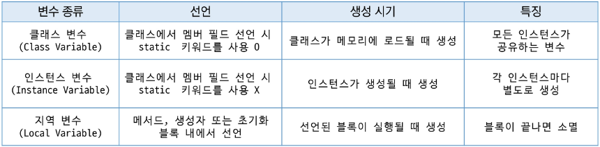

### 메서드(Method)

- 객체가 할 수 있는 행동을 정의
- 어떤 작업을 수행하는 명령문의 집합에 이름을 붙여 놓은 것
- 메서드의 이름은 소문자로 시작하는 것이 관례
- 자바에서는 독립적으로 정의된 함수가 없어 **함수 == 메서드**

### 메서드 선언

- 선언 시 { } 안에 메서드가 해야 할 일을 정의

### 메서드 호출

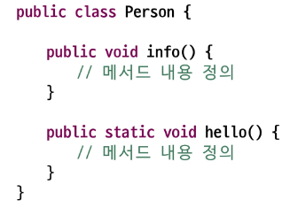

- 객체를 생성한 후 객체의 멤버 메서드를 호출한다.
- 클래스 객체.메서드 이름으로 호출

```java
Person p = new Person();
p.info();
```

- static이 메서드에 선언되어 있을 때는 클래스이름.메서드 이름으로 호출  
  `Person.hello();`  
  추후 학습 예정

### 매개 변수(Parameter)

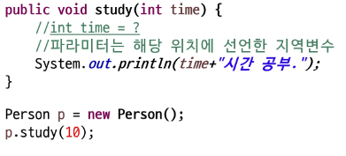

- 메서드에 입력 데이터를 전달하는 역할 (생략 가능)
- 메서드 선언 시 타입과 이름을 지정
- 호출할 때는 **인자(Argument)**라고도 함
- 매겨 변수는 묵시적 형변환을 이용하여 전달 됨

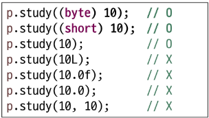

### 가변인자(Variable Arguments)

- 메서드에서 매개변수 개수를 가변적으로 받을 수 있음. (0개~)
- 배열처럼 처리되지만 호출 시 배열을 명시적으로 생성할 필요가 없음
- 가변 인자는 항상 마지막 위치해야 함
- 여러 개의 가변 인자 불가

```java
리턴타입 메서드이름(타입... 변수명) {
	//내부적으로 변수명은 배열처럼 사용 가능
}
```

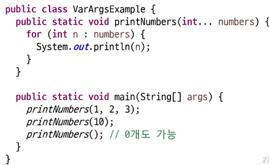

### 반환 타입(Return Type)

- 메서드가 수행한 결과를 반환
- 메서드 선언 시 타입을 지정, 없다면 void 작성(**생략 불가**)
- 반환 타입이 void 가 아니라면 반드시 해당 타입의 값을 **return 해야함**
- 반환 타입은 메서드 당 하나만 작성 가능
- 결과를 받을 때 묵시적 형 변환 적용

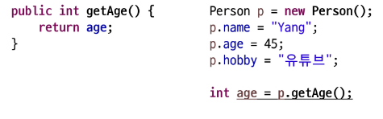

### 메서드 오버로딩(Overloading)

- 이름이 같고 매개변수가 다른 메서드를 여러 개 정의하는 것
- 중복 코드에 대한 효율적 관리 가능
- **파라미터의 개수** 또는 **순서, 타입**이 달라야 할 것(파라미터 이름만 다른 것은 X)
- 리턴 타입이 다른 것은 의미 X

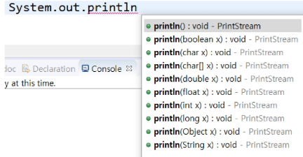

---

## 생성자(Constructor)

### 생성자

- 객체 생성 시 호출되는 특별한 메서드 (필드 초기화 또는 생성시 필요한 작업 수행)
- 클래스 이름과 같고, 반환타입이 없음(**void 작성 X**)
- **new** 키워드와 함께 호출하여 객체 생성
- 객체 생성 시 **반드시 호출 되어야 함**
- 기본 생성자(매개 변수가 없음)를 자동으로 제공 (**생성자 미 작성 시**)
- 매개변수의 개수가 다르거나, 자료형이 다른 여러 개의 생성자가 있을 수 있음(생성자 오버로딩)
- 생성자의 첫번째 라인으로 this() 생성자를 사용하여 또 다른 생성자를 하나 호출 가능

### 기본 생성자

- 매개 변수가 없는 생성자
- 개발자가 따로 정의하지 않으면 컴파일러가 자동으로 추가
- 생성자가 **하나라도** 정의 되어 있으면 컴파일러는 **기본 생성자를 추가하지 않음**
- **기본 생성자 만드는 걸 습관화 (권장사항)**

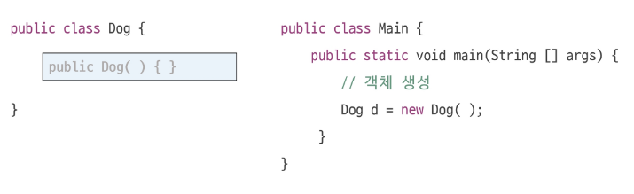

### 매개변수 생성자

- 매개 변수를 받아 객체를 초기화 하는 생성자
- 생성자 호출 시 인자를 넘겨주어야 함
- 작성 시 컴파일러는 기본 생성자를 작성하지 않음

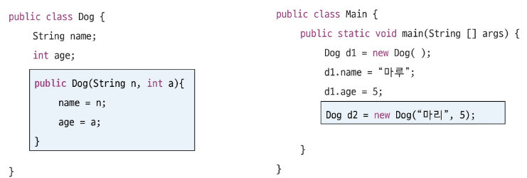

### 생성자 오버로딩

- 같은 이름의 생성자를 매개 변수의 개수나 타입이 다르게 여러 개 정의
- 매개 변수의 타입, 개수, 순서 등이 달라야 함

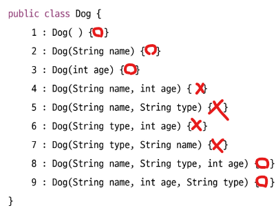

### this.

- **매개변수 이름**과 **필드 이름**이 같을 때, 필드를 구분하기 위해서 사용 (다르면 생략 가능)
- 참조 변수로써 현재 인스턴스 자기 자신을 가리킴
- static 영역에서 사용 불가능

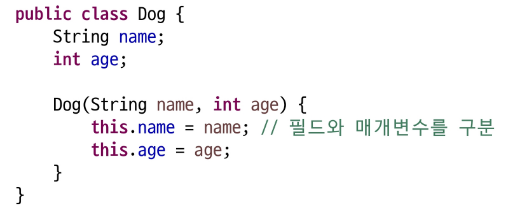

### this()

- 해당 키워드를 통해 같은 클래스의 다른 생성자를 호출
- 같은 클래스 내에서만 호출 가능
- 반드시 생성자의 **첫번째 줄**에 위치
- 중복 코드를 제거하거나, 생성자 체인을 통해 간결하고 유지보수하기 쉬운 코드 작성에 도움

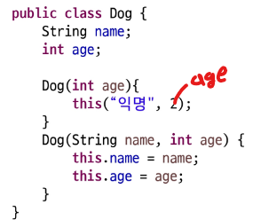

---

## 객체지향 프로그래밍

### 객체지향 프로그래밍(OOP, Object Oriented Programming)

- **객체** : 의사나 행위가 미치는 대상, 작용의 대상 / 세상의 모든 사물, 개념(유 · 무형) 등
- **객체(Object)** : **데이터**와 관련된 **알고리즘(메서드)**를 하나의 단위로 묶어 놓은 것
- **객체 모델링** : 현실세계의 객체를 SW 객체로 설계하는 것

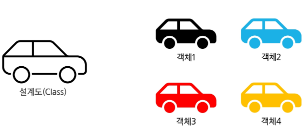

### 객체지향 프로그래밍 특징 (A PIE)

- Abstaraction(추상화)
- Polymorphism(다형성)
- Inheritance(상속)
- Encapsulation(캡슐화)

### 객체지향 프로그래밍 장점

- 모듈화 된 프로그래밍
- 재사용성이 높다

---

오프라인

# OOP

### 객체 지향 프로그래밍


: **객체 지향 프로그래밍(OOP, Object Oriented Programming)** 은 컴퓨터 프로그래밍의 패러다임(방법론) 중 하나이다.
객체 지향 프로그래밍은 컴퓨터 프로그램을 명령어의 목록으로 보는 시각에서 벗어나 여러 개의 독립된 단위, 즉 “객체”들의 모임으로 파악하고자 하는 것이다. 각자의 객체는 메시지를 주고받고, 데이터를 처리할 수 있다.

### 객체

**객체** ⇒ 정보 + 행동  
속성과 행동으로 구성된 모든 것

### 절차지향 프로그래밍

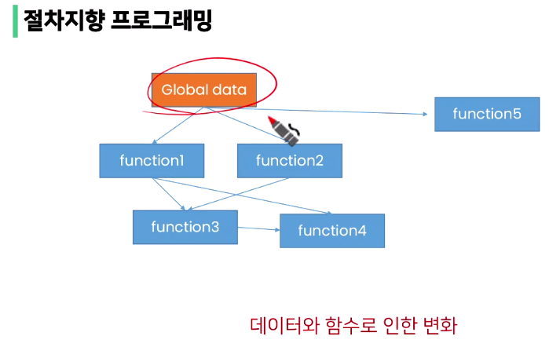

→ 중간 함수(function)가 바뀌게 되면, 전체적인 데이터의 흐름이 바뀌어서 문제가 발생!

### 객체지향 프로그래밍

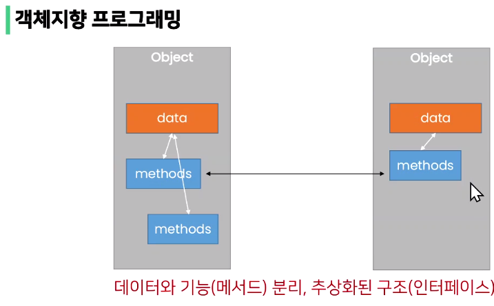

→ 데이터와 기능(메서드)을 분리해 하나로 묶어놓은 객체라는 단위로 만듬

→ 추상화된 구조(인터페이스)

### 객체지향 프로그래밍이 필요한 이유

- 현실 세계를 프로그램 설계에 반영(추상화) → **복잡한 것을 숨기고 필요한 것만 드러낸다.**

### 객체지향의 장점 / 단점

**장점**

- 클래스 단위로 모듈화시켜 개발할 수 있으므로 많은 인원이 참여하는 대규모 소프트웨어 개발에 적합
- 필요한 부분만 수정하기 쉽기 때문에 프로그램의 유지보수가 쉬움

**단점**

- 설계시 많은 노력 시간이 필요
    - 다양한 객체들의 상호 작용 구조를 만들기 위해 많은 시간과 노력 필요
- 실행 속도가 상대적으로 느림
    - 절차 지향 프로그래밍이 컴퓨터의 처리구조와 비슷해서 실행 속도가 빠름

### 클래스와 객체

클래스: 객체(인스턴스)를 만들기 위한 설계도

### 객체와 인스턴스

- 클래스로 만든 객체를 인스턴스 라고도 함 → 메모리에 할당된 객체
    - 객체와 인스턴스의 차이점?
      객체 ⇒ 클래스의 인스턴스

### 객체지향 프로그래밍 특징 (A PIE)

- **A**bstaraction(추상화)  
  ⇒ 복잡한 것을 숨기고, 필요한 부분만 드러낸다.
- **P**olymorphism(다형성)  
  ⇒ 같은 이름인데, 다른 동작을 수행하도록 하는 것 *ex) 짖다() → 강아지(멍멍), 고양이(냐옹)*
- **I**nheritance(상속)  
  ⇒ 부모(상위클래스)의 것을 물려받아서 자식(하위클래스)이 재사용 가능 ex) 동물.class → 강아지.class, 고양이.class
- **E**ncapsulation(캡슐화)  
  ⇒ 데이터를 외부에서 접근하지 못하게 안전하게 포장하는 것