# 객체배열 관리

### 학습목표

- [ ]  JVM 런타임 메모리 구조를 그림으로 설명하고, 각 영역에 저장되는 데이터를 구분할 수 있다.
- [ ]  static 키워드를 사용한 변수, 메서드, 블록의 특징을 설명할 수 있다.
- [ ]  package, import에 대해서 설명할 수 있다.
- [ ]  **접근 제한자**의 범위와 패키지 상속 관계에서의 가시성을 설명하고, 캡슐화를 위해 적절히 사용할 수 있다.
- [ ]  객체배열을 활용하여 데이터를 관리할 수 있다.
- [ ]  싱글턴 패턴을 이해하고 사용할 수 있다.

## JVM 메모리 구조

### JVM(Java Virtual Machine) : 자바 가상 머신 / 플랫폼 종속적

- **자바 프로그램이 실행되는 환경 제공**
- 메모리를 체계적으로 관리하기 위해 여러 영역으로 나뉘어져 있음
    - 버전에 따라 다르지만 아래 5개는 가장 기본이 되는 영역
    - **메서드 영역**(Method Area)
    - **힙 영역**(Heap Area)
    - **스택 영역**(Stack Area)
    - PC 레지스터(PC Register)
    - 네이티브 메서드 스택(Natice Method Stack)
- **GC(Garvage Collection)**: JVM은 **가비지 컬렉터**를 통해 자동으로 메모리를 관리, 사용되지 않는 객체를 메모리에서 해제

### JVM 메모리 구조

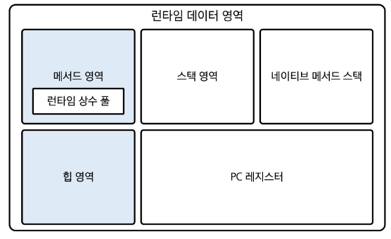

> 💡 JVM 버전에 따라 달라질 수 있다.

메서드 영역, 힙 영역 : 모든 스레드가 공유

스택 영역, PC 레지스터, 네이티브 메서드 스택 : 스레드 마다 생성

### 메서드 영역(Method Area)

- 클래스 **정보**를 저장하는 영역 (교실의 칠판 같은 곳)
    - 모든 학생(스레드)이 볼 수 있는 공용 공간
    - 수업 내용(클래스 정보), 공식(메서드), 상수 등을 저장하는 공간
- 정적 **변수(static)**, **상수**, **메서드**  등이 저장됨
- 일부 JVM에 따라 GC가 관리해주는 경우도 있음
- 모든 스레드가 공유
- **클래스 로더(Class Loader)**에 의해 클래스가 로드 될 때 저장되는 공간
- → 회사의 메뉴얼(설계도) / 지침

### 힙 영역(Heap Area) (매우 중요)

- **객체 인스턴스들**을 저장하는 공간 (공용 창고)
    - 만든 물건(객체)들을 보관하는 공간
    - 모든 사람(스레드)이 사용할 수 있는 공용 공간
    - 안 쓰는 물건은 청소부( GC)가 치워준다

```java
String name = new String("홍길동"); //"홍길동" 이라는 객체가 힙에 저장
```

- **GC**가 관리하는 영역 (사용되지 않는 객체를 자동으로 삭제)
- 인스턴스 **변수**, **배열** 등이 해당 영역에 저장
- 어플리케이션이 사용할 수 있는 **가장 큰 메모리**
- 모든 스레드가 공유
- 문자열 상수 풀 관리 (Java 7+)
- → 프로젝트 자료 같은 것들

### 스택 영역(Stack Area) / (스택: 자료구조 LIFO)

- **지역 변수**, **메서드 호출** 시 사용되는 값, 연산 결과 등 저장 (각자의 책상 서랍)
    - 각 사람(스레드)마다 하나씩 개별적으로 가지고 있는 공간
    - 임시로 필요한 것(지역변수)을 보관
    - 일이 끝나면 자동으로 정리됨

```java
public void calculate() {
		int x = 10; // x는 스택에 저장
		int y = 20; // y도 스택에 저장
		// 메서드가 끝나면 x,y 는 자동으로 사라짐
}

// main메서드에
calculate(); //호출... 복귀하면 x,y 지역변수 소멸
```

- 메서드 호출 시 스택 프레임이 생성되며, 끝나면 스택 프레임 제거
- 접시를 쌓듯 쌓이는 형태
- 스레드 마다 생성
- → 작업 중인 문서 or 책상 (곧 치워질 예정)

### PC 레지스터(Program Counter Register)

- 현재 실행 중인 메모리의 주소를 저장하는 영역 (책갈피)
    - 지금 어디까지 읽었는지 표시 (각자 = 스레드마다 자신의 책갈피를 가지고 있다)
- 프로그램 실행 흐름을 제어하는 데 사용
- 스레드 마다 생성
- → 지금 하고 있는 작업 위치

### 네이티브 메서드 스택(Natice Method Stack)

- 네이티브 언어(C, C++ 등)로 작성된 메서드 호출 시 사용하는 메모리 영역 (통역사의 메모장)
    - 다른 언어로(C/C++) 된 것들을 실행할 때 사용 (각자=스레드마다 하나씩 가지고 있다)
- 스레드 마다 생성
- → 외주 업체와 협업

### Garbage Collection

> GC: 자바의 메모리 관리 시스템, 사용하지 않는 객체(힙 영역)를 찾아서 제거!
→ how? 찾는 방법: 스택 영역에서 더 이상 참조하지 않는 객체이면 삭제!

```java
// 예시1. GC가 청소하는 경우
String message = new String("안녕"); // "안녕" 객체 생성
message = new String("반가워"); // "안녕"은 이제 안씀 -> GC가 청소

// 예시2. GC가 청소하지 않는 경우
String greeting = new String("안녕");
String hello = greeting; // 둘 다 "안녕"을 가리킴
greeting = new String("잘가");
// "안녕"은 아직 사용 중이므로 청소하지 않음
```

**장점**

- 개발자가 직접 메모리를 관리하지 않아도 됨
- 메모리 누수를 방지

**단점**

- 언제 실행될지 정확히 알 수 없음
- 실행될 때 잠시 프로그램이 멈출 수 있음  
  (stop-the-world)

### 객체 생성과 메모리 할당

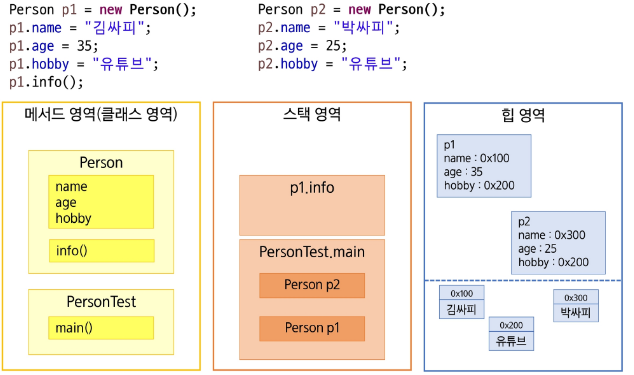

---

# 사용 제한자(Modifier)

> 사용 제한자란? 변수나 메서드의 특성을 정해주는 키워드


## final - “변경 금지”

한 번 지정하면 바꿀 수가 없음 (변수가 가지고 있는 값을 고정)

```java
// 1. final 변수 = 상수 (바꿀 수 없는 값)
final int MAX_SCORE = 100;  // 최대 점수는 100점
// MAX_SCORE = 200;  // ❌ 에러! 바꿀 수 없음
final Person person1 = new Person("홍길동", 20); // person1에 할당된 주소(address)를 변경x
person1.name = "김철수"; // 가능

Person person2 = person1; // 가능
person2.age = 30; // 가능

// 2. final 메서드 = 수정 금지
class Parent {
    public final void importantRule() {
        System.out.println("이 규칙은 바꿀 수 없어요");
    }
}

// 3. final 클래스 = 상속 금지
final class FinalReport {
    // 이 클래스는 자식을 만들 수 없음
}
```

## Static - “클래스 수준에서 공유되는 데이터”

→ ex) 아파트 공용시설 (놀이터, 휴게소)  
(아파트 세대에 속해있지 않더라도 해당되는 값을 사용이 가능!)

### static → 메모리에 미리 올려둠 / 정적… 변화가 잘 없다?

- 클래스 수준에서 공유되는 **멤버**(필드, 메서드, 중첩 클래스)를 정의하는 데 사용
- static 키워드를 작성하면 **객체(인스턴스)**와 무관하게 **클래스 자체에 속함**
    - 클래스에 선언한다
- 특정 객체에 속하지 않고 모든 객체가 동일한 **static 멤버(클래스 변수)**를 참조
- 클래스의 이름을 통해 직접 호출 가능(=권장)  
  (*객체를 통해서도 가능하기도 하다..*)
- **JVM** **메서드 영역**에 저장

### static 필드(클래스 변수)

- 정적 필드는 클래스 수준에서 공유되는 변수
- 객체마다 값이 다른 인스턴스 필드와는 달리 **모든 인스턴스가 공유**
- 클래스 이름을 통해 호출 하는 것을 권장

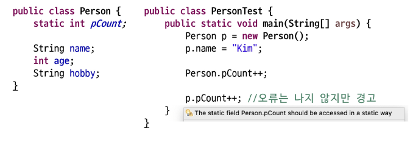

### static 메서드

- 정적 메서드는 클래스 이름을 통해 직접 호출할 수 있는 메서드
- 객체와 무관하게 동작, **전역적인 작업에 적합** (보통 알고리즘 문제 풀 때 사용)

```java
public class Calculator {
   // static 메서드 예시 (유틸리티 만들 때 많이 사용)
   public static int add(int a, int b) {
		   // this.인스턴스변수; <- 이렇게 인스턴스나 내부의 객체 필드를 사용하는 행위! x
       return a + b;
   }

   public static void main(String[] args) {
       // 객체 생성 없이 호출 가능 (객체와 무관하게 동작)
       int result = Calculator.add(5, 3);
       System.out.println(result); // 8 출력
   }
}
```

### static 블록 (초기화 블록)

- 정적 블록은 **클래스 로드** 시 한 번만 실행되는 초기화 블록
- 정적 필드 초기화에 사용

```java
class Counter {
    // static 변수
    public static int sCount;
    // non-static 변수 
    public int iCount;
    
    // 초기화 블록
    // 클래스 로드 시에 한번만 실행되는 초기화 블록
    static {
			  System.out.println("Counter 클래스가 로드되었어요!");
        sCount = 10;
    }
}

// main 메서드에다가..

System.out.println("아직은 Counter 클래스가 로드되지 않았네요??");
Counter counter = new Counter(); // Counter 클래스가 로드되었어요!
```

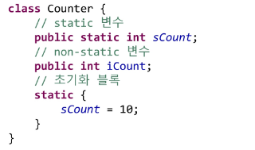

### static 주의 사항

- static 영역에서는 non-static 영역을 직접 접근할 수 없음

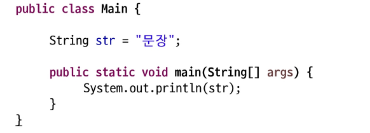

- non-static 영역에서는 static 영역에 대한 접근이 가능

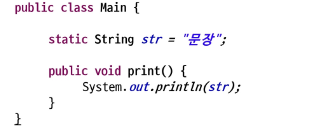

## Package & import  

### 패키지(Package)


: 관련 클래스를 모아놓는 폴더 역할 (계층적 구조를 가진다)

```java
// 파일의 맨 첫 줄에 선언
package com.mycompany.project;

// 폴더 구조: com/mycompany/project/MyClass.java
public class MyClass {
    // ...
}
```

- 클래스와 인터페이스를 **묶는 디렉토리(폴더) 구조**
- 클래스 **이름 충돌 방지**(패키지 명까지 해서 네임스페이스 제공)
- 클래스 파일 **첫 번째 줄에 package 키워드를 사용하여 선언**  
  (생략 시 default package)
- .(dot)을 이용하여 패키지를 구분 (계층 구조)
- 일반적으로 소속이나 회사의 도메인 역순으로 작성

### 임포트(import)


: 다른 패키지의 클래스를 사용하기 위해 가져오는

```java
// 사용하고 싶은 클래스를 가져옴
import java.util.Scanner;  // Scanner 클래스만 가져오기
import java.util.*;       // util 패키지의 모든 클래스 가져오기

public class MyProgram {
    public static void main(String[] args) {
        Scanner scanner = new Scanner(System.in);  // import 했으므로 사용 가능
    }
}

// import 없이 사용하려면 (불편함)
java.util.Scanner scanner = new java.util.Scanner(System.in);

```

- **다른 패키지**에 있는 클래스를 사용하기 위해서는 import 과정이 필요
- 패키지와 달리 여러 번 선언 가능

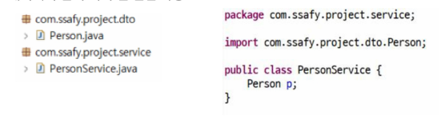

- 단일 import → import [풀 패키지명]
- 전체 import → import[패키지명] * (**하위 패키지까지 import 되지는 않음**)
- 자바에서는 클래스가 **실제로 사용되는 시점**에 메모리에 로드  
  → import 많다고 느려지지 않음
- `java.lang.*` 기본적으로 import 되어 있는 패키지

> 💡
> ctrl + shift + o  
> (자동 import 단축키)  
> → 동일한 클래스명이 여러 개 : 수동선택 필요

### static import

- static member를 import 하여 이름만으로 접근이 가능함

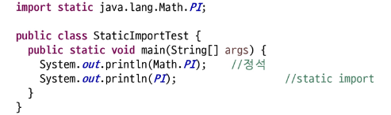

- Content Assist에 등록하여 사용 가능 (간단한 import 가능)


### 일반적인 클래스 레이아웃

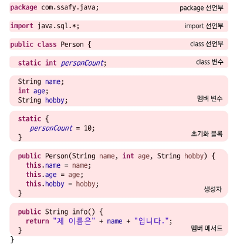

## 접근 제한자(Access Modifier)

### 캡슐화(Encapsulation)

- 필드와 메서드를 하나의 단위로 묶고, **외부로부터** 데이터를 숨기며 안전하게 보호하는 것
- 정보 은닉 → 내부 데이터를 외부에서 직접 접근하지 못하게 하고 특정 메서드를 통해서만 접근하도록 제한

### 접근 제한자

> 누가 이 변수나 메서드를 사용할 수 있는지 정하는 것 (제한)

- 클래스, 메서드, 변수 등에 대한 **접근 범위를 지정**
- 캡슐화와 정보은닉을 가능하게 함
- 접근 제한자는 하나만 작성이 가능

### 접근 제한자 종류

- **public** : 모든 위치에서 접근 가능
    - **누구나 접근 가능** - 대문 (누구나 들어올 수 있음)
- **protected** : 같은 패키지 또는 패키지가 달라도 상속 관계에서 접근 가능
    - **상속 받거나 같은 패키지만 가능** - 거실 (가족과 친척)
- **default**(package-private) : 같은 패키지안에서만 접근 가능
    - **같은 패키지만 가능** - 안방 (같은 집 식구들만)
- **private** : 같은 클래스 내부에서만 접근 가능
    - **클래스 자신만 사용 가능** - 개인 금고 (나만 열 수 있음

### 클래스와 접근 제한자

- 최상위 클래스 (외부 클래스) : public 또는 default 만 사용 가능
- 중첩 클래스 (내부 클래스) : 4가지 종류 모두 사용 가능

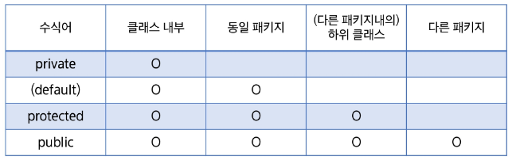

### 사용 예시

```java
public class AccessModifier {
    public String publicField = "누구나 접근";
    protected String protectedField = "상속/같은 패키지";
    String defaultField = "같은 패키지만"; // default
    private String privateField = "클래스 내부만";

    public void publicMethod() { }
    protected void protectedMethod() { }
    void defaultMethod() { } // default
    private void privateMethod() { }
}
```

```java
public class Person {
    public String nickname = "공개된 별명";      // 누구나 알 수 있음
    protected String name = "이름";            // 가족(상속)과 이웃(같은 패키지)만
    String address = "주소";                   // 이웃(같은 패키지)만 (default)
    private String password = "비밀번호";       // 나만 알 수 있음

    // public 메서드: 누구나 호출 가능
    public void introduce() {
        System.out.println("안녕하세요!");
    }

    // private 메서드: 클래스 내부에서만 사용
    private void checkPassword() {
        // 비밀번호 확인 로직
    }
}
```

### 접근자(Getter) / 설정자(Setter)

> private 필드에 안전한 접근을 제공하도록 하는 메서드들  
OOP의 **캡슐화** 원칙을 준수하기 위해 활용

- 캡슐화를 구현하는데 사용되는 메서드

>💡 캡슐화(encapsulation): 외부에서 필드에 대한 직접 접근을 막아서 잘못된 데이터 변경을 방지하기 위한 목적  
→ how? 내부의 필드는 숨기고 private, 외부에서는 getter, setter를 통해 접근할 수 있도록 한다


- Getter : private 필드 값을 외부에서 읽을 수 있게 함
- Setter : private 필드 값을 외부에서 수정할 수 있게 함
- → 직접 접근이 아닌 안전하게 읽고 쓰는 방식 제공
- 접두사 get / set을 이용하여 메서드 작성
- 접근자, 설정자 필드명 첫글자는 대문자로 (ex: `getAge, getName, setAge, setName`)

```java
public class Person {
    private String name;
    private int age;

    // Getter
    public String getName() {
        return name;
    }

    // Setter
    public void setName(String name) {
        this.name = name;
    }

    public int getAge() {
        return age;
    }

    public void setAge(int age) {
        if(age >= 0) { // 유효성 검사
            this.age = age;
        }
    }
}
```

## 객체 배열 관리

### 객체배열 관리

- 여러 객체를 **하나의 배열**로 묶어서 관리하는 방식
- 객체 배열의 요소는 개체 참조 값을 저장 → 다차원 배열
- 기본 값은 null로 초기화
- 객체를 **추가, 조회, 수정, 삭제**할 수 있음 (**CRUD**)
- 싱글턴 패턴을 사용하여 관리할 수 있음

### 싱글턴 패턴(Singleton Pattern)

> 💡 싱글턴(Singleton): 프로그램에서 단 하나만 존재해야하는 객체를 만드는 방법  
→ how? **private 생성자**와 **static 메서드**를 통해서 단 하나의 인스턴스만을 생성하여 공유하도록 한다  
⇒ 싱글턴 패턴


- 객체를 **하나만 생성하도록 보장**하는 디자인 패턴
- 객체의 **유일성 보장** → 하나의 인스턴스만 생성 (전역적으로 동일한 객체 공유)
- **생성자를 private**으로 만들어 **클래스 내부에서만 생성** 가능
- 정적 메서드를 통해 전역적으로 접근 가능

```java
// 싱글턴 패턴 (단 하나의 인스턴스로만 생성-공유 하도록!)
public class President {
	// private 필드를 하나 지정
	// -> 해당 클래스의 인스턴스 하나를 할당...!
	private static President instance = new President();

	// 다른 곳에서는 생성할 수가 없도록 막기!
	// -> 기본 생성자를 private 접근제한자 달기!
	private President() {}
	
	// 이미 만들어진 인스턴스를 가져다 쓸 수 있는 메서드
	public static President getInstance() {
		return instance;
	}
	
	// 인스턴스 메서드
	public void announce() {
		System.out.println("대통령 발표: 여러분들 안녕하십니까...");
	}
}
```

```java
public class Main {
	public static void main(String[] args) {
		President p1 = President.getInstance();
		President p2 = President.getInstance(); 
		// 같은 객체를 가리킨다...!
		System.out.println(p1 == p2); // true
		
		p1.announce();
	}
}
```

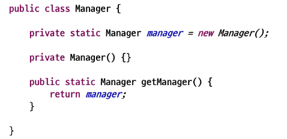

### Eager Initialization (미리 만들기)

```java
public class President {
    // 1. 미리 하나 만들어 놓음
    private static final President instance = new President();

    // 2. 다른 곳에서 new로 만들지 못하게 막음
    private President() {
        System.out.println("대통령이 선출되었습니다.");
    }

    // 3. 만들어진 것을 가져다 쓸 수 있게 함
    public static President getInstance() {
        return instance;
    }

    public void announce(String message) {
        System.out.println("대통령 발표: " + message);
    }
}

// 사용 예시
President president1 = President.getInstance();
President president2 = President.getInstance();
// president1과 president2는 같은 객체를 가리킴

president1.announce("국민 여러분!");
```

### (참고) Lazy Initialization (필요할 때 만들기)

```java
public class PrinterManager {
    // 1. 처음엔 비어있음
    private static PrinterManager instance;

    // 2. 다른 곳에서 new로 만들지 못하게 막음
    private PrinterManager() {
        System.out.println("프린터 관리자 생성");
    }

    // 3. 필요할 때 만들어서 줌
    public static PrinterManager getInstance() {
        if (instance == null) {  // 아직 안 만들어졌으면
            instance = new PrinterManager();  // 만들기
        }
        return instance;  // 이미 있으면 그걸 줌
    }

    public void print(String document) {
        System.out.println("인쇄 중: " + document);
    }
}

// 사용 예시
PrinterManager manager = PrinterManager.getInstance();
manager.print("보고서.pdf");

```

---

오프라인

# 객체배열관리

JVM메모리구

---

오후강의

### Person Manager 실습

- 사람들을 관리(추가, 조회, 수정, 삭제) 할 수 있는 프로그램을 만들어보자
- 싱글턴 패턴을 적용해 보자.

### 클래스 다이어그램

프로그램을 만들 때 설계를 한 다음에 코드를 구현

코드를 구현한 다음에 설계를 그리기도 하는데 순서가 잘못된 거

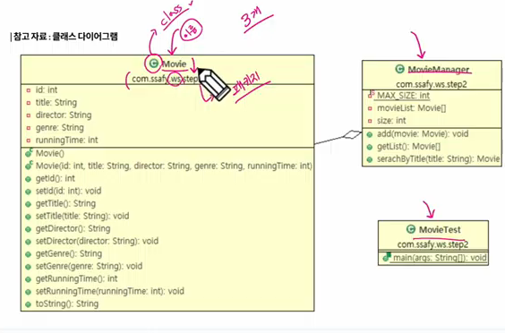

Movie: class 이름(도메인)

필드 : id, title, director, genre, runningTime 등..

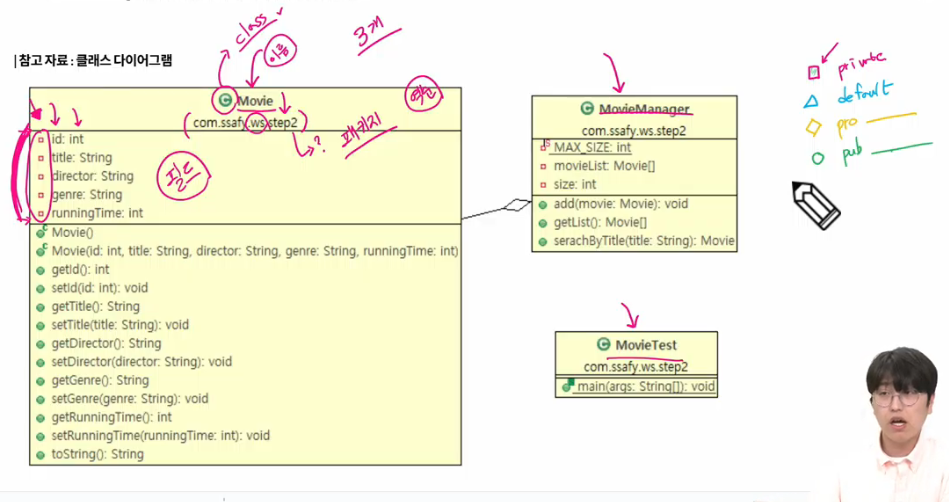

메서드 : Movie(), getId(), setId(), 등등