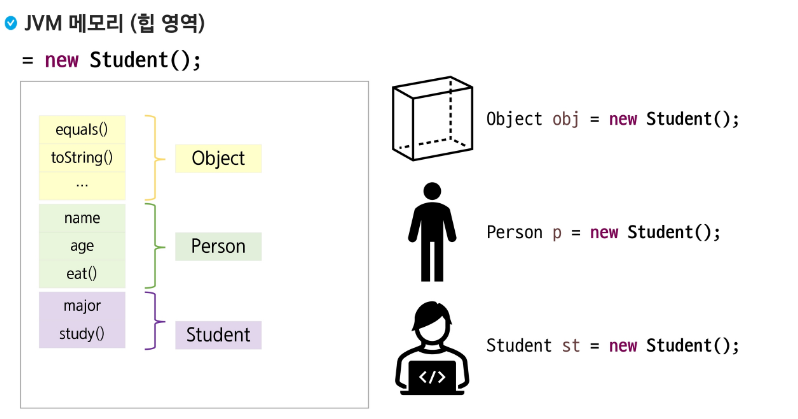

# 다형성(Polymorphism)

- 실제 하나의 객체를 다양한 타입의 참조로 사용할 수 있음
- 다양한 유형의 여러 객체를 **하나의 공통된 타입**으로 참조할 수 있음
- 상속 관계에 있을 때 조상클래스 타입으로 **자손 클래스의 객체를 참조**할 수 있음
- 다양한 타입으로 참조하더라도 **참조만 바뀔 뿐** 실제 객체 자체(객체의 행위)는 변함이 없음

### 다형성의 장점

- 코드의 **유연성** → 상위 클래스 또는 인터페이스 타입으로 다룰 수 있음
- 코드 재사용성 → 공통 동작을 **상위클래스 또는 인터페이스**에 정의하여 중복 코드를 제거
- 확장성 → 새로운 클래스 추가 시 기존 코드 없이도 쉽게 확장 가능
- 유지보수성 → 변경 사항이 상위 클래스나 인터페이스를 수정하면 되므로 용이

### 다형성의 모습


### 다형성의 특징

- 상속 관계에 있을 때 조상 클래스 타입으로 자손 클래스 객체 참조 가능

### JVM 메모리 (힙 영역)



### 참조변수의 형 변환

- **자손타입 → 조상타입 (묵시적 형 변환)**
- 형 변환 생략 가능


- **조상타입 → 자손타입 (명시적 형 변환)**
- 형 변환 생략 불가능


- 문법적으로 가능하지만 실행 시키면 실행되지 않는다.


### instanceof 연산자

- 참조변수가 참조하고 있는 인스턴스의 타입을 확인 하기 위해서 사용
- 결과를 boolean으로 반환
- true가 반환 되면 해당 타입으로 형 변환 가능


### 참조 변수와 인스턴스 멤버의 관계


- 상속관계에서 멤버변수가 중복이 되면 참조 변수 타입에 따라 연결이 달라짐
- 메서드가 중복될 때(오버라이딩), 참조 변수의 타입에 상관없이 항상 실제 인스턴스의 자식 클래스 메서드가 호출  
  → **동적 바인딩**
- static 메서드는 참조변수 타입의 영향을 받기 때문에 이를 방지하고자 클래스 이름으로 메서드 호출(권장)

### 다형성의 활용

- 다른 타입의 객체를 다루는 배열
- 매개변수의 다형성


---

# 추상 클래스(abstract class)

### 추상 클래스 정의


- cook() 메서드는 자손 클래스에서 반드시 재정의해서 사용되기 때문에 조상의 구현이 무의미
- 메서드의 선언부만 남기고 구현부는 ;(세미콜론)으로 대체
- 구현부가 없으므로 abstract 키워드를 메서드 선언부에 추가
- 객체를 생성할 수 없는 클래스라는 의미로 클래스 선언부에 abstract를 추가


### 추상 클래스 특징

- abstract 클래스는 **상속 전용의 클래스**
- 클래스에 구현부가 없는 메서드가 있으므로 **객체를 생성할 수 없음**
- 상위 클래스 타입으로 자식을 참조할 수는 있음


- 조상 클래스에서 상속 받은 **abstract**  **메서드를 재정의 하지 않은 경우**  
  → 클래스 내부에 **abstract 메서드**가 있으므로 자식 클래스는 abstract 클래스 필수
- 다중 상속 불가  
  → 구현부가 없는데 why?  
  추상 메서드 + 일반 메서드도 존재할 수 있으니…

### 추상 클래스 사용 목적

- 공통적인 설계 강제 → 미완성의 메서드를 제공함으로써 **구현을 강제 시킴**
- 코드 재사용성 향상
- 일관성 유지 → 추상 메서드를 통해 **하위 클래스가 동일한 동작을 가지도록 보장**
- 다형성 지원 → 유연한 설계 가능

### 클래스와 추상클래스 비교


클래스 정의: 상태/기능 → 사용자 정의 자료형

추상 클래스 → 추상 메서드 무조건? 아니 없어도 됨~

---

# 다형성

## 다형성의 정의

- **다형성 :** 여러가지 형태를 받아들일 수 있는 특징
- 동일한 이름의 메서드를 다른 객체 또는 서브클래스에서 호출할 수 있는 능력
- 하나의 인터페이스를 통해서 여러 형태의 구현(Implements)을 다룰 수 있는 OOP 개념

## 다형성의 특징

- **동적 바인딩 :** 런타임 시에 실제 객체의 타입에 따라 메서드 결정  
  → 동적 바인딩을 어떻게 구현했는지??  
  https://hyunsb.tistory.com/58  
  *주의: **메서드** 호출은 런타임 시에 결정 = **동적 바인딩**,  
  **필드** 호출은 컴파일 시에 결정 = **정적 바인**
- **확장성 확보 :** 새로운 클래스를 추가할 때 기존 수정 작업을 최소화
- **재사용성 확보 :** 공통의 인터페이스를 통한 코드를 재사용 가능

## 오버로딩과 오버라이딩

- **오버로딩(Overloading)** : 같은 클래스 내에서 매개변수가 서로 다른 동일한 이름의 메서드를 정의

    ```java
    class Calculator {
       // 기본 덧셈 메서드 add 정의
       public static int add(int a, int b){
    	   return a + b;
       }
       // 3 개의 정수 덧셈
       public static int add(int a, int b, int c){
    	   return a + b + c;
       }
    }
    ```

- **오버라이딩(Overriding)** : 상속 받은 메서드를 자식 클래서에서 재정의

    ```java
    // 도형 (모양)
    class Shape {
    	protected String color; // 색상
    	
    	// 생성자
    	public Shape(String color){
    		this.color = color;
    	}
    	// 도형의 면적
    	public double getArea(){
    		return 0.0;
    	}
    }
    
    // 원
    class Circle extends Shape {
    	protected double radius; // 반지름
    	
    	public Circle(double radius, String color){
    		super(color);
    		this.radius = radius;
    	}
    	
    	// @Override 어노테이션을 사용하는 것을 권장...!!
    	// 정상동작1 , 무언가 다르게 동작2, 에러가 발생3, 0.0 이 출력된다4
    	// 메타데이터 -> 정보를 설명하기 위한 정보
    	// 쌤! 이거 왜 달아요??? 왜 달지?? 없어도 되는데 왜 달까? Why?
    	// 컴파일러에게 힌트 제공! <- "이 메서드는 오버라이드 대상입니다!"
    	@Override
    	public double getArea(){
    		return Math.PI * radius * radius;
    	}
    }
    ```


# 추상클래스

## 추상클래스란?

- 하나 이상의 추상 메서드를 포함하는 클래스  
  (사실은… 추상 메서드가 없어도 되긴함… abstract만 앞에 붙이면됨)
- `abstract` 키워드를 통해서 클래스 선언
- Why? 직접 인스턴스를 생성하는 것을 불가능하게 만들기 위해!(객체화 불가)
- 상속을 통해서만 사용 가능하게 하도록 하기 위해!
- 공통 기능은 구현하고, 세부 구현은 자식 클래스에게 위임

### 추상클래스의 특징

- 추상 메서드와 일반메서드 모두 가질 수 있음
- 생성자, 인스턴스 변수, 일반 메서드 모두 포함 가능
- **자식 클래스를 통해서 모든 추상 메서드를 구현해야한다.**
- ????(4지선다)

### 추상클래스 예제

```java
// 추상 클래스
abstract class Vehicle {
    protected String brand;
    protected String model;
    protected int year;

    // 일반 생성자
    public Vehicle(String brand, String model, int year) {
        this.brand = brand;
        this.model = model;
        this.year = year;
    }

    // 일반 메서드 (구현됨)
    public void displayInfo() {
        System.out.println("브랜드: " + brand + ", 모델: " + model + ", 연도: " + year);
    }

    public void startEngine() {
        System.out.println("엔진을 시동합니다.");
    }

    public void stopEngine() {
        System.out.println("엔진을 정지합니다.");
    }

    // 추상 메서드 (자식 클래스에서 반드시 구현)
    public abstract void accelerate();
    public abstract void brake();
    public abstract void getMaxSpeed();
    public abstract String getFuelType();
}

// 자동차 클래스
class Car extends Vehicle {
    private int doors;

    public Car(String brand, String model, int year, int doors) {
        super(brand, model, year);
        this.doors = doors;
    }

    @Override
    public void accelerate() {
        System.out.println("자동차가 가속페달을 밟아 속도를 높입니다.");
    }

    @Override
    public void brake() {
        System.out.println("자동차가 브레이크를 밟아 정지합니다.");
    }

    @Override
    public void getMaxSpeed() {
        System.out.println("최대 속도: 200km/h");
    }

    @Override
    public String getFuelType() {
        return "휘발유";
    }

    public void openTrunk() {
        System.out.println("트렁크를 엽니다.");
    }
}

// 오토바이 클래스
class Motorcycle extends Vehicle {
    private boolean hasSidecar;

    public Motorcycle(String brand, String model, int year, boolean hasSidecar) {
        super(brand, model, year);
        this.hasSidecar = hasSidecar;
    }

    @Override
    public void accelerate() {
        System.out.println("오토바이가 스로틀을 돌려 가속합니다.");
    }

    @Override
    public void brake() {
        System.out.println("오토바이가 핸드브레이크와 풋브레이크를 사용합니다.");
    }

    @Override
    public void getMaxSpeed() {
        System.out.println("최대 속도: 300km/h");
    }

    @Override
    public String getFuelType() {
        return "휘발유";
    }

    public void wheelie() {
        System.out.println("앞바퀴를 들고 달립니다!");
    }
}

// 전기차 클래스
class ElectricCar extends Vehicle {
    private int batteryCapacity;

    public ElectricCar(String brand, String model, int year, int batteryCapacity) {
        super(brand, model, year);
        this.batteryCapacity = batteryCapacity;
    }

    @Override
    public void accelerate() {
        System.out.println("전기차가 조용히 가속합니다.");
    }

    @Override
    public void brake() {
        System.out.println("전기차가 회생제동으로 에너지를 회수하며 정지합니다.");
    }

    @Override
    public void getMaxSpeed() {
        System.out.println("최대 속도: 250km/h");
    }

    @Override
    public String getFuelType() {
        return "전기";
    }

    public void chargeBattery() {
        System.out.println("배터리를 충전합니다. 용량: " + batteryCapacity + "kWh");
    }
}

```

## 추상 클래스 VS 인터페이스

| 구분 | 추상클래스 | 인터페이스 |
| --- | --- | --- |
| **키워드** | abstract class | interface |
| **상속** | 단일 상속 (extends) | 다중 구현 (implements) |
| **메서드** | 추상/일반 메서드 모두 가능 | 추상 메서드 위주 (Java 8+에서 ***default 메서드 가능) |
| **변수** | 인스턴스 변수 가능 | public static final 상수만 가능 |
| **생성자** | 가능 | 불가능 |
| **접근제어자** | 모든 접근제어자 사용 가능 | public만 가능 (생략 시 public) |
| **목적** | 공통 기능 제공 + 일부 강제 구현 | 완전한 추상화, 다중 상속 효과 |

[자바 스코프(scope) [참고]](https://www.notion.so/scope-23b7f669b1338088a7dce5f0542c9f64?pvs=21)