# 상속

## 상속(Inheritance)

- 상위 클래스의 속성과 메서드를 물려받아 **확장**하여 새로운 자식 클래스를 정의하는 것

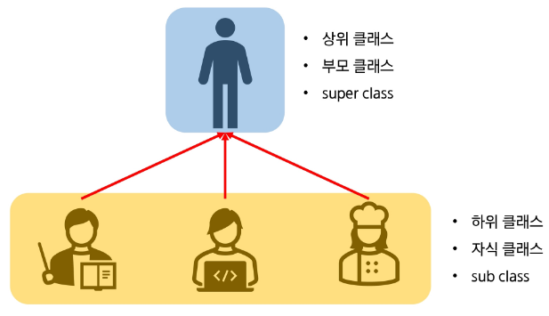

### 이클립스 자동완성 알아보기

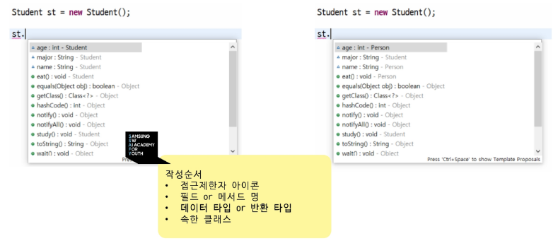

작성순서

- 접근제한자 아이콘
- 필드 or 메서드 명
- 데이터 타입 or 반환 타입
- 속한 클래스

### 상속의 특징

- **코드 재사용성** : 상위 클래스에 정의된 **필드, 메서드** 사용 가능 / 공통된 기능을 상위 클래스에 정의  
  → *접근 제한자로 감추어 버리면 접근 할 수 없음*
- 상위 클래스의 생성자와 초기화 블록은 상속하지 않음
- extends 키워드 사용
- 상속을 명시하지 않으면 기본적으로 Object 클래스를 상속 받고 있음

> 공통된 기능을 상위클래스에 정의  
→ 상위클래스 변경 시 모든 하위 클래스 적용
>
- **다중 상속 불가** : 클래스 상속에서 다중 상속을 허용하지 않음
- 인터페이스를 사용하여 다중 상속과 비슷한 효과를 구현할 수 있음

### 상속의 특징(is - a 관계)

- A는 B이다 (A is a B) 라는 **상속**을 통한 관계
- 상위 클래스는 하위 클래스의 공통된 **특성과 행동**을 정의하며, 하위 클래스는 이를 확장하거나 구체화
- 일반화와 전문화가 필요한 경우 사용

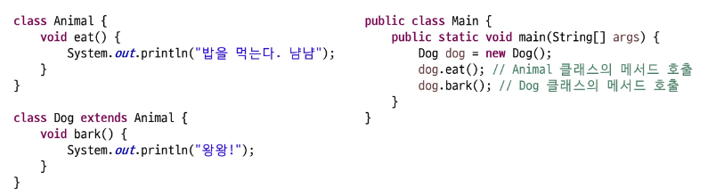

### 포함관계 (has - a 관계)

- A는 B를 가지고 있다. (A has a B)라는 포함을 통한 관계
- 한 클래스가 다른 클래스의 객체를 속성으로 포함하여 구현
- 구성 요소를 나타낼 때 사용
- 두 클래스는 독립적

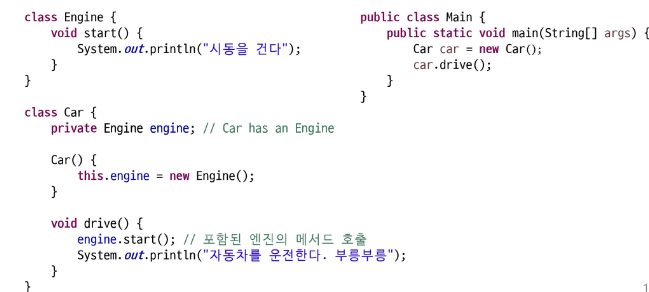

### is - a 관계와 has - a 관계 비교

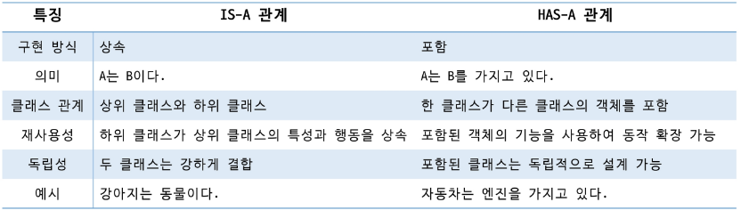

### 상속의 특징

- 접근 제한자(public, protected, default, private)에 따라 상위 클래스의 멤버에 대한 **접근 범위가 결정됨**
- 공통된 기능이 정의되어 있는 **상위 클래스만 수정하면** 하위 클래스는 모두 적용 (유지보수성)

### super 키워드

- 상위 클래스의 멤버(필드, 메서드, 생성자)를 참조하는데 사용
- this 키워드가 현재 클래스의 멤버를 참조하는데 사용하는 것처럼, **super 는** 상위 클래스와 관련된 작업을 수행할 때 사용

### super 키워드 (상위 클래스 필드 참조)

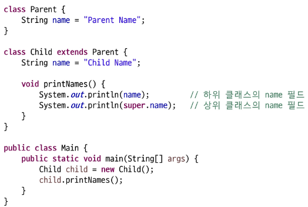

### super 키워드 (상위 클래스 메서드 호출)

- 하위 클래스에서 상위 클래스의 메서드를 호출하여 기능을 유지하거나 확장할 수 있음

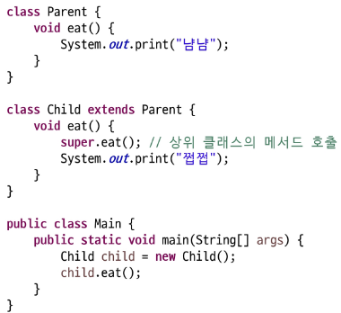

### super 키워드 (상위 클래스 생성자 호출)

- 하위 클래스의 **생성자**에서 super()를 사용하여 상위 클래스의 생성자를 명시적으로 호출할 수 있음
- **super()**는 반드시 생성자의 첫 번째 줄에 위치
- 명지적으로 작성하지 않으면 컴파일러는 기본 생성자 호출
- **this()**와 같이 사용할 수 **없음**

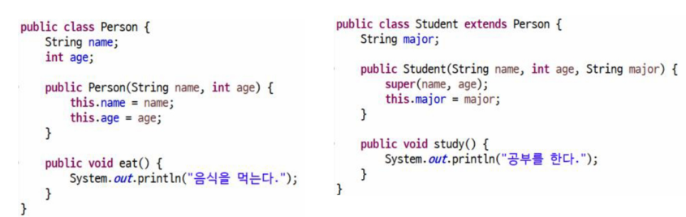

### 메서드 재정의(Overriding)

- **메서드 이름, 매개 변수, 반환 타입**이 상위 클래스와 동일 해야함
- 접근 제한자는 **상위 클래스의 메서드보다 더 넓은 범위로만 변경 가능**
- 조상보다 더 큰 예외를 던질 수 없음
- @Override 어노테이션 사용을 **권장**
- 메서드 오버로딩(Overloading)과 다른 개념

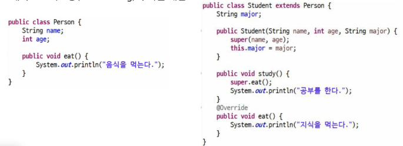

> **어노테이션(Annotation)**
> - 사전적 의미 : 주석
> - 컴파일러, JVM, 프레임워크 등이 보는 주석
> - 소스코드에 메타 데이터를 삽입하는 형태

---

# Object 클래스

- 자바의 가장 최상위 클래스로 모든 클래스의 **조상**
- 모든 클래스는 직접적으로나 간접적으로 **Object를 상속** 받음
- Object의 멤버는 모든 클래스의 멤버

### toString() 클래스

- 객체를 문자열로 변경하는 메서드

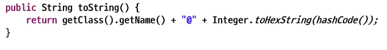

- 정작 궁금한 내용은 해시코드 + 클래스 이름이 아닌 **내용**이 궁금

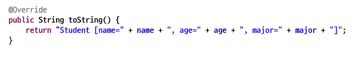

### equals() 메서드

- 두 객체가 동일한지 비교하는 메서드

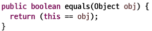

- 두 개의 레퍼런스 변수가 같은 객체를 가리키고 있는가?

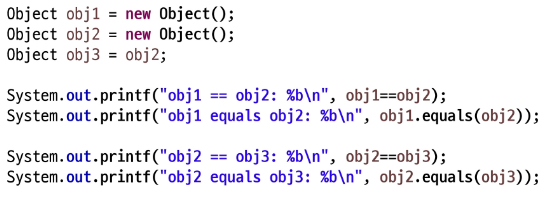

> == : 비교 연산자로 두 객체의 주소 값 비교
>
- 우리가 비교할 것은 정말 객체의 주소 값인가?  
    - 두 객체의 내용을 비교할 수 있도록 equals 메서드 재정의

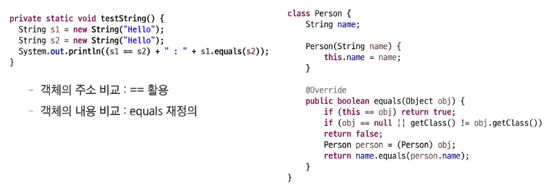

### hasCode() 메서드

- HashSet, HashMap 등에서 객체의 동일성을 확인하기 위해 사용
- equals 메서드를 재정의 할 때는 반드시 hashCode()도 재정의 할 것
- 미리 작성된 String이나 Number 등에서 재정의 된 hashCode() 활용 권장

> hashCode : 객체를 식별하는 정수형 값
>- 객체를 빠르게 검색하거나 비교할 때 사용
>- 기본적으로 메모리 주소 기반으로 생성하지만 재정의 가능
>

### getClass()메서드

- 객체의 런타임 클래스 정보를 반환

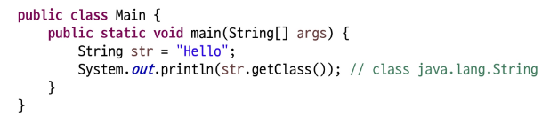

### 기타 메서드

- clone()
- finalize()
- wait() / notify()

---

## final 키워드

- 변경 불가능성을 나타내는 키워드
- 컴파일 타임 안정성을 높이는데 사용
- **변수** : 값의 고정성
- **메서드** : 재정의 방지
- **클래스** : 상속 불가능
- 과도한 사용은 코드의 유연성을 감소 시킴

### final 변수

- 값이 변경되지 않는 상수를 선언할 때 사용
- **선언과 동시에 초기화** 혹은 **생성자를 통한 초기화**를 해야함
- 참조 변수에 final을 사용하면 참조를 바꿀 수 는 없지만 객체의 내부 상태는 변경 가능

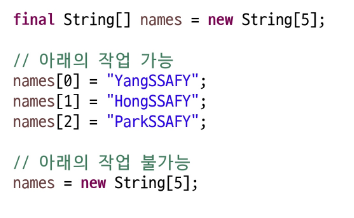

### final 메서드

- 재정의(Overriding) 금지 → 하위 클래스에서 재정의할 수 없음
- 상위 클래스에서 중요한 동작을 변경되지 않도록 보호할 때 사용

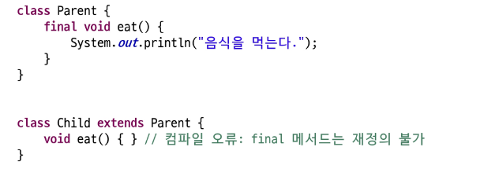

### final 클래스

- 상속할 수 없는 클래스 정의
- 클래스 자체를 확장할 필요가 없거나, 보안을 강화해야 하는 경우 사용
- String 클래스는 final로 선언 되어 있음

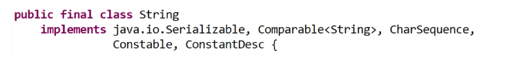

---

오프라인 강의

# 상속

### 상속이란?

- 부모 클래스로부터 **속성**과 **메서드**를 자식 클래스가 **물려받는 것**!
- 코드의 재사용성이 높아짐 (유지보수가 용이함)
- `extends` 키워드를 통해서 사용하여 구현

```java
// 부모 클래스 (Parent Class, Super Class)
class Animal {
    protected String name;

    void eat() {
        System.out.println("동물이 먹이를 먹습니다.");
    }
}

// 자식 클래스 (Child Class, Sub Class)
class Dog extends Animal {
    void bark() {
        System.out.println("멍멍!");
    }
}

// main 메서드에다가...
Dog d = new Dog();
d.eat(); // 사용 O
d.name; // 사용 X / print 해야함
System.out.println(d.name);
```

### 상속 불가(Single Inheritance Rule)

- Java는 클래스의 다중 상속을 지원하지 않음
- 하나의 클래스는 오직 하나의 부모 클래스만 상속 가능
- 다이아몬드 문제(Diamond Problem)를 방지하기 위해서

```java
class A {
    void method() {
        System.out.println("A의 메서드");
    }
}

class B {
    void method() {
        System.out.println("B의 메서드");
    }
}

// 다중 상속 불가 - 컴파일 오류!
// class C extends A, B {}  // 이런 문법은 Java에서 지원하지 않음
```

### 다이아몬드 문제란?

- 두 부모의 클래스가 같은 메서드를 가질 때 어떤 메서드를 상속받아야하나?? 모호해지는 문제!  
  → **강제 문법적으로 X**

```java
// 만약 다중 상속이 가능하다면...
/*
     Animal
    /      \
   Dog      Bird
    \      /
    DogBird (가상의 다중상속 클래스)
*/
//        멍멍~   짹짹~
// Animal, Dog, Bird 모두 makeSound() 메서드를 가진다면
// DogBird.makeSound() 호출 시 어떤 메서드가 실행될까?
```

> **정리 :** Java 언어 상에서는 클래스는 하나 이하의 클래스만 상속 받을 수 있다!
>

### 다중 상속을 받고 싶다(대안) : 인터페이스 활용

- 인터페이스를 통한 다중 구현(implements) 가능  
  (차후 라이브에서 학습 예정…! 미리보기)

    ```java
    // 인터페이스(interface)란? 클래스에게 반드시 구현해야하는 메서드를 정의
    // 하는 공간 -> 일종의 "설계요구서"
    // -> "이런이런 것들을 할 수 있어요!!" 라는 행위들을 정의하는 곳
    
    interface Flyable {
        void fly();  // "날기" 기능을 구현해주세요~
    }
    
    interface Swimmable {
        void swim();   // "수영하기" 기능을 만들어주세요~
    }
    
    // 인터페이스를 통해서 다중 구현(imple) 가능
    class Duck extends Animal implements Flyable, Swimmable {
    		@Override
    		void fly() {
    			System.out.prinln("오리가 날아갑니다~");
    		}
    
    		@Override
    		void swim() {
    			System.out.println("오리가 수영을 즐깁니다~");
    		}
    }
    ```


### is - a 관계 (상속)

- “~은 ~이다”의 관계
- **상속**을 사용해서 구현

```java
class Dog extends Animal {
		// 강아지는 동물이다. Dog is an Animal.
}
```

### has - a 관계 (포함)

- “~은 ~를 가지고 있다”의 관계
- 객체를 **멤버 변수**로 포함하는 관계

```java
class Car {
		Engine engine;   // 자동차는 엔진을 가지고 있다. Car has an Engine
		
		Car() {
			engine = new Engine();
		}
}
```

> **정리 :** 상속은 is - a 관계일 때만 사용하고, has - a는 포함 (필드)으로 사용해라
>

### this 키워드

- 현재 객체 자신을 참조
- 인스턴스 변수와 매개변수 이름이 같을 때 구분하고자…! (지역변수가 같을 때에도~)
- 같은 클래스의 다른 생성자 호출 시

```java
class Person {
	String name;   //요거 인스턴스 변수!
	int age;
	
	// 생성자
	Person(String name, int age) {
		this.name = name; // this.name은 인스턴스 변수 
		this.age = age;
	}
	
	// 다른 생성자도 호출 가능!
	Person(String name) {
		this(name, 0); // 다른 생성자를 this() 호출!
	}
}
```

### super 키워드

- 부모 클래스를 참조
- 부모 클래스의 멤버 변수나 메서드에 접근 (컴파일 시점에 결정 = 정적 바인딩)
- 부모 클래스의 생성자를 호출

```java
class Animal {
    String name;

    Animal(String name) {
        this.name = name;
    }

    void makeSound() {
        System.out.println("동물 소리");
    }
}

class Dog extends Animal {
    String breed;

    Dog(String name, String breed) {
        super(name);  // 부모 클래스의 생성자 호출
        this.breed = breed;
    }

    @Override
    void makeSound() {
        super.makeSound();  // 부모 클래스의 메서드 호출
        System.out.println("멍멍!");
    }
}
```

## 메서드 오버라이딩 (Method Overriding)

- 부모 클래스에 메서드를 자식 클래스에서 재정의
- `@Override` 어노테이션 사용 권장
- 런타임 시에 실제 객체 타입에 따라서 호출되는 메서드가 결정!(동적=바인딩)

```java
class Animal {
    String name;

    Animal(String name) {
        this.name = name;
    }

    void makeSound() {
        System.out.println(name + "이(가) 소리를 냅니다.");
    }
}

class Cat extends Animal {
    Cat(String name) {
        super(name);
    }

    @Override
    void makeSound() {
        System.out.println(name + "이(가) 야옹~ 하고 웁니다.");
    }
}

class Dog extends Animal {
    Dog(String name) {
        super(name);
    }

    @Override
    void makeSound() {
        System.out.println(name + "이(가) 멍멍! 하고 짖습니다.");
    }
}

// 퀴즈1.
Dog d1 = new Dog("퍼피");
d1.makeSound() // 출력: 퍼피이(가) 멍멍! 하고 짖습니다.

Cat c1 = new Cat("캣츠");
c1.makeSound() // 출력: 캣츠이(가) 야옹~ 하고 웁니다.

// 퀴즈2.
Animal a1 = new Dog("초코");
a1.makeSound(); // 출력: 초코이(가) 멍멍! 하고 짖습니다.
```

퀴즈!

1. A, B, C 클래스의 필드를 출력해보시오!!

```java
class A {
    protected int x = 10;  // A의 x
}

class B extends A {
    protected int x = 20;  // B의 x
    // 필드는 상속되지 않고 숨겨진다(hiding) 
    // 오버라이딩x hiding 현상o
}

class C extends B {
    protected int x = 30;  // C의 x
    
    public void accessFields() {
    	// 함정 : "필드"들은 동적 바인딩 대상이 아니다...!
    	//       정적 바인딩 -> 컴파일 시점에 결정되는 것
        System.out.println("C의 x: " + this.x);     // 30
        System.out.println("B의 x: " + ((B)this).x);     // 20
        System.out.println("A의 x: " + ((A)this).x);     // 10
    }
}

public class Main {
	public static void main(String[] args) {
		C c = new C();
		c.accessFields();
	}
}
```

1. A, B, C 클래스의 메서드를 출력해보시오!!

```java
class A {
    protected int x = 10;
    public void method() { 
    	System.out.println("A의 method"); 
    }
}

class B extends A {
    protected int x = 20;
    @Override
    public void method() { 
    	System.out.println("B의 method");
	    super.method();
    }
}

class C extends B {
    protected int x = 30;
    @Override
    public void method() { 
    	System.out.println("C의 method");
    	// super 키워드는 우회적으로 "정적바인딩"으로 
    	//                  부모 클래스를 호출하는 키워드!
    	super.method();
    }
    
    public void accessMethod() {
    	// 메서드는 동적바인딩 대상이다...!
    	// 동적바인딩 -> 런타임(runtime) 시점에 객체에 따라 결정!
		this.method();
    }
}

public class Main {
    public static void main(String[] args) {
			 C c1 = new C();
			 c1.accessMethod();   
    }
}
```

# Object 클래스

### Object클래스란?

- 모든 Java 클래스의 최상위 부모 클래스
- 명시적으로 상속하지 않더라도 자동으로  Object 클래스는 상속받는다
- `java.lang.Object` 여기에 선언되어 있음

```java
// 아래의 두 선언은 동일하다
class MyClass {}
class MyClass extends Object {}
```

### toString() 메서드

- 객체의 문자열 표현을 반환(`System.out.println(객체)` 자동으로 .toString() 메서드가 호출)
- 기본 구현 : 클래스명@해시코드
- 보통 의미있는 정보를 출력하기 위해 오버라이드 대상

```java
class Person {
    String name;
    int age;

    Person(String name, int age) {
        this.name = name;
        this.age = age;
    }

    @Override
    public String toString() {
        return "Person[name='" + name + "', age=" + age + "]";
    }
}

// 사용 예
Person p = new Person("홍길동", 25);
System.out.println(p.toString()); // Person{name='홍길동', age=25}
System.out.println(p);            // toString() 자동 호출
```

### 객체 동등성 비교

자바에서는 객체(Object)의 비교에 대해서 동등성(서로 같다)을 판단할 때에 아래의 과정을 거쳐서 판단을 진행한다. `(hashCode() → equals()`)

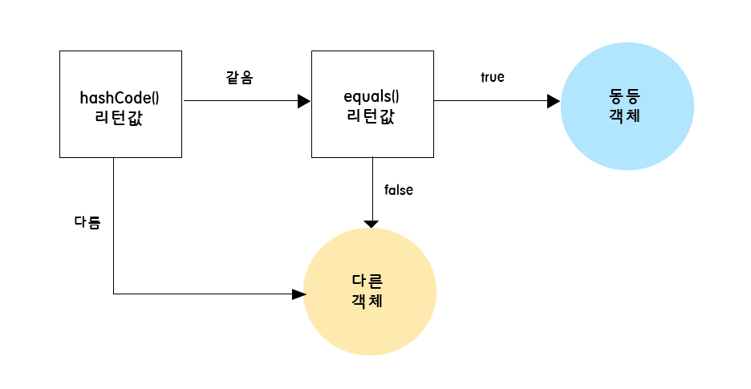

> Why? 왜 이렇게 하나요? **성능 최적화**  
→ hashCode()는 정수 비교만 수행하면 되기 때문에 매우 빠르다!  
but, 가끔 이런 해쉬코드 비교가 서로 충돌(같은 값)이 발생하는 경우가 있어서  
그 후에 안정적인 비교를 위해 필드값을 직접 비교하는 equals()연산을 그 후에 사용하도록 보완!
>
- 충동 케이스

    ```java
    // 충돌케이스
    System.out.println("Aa".hashCode());  // 2112
    System.out.println("BB".hashCode());  // 2112
    ```


차후에 JCF(Java Collenction Framework) 자료구조 시간에 해쉬(hash)를 사용하는
자료구조 (HashMap, HashSet)에서 한번 더 언급될 예정 ㅎ;

### equals() 메서드

- 두 객체가 논리적으로 같은지 비교
- 기본 구현 : 참조값 비교(== 연산자와 동일)
- 논리적인 동등성을 위해서 우리가 오버라이드하는 메서드

```java
class Person {
    String name;
    int age;

    @Override
    public boolean equals(Object obj) {
        if (this == obj) return true;
        if (obj == null || getClass() != obj.getClass()) return false;

        Person person = (Person) obj;
        return age == person.age &&
               Objects.equals(name, person.name);
    }
}
```

### hashCode() 메서드

- 객체의 해쉬코드 값을 반환
- equals() 메서드를 오버라이드 하게 되면 hashCode()도 함께 오버라이드 해야함
- 같은 객체는 항상 같은 해쉬코드를 가져야한다

```java
class Person {
    String name;
    int age;

    @Override
    public int hashCode() {
        return Objects.hash(name, age);
    }
}
```

### 기타 주요 메서드

- `getClass()` : 객체의 클래스 정보 반환
- `clone()` : 객체를 복제하여서 반환(Cloneable이라는 인터페이스룰 구현할 필요가 있다.)
- `wait()`, `notify()`, `notifyAll()` : 스레도 동기화

> **정리** : Object 클래스의 메서드들을 필요 시에 따라서 적절히 오버라이드하여 활용!
>

# Final 키워드

| 적용 대상 | 효과 |
| --- | --- |
| 변수 | 값 변경 불가 (상수) |
| 메서드 | 오버라이드 불가 |
| 클래스 | 상속 불가 |

### final 변수

- 한 번 초기화되면 값을 변경할 수 없음
- 상수를 만들 때 사용
- 지역변수, 인스턴스 변수, 클래스 변수 모두에 적용 가능

```java
class Example {
    final int CONSTANT = 100;           // 상수
    final int value;                    // 생성자에서 초기화 필요

    Example(int value) {
        this.value = value;             // 생성자에서 한 번만 초기화 가능
    }

    void method() {
        final int localVar = 50;        // 지역 상수
        // localVar = 60;               // 컴파일 오류!
        
        final Object obj = new Object();// 다른 객체로 교환 불가
    }
}
```

### final 메서드

- 자식 클래스에서 오버라이드할 수 없음
- 메서드의 구현을 변경하지 못하게 할 때 사용

```java
class Parent {
    final void finalMethod() {
        System.out.println("이 메서드는 오버라이드할 수 없습니다.");
    }
}

class Child extends Parent {
    // @Override
    // void finalMethod() {}  // 컴파일 오류!
}
```

### final 클래스

- 상속할 수 없는 클래스
- 대표적인 예: String, Integer, Boolean 등

```java
final class FinalClass {
    // 이 클래스는 상속받을 수 없음
}

// class ChildClass extends FinalClass {}  // 컴파일 오류!
```

### final 키워드 정리

- final 키워드는 불변성과 안정성을 보장하지만, 과도한 사용은 유연성을 해칠 수 있다