# 인터페이스(Interface)

- 다양한 분야에서 사용되는 용어
- **두 개체**(시스템, 장치, 프로그램 등)간의 상호작용 방식을 정의하는 경계  
  

- 두 개체가 서로 이해할 수 있는 **언어**와 **규칙**을 정의
- 복잡한 내부 동작을 숨기고, 사용자가 단순한 방식으로 접근하도록 도움
- 표준을 정하여 다른 구성 요소들이 같은 규칙을 따르도록 함
- **완벽히 추상화된 설계도**
    - 추상클래스 → 미완성된 메서드
- 클래스와 유사하게 작성되지만 class 대신 **interface 키워드** 사용
- 기본적으로 모든 메서드가 추상 메서드 (Java 8 부터 default 메서드와 static 메서드 추가)
- 인터페이스 내에 선언된 메서드는 public abstaract가 기본으로 생략 가능
- 인터페이스 내에 정의된 변수는 자동으로 public static final로 간주되며, 생략 가능


## 인터페이스의 구현

- 인터페이스는 인스턴스를 생성할 수 없음
- 클래스가 인터페이스를 구현할 경우 **implements 키워드**를 사용
- 클래스는 여러 개의 인터페이스를 다중 구현 가능
    - 헷갈릴 구현부가 없기 때문에
- 클래스는 인터페이스의 추상 메서드를 **모두 구현(재정의)해야** 객체 생성 가능  
  → 모두 구현하지 않으면 추상 클래스로 변경해야

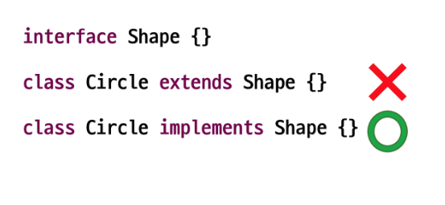

## 인터페이스의 다중 구현

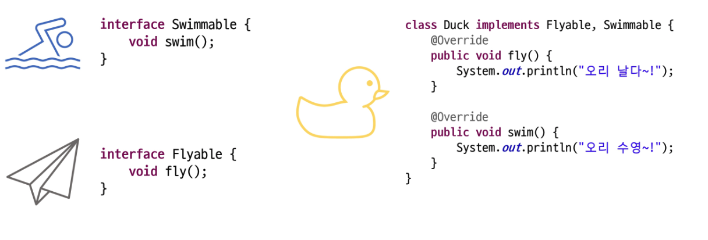

## 인터페이스 상속

- **extends 키워드**를 이용하여 상속
- 클래스와 달리 인터페이스는 **다중 상속이 가능** → 메서드 구현부가 없음

## default 메서드 (Java 8+)

- 인터페이스에 **구현부가 있는** 메서드를 작성할 수 있음
- 메서드 앞에 default 라는 키워드를 작성 해야함
- public 접근제한자를 사용해야 하며 public은 생략 가능
- 클래스에서 인터페이스의 default 메서드를 재정의할 수 있음

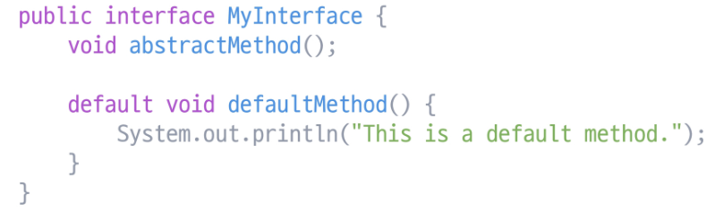

> 개발 도중 interface를 추가해야 하는 상황에서 default 메서드를 통해 문제 상황을 줄일 수 있음  
→ **구현체에서 구현할 필요가 없음**
>

### default method 충돌 해결

- 여러 인터페이스의 디폴트 메서드 간의 출동
    - **구현 클래스**에서 오버라이딩
- 디폴트 메서드와 조상 클래스의 메서드 간의 충돌
    - 자동으로 **조상 클래스 상속**

## 정적(static) 메서드 (Java 8+)

- 인터페이스 내에 선언된 static 메서드는 클래스의 static 메서드와 사용 방법이 동일함
- 인터페이스 이름으로 메서드에 접근하여 사용
- 특정 인터페이스에 관련된 유틸리티 메서드나 헬퍼 메서드를 제공할 수 있음
- **static 메서드**는 인터페이스를 구현한 클래스에서 상속되거나 재정의할 수 없음

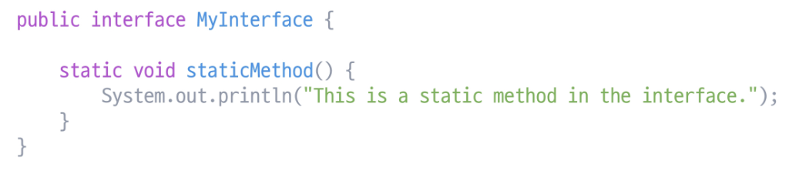

## private 메서드 (Java 9+)

- 인터페이스 내부에서만 사용되는 헬퍼 메서드
- 디폴트 메서드, 정적 메서드에서 반복되는 로직 분리 후 작성
- 외부에서 접근하지 못하도록 숨김
- 재사용성 증가
- static 키워드를 사용할 수 있음

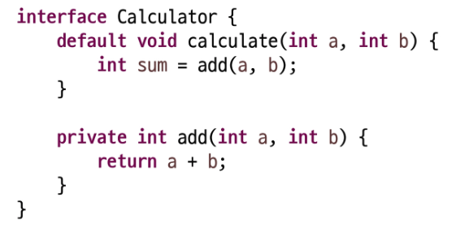

## 인터페이스와 다형성

- 인터페이스를 구현한 클래스로 만든 객체는 해당 인터페이스 타입으로 참조할 수 있음
- **동적 바인딩**: 런타임 시점에서는 실제 객체의 메서드가 호출

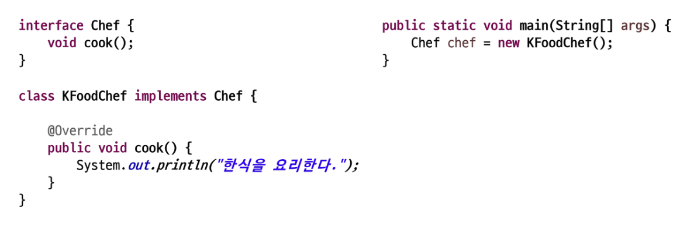

## 인터페이스의 필요성

| 인터페이스 특징 | 내용 |
| --- | --- |
| **표준화 처리** 가능 | 여러 클래스들이 동일한 인터페이스를 구현하여 일관된 방식으로 동작 처리 |
| **개발 기간 단축** 가능 | 시스템 구조를 먼저 설계하고, 각 부분을 독립적으로 개발하여 개발 기간 단축 |
| 서로 관계가 없는 클래스들 간의 **관계 형성** | 관련이 없는 클래스들이 동일한 인터페이스를 구현하여 공통된 동작 공유 |
| 간접적인 클래스 사용으로 **모듈 교체 용이** | 구체적인 클래스에 의존하지 않고 인터페이스를 통해 클래스 사용, 모듈 교체 용이 |
| **독립적 프로그래밍** 가능 | 각 클래스가 독립적으로 개발 및 테스트 가능, 코드 재사용성과 유지보수성 향상 |
| **다형성** 지원 | 같은 인터페이스를 구현하는 객체들을 일관되게 처리하여 코드 유연성과 확장성 증가 |
| 설계의 **유연성 제공** | 클래스 간의 강한 결합을 피해 설계의 유연성 증가, 시스템 변경 및 확장 시 영향 최소화 |

## 클래스와 인터페이스 비교

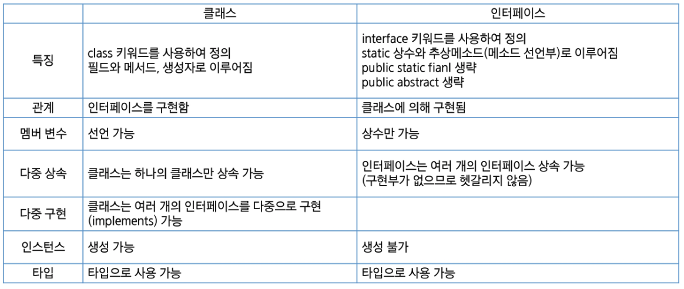

## 추상클래스와 인터페이스 비교

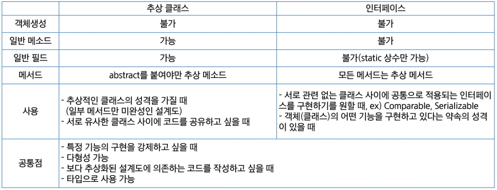

---

# 제네릭(Generics)

## 만능상자 VS 타입상자

- **만능상자**
    - 넣을 때는 Good
    - 꺼낼 때는 Bad
- **타입상자**
    - 넣을 때는 Bad
    - 꺼낼 때는 Good

- 다양한 데이터 타입을 처리할 수 있는 **클래스**, **인터페이스**, **메서드**를 작성하는 기법
- 컴파일 시점에서 데이터 타입을 지정할 수 있음 → 타입 안정성 제공
- 하나의 코드로 여러 타입에 대해 동작하게 설계 가능 → 코드 재사용성 증가
- 데이터 타입을 지정하였으므로 불필요한 타입 캐스팅을 제거할 수 있음

## 제네릭 클래스

- 클래스 정의 시 **타입 매개변수**를 사용하여 다양한 타입을 처리할 수 있는 클래스
- 타입 매개변수는 `<T>` 안에 적는다

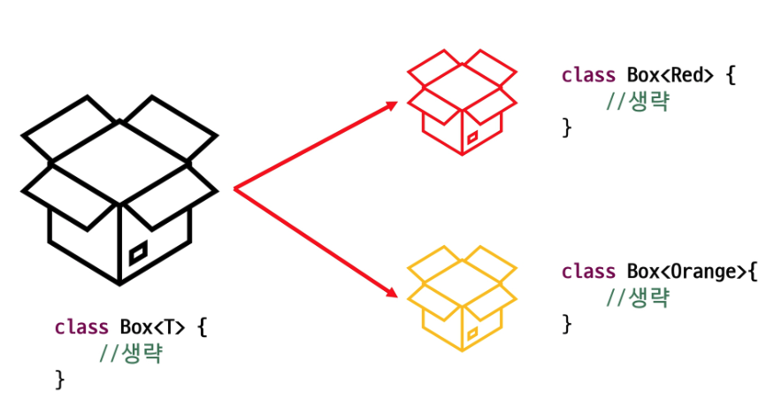

## 제네릭 클래스 선언

- 클래스 또는 인터페이스 선언 시 <>에 타입 파라미터 표시

    ```jsx
    public class ClassName<T> {}
    public interface InterfaceName<T>{}
    ```

- 타입 파라미터 → 특별한 의미의 알파벳 보다 단순히 임의의 참조형 타입을 말함
    - T : reference Type
    - E : element
    - K : Key
    - V : value

## 제네릭 클래스 객체 생성

- **변수**와 **생성 쪽의 타입**은 반드시 일치해야 함 (**상속관계에 있어도 마찬가지**)

    ```java
    Box<Student> box = new Box<Student>(); // (O)
    Box<Person> box = new Box<Student>(); // (X)
    ```

- 추정이 가능한 경우 타입 생략 가능 (생성자 쪽 생략 가능 Java 7+)

    ```java
    Box<Student> box = new Box();
    ```

- 제네릭 타입을 지정하지 않고 생성이 가능하지만 권장X (자동으로 T는 Object)

## 제네릭 클래스 실습

- Object를 속성으로 사용 → 모든 객체 수용 가능

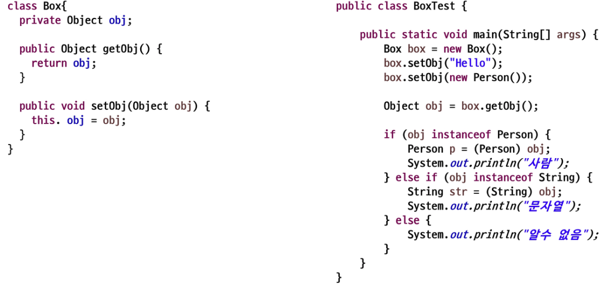

- 지정 타입을 속성으로 사용 → 타입 선언 시 결정

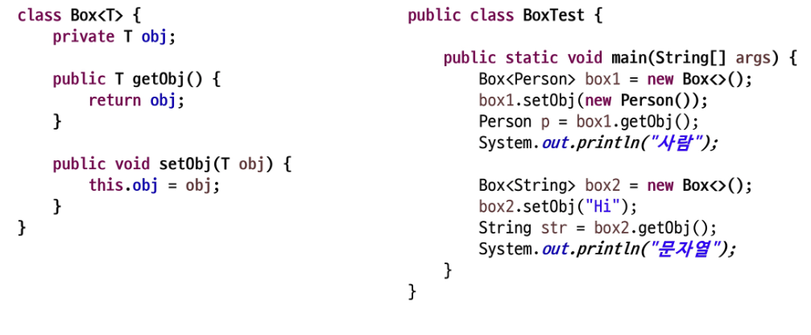

## 제네릭 메서드

- 타입 파라미터를 사용하는 메서드
- 클래스의 타입 파라미터와는 별개로, **메서드 레벨에서** 제네릭 타입을 정의하고 사용할 수 있음
- 제네릭 메서드는 메서드의 매개변수나 반환 타입을 **타입 파라미터로 지정**하여 다양한 타입을 처리
- 제네릭 메서드를 정의하려면 **메서드의 반환 타입앞에 타입 파라미터를 선언**

    ```java
    public <T> void printClassName(T item) {
    	System.out.println("Item type: " + item.getClass().getName());
    }
    ```

- 메서드를 호출할 때는 **타입 파라미터를 생략 가능**(컴파일러가 추론)할 수도 있지만 명시할 수도 있음
- 명시할 때는 메서드명 앞 .(dot)연산자 사이에 <타입>을 표시

    ```java
    integerBox.printClassName("Test String");
    integerBox.<Double>printClassName(12.5);
    ```


## 한정된 타입 매개변수

- 제네릭 클래스를 정의할 때
- 모든 종류의 타입에 대해서 작성하는 것이 아니라 특정한 종류의 타입에 대해서만 작성하고 싶은 경우
- 구체적인 타입의 제한이 필요할 때 **extends 키워드를 사용**할 수 있음
- 타입 파라미터를 한정할 때는 하한 경계(super)의 사용이 불가하며, 상한 경계(extends)만 사용 가능

    ```java
    class Box<T extends Person> {
    	private T obj;
    	
    	public T getObj() { return obj; }
    	
    	public void setObj(T obj) { this.obj = obj; }
    }
    ```

- 클래스가 아닌 인터페이스로 제한할 경우도 **extends 키워드** 사용
- 클래스와 함께 인터페이스 제약 조건을 이용할 경우 & 로 연결

## 와일드 카드

- 제네릭 클래스 **인스턴스 변수**의 참조 타입을 작성할 때
- 와일드 카드로서 **문자 ?를 사용**
- 불특정 타입을 나타내기 위해 사용하는 특수한 타입 매개변수
- 제네릭 클래스에 다형성 적용 가능

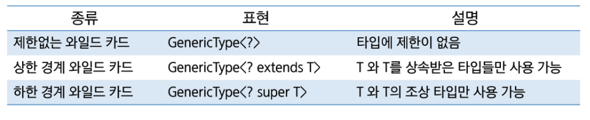

---

오프라인

# 인터페이스 & 제너릭

## 자바 키워드 정리

### 1. extends  - 클래스 / 인터페이스 상속

- **의미:** IS - A 관계 (~는 ~이다)
- **용도:** 기존 구현을 **확장**(extends)
- **단일 상속**을 받을 때 사용 가능

### 2. implements - 인터페이스 구현

- **의미:** CAN - DO 관계 (~를 할 수 있다)
- **용도:** 인터페이스 계약을 구현
- **다중 구현**을 할 때

예시)

- `Dog extends Animal`: 개는 동물이다
- `Duck implements Flyable`: 오리는 날 수 있다.
- `interface FastRunnable extends Runnable`: 인터페이스들 끼리는 extends를 사용!  
  **Why?** 인터페이스는 다른 인터페이스의 메서드 명세를 “**확장**”하는 개념이기 때문!

## 인터페이스

### 인터페이스의 정의

인터페이스는 **클래스가 구현해야하는 메서드들의 명세를 정의하는 참조 타입**

> 구현해야하는 메서드를 정의해주는 일종의 “설계요구서”  
→ “이런이런 것들을 할 수 있어요!” 라는 행위(메서드)들을 정의하는 곳
>
- 모든 메서드들은 기본적으로 `public abstract`
- 모든 필드들은 기본적으로 `public static final`
- 다중 상속 지원 (여러 인터페이스를 구현 가능)

```java
public interface Animal {
    // 상수 (public static final 생략 가능)
    int MAX_AGE = 100;

    // 추상 메서드 (public abstract 생략 가능)
    void eat();
    void sleep();
}
```

### 추상 메서드 (Abstract Method)

인터페이스 내에서 선언된 메서드는 기본적으로 “추상 메서드”,  
구현체(클래스)에서 반드시 오버라이드해야 한다.

```java
public interface Drawable {
    // 추상 메서드
    void draw();
    void resize(int width, int height);
}

class Circle implements Drawable {
    @Override
    public void draw() {
        System.out.println("원을 그립니다.");
    }

    @Override
    public void resize(int width, int height) {
        System.out.println("원의 크기를 조정합니다.");
    }
}
```

### default 메서드(★★★★★)

Java 8+, 인터페이스 내에서 구현부를 가진 메서드를 정의할 수 있도록 사용하는 키워드

**특징**

- `default` 키워드 사용
- **구현의 강제성 없음**: 구현체에서 선택적으로 오버라이드 가능
- **Why?** 기존 인터페이스 내에서 새로운 기능 추가 시에 하위 호환성을 유지하기 위해…  
  (클래스에서 구현을 해줘야하는 데, 새로운 메서드(추상)를 선언하면? → 구현한 클래스에 에러 쾅!)

```java
// Vehicle -> 자동차..
public interface Vehicle{
	void start();
	
	void stop(); // 이렇게 새로운 메서드가 추가된다면???

	// default 메서드 : 구현부가 있는 메서드를 만들어 둘 수 있음! (구현은 강제성x)
	default void honk() {
		System.out.println("빵빵!");
	}
}

// 구현한 클래스 쪽에도 새로운 메서드에 대한 로직을 구현해줘야 할 필요가 있음!
public class Car implements Vehicle {

			@Override
			public void start(){ /* 구현 로직 ... */ }
			
			// 어...? 새로운 stop 메서드 구현부가 있어야 하는데...??? 컴파일러 에러 쾅!
}
```

### static 메서드

Java 8+, 인터페이스에서 정적인 메서드를 정의할 때 사용할 수 있다.

**특징**

- 인터페이스명으로도 직접 호출 `Comparator.reverseOrder`
- 구현체에서 오버라이드 불가 (재정의 불가)  
  **Why?** 관련 유틸리티 기능들을 인터페이스와 함께 작성할 수 있기 때문! → **코드 응집도 향상!**

```java
public interface MathUtils {
    static int add(int a, int b) {
        return a + b;
    }

    static double calculateArea(double radius) {
        return Math.PI * radius * radius;
    }
}

// 사용 예시
public class Main {
    public static void main(String[] args) {
        int sum = MathUtils.add(5, 3);
        double area = MathUtils.calculateArea(2.5);
    }
}

```

### private 메서드

Java 9+, 인터페이스 내에 private 메서드를 정의할 수 있다.

**특징**

- `private` 키워드 사용
- 인터페이스 내부에서만 사용 가능 (접근 가능)
- `default` 메서드나 `static` 메서드에서 공통 로직을 추출할 때 사용

```java
public interface Logger {
	// 정보 info 를 출력
	default void logInfo(String message){
		printLog("INFO", message);
	}
	
	// 경고 warning 를 출력
	default void logError(String message){
			printLog("WARNING", message);
	}
	
	// 공통 로직 꺼내기 - (목적 : 메서드들 사이에서의 공통 로직을 추출해서 캡슐화)
	default void printLog(String level, String message){
			System.out.println("[" + level + "]" + message);
	}
}

class ConsleLogger implements Logger {
}

//예시
ConsoleLogger logger = new ConsoleLogger();
logger.logInfo("프로그램 시작");
logger.logError("문제가 발생했습니다.");
//logger.printLog("somthing...");
```

**Why?**

- `default` 메서드 간의 코드 중복 제거
- `static` 메서드에서 헬퍼 메서드로 활용 (*헬퍼 메서드: 내부 메서드의 보조격 메서드 = 보통 가독성 목적)
- 인터페이스 내부에서 구현에 대한 **캡슐화**

### 우선순위 규칙

여러 인터페이스를 구현하거나 상속받을 때에 메서드 충돌이 발생하는 경우 → **우선순위** 부여

1. 클래스 메서드   **>**  인터페이스 default 메서드
2. 하위 인터페이스 메서드  >  상위 인터페이스 메서드
3. (우선순위가 동일한 상황인 경우 명시적으로 오버라이드를 해줘야 한다)

```java
interface A {
	default void hello() {
		System.out.println("A의 hello");
	}
}

interface B {
	default void hello() {
		System.out.println("B의 hello");
	}
}

class Parent {
	public void hello() {
		System.out.println("Parent의 hello");
	}
}

class Child extends Parent implements A {
		// x
}

// 우선순위가 서로 동일한 상황이므로 반드시 명시적으로 오버라이드를 해줘야한다!
class Child2 implements A, B {

	 // 우선순위가 동일한 상황에 명시적으로 오버라이드 해주면 사용 가능!
	 @Override
   public void hello() {
			System.out.println("Child2의 hello");
			// A 에 있는 hello 메서드를 호출...!
			A.super.hello();
			// B 에 있는 hello 메서드를 호출...!
      //	super.hello();
      B.super.hello();
	 }
}

// 호출 예시
Child c1 = new Child();
c1.hello() // Parent의 hello

Child2 c2 = new Child2();
c2.hello() // ?
```

## 제너릭

### 제너릭 타입

타입(type) 자체를 **파라미터화**하여 컴파일 타임에 타입 안정성을 보장하는 기능

**특징**

- 컴파일 타임 시에 타입(type) 체크로만 사용!  
  (런타임 시에는 모두 **Object** 타입으로 평가… 성능적인 영향 제로!!)  
- 타입 캐스팅을 불필요하게 사용 X  
  (제너릭을 사용하게 되면 컴파일 시간에 타입을 체크 가능 ! → 불필요하게 런타임에 캐스팅 필요 없어짐)
- 코드의 재사용성 향상

```java
// 제너릭 없이
List list = new ArrayList();
list.add("문자열");
String str = (String) list.get(0); // 캐스팅 필요

// 제너릭 사용
List<String> stringList = new ArrayList<>();
stringList.add("문자열");
String str2 = stringList.get(0); // 캐스팅 불필요
```

### Quiz~

```java
class Printer {
	void print(Integer a) {
		System.out.print("A" + a);
	}
	void print(Object a) {
		System.out.print("B" + a);
	}
	void print(Number a) {
		System.out.print("C" + a);
	}
}
public class Gisafirst {
	public static void main(String[] args) {
		new Container<>(0).print();
	}
	public static class Container<T> {
		T value;
		public Container(T t) {
			value = t;
		}
		public void print() {
			new Printer().print(value);
		}
	}
}
```

⇒ **B0**

**Why? 제너릭을 사용?**
: **컴파일 타임에 타입체크**를 ****하기 위해(컴파일러에게 해당 타입체크를 지시하게 하기 위해서…)

제너릭을 썼을 때의 단점… 반드시 Object 클래스의 자식 클래스여야 사용 가능!  
→ **기본 타입**(primitive type) : int, boolean, double, float, byte, short …) 제너릭에 사용 불가!

## Wrapper 클래스

우리가 사용하는 기본 타입(primitive type)들을 참조 타입으로 변형해주는 클래

| 기본 타입 | Wrapper 클래스 |
| --- | --- |
| byte | Byte |
| short | Short |
| int | Integer |
| long | Long |
| float | Float |
| double | Double |
| char | Character |
| boolean | Boolean |

```java
// 잘못된 사용 예시 - 기본타입 (컴파일 에러)
// List<int> numbers = new ArrayList<>();  // 에러! 

// 올바른 사용 예시 - Wrapper 클래스 사용
List<Integer> numbers = new ArrayList<>();

numbers.add(10);              //  오토박싱: int   -> Integer
int value = numbers.get(0);   //  오토언박싱: Integer -> int
```

### 오토박싱과 오토언박싱

: 기본 타입과 Wrapper 클래스 간의 자동 변환을 해주는 것을 의미

```java
// 오토박싱 (primitive -> wrapper)
Integer num1 = 100; // new Integer(100); 과 동일
List<Integer> numbers = new ArrayList<>();
numbers.add(10);  // int 50이 자동으로 Integer로 변환

// 오토언박싱 (Wrapper -> primitive)
Integer num2 = 200;
int primitive = num2;      // Intger -> int 로 자동 변환
int sum1 = num1 + num2;    // 둘 다 int로 변환되어서 계산
```

### 주의사항

Wrapper 클래스는 기본적으로 참조 자료형…!

```java
	// Wrapper 클래스는 기본적으로 참조 타입이다...!
	Integer a = 1234;
	Integer b = 1234;
	
	// 객체들끼리는 비교할 때 주소(address) 비교!
	System.out.println(a == b);  // false
	System.out.println(a.equals(b)); // true
	
	///////////////////////////////////////////////////////
	Integer c = 100;
	Integer d = 100;
	
	// Wrapper 클래스의 정수값 -128~127 숫자들은 미리 캐싱되어 있음
	System.out.println(c == d);  // true
	System.out.println(c.equals(d)); // true 
```

> 💡
제네릭을 가진 클래스, 인터페이스, 메서드를 직접 정의하는 일은 드물고  
SSAFY 교육 과정 상 비중이 높지 않기에 시험 공부 및 학습 용도로 참고만 하세요! 😊
>

### 2.2 제너릭 클래스

클래스 선언 시 타입 파라미터를 사용하는 클래스입니다.

```java
public class Box<T> {
    private T content;

    public void setContent(T content) {
        this.content = content;
    }

    public T getContent() {
        return content;
    }
}

// 사용 예시
Box<String> stringBox = new Box<>();
stringBox.setContent("Hello");
String content = stringBox.getContent();

Box<Integer> intBox = new Box<>();
intBox.setContent(42);
Integer number = intBox.getContent();
```

**복수의 타입 파라미터:**

```java
public class Pair<T, U> {
    private T first;
    private U second;

    public Pair(T first, U second) {
        this.first = first;
        this.second = second;
    }

    public T getFirst() { return first; }
    public U getSecond() { return second; }
}

// 사용 예시
Pair<String, Integer> nameAge = new Pair<>("홍길동", 25);
```

### 2.3 제너릭 인터페이스

인터페이스에서도 제너릭을 사용할 수 있습니다.

```java
public interface Repository<T> {
    void save(T entity);
    T findById(Long id);
    List<T> findAll();
    void delete(T entity);
}

// 구현 클래스
public class UserRepository implements Repository<User> {
    @Override
    public void save(User user) {
        // 사용자 저장 로직
    }

    @Override
    public User findById(Long id) {
        // 사용자 조회 로직
        return new User();
    }

    @Override
    public List<User> findAll() {
        // 모든 사용자 조회 로직
        return new ArrayList<>();
    }

    @Override
    public void delete(User user) {
        // 사용자 삭제 로직
    }
}
```

### 2.4 제너릭 메서드

메서드 레벨에서 제너릭을 사용하는 방법입니다.

```java
public class Utility {
    // 제너릭 메서드
    public static <T> void swap(T[] array, int i, int j) {
        T temp = array[i];
        array[i] = array[j];
        array[j] = temp;
    }

    // 복수 타입 파라미터를 가진 제너릭 메서드
    public static <T, U> boolean compare(Pair<T, U> p1, Pair<T, U> p2) {
        return p1.getFirst().equals(p2.getFirst()) &&
               p1.getSecond().equals(p2.getSecond());
    }
}

// 사용 예시
String[] names = {"Alice", "Bob", "Charlie"};
Utility.swap(names, 0, 1); // Alice와 Bob의 위치 교환
```

### 2.5 타입 파라미터 제한 (Bounded Type Parameters)

타입 파라미터에 제약을 두어 특정 타입이나 그 하위 타입만 허용하는 방법입니다.

**상한 경계 (Upper Bound):**

```java
// Number 클래스나 그 하위 클래스만 허용
public class NumberBox<T extends Number> {
    private T number;

    public void setNumber(T number) {
        this.number = number;
    }

    public double getDoubleValue() {
        return number.doubleValue(); // Number의 메서드 사용 가능
    }
}

// 사용 예시
NumberBox<Integer> intBox = new NumberBox<>(); // OK
NumberBox<Double> doubleBox = new NumberBox<>(); // OK
// NumberBox<String> stringBox = new NumberBox<>(); // 컴파일 에러
```

### 2.6 와일드카드 (Wildcards)

불특정 타입을 나타내는 `?` 기호를 사용하는 방법입니다.

**무제한 와일드카드 (`?`):**

```java
public void printList(List<?> list) {
    for (Object item : list) {
        System.out.println(item);
    }
}
```

**상한 경계 와일드카드 (`? extends Type`):**

```java
// Number나 그 하위 타입만 허용 (공변성)
public double sum(List<? extends Number> numbers) {
    double total = 0.0;
    for (Number num : numbers) {
        total += num.doubleValue();
    }
    return total;
}

// 사용 예시
List<Integer> intList = Arrays.asList(1, 2, 3);
List<Double> doubleList = Arrays.asList(1.1, 2.2, 3.3);
sum(intList);    // OK
sum(doubleList); // OK
```

**하한 경계 와일드카드 (`? super Type`):**

```java
// Integer나 그 상위 타입만 허용 (반공변성)
public void addNumbers(List<? super Integer> list) {
    list.add(1);
    list.add(2);
    list.add(3);
}

// 사용 예시
List<Number> numberList = new ArrayList<>();
List<Object> objectList = new ArrayList<>();
addNumbers(numberList); // OK
addNumbers(objectList); // OK
```

---