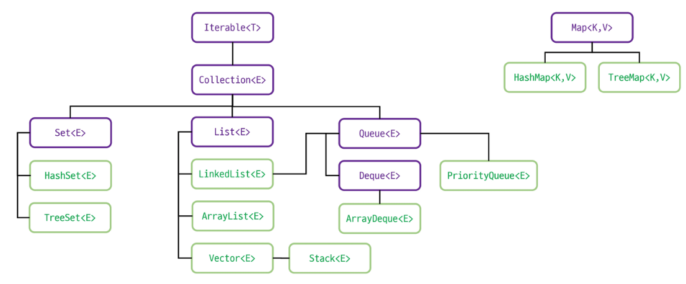
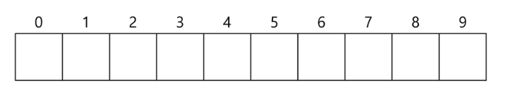
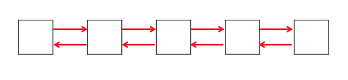
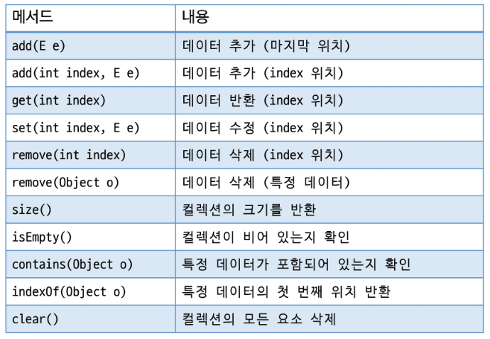
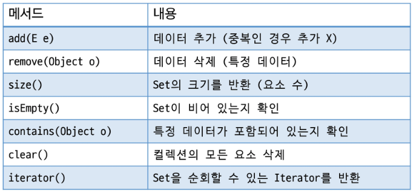

# 자료구조

## 자료구조(Data Structure)

- 데이터에 **효율적**으로 접근하기 위해 선택되는 데이터의 조직 및 저장 형식
- 데이터 값들의 모, 이들 간의 관계, 데이터에 적용될 수 있는 연산의 모음

## 자료 구조의 분류

- 정적 자료구조(Static Data Structure): 크기가 **고정된 자료 구조** (예: 배열)
- 동적 자료구조(Dynamic Data Structure): 크기가 **변할 수 있는 자료 구조**(예: 리스트, 스택, 큐)

## 자료 구조의 선택 기준

- 데이터 접근 **속도**
- **메모리** 사용 **효율성**
- **삽입 및 삭제**의 **효율성**
- **순서 유지** 여부
- **중복 데이터 허용** 여부

# 컬렉션 프레임워크(Collection Framework)

프레임워크 → 반정도 만들어져있는 틀

- 표준화된 데이터 구조와 이를 처리하기 위한 **클래스** 및 **인터페이스**의 집합
- 데이터를 **동적 크기로 관리**하고, 삽입, 삭제, 검색, 정렬 등을 효율적으로 처리할 수 있음
- **제네릭**을 지원하여 **타입 안전성 보장**
- **표준화된 메서드** 제공

## 컬렉션 주요 인터페이스 및 구현 클래스

## Collection interface

[Java Collection API](https://docs.oracle.com/en/java/javase/17/docs/api/java.base/java/util/Collection.html)

---

# List 계열

## List 계열 컬렉션

https://docs.oracle.com/en/java/javase/17/docs/api/java.base/java/util/List.html

- 순서가 있는 데이터 집합
- **중복 데이터 허용** (저장된 **순서 유지**)
- 크기가 고정된 배열과 달리 **크기가 동적으로 변함**
- 구현 클래스
    - ArrayList
    - LinkedList
    - Vector

## ArrayList

- **배열** 기반의 구현
- 인덱스를 통한 접근이 빠름
- 데이터 **삽입, 삭제**가 빈번한 경우 성능 저하 (많은 데이터 이동)
- 데이터의 조회가 많고, 삽입/삭제가 적은 경우 유용

## LinkedList

- **노드 기반**의 구현

| **링크**   주소값(이전노드) | **데이터** | **링크**   주소값(다음노드) |
|-------------------| --- |-------------------|
- 각 노드가 이전 노드와 다음 노드의 참조를 포함
- 데이터 **삽입, 삭제가 빠름**
- 데이터의 삽입/삭제가 많고 조회가 많이 없는 경우 유용

## List 주요 메서드

---

# Set 계열

## Set 계열 컬렉션

https://docs.oracle.com/en/java/javase/17/docs/api/java.base/java/util/Set.html

- **중복 데이터** 허용하지 않음(★)
- 순서 보장하지 않음
- **null 값 허용** (**한 개** 저장)
- 데이터의 고유성을 보장하기 위해 사용
- 구현 클래스
    - HashSet
    - LinkedHashSet(순서를 보장)
    - TreeSet

## HashSet

- 데이터의 저장 순서를 유지하지 않음
- **HashMap 기반**으로 동작 → **빠른 추가, 삭제, 검색**이 가능
- **null 값 하나 저장**할 수 있음

> **Hash** : 데이터를 빠르게 저장하고 검색하기 위해 사용하는 특별한 값 또는 기법  
→ 데이터를 **고유한 숫자 값**으로 변환하는 과정
>

## LinkedHashSet

- 데이터의 **저장 순서를 유지함**
- LinkedHashMap 기반으로 동작 → **빠른 추가, 삭제, 검색**이 가능
- 이중 연결 리스트를 이용하여 관리 (약간 더 느림)
- null 값 하나 저장할 수 있음

## TreeSet

- 데이터가 **정렬된 상태로 유지** (기본 **오름차순**)
- 사용자 정의 정렬이 필요한 경우 Comparator를 사용할 수 있음
- 내부적으로 **이진 탐색 트리**(레드-블랙 트리 [균형유지]) 구조를 사용
- null 값 저장 불가

## Set 주요 메서드

---