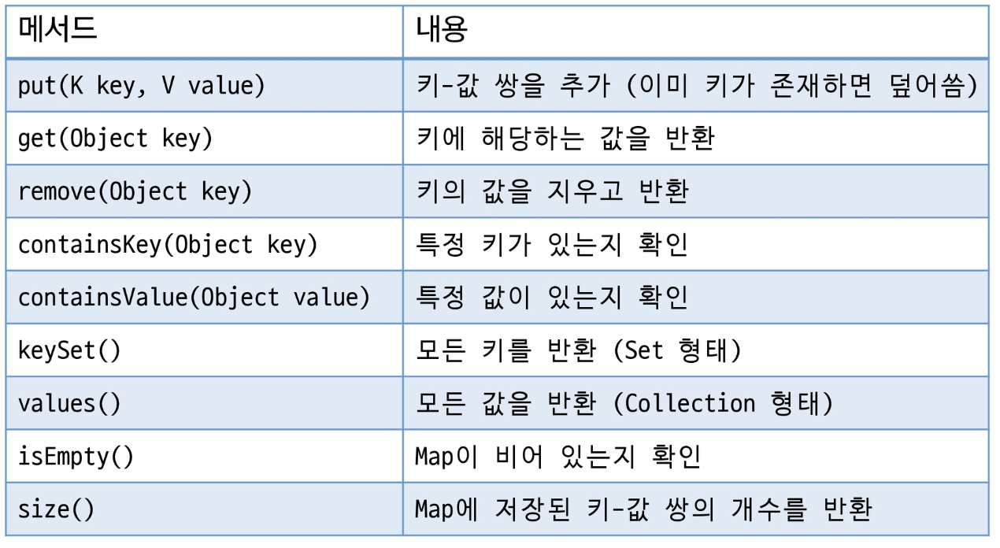
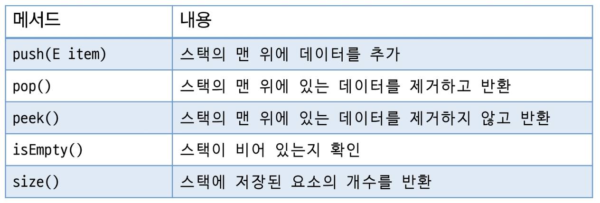
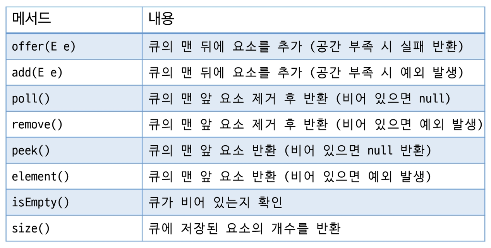
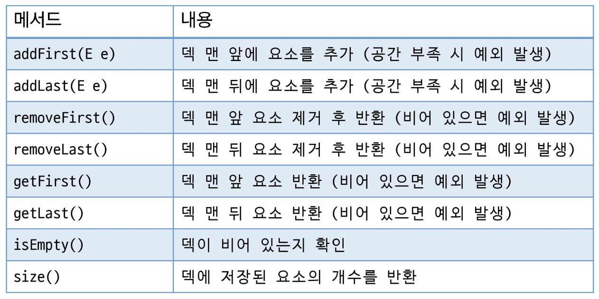
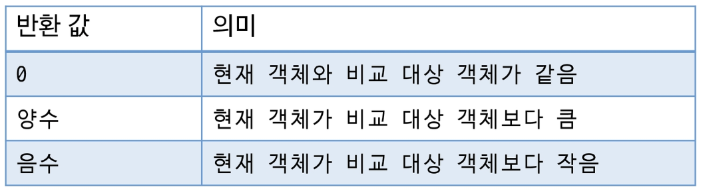
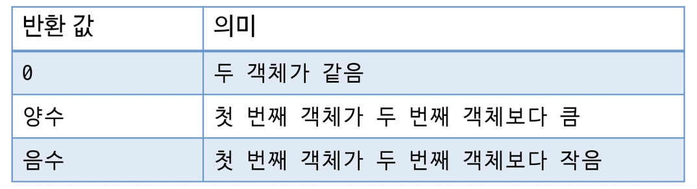
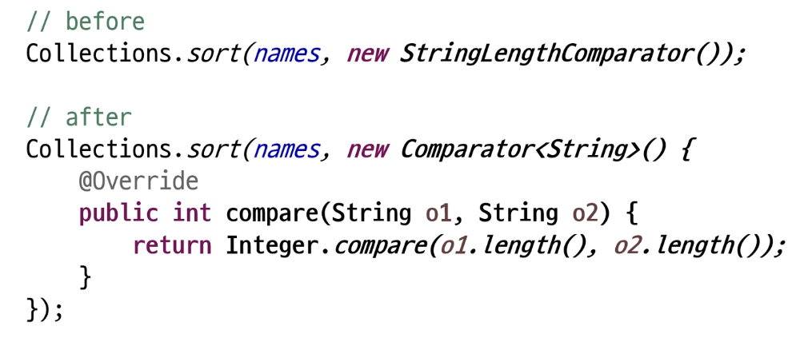

# Map 계열

## Map 계열 컬렉션

- **키(Key)**와 **값(Value)**의 쌍으로 데이터를 저장하는 구조
- **키**를 기준으로 **값**에 접근하여 **키는 중복을 허용하지 않음** (값은 허용)
- 키를 활용하여 **빠른 검색 가능**
- 키 또는 값에 **null 허용** (일부 TreeMap 에서는 허용하지 않음)
- 구현 클래스
    - HashMap
    - LinkedHashMap
    - TreeMap

## HashMap

- 데이터의 **저장 순서를 유지하지 않음**
- 내부적으로 **Hash Table**을 사용하여 데이터 저장 및 검색
- null 키를 하나 허용하며, 여러 개의 null 값을 허용
- **빠른 검색, 삽입, 삭제**를 지원

> 서로 다른 키가 동일한 Hash 값을 가질 경우, 충돌이 발생하면 **체이닝을 사용하여 연결리스트로 관리**
>

## LinkedHashMap

- 데이터의 **저장 순서를 유지**
- 내부적으로 **Hash Table + 이중 연결 리스트**를 사용하여 데이터 저장 및 검색
- null 키를 하나 허용하며, 여러 개의 null 값을 허용
- 빠른 검색, 삽입, 삭제를 지원
- 해시 충돌 시 HashMap과 동일하게 처리

## TreeMap

- **키를 기준으로 정렬된 상태**로 데이터를 유지 (기본 오름차순)
- **사용자 정의 정렬**이 필요한 경우 **Comparator를 사용**
- 내부적으로 **레드-블랙 트리 기반**으로 구현
- null 키는 허용하지 않음

## Map 주요 메서드



# Stack

- **후입선출**(Last-In First-Out, **LIFO**) 구조
- Vector 기반으로 동작



# Queue

- **선입선출**(First-In First-Out, **FIFO**) 구조
    - 우선순위 큐(*추후 학습)
- 다양한 구현체 (**LinkedList, ArrayDeque**)가 있음



# Deque

- **양방향 큐** (양쪽에서 삽입과 삭제 가능)
- **ArrayDeque** (배열 기반), **LinkedList** (연결리스트 기반) 사용 가능



# 정렬(Sort)

- 요소들을 특정 기준에 맞추어 **오름차순** 또는 **내림차순**으로 배치 하는 것
- **순서를 가지는 Collection들만** 정렬 가능
- 자바 제공 클래스 → Collections의 sort()를 이용하여 정렬  
  → **배열**은 Arrays의 sort()를 이용하여 정렬

## Comparable 인터페이스

- 객체의 **기본 정렬 기준을 정의**
- 클래스에 **직접 구현**
- compareTo(T o) 메서드를 구현하여 정렬 기준을 정의
- ex) 이름 순 정렬, 나이 순 정렬 등

```java
public interface Comparable<T> {
		public int compareTo(T o);
}
```



## Comparator 인터페이스

- 별도의 정렬 기준을 정의
- 정렬 기준이 여러 개 필요한 경우 유용
- 클래스 외부에서 정렬 기준을 정의하며, 특정 필드나 사용자 정의 기준으로 정렬할 수 있음
- compare(T o1, T o2) 메서드를 구현하여 정렬 기준을 정의

```java
public interface Comparator<T> {
		int compare(T o1, T o2);
}
```



- **1회성 객체 사용 시 anonymous inner class** 사용
- 클래스 정의, 객체 생성을 한번에 처리



- Lambda 표현식 사용

```java
Collections.sort(names, (o1, o2) -> {
		return Integer.compare(o1.length(), o2.length());
});
```

> Lambda 식
> - **함수적 프로그래밍의 형태**로 재사용 가능한 코드 블록
> - 기존의 anonymous inner class 를 이용한 **처리 방식을 간결하게 처리**
>