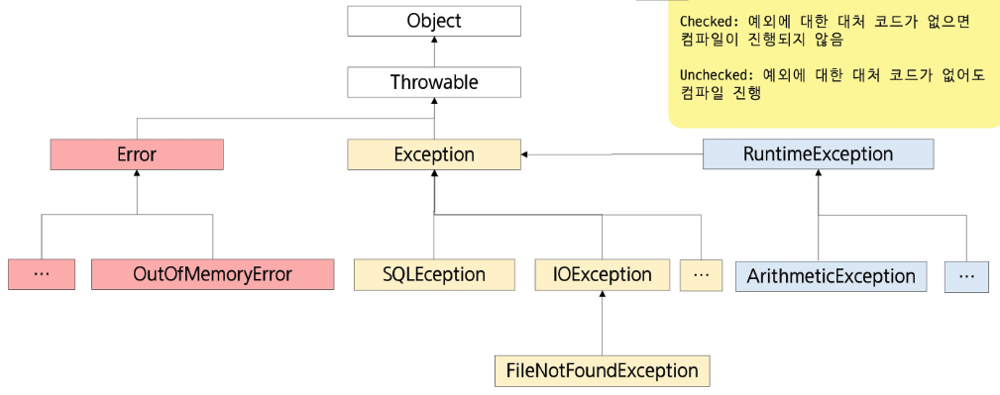
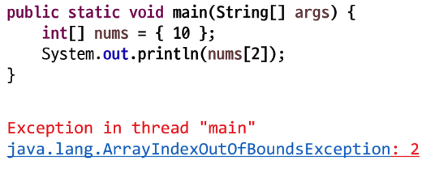
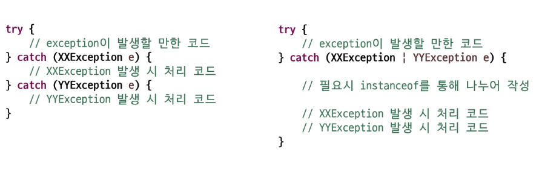
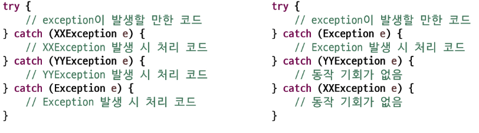
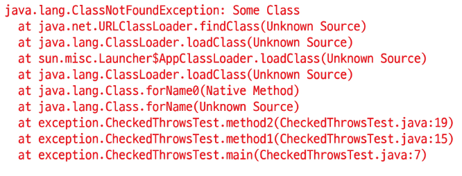
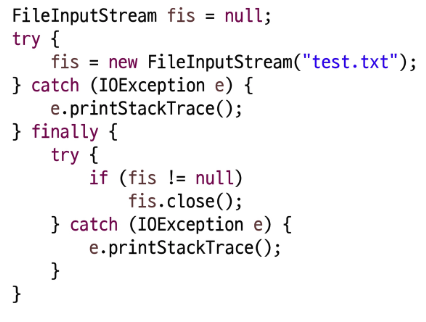
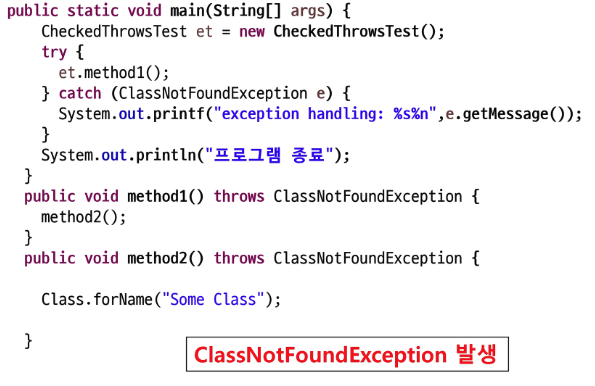
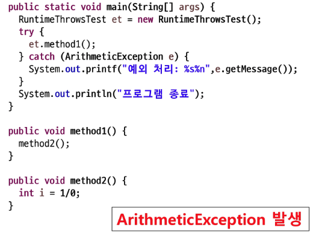
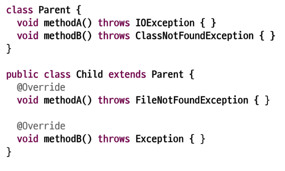
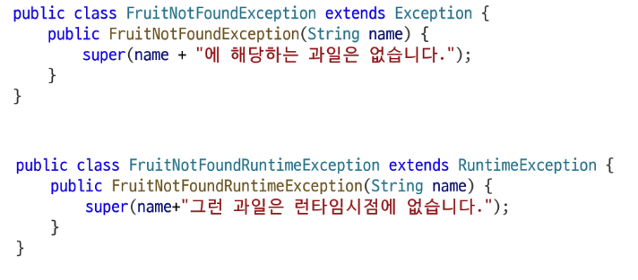

# 예외처리(Exception Handling)

## 프로그램의 오류 (에러, Error)

- **어떤 원인**에 의해 오동작 하거나 비정상적으로 종료되는 경우

## 발생 시점에 따른 구분

| 에러 | 내용 |
| --- | --- |
| 컴파일 에러 (compile-time error) | **컴파일 도중** 컴파일러가 발견하는 오류 |
| 런타임 에러(runtime error) | 컴파일은 성공적으로 진행되었으나, **프로그램 실행 중** 발생하는 오류 |
| 논리적 에러(logical error) | 컴파일도 되고 프로그램도 실행되었으나, **프로그램이 의도대로 동작하지 않는 오류**
프로그램이 정상적으로 실행되고 종료되었지만 **결과가 예상과 다른 경우** |

## 에러와 예외

- **에러(Error):** 발생하면 복구할 수 없는 심각한 오류
    - An Error is a subclass of Throwable that indicates serious problems that a reasonable application should not try to catch.
    - 메모리 부족
    - 스택 오버 플로우
    - …
- **예외(Exception):** 프로그래머가 적절한 코드를 통해 대비할 수 있는 오류
    - An exception is an event, which occurs during the execution of a program, that disrupts the normal flow of the program's instructions.
    - 클래스 형 변환 실패
    - 파일 읽기 실패
    - …

## 예외처리(Exception Handling)

- 예외 발생 시 프로그램의 비 정상 종료를 막고 **정상적인 실행 상태를 유지하는 것**
  *(허락(try)보다 용서(catch)가 쉽다..)*
- 예외의 감지 및 예외 발생 시 **동작할 코드 작성**하고, 사용자에게 적절한 메시지 제공

## 예외 클래스의 계층

> **Checked:** 예외에 대한 대체 코드가 없으면 컴파일이 진행되지 않음
>

> **Unchecked:** 예외에 대한 대체 코드가 없어도 컴파일 진행
>



## 예외의 계열

- RuntimeException 클래스들
    - **프로그래머의 실수**로 발생하는 계열
    - unchecked exception
    - 대체 코드가 없어도 컴파일 문제 x
- Exception 클래스들
    - 사용자의 실수 등 **외적인 요인**에 의해 발생하는 계열
    - checked exception
    - 대처 코드가 없으면 컴파일 진행 x

## 예외 발생 예시



## 예외 처리 키워드

- **직접 처리**
    - `try {}` : 예외가 발생할 가능성이 있는 코드를 포함하는 블록
    - `catch (예외매개변수) {}` : 예외가 발생할 때 실행할 코드 블록
    - `finally {}` : **예외 발생 여부와 상관없이** 항상 실행되는 코드 블록
- **간접 처리**(처리 위임)
    - `throws` : **메서드 선언부에 사용**되며, 메서드에서 발생 가능한 예외를 호출자에게 전달
- **예외를 직접 발생**시킬 때
    - `throw` : 예외를 명시적으로 발생시키는 키워드

## 예외처리(try ~ catch 구문)

- 프로그램 실행 시 발생할 수 있는 **예외에 대한 대비코드 작성**
- 프로그램의 비정상적인 종료를 막고, 정상적인 상태를 유지할 수 있도록 함.

```java
try {
		// 예외가 발생할 수 있는 코드
} catch (SomeException e) {
		// 예외가 발생했을 때 처리할 코드
}
```

- **중괄호(블록) 생략 불가능**
- **중첩** 된 예외처리 : 블록 안에 또 다른 try ~ catch 구문이 올 수 있음

```java
try {
		// (1)예외가 발생할 수 있는 코드
		// (2)정상코드
} catch (SomeException e) {
		// (3)예외가 발생했을 때 처리할 코드
}
// (4)일반코드
```

## 다중 예외처리

- try 블록에서 여러 종류의 예외가 발생할 경우
- 하나의 try 블록에 **여러개의 catch 블록 추가** 가능



## 다중 예외처리 유의 사항

- 예외 객체에 해당하는 catch 문장을 찾을 때는 **다형성이 적용됨**
- 상위 타입의 **예외가 먼저 선언되는 경우** 뒤에 등장하는 catch 블록은 동작할 기회가 없음
- 상속 관계가 없는 경우는 무관
- 상속 관계에서는 작은 범위(자식)에서 큰 범위(조상)순으로 정의



## Exception 인스턴스의 주요 메서드

- `getMessage()` : 발생된 **예외에 대한 구체적인 메시지**를 반환
- `prinStackTrace()` : 예외 발생 **당시의 호출 스택(Call Stack)**을 출력



## finally 구문

- finally는 예외 발생 여부와 상관 없이 언제나 실행

```java
try {
		// 예외가 발생할 가능성이 있는 코드
} catch (SomeException e) {
		// 예외 처리 코드
} finally {
		// 예외 상관없이 항상 수행해야 하는 코드
}
```

- 예외 발생시 → try - catch - finally 순으로 코드 실행
- 예외 미발생시 → try - finally 순으로 코드 실행
- 중간에 **return이 있어도 finally 블록 수행 후 반환  
  *(try & catch 에 둘다 return이 있으면 바깥 코드 실행 x)*

## 자동 자원 반납 구문 (try with resources)

- **자원 등을 반납**할 때 finally에서 `close()` 를 통해 반납을 주로 함
- 코드가 지저분해 지고 다른 예외상황을 발생시킬 수 있음



- `try()` → 괄호 안에 객체를 생성하는 코드를 작성하면, 해당 객체는 `close()` 를 호출하지 않아도 블록을 벗어 나는 순간 `close()` 가 호출됨
- 해당 객체의 클래스가 `AutoCloseable` 이라는 인터페이스를 구현해야 함

```java
try (FileInputStram fis = new FileInputStram("test.txt")){
		// 코드 생략
} catch (IOException e) {
		e.printStackTrace();
}
```

---

# throws 활용

## 메서드에서 예외 **던지기**

- **메서드 선언부**에 `throws` 키워드를 사용하여 예외 작성
- 예외가 여러 개일 경우 **,(Comma)** 를 이용하여 나열
- 메서드가 **예외**를 처리하는 것이 아닌 **전달**
  *→ 몰아서 처리 가능*
- 조상 타입의 예외로 처리 가능

## checked exception 과 throws



## runtime exception 과 throws

- 런타임을 알아서 던짐.



## 메서드 재정의와 throws

- **메서드 재정의 시** 조상클래스 메서드가 던지는 예외보다 **부모 예외를 던질 수 없음**



---

# 사용자 정의 예외 처리

## 사용자 정의 예외

- 기존에 정의된 예외 이외에 **사용자가 직접 정의 예외를 작성할 수 있음**
- 대부분 **Exception 또는 RuntimeException 클래스를 상속받아** 작성
    - checked exception 활용: 명시적 예외 처리 또는 throws 필요   
      (**코드는 복잡**해지지만 처리, 누락 등 오류 발생 가능성은 down)
    - runtime exception 활용: 묵시적 예외 처리 가능  
      (**코드는 간결**해지지만 예외 처리, 누락 가능성 발생)

> 사용자 정의 예외를 사용하면(★)
> - 동일한 상황에서 **예외 객체 재사용**
> - 필요한 **추가 정보**, **기능 활용** 가능
> - throw 를 이용하여 **return을 사용하지 않아도 됨**
>

## 사용자 정의 예외

- 직접 사용자 정의 예외를 작성하여 실습해보자
- 과일 판매 시나리오

