# 파일(File) 클래스

`java.util`

- **파일**(데이터의 집합 정도..) 및 **디렉토리**를 객체로서 관리
- 특정 파일 또는 디렉토리에 대응되는 **객체를 생성**
- 파일 및 디렉토리에 대한 정보를 **관리하고 조작**할 수 있는 **다양한 메서드를 제공**
- 파일 객체의 생성: **경로를 문자열로 전달**, 해당 파일 또는 디렉토리 **경로에 대응되는 객체 생성**

```java
File file = new File("파일 또는 디렉토리의 경로");
```

- 문자열 경로는 **상대 경로** 또는 **절대 경로**를 사용

> 절대 경로 : 시스템에서 파일이나 폴더가 위치한 **전체 경로**  
>상대 경로 : 현재 **작업중인 디렉토리 기준**으로 산정되는 **경로**  
>OS 별로 파일 구분자가 다를 수 있어 `File.separator` 사용 권장
>

## File 클래스의 다양한 메서드

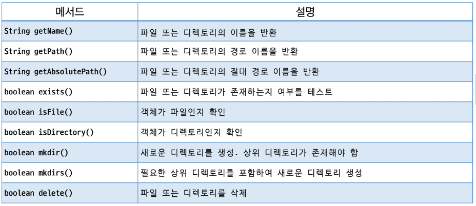

---

# 입출력과 스트림

## 입출력(I/O, Input/Output)

- 데이터의 입력(Input) / 출력(Output)
- 컴퓨터 내부 혹은 외부의 장치와 데이터를 주고 받는 행위

## 스트림(Stream)

- 데이터를 **운반하는데 사용되는 통로**
- 물흐름과 같이 **단방향**으로만 통신 가능
- **하나의 스트림**을 이용하여 입력과 출력 처리 불가능
- 데이터의 방향에 따라 입력 스트림, 출력 스트림으로 나뉨

## 데이터 타입에 따른 스트림의 분류

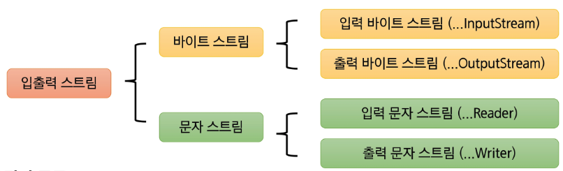

## 스트림의 종류

- 데이터의 타입: **바이트, 문자**
- 데이터의 방향: **입력, 출력**
- 노드의 종류: 표준 입출력, 파일, …
- 스트림의 성격: **노드 스트림** / **보조 스트림**

## 바이트 스트림 (Byte Stream)

- 바이트 단위로 데이터를 입력받거나 출력하기 위한 **스트림 클래스**
- 주로 이진 파일(이미지, 오디오, 비디오, …) 을 읽고 쓰는 데 사용
- 최상위 **추상 클래스**: **InputStram, OutputStream**
- 노드의 종류에 따라 다양한 구체적인 서브 클래스 사용

## InputStream 클래스

- 모든 **바이트 입력 스트림**의 **최상위 추상클래스**
- 바이트 단위로 데이터를 읽기 위한 여러 메서드를 제공
- **입력 소스 → 프로그램** 방향으로 흐름

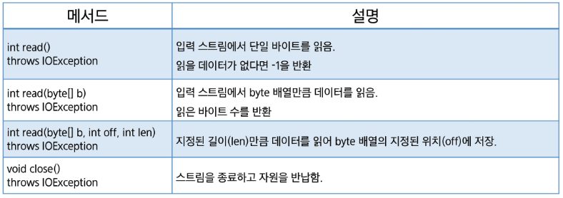

## OutputStream 클래스

- 모든 **바이트 출력 스트림**의 **최상위 추상 클래스**
- 바이트 단위로 데이터를 출력하기 위한 여러 메서드 제공
- **프로그램 → 출력 대상** 방향으로 흐름

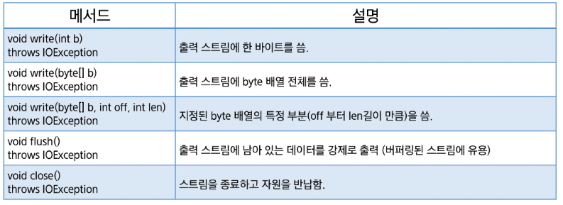

## 문자 스트림 (Character Stream)

- 바이트 스트림과는 달리 **문자 단위(2byte 유니코드)** 단위로 데이터를 처리
- 주로 키보드에서 입력을 받거나 텍스트 파일을 읽고 쓰는 데 사용
- 문자 스트림의 최상위 추상 클래스: Reader, Writer
- FileReader 와 FileWriter가 파일에 텍스트를 읽거나 쓸 때는 **현재 JVM이 돌아가고 있는 시스템**의 기본 **문자 인코딩 방식**을 사용
- 기본 문자 인코딩 확인 : `System.getProperty(”file.encoding”);`

## Reader 클래스

- 자바의 **모든 문자 입력 스트림의 최상위 추상 클래스**
- 문자 단위로 데이터를 입력 받기 위한 다양한 메서드 정의

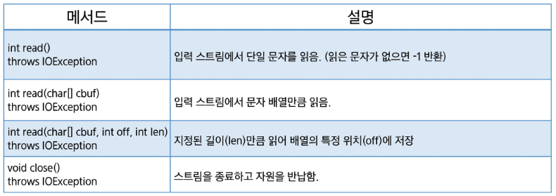

## Writer 클래스

- 자바의 **모든 문자 출력 스트림의 최상위 추상 클래스**
- 문자 단위로 데이터를 출력하기 위한 다양한 메서드 제공

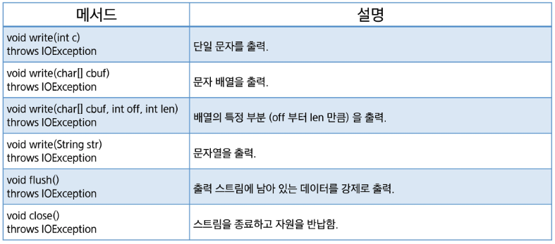

---

# 보조 스트림

## 스트림의 종류 : 노드 스트림, 보조 스트림

## 노드 스트림 (Node Stream)

- 실제 **노드***(파일 / 시스템 표준 / 객체 / …)***에 연결**
- 데이터의 실제 입출력을 담당

## 보조 스트림(Filter Stream)

- 실제 **노드에 연결되지 않음**
- 다른 스트림을 감싸서 **추가적인 기능**(ex: 버퍼링, 데이터 형식 변환, 객체 직렬화) 을 제공
- 여러 보조 스트림을 **체인 형태로 연결**하여 **다양한 기능을 조합**할 수 있음
- 노드 스트림 없이 **단독으로 사용할 수 없음**
- 보조 스트림의 close()를 호출하면 노드 스트림의 close() 까지 호출됨

## 보조 스트림의 종류

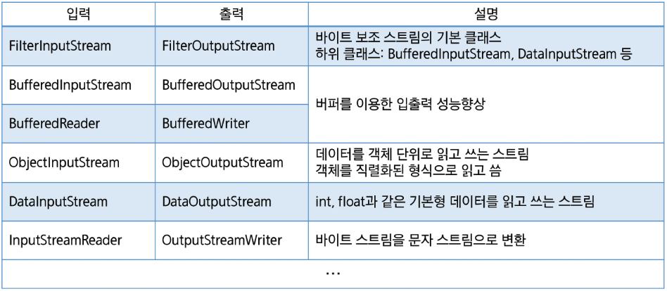

---

# 객체 직렬화

## 직렬화(Serialization)

- 객체의 상태를 **바이트 스트림으로 변환**하여 **저장하거나 전송**할 수 있도록 하는 과정
- **역직렬화** (Deserialization) : 직렬화 된 바이트 스트림을 **다시 객체로 복원**하는 절차
- ObjectOutputStream: 객체를 바이트 스트림으로 변환하는 스트림
- ObjectInputStream: 바이트 스트림을 객체로 복원하는 스트림

*힙 영역에 제대로 정리가 안될 수 도 있다 → 스트림으로 정렬하기 위한 직렬화*

*역으로 스트림을 파일(객체)로 힙 영역에 만들기 → 역직렬화*


## 직렬화 (Serialization) 가능 클래스 만들기

- 객체가 ObjectOutputStream에 의해 **직렬화하기 위해**서는 해당 객체의 클래스가 반드시 **Serializable 인터페이스를 구현**해야 함
- **Serializable 인터페이스:** 메서드를 포함하지 않으며, 직렬화 가능 여부를 표시하는 **마커 인터페이스**
- 해당 인터페이스를 구현한 클래스를 **상속받았다면 구현하지 않아도 됨**
- 자손에만 구현했다면 **조상클래스는 직렬화 되지 않음**
- 직렬화 과정에서 제외하고 싶은 필드는 `transient` **키워드를 통해 직렬화 대상에서 제외**시킬 수 있음
- **serialVersionUID:** 클래스의 **버전 관리**를 위해 serialVersionUID를 명시적으로 선언하는 것을 권장
- 클래스의 변경으로 인한 역질렬화 오류를 방지하는 데 사용

## serialVersionUID

- 직렬화 된 객체를 **역직렬화 할 때**는 직렬화 했을 때와 **같은 클래스를 사용**해야 함
  *(변경/수정이 일어나지 않은 설계도)*
- 따라서 해당 UID를 활용하여 클래스의 변경여부를 파악
- 작성하지 않으면 컴파일러가 **자동으로 생성** (멤버 변경 시 자동 수정 → 위험)
- 따라서 작성하는 것을 권장

---

오프라인

# 파일

- File 클래스
    - 파일 및 디렉토리(폴더)를 객체로써 관리

    ```java
    //문자열로 "경로"를 전달 -> 파일 객체 생성!
    File f = new File("test.txt");
    ```

    - 특정 파일 디렉토리에 대응되는 **객체를 생성**
    - 정보를 관리하고 조작을 수행할 수 있다 (제공된 메서드를 통해서)
- 상대 경로  
  ⇒ 현재 작업 중인 디렉토리(Working Directory)를 기준으로 경로
    - 현재 위치 `.`
    - 상위 폴더 `..`
    - Q. 부모 디렉토리에 있는 `cat.jpg` 파일을 접근… → `../cat.jpg`
- 절대 경로  
  ⇒ 시스템 상의 파일 폴더가 위치해 있는 전체 경로

```java
C:\Users\SSAFY\cat.png
```

- File 클래스의 다양한 메서드

  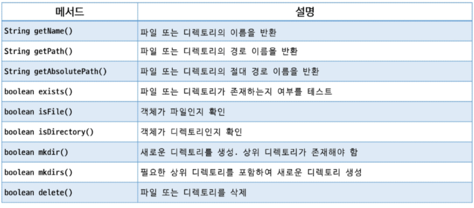

  암기 필요 X

    ```java
    package 오프라인_수업;
    
    import java.io.File;
    
    public class FileTest {
    	public static void main(String[] args) {
    		// File 클래스 : 파일 또는 디렉토리를 관리하기 위한 클래스
    		File f = new File("cat.jpg"); // 상대 경로
    		System.out.println(f.exists()); // 파일이 존재하면 true (아니면 false)
    		
    		System.out.println(f.isFile()); // 파일 입니까?
    		System.out.println(f.isDirectory()); // 디렉토리 입니까?
    		System.out.println(f.isAbsolute()); // 절대경로 입니까?
    		System.out.println(f.getAbsolutePath()); // 절대경로 반환
    		
    		
    		System.out.println("==============================================================");
    		File bin = new File("bin");
    		
    		System.out.println(bin.isDirectory());
    		System.out.println(bin.exists());
    		
    		System.out.println("==============================================================");
    		// 없는 폴더를 지정
    		File folder = new File("static/2025/07/31"); // 현업에서도 이럼 -> 검색, 색인 속도 향상을 위해
    		System.out.println(folder.exists());
    		
    		// 폴더 생성 mkdir vs mkdirs
    //		System.out.println(folder.mkdir()); // 부모 디렉토리가 있는 경우에만 생성
    		System.out.println(folder.mkdirs());
    	}
    }
    
    ```


# 입출력과 스트림

- 입출력(I/O, Input / Output)
    - 데이터 입력 = input, 출력 = output
    - 컴퓨터에 있는 장치 (+외부장치)를 통해서 데이터를 주고 받는 것
- 스트림(Stream)
    - 데이터가 단방향으로 흘러가는 구조(통로)  
      → 입력: 입력스트림을 통해 입력이라는 행위만 가능!  
      → 출력: 출력스트림을 통해 출력이라는 행위만 가능!

  → 입출력 다하고 싶은데? 동시에 하고 싶다?

  ⇒ 입력스트림 + 출력스트림 별도로 만들어서 처리!


이러한 데이터 스트림을 Java에서는 다루게 되는 데이터 타입에 따라 분류!


- 입출력 단위 byte(1byte = 8bit) : 바이트 스트림 `InputStream` , `OutputStream`
- //           char(2bytes)           : 문자 스트림               `Reader` , `Writer`

TIP.📝 아래의 코드가 무엇인지를 파악 (오늘 핵심 키워드)

```java
//	                            Reader     <----- 중계역할 <----     InputStream
//	                                     InputStreamReader(보조스트림)
//                           char(2bytes)    <--------------        byte(1bytes)           
/* BufferedReader br = */ new BufferedReader(new InputStreamReader(System.in));

/* BufferedWriter bw = */ new BufferedWriter(new OutputStreamWriter(System.out));
```

## 바이트 스트림(byte Stream)

→ 바이트 단위로 입출력을 하기 위한 스트림 클래스

- 기본입출력 (System.in, System.out)
- 이진 파일 (이미지, 오디오, 비디오) 읽고 쓰기 사용

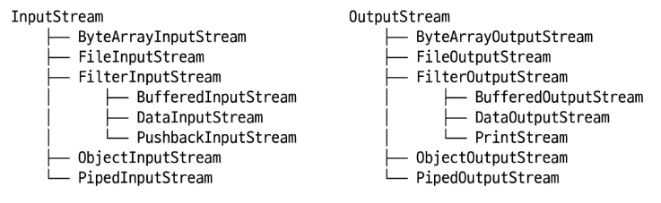

암기 불필요! (File-과 Object- 정도??? 사용할 듯?)

## 문자 스트림

→ 문자 단위 (char, 2byte 유니코드 체계)로  데이터를 처리하는 스트림

- 주로 키보드 입력을 통해 받은 데이터 처리 + 텍스트 파일 입출력 처리

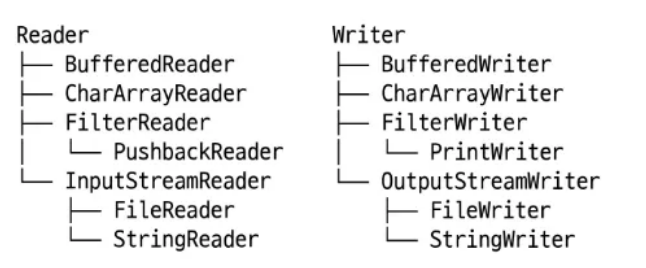

## 보조 스트림

- 다른 스트림을 감싸서 추가적인 기능을 수행하기 위한 보조 역할
- 노드 스트림 없이 **단독 사용이 불가능!**
- 보조 스트림이 닫히면 `close()` 자동으로 노드 스트림도 `close()` 가 된다!
- InputStream + Reader → `InputStreamReader`
- OutputStream + Writer → `OutputStreaWriter`

## 버퍼(buffer)

데이터를 한 곳에서 다른 곳으로 전달할 때에  
일시적으로 데이터를 저장하는 임시 메모리 영역

→ 여러 개의 문자열을 한꺼번에 받아서 처리를 수행할 수 있게 도와준다..!

- 버퍼 + 문자열 스트림 - Buffer + Reader ⇒ `BufferedReader`  
  글자들을 한번에 받아서 개행 단위(\n)로 처리할 수 있다!  
  (기본: 임시 메모리 공간 8192 chars… = 16384bytes)  
    - 메서드 종류…
        - readLine() : 개행(\n 문자) 단위로 입력값을 문자열로 반환 메서드

> 저희가 이걸 지금 당장 어디에 쓰죠? → 파일 읽고 써서… 뭐라도 할 수 있나?
→ 우리가 CD 게임처럼 세이브/로드 하듯 우리의 객체(Object)도 “파일화”가 가능!”
>

# 객체 직렬화 (Serialization)

- 직렬화 = 객체의 상태를 바이트 스트림으로 변환하여 전송하거나 저장할 수 있도록 하는 과정
    - 역직렬화 (Deserialization) : 직렬화된 바이트 스트림을 다시 객체로도 복원하는 절차

  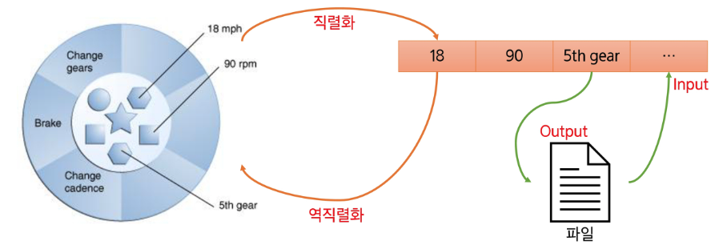

- Object + OutputStream = ObjectOutputStream : 객체 → 바이트 스트림으로 변환하는 스트림
- Object + InputStream = ObjectInputStream : 바이트 스트림 → 객체로 복원하는 스트림

- 직렬화 가능 (변환할 클래스를 **직렬화 가능** 상태!)

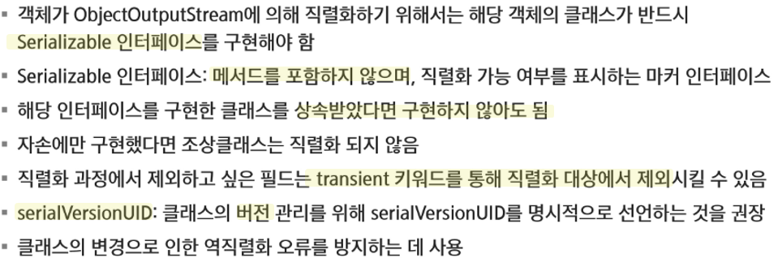

- **serialVersionUID**
  직렬화된 객체를 역직렬화할 때에 직렬화 했을 때와 같은 클래스를 사용해야 한다.  
  → 해당 UID를 활용해서 클래스가 변경 여부를 파악!  
    - 명시적으로 작성하지 않으면, 컴파일러가 자동 생성! (멤버 필드, 메서드, 활용제한자!)

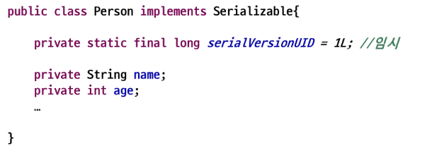

이미 필드 선언이 long 타입이므로 1L에서 L 안써도 되나, 쓰는 것을 추천 …