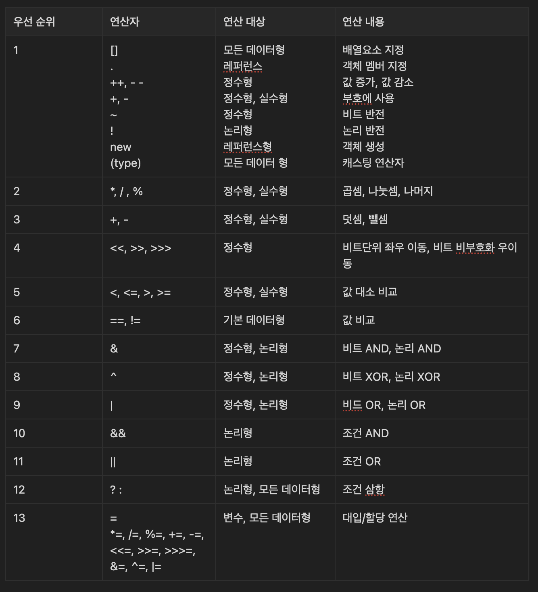

# Java

## Java 기초

### 자바 프로그램의 구조

1. **클래스 선언**  
   프로그램의 틀을 만드는 단계
2. **main() 메서드**  
   프로그램이 시작되는 지점
3. **실행될 코드**  
   실제로 동작하는 명령들

```java
// 1. 클래스 선언
public class MyFirstProgram {
    // 2. main() 메서드
    public static void main(String[] args) {
            // 3. 실행될 코드
            System.out.println("안녕하세요. 자바!);
    }
}
```

**클래스 선언:** “MyfirstProgram”이라는 이름의 클래스를 만듭니다.  
* public = 공개적으로 사용 가능
* class = 클래스를 만들겠다는 선언*

> Java 언어의 특징 ⇒ 모든 단위가 “클래스”로 설계가 되어 있어야 한다.

**main() 메서드:** 프로그램의 시작점입니다. 자바는 항상 main 메서드부터 실행을 시작합니다!

**출력 명령:** 화면에 메시지를 보여줍니다. 큰따옴표 안의 내용이 그대로 출력됩니다.
* `System.out` ⇒ 표준 출력
* `System.in` ⇒ 표준 입력*

>💡 main 메서드는 자바 프로그램의 **출입구**  
자바가상머신(JVM)이 프로그램을 실행할 때 가장 먼저 찾는 곳!

### 변수란?

변수는 데이터가 살고 있는 집 주소입니다.

**특징**

- 이름으로 구분
- 값을 담는다
- 값 수정
- 타입 지정

**변수 선언**

>- 자료형 변수명; (선언)  
>- 변수명 = 값; (할당)
>- 자료형 변수명 = 값; (초기화)


**변수 작명 규칙**
 
>1. 알파벳 문자와 숫자, ‘$’, ‘_’ 로 이루어진다. (한글이름도 가능은 함)  
>2. 중간에 공백 X
>3. 첫번째 문자는 반드시 알파벳, ‘$’, ‘_’로 시작
>4. 대/소문자 구별
>5. 자바 언어 키워드 사용 X


### **데이터 타입(Data Type)**

- **Primitive Data Type (기초형)**
    - **정수형 데이터 타입**   
      `byte` ⇒ -128 ~ 127  
      `int` ⇒ -2,147,483,648 ~ 2,147,483,647  
      `long` ⇒ 64비트 정수, L 접미사 필요
    - **실수형 데이터 타입**  
      `double` ⇒ 64비트 실수
    - **문자형 데이터 타입**  
      `char` ⇒ 한글 문자도 가능
    - **논리형 데이터 타입**  
      `boolean` ⇒ true 또는 false
    - **여러 변수 동시 선언**  
      `int korean = 90, english = 85;` ⇒ 같은 타입의 여러 변수 선언
- Reference Data Type (참조형)
    - **문자열**  
      `String name = “홍길동”;`
    - **배열**  
      `int[] score = new int[3];  
      score[0] = 90;  
      score[1] = 80;  
      score[2] = 70;

  String[] hobby = new String[] {”등산”, “게임”, “독서”};`

### **연산자**


### **조건문 (Conditional)**

**boolean 데이터 타입**: 요직 두 가지 값만 가질 수 있는 특별한 타입

if

if-else

else if

*추후 과정에서*

### 반복문

*추후 과정에서*