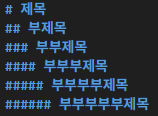
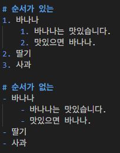
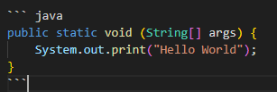
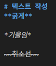

# Markdown


: 일반 텍스트로 문서를 작성하는 간단한 방법  
주로 개발자들이 텍스트와 코드를 작성해 문서화하기 위해 사용

→ Markup 언어와 동일하게 태그 방식을 갖추고 있다.  
→ 개발 업계 표준 문서 작성 포맷

## 특징

- 작성된 Markdown 문서는 다른 프로그램에 의해 변환되어 출력됨

>💡 공식문서 : https://www.markdownguide.org/basic-syntax/


### Heading

- 문서의 단계별 제목으로 사용
- #의 개수에 따라 제목의 수준을 구별



### 리스트

- 목록을 표시하기 위해 사용
- 순서가 있는 리스트와 순서가 없는 리스트 제공
    - 순서 있는 : 1. / 2. / (공백)
    - 순서 없는 : - / (공백) -



### Code block & Inline code block

- 일반 텍스트와 달리 해당 프로그래밍 언어에 맞춰서 텍스트 스타일을 변환
    - (```)

  


### 링크(Link) & 이미지(Image)

- 특정 주소를 사용해 다른 페이지로 이동하는 링크 혹은 이미지를 출력
- 이미지의 너비와 높이는 마크다운으로 조절할 수 없음(HTML 필요/dark magic)

### 텍스트 관련 문법

- **굵게**(**) *기울임*(*) ~~취소선~~(~~)
- 문단을 나누려면 개행(띄어쓰기 두번) 후 개행



- 체크박스(-[ ], -[x])

### 수평선

- 단락을 구분할 때 사용하는 수평선
- '-' (hypen)을 3개 이상 적으면 작동

## 마크다운 작성을 도와주는 마크다운 에디터

- Typora
- MarkText
- Markdown all in one