# 냠냠코치 (Yum Yum Coach)

---

### 팀원

- 박지우, 정세호

---

# 🥗 프로젝트 소개

**냠냠코치**는 사용자의 건강한 식단 관리를 돕는 웹 애플리케이션입니다. 본 프로젝트는 HTML5, CSS3, JavaScript의 핵심 문법을 이해하고, 반응형 UI 구축 및 동적 기능 구현을 목표로 개발되었습니다.

사용자는 **식품의약품안전처**에서 제공하는 음식 영양성분 DB를 활용해 매일의 식단을 간편하게 기록하고, 섭취한 영양소를 바탕으로 개인화된 분석 및 조언을 제공받을 수 있습니다. 또한, 커뮤니티와 챌린지 기능을 통해 사용자들이 즐겁게 건강 관리 목표를 달성하고 유지할 수 있도록 돕습니다.

모든 사용자 데이터는 백엔드 서버 없이 **브라우저의 로컬 스토리지(Local Storage)**를 사용하여 안전하게 저장 및 관리됩니다.

---

# ✨ 주요 기능

프로젝트 요구사항 명세서에 따라 **기본(필수)**, **추가**, **심화** 기능으로 나누어 개발했습니다.

### 1. 기본 기능 (필수)

- **회원 관리 (로컬 스토리지 기반)**

  - 회원가입 시 사용자의 프로필 정보(키, 몸무게, 질환 등)를 로컬 스토리지에 저장합니다.
  - 로그인 시 저장된 정보와 비교하여 인증을 수행하고, 로그인 상태를 유지합니다.
  - 회원 정보를 조회, 수정, 삭제하는 기능을 제공합니다.

- **식단 기록 및 관리**

  - `food_db.json`에 기반한 음식 검색 기능을 통해 간편하게 식단을 기록(작성)할 수 있습니다.
  - 기록된 식단을 조회, 수정, 삭제할 수 있습니다.
  - 입력된 식단을 기반으로 영양 정보를 분석하여 결과를 제공합니다.

- **대시보드**
  - 오늘 섭취한 칼로리와 목표 칼로리를 비교하여 보여줍니다.
  - 일일 단백질, 탄수화물, 지방 섭취 현황을 시각화하여 제공합니다.
  - Chart.js를 활용하여 최근 7일간의 영양소 섭취 통계를 그래프로 제공합니다.
  - 최근 식단 기록을 목록 형태로 보여주며, 수정 및 삭제가 가능합니다.

### 2. 추가 기능

- **챌린지**

  - 칼로리, 단백질 등 특정 영양소 섭취 목표를 설정하여 자신만의 챌린지를 생성할 수 있습니다.
  - 식단 기록 시, 관련된 챌린지의 진행률이 자동으로 업데이트됩니다.
  - 생성된 챌린지를 삭제할 수 있습니다.

- **커뮤니티**
  - 자유롭게 게시글을 작성하고, 다른 사용자의 글을 조회할 수 있습니다.
  - 본인이 작성한 게시글은 수정 및 삭제가 가능합니다.
  - 게시글 상세 페이지에서 댓글을 작성하고, 본인의 댓글을 삭제할 수 있습니다.
  - 다른 회원을 팔로우/팔로잉하는 기능을 제공합니다.

### 3. 심화 기능

- **AI 코치**
  - 사용자의 프로필 정보(키, 몸무게, 나이)와 식단 기록을 바탕으로 개인화된 조언을 생성합니다.
  - BMI 지수, 연령대별 평균 칼로리 섭취량, 식단 다양성 등을 분석하여 제공합니다.

---

# 📁 프로젝트 구조

```
냠냠코치/
├── css/
│   └── style.css           # 전역 스타일 시트
├── js/
│   ├── auth.js             # 인증 및 로그인 상태 관리
│   └── dataManager.js      # 로컬 스토리지를 이용한 데이터 관리
├── data/
│   ├── challenges.json     # 챌린지 초기 데이터
│   ├── community.json      # 커뮤니티 초기 데이터
│   ├── diet-data.json      # 식단 초기 데이터
│   ├── food_db.json        # 음식 영양 정보 DB
│   └── yumyum_coach_stats.json # AI 코치용 통계 데이터
├── index.html              # 서비스 소개 랜딩 페이지
├── dashboard.html          # 메인 대시보드
├── login.html              # 로그인 페이지
├── signup.html             # 회원가입 페이지
├── profile.html            # 프로필 수정 페이지
├── meal_log.html           # 식단 기록/수정 페이지
├── challenge.html          # 챌린지 페이지
├── community.html          # 커뮤니티 목록 페이지
├── post-detail.html        # 커뮤니티 상세 페이지
└── ai_coach.html           # AI 코치 페이지
```

---

# 🛠️ 주요 기술 스택

- HTML
- CSS
- JavaScript
- Bootstrap 5
- Chart.js

---

# 🚀 화면 구현

## 필수 구현

### 식단

**작성**
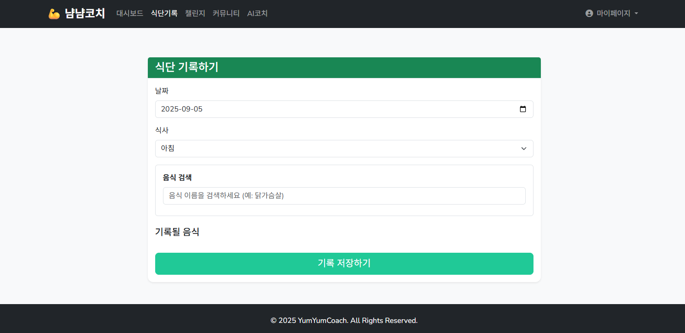

**조회/삭제**
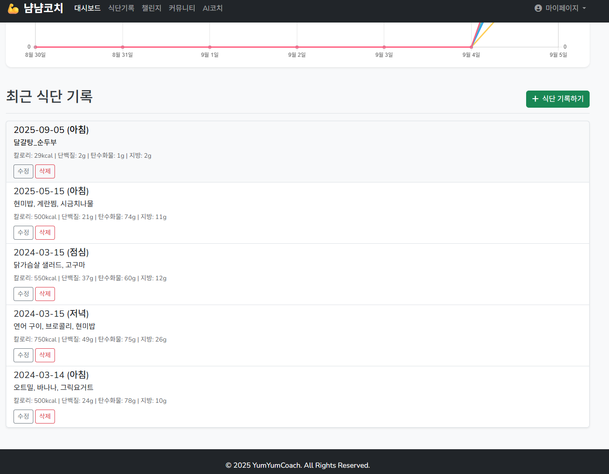

**수정**
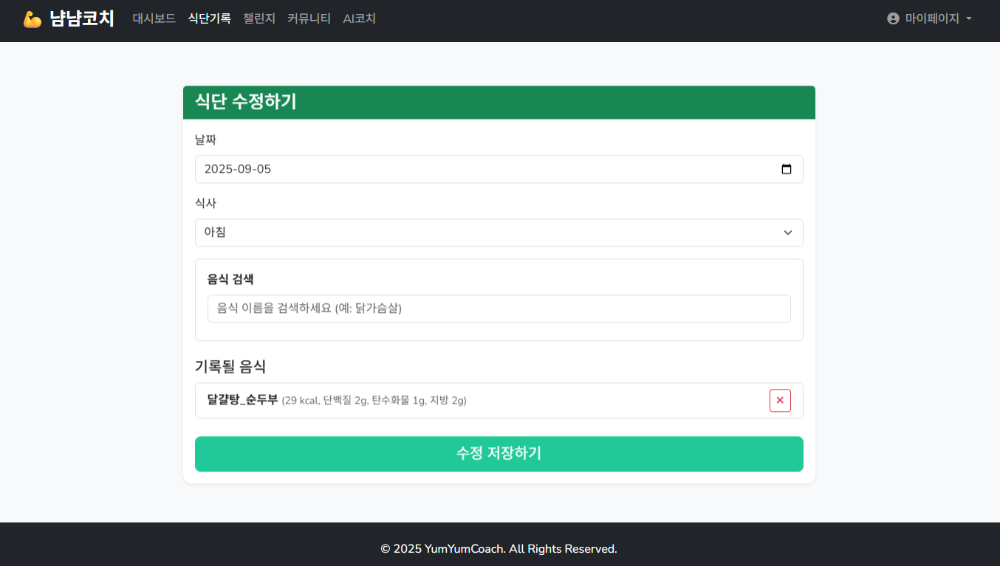

### 회원

**작성**
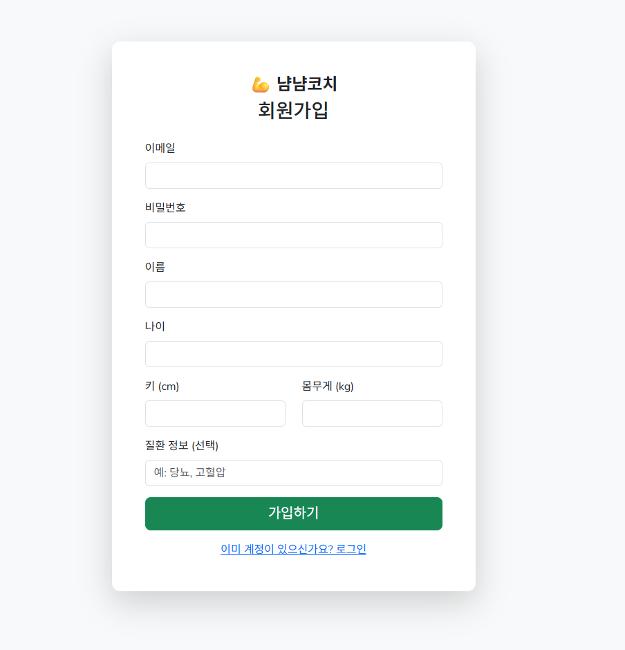

**로그인**
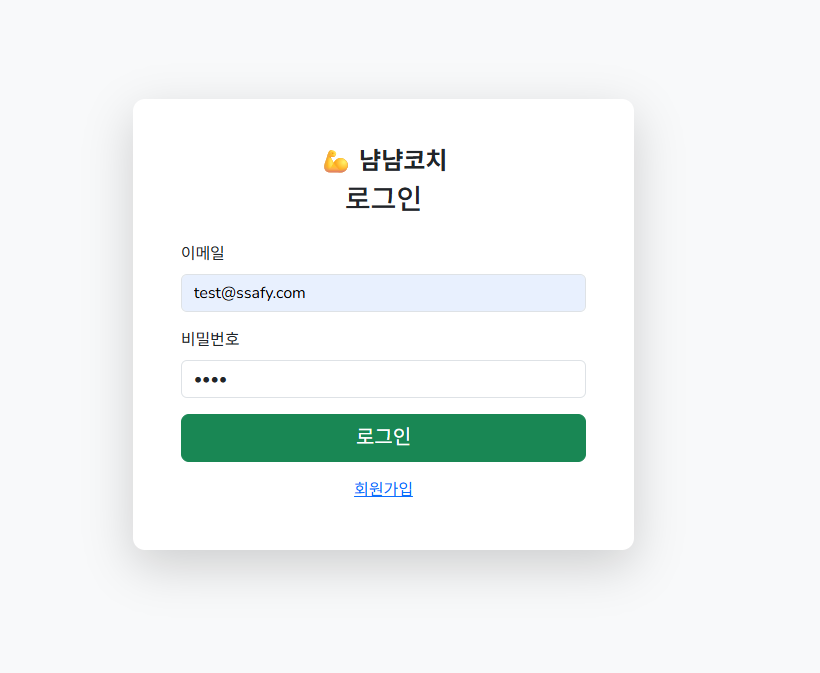

**조회/로그아웃**
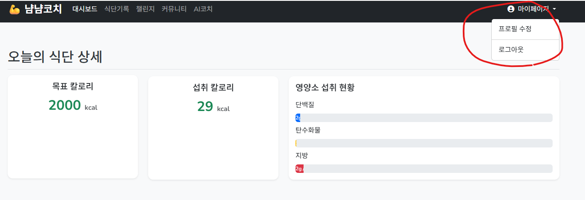

**수정**
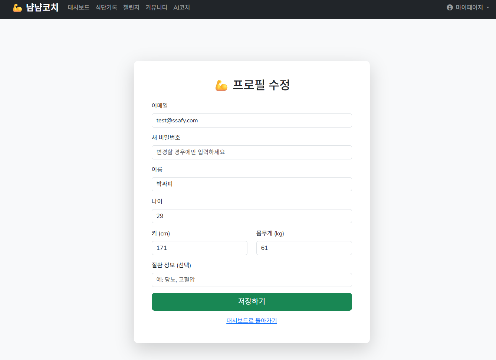

## 추가 구현

### 챌린지 정보 관리

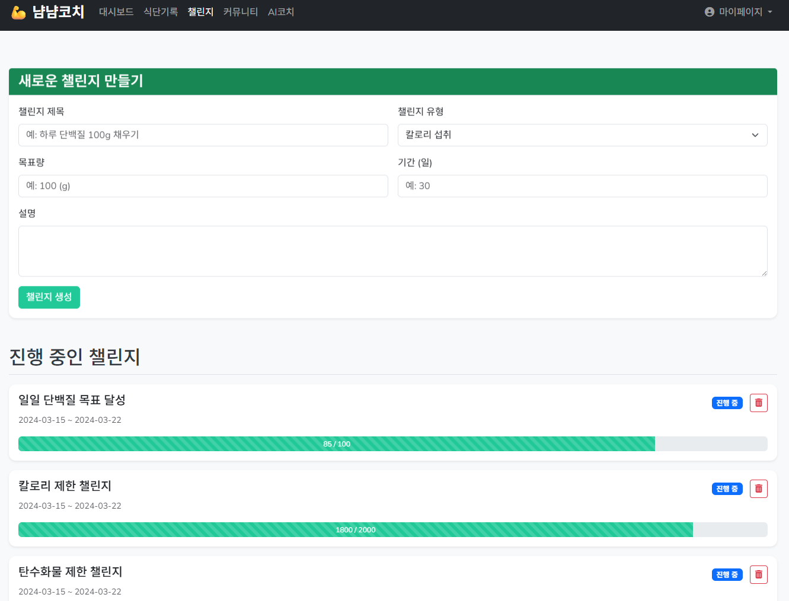

### 게시판/댓글

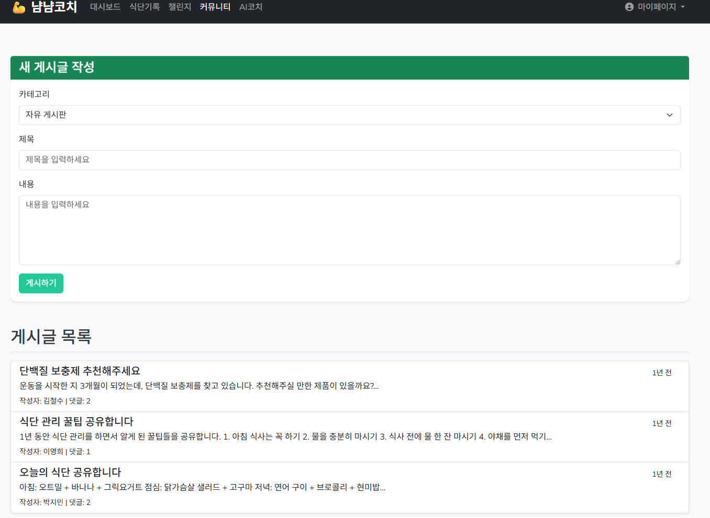
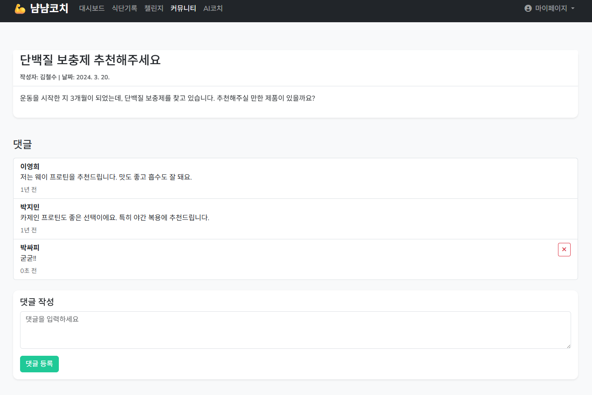

## 심화 구현

### AI코칭

## 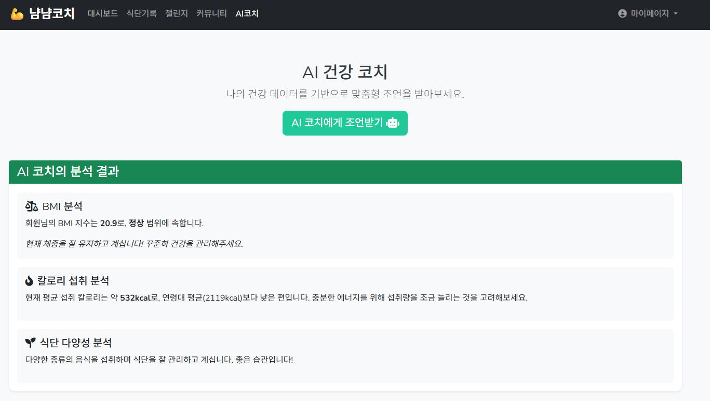

# AI 활용

**주요 프롬프트 유형 및 상호작용 방식:**

1.  초기 분석 및 명세 요청:
    프로젝트의 초기 파일 구조를 제공하고, 전반적인 분석과 명세 작성을 요청
    상호작용: 프로젝트의 전체 구조와 데이터 모델을 파악하고, 이를 바탕으로 개선 방향을 제안

2.  기능 단위의 점진적 개발 요청:
    "식단 수정 기능 넣어줘", "AI 코치 기능도 넣어줄 수 있어?" 와 같이 특정 기능 구현을 명확하게 요청
    상호작용: 요청사항을 세부적인 작업 계획으로 나누어 제안

3.  대규모 리팩토링 및 구조 변경 요청:
    "로컬스토리지 저장에서 파일저장 방식으로 전환 해보자" 또는 "index.html을 랜딩페이지로 만들고 로그인 기능을 추가해줘" 와 같이 프로젝트의 구조를 근본적으로 변경하는 대규모 작업을 요청
    상호작용: 기술적 제약(파일 시스템 접근 불가)을 설명, 복잡한 계획을 단계별로 나누어 제안.

4.  오류 보고 및 수정 요청:
    "댓글 작성 후 삭제가 안돼", "회원가입 창에 중복된 코드가 생긴것같아" 와 같이 발생한 문제와 오류를 구체적으로 알려줌.
    상호작용: 명확한 오류 보고로 원인을 빠르게 파악하고 코드를 수정

---

# 💡 느낀점

- **박지우**: Bootstrap을 사용하면서 기존에 사용했던 CSS를 일일이 작업했던 과거를 잊어버리게 됐습니다. 사실 잊진않았고 더 편리한 방법을 알게되어 기쁩니다. 편리하지만 그만큼 더 조심히 써야하고 더 많이 공부해야하는 것 같습니다. 특히 프레임워크의 특성상 계속해서 업데이트 되는 기능이 있기 때문에 꾸준한 버전 공부가 필요하다고 생각합니다.

- **정세호**: 오늘 AI 를 활용하여 바이브 코딩을 해봤는데 신기하면서도 내가 원하는대로 잘 작동되지 않는 것을 보니까 AI도 사용자가 어떻게 사용하는지에 따라 결과물이 달라질 수 있다는 것을 느꼈습니다. 평소 AI를 공부하는 것에 소극적인 생각이였는데 오늘 이후로는 좀더 AI에 대해 알아보고 공부해야 겠다라는 것을 느꼈습니다.
