# HTML

: Hyper Text Markup Language

- **Hyper Text:** 참조를 통해 한 문서에서 다른 문서로 즉시 접근 할 수 있는 텍스트
- **Markup Language:** **태그(tag)** 등을 이용하여 문서나 데이터의 구조를 정의하는 언어
- HTML은 마크업 언어이지만 **프로그래밍 언어는 아님**  
  → 프로그래밍적 로직과 흐름 제어가 없다

⇒ **웹 페이지를 작성(구조화)하기 위한 언어**

- 콘텐츠와 구조를 정의
- 브라우저에게 구조화된 콘텐츠를 전달하는 역할

---

# HTML 구성요소

- HTML의 요소(Element)는 태그(Tag)와 내용(Contents)으로 구성

```html
<!-- (여는/시작) 태그       (닫는/종료) 태그 -->
            <h1> EDUSSAFY </h1>
<!--   		내용(content)           -->
```

- **시작태그 / 종료태그** 로 쌍을 이루어야 함 (순서 꼬이면 X)
- 내용이 없으면 열고 **바로 닫는 형태로 작성할 수 있음** 예) `<hr/><br/>`
- 태그는 대/소문자를 구분하지 않음  
  → 소문자로 쓰는 것이 관례

## 요소와 태그

- **요소는 중첩(nested)** 될 수 있음

  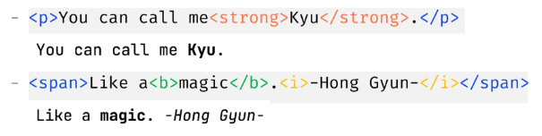

- 닫는 태그의 생략 - (빈 요소, Self-closing Tag)

  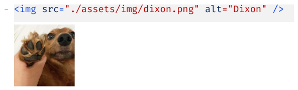


## 속성(attribute)(★★★★★)

- 속성(attribute) : **태그에 추가적인 정보를 제공**하는 역할

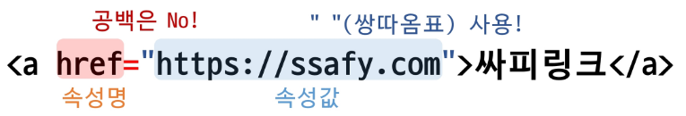

- 요소의 **여는 태그에 작성**하며 `속성명="속성값"` 형태로 작성  
  → 웬만하면 공백 no
- 일부 속성은 값 없이 선언만으로 사용 가능(readonly, selected, 등)
- **요소**는 **속성**을 가질 수 있으며, 경로나 크기와 같은 추가 정보를 제공
- 필요시 **여러 개의 속성 작성 가능**
- 각 태그별로 사용할 수 있는 속성이 다름
    - `<a>` : href (링크 URL), target, rel, ping, …
    - `` : src (이미지 URL), alt (대체 텍스트), width (너비), height (높이), …
- 태그와 **상관없이 사용 가능한 속성**(**공통 속성**, HTML Global Attribute) (★★★)
    - `id` : 문서 전체에서 **유일한 고유 식별자**를 지정하기 위한 속성  
      → 1개
    - `class` : 여러 태그에 **공통적인 특성**을 부여하기 위한 속성  
      → 여러 개
    - `style` : **인라인 스타일을 부여**하기 위한 속성
    - …

## (정리) 요소와 태그 및 속성

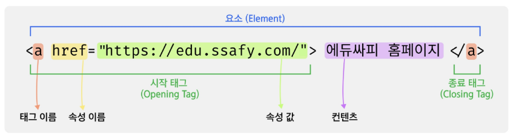

- 요소(Element) : HTML 문서를 구성하는 **기본 단위**, 태그와 그 안의 내용(Contents)로 구성
- 태그(Tag) : 시작 태그와 종료 태그, HTML 요소를 감싸는 **꺽쇠 괄호(<>)로** 이루어진 마크업 기호
- 속성(Attribute) : HTML 태그에 추가 정보를 제공하는 **키-값 쌍의 형태**

## 기본 구조

- `<html></html>`
    - HTML **최상위 요소**로 페이지 전체의 컨텐츠를 감싸는 루트(root) 요소
    - 문서내에서 사용할 **문자코드를 lang속성에 지정**
- `<head></head>`
    - HTML 문서에 표현하고 싶은 구성 요소 외의 재료들을 담고 있는 공간
    - 페이지 이름, CSS, favicon등을 작성
    - 브라우저 화면에 출력되지 않음
- `<body></body>`
    - 브라우저 화면에 나타나는 정보로 HTML 문서에 보여줄 모든 요소를 작성하는 공간
- `<!DOCTYPE>`
    - 웹 브라우저에서 HTML 문서가 **표준 방식(HTML5)으로 해석되도록 알려줌**
    - **미 작성시** 동작할 수 도 있지만 제대로 보이지 않을 수 도 있음
- `<meta>`
    - 문서의 작성자, 날짜 등 화면에 출력되지 않는 일반 정보들
    - `charset = "utf-8"` : HTML문서가 사용할 문서형태 지정
    - `name="viewport" content-sidth="device-width"`  
      : HTML 문서에 너비를 보장해주어 흘러 넘치지 않게 함   
      - `<title></title>`  
      - HTML 문서의 제목으로 브라우저 탭에 표시됨

## 주석

- 주석의 내용은 **브라우저에 출력되지 않음**(개발자 도구창을 통해 확인 가능)
- HTML Tag의 내용을 설명하기 위한 용도로 사용
- `<!-- HTML 주석 내용 -->`

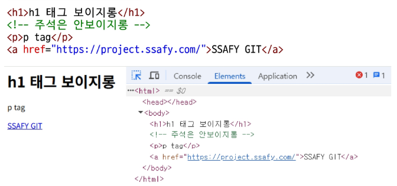

## 특수문자

- HTML 문서 안에서는 `<,>,&,` 같은 특정 문자가 태그 등 특별한 의미를 가지므로, 해당 문자들이 보이지 않을 수 있음
- 미리 약속한 특별한 기호로 바꾸어 작성 (HTML Entity 사용)
- 공백 (white space)는 개수와 상관 없이 공백 하나로 인정

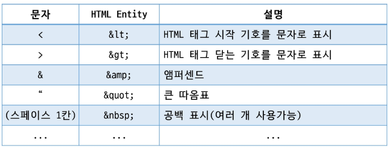

## (참고) Whitespace Collapsing

- HTML문서에서 space, tab, enter(줄 바꿈)가 여러 개 있더라도 **하나의 공백으로 처리**하는 것
- 목적
    - **성능적인 측면:** 브라우저가 자동으로 공백을 하나로 줄여 HTML 문서를 **더 효율적으로 해석** 가능케 함
    - **일관된 렌더링 보장:** HTML 문서에 대한 표준화된 처리 방식을 통해 **다양한 환경에서 동일한 결과**를 보장
    - **가독성과 유지보수성 향상:** 개발자가 자유롭게 들여쓰기와 줄 바꿈을 사용할 수 있도록 하여 코드가 과도하게 복잡해지는 것을 방지

## DOM (Document Object Model) 트리

- HTML 문서를 브라우저에 렌더링 하기 위한 구조
- 계층적 구조(부모-자식)로 문서를 표현하여 요소 관계가 명확
    - 조상관계: ancestor
    - 자손관계: descendant
    - 부모관계: parent children
    - 형제관계: sibling
- 모든 **HTML 요소, 속성, 텍스트**는 각각 **하나의 노드로 취급**
- 부모/자식/형제 요소를 쉽게 탐색 가능
- 동적으로 요소를 **추가, 수정, 삭제하기 용이**
- 문서의 렌더링을 할 때 효율적인 처리

## HTML 코드 예시

- <body> 태그에 보여줄 내용을 작성
- h1 : 제목을 나타내는 태그 (h1~h6)
- p : 문단을 나타내는 태그
- span : 문장 내에 일부 구문을 위한 컨테이너
- a : 다른 웹 페이지로 이동하는 링크

## 블록 요소 vs 인라인 요소

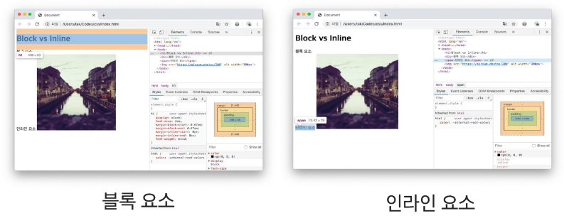

- **블록 요소 (Block Elements)**
    - 항상 **새로운 줄에서 시작**
    - **너비가 100%** 가득 참 (부모 요소 기준)
    - 높이와 너비, 바깥 여백(margin), 안쪽 여백(padding)의 **상하좌우 값 설정 가능**
    - 의미론적 역할: 문서의 구조를 구성하여 독립적인 콘텐츠 단위를 표현
- **인라인 요소 (Inline Elements)**
    - **줄 바꿈 없이 같은 줄**에서 시작
    - **컨텐츠 크기 만큼만 공간 차지** (높이와 너비 값을 직접 지정 X)
    - 바깥 여백(margin), 안쪽 여백(padding)에 대해서는 **좌우만 적용**
    - 의미론적 역할: 문장 내에 일부나 텍스트 강조 등 작은 단위의 의미를 전달하는 데 사용

## Block Content

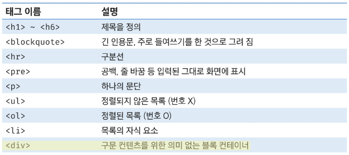

## Inline Text Content

→ CSS로 컨트롤 가능

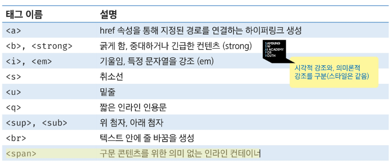

## image & multimedia

- 멀티미디어를 웹페이지에서 활용할 수 있도록 해주는 태그
- (참고) 기본적으로 인라인 수준(inline-level) 요소이나 브라우저나 속성에 따라 **inline-block로 지정  
  →** 사진을 누르면 링크를 타고 ? ⇒ `<a>`태그 안에 넣자

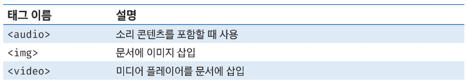

## Table Content

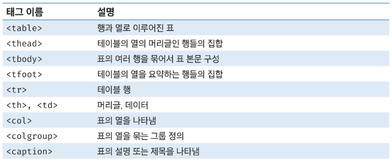

---

# Semantic 태그

## Semantic Tag

- **의미론적 요소를 담은 태그** (HTML5에서 도입된 콘텐츠의 의미를 명확히 설명하는 태그)
- 의미전달 이상으로 다양한 분야(SEO, Screen Reader)에서 활용

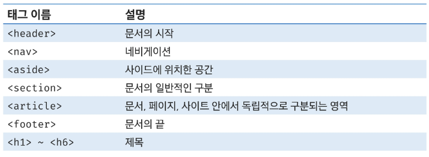

- 시멘트 태그를 사용함으로써 **콘텐츠**의 **의미와 구조**를 명확하게 해줌
- 검색엔진 최적화(SEO)
    - 검색엔진이 웹페이지 구조를 더 잘 이해
    - **검색 결과 순위 향상**에 도움
- 웹 접근성 향상
    - 스크린리더가 콘텐츠 구조를 더 정확히 해석
    - **장애인 사용자의 웹 이용 편의성 증대**
- 코드 가독성 향상
    - 개발자간 **코드 의도 파악이 용이**
    - **유지보수 효율성 증가**
- 상황에 따라서 non-semantic 태그를 활용하는 경우도 존재
1. Semantic Tag를 적극적으로 활용하는 케이스

   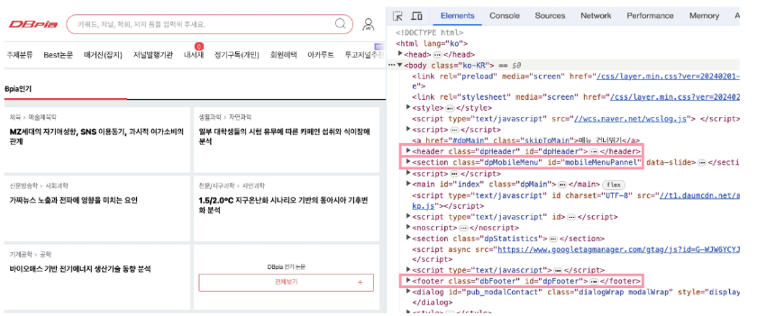

2. non-semantic, id와 class 속성으로 Semantic Tag를 대신하는 케이스

   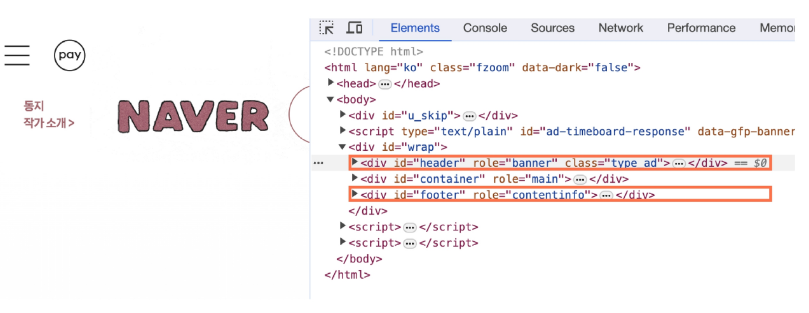


## (참고) 검색엔진 최적화(SEO)

- Search Engine Optimization
- 웹사이트가 검색엔진에서 더 잘 보이드로고 최적화하는 과정
- 자연스러운 검색 결과에서 상위 노출을 목표로 함
- 자연 유입(organic traffic)증가, 마케팅 비용 절감 효과, 브랜드 신뢰도 향상 등 이점
- 메타와 시멘틱 태그 최적화, 모바일 최적화, 컨텐츠 및 페이지 로딩 속도 개선

## (참고) 웹 접근성 (Web accessibility)

- 모든 사용자가 동등하게 이용
- 장애 여부, 연령 등에 관계 없이 접근 보장
    - 시각 : 스크린 리더 사용 (이미지 대체 텍스트 필요)
    - 청각 : 영상 자막 필요 (소리 정보의 텍스트 제공)
    - 고령자 : 글자 크기 조절, 직관적인 네비게이션과 사이트 구조
    - 기타 : 키보드로만 조작하는 사용자, 느린 인터넷 환경 등
- “차별 없는 디지털 세상”