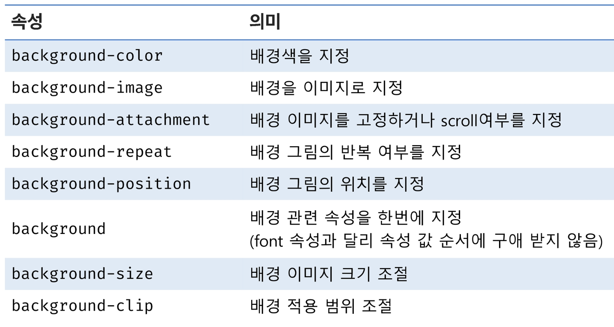

# CSS 개념

## CSS (Cascading Style Sheets)

- HTML 문서를 화면에 표시하는 스타일을 지정하기 위한 언어
- 웹 문서의 **내용과 관계없이 디자인만** 바꿀 수 있음
- 다양한 기기에 맞게 **반응형**으로 바뀌는 문서를 만들 수 있음
- 레이아웃 구성 및 배치
- 애니메이션 및 전환 효과

> **스타일을 지정하기 위한 언어**  
선택하고, 스타일을 지정한다.
>

## CSS 기본 구조

## CSS 문법

- CSS 구문은 **선택자**를 통해 스타일을 지정할 HTML 요소를 선택
- 중괄호 안에서는 속성과 값, 하나의 쌍으로 이루어진 선언을 진행
- 각 쌍은 선택한 요소의 속성, 속성에 부여할 값을 작성
    - 속성 (property) : 어떤 스타일 기능을 변경할지 결정
    - 값(value) : 어떻게 스타일 기능을 변경할지 결정

## 주석

- 주석의 내용은 style 탭에 표시되지 않음
    - ‘source’나 ‘element’탭에서는 확인 가능
- `/* CSS 주석 내용 */`

## CSS 정의 방법(★★★)

- 인라인 참조(Inline) : **개별 요소** 내 `style 속성`
- 내부 참조(Intenal) : **`<head>` 내** `<style>` 태그
- 외부 참조(External) : **.css 파일 작성** 후 `<link>` 태그 사용
- 우선순위.. ⇒ *나와 가까울 수록 / 유니크 할 수록* (★)

## Inline style - 인라인 스타일

- 요소의 태그에서 `style 속성` 을 사용하여 속성값으로 스타일을 정의하는 방식

## Internal Style Sheet - 내부 스타일 시트

- HTML 파일 내에 스타일을 적용하는 방식
- `<head>` 안에 `<style>` 사용
    - CSS 파일에 작성하는 내용과 동일하게 작성
- 외부 스타일 시트보다 우선 적용

## External Style Sheet - 외부 스타일 시트(★★★)

- 외부에 작성된 CSS 파일을 불러와서 스타일을 적용시키는 방식
- `<head>` 안에 `<link>` 를 사용하여 외부 스타일 시트 적용
- **href** 속성에 css 파일의 경로 작성 (rel 속성값은 stylesheet) (★)

## CSS 정의 방법 비교

- **내부 참조**의 경우에는 **CSS 정의**를 해당 HTML 파일에서 관리를 수행 해야함
- **외부 참조**의 경우에는 **별도의 CSS 파일을 통해 원하는 HTML 파일에 적용 가능**

## CSS with 개발자 도구

- Styles : 해당 요소에 선언된 모든 CSS
- Computed : 해당 요소에 최종 계산된 CSS

---

# CSS 단위

## 대표적인 CSS 크기 단위

- px : **고정된 절대값**, 모니터 해상도의 한 화소인 ‘픽셀’을 기준
- rem : 지정한 루트(<html> 태그 기준…기본 16px) 요소 **글꼴 크기의 배수**
- em : **현재 지정한 폰트 크기의 배수**

## CSS 크기 단위

## 색상 단위

- 색상 키워드 : 대소문자 구분 x, ex) red, blue …
- RGB 색상 : 16진수 표기법 혹은 함수형 표기법을 사용해서 특정 색을 표현하는 방식
- HSL 색상 : 색상, 채도, 명도를 통해 특정 색을 표현하는 방식

---

# CSS 속성

## font

## text

## background

## table

---

# CSS 선택자

- HTML 문서에서 CSS 규칙을 적용할 요소를 정의

- 기본 선택자
    - 전체 선택자 (General Selector) `*`
    - 유형 선택자 (Type Selector) `요소 (태그명)`
    - 아이디 선택자 (ID Selector) `#`
    - 클래스 선택자 (Class Selector)  `.`
    - 속성 선택자 (Attribute Selector) `[attribue]`
    - 가상 클래스 선택자
    - 가상 엘리먼트 선택자
- 그룹 선택자
    - 선택자 목록 (Selector List) `,`

### 전체 선택자 (Universal Selector)

- HTML 문서 내 모든 요소(Element)를 선택
- 사용볍 `* { style properties }`

### 유형 선택자 (Type Selector)

- 요소의 이름 - 태그(Tag)을 이용하여 스타일을 적용
- HTML 내에서 주어진 유형의 모든 요소를 선택
- 사용법 `element { style properties }`

### 아이디 선택자 (ID Selector)

- ID 특성 값을 비교하여, 동일한 ID를 가진 태그(Tag)를 선택
- HTML 내에서 주어진 ID를 가진 요소가 하나만 있는 것을 지향
- 사용법 `#id명 { style properties }`

### 클래스 선택자 (Class Selector)

- Class 가 적용된 모든 태그(Tag)를 선택
- HTML 내에서 동일한 클래스 명을 중복해서 사용 가능
- 사용법 `.class명 { style properties }`

### 속성 선택자 (Attribute Selector)

- 태그의 속성명과 속성값을 활용하여 요소를 선택
- HTML 내부에서 동일한 특성을 가진 요소는 모두 선택
- 사용법 `[property=value] { style properties }`

### 선택자 목록 (Selector List)

- ,를 이용하여 선택자 그룹을 생성하는 방법
- 일치하는 모든 노드를 선택
- 사용법  `element, element ... { style properties }`

## 우선순위

- 여러 CSS 스타일 규칙이 충돌할 때, 어떤 스타일이 적용될 지 결정하는 기준
    - 선택자의 구체성에 따라서 우선 순위가 결정
- `!import > 인라인 > ID 선택자 > 클래스, 속성, 의사 클래스 선택자 > 유형 선택자`
- 동일한 우선 순위를 가질 경우 나중에 선언된 스타일을 적용

- X - Y - Z 를 이용하여 명시도 측정
- X : id 선택자의 개수
- Y : class 선택자, 속성 선택자, 가상 클래스 선택자의 개수
- Z : 타입 선택자, 가상 요소 선택자의 개수

- 같은 요소에 두 개 이상의 CSS 규칙이 적용된 경우
- 마지막 규칙, 구체적인 규칙, !important 가 우선 적용

## 상속

- 부모 요소에 적용된 스타일이 자식 요소에게 상속이 될 수도 있고, 안될 수도 있음
- 상속 되는 속성
    - 요소의 상속되는 속성에 값이 지정되지 않은 경우, 요소는 부모 요소의 해당 속성의 계산 값을 얻음
    - 대표적인 예시는 color 속성
- 상속 되지 않는 속성
    - 요소의 상속되지 않는 속성에 어떤 값이 지정되지 않는 경우, 요소는 그 속성의 초기값을 얻음
    - 대표적인 예는 border 속성

---

# CSS 결합자 (Combinator)

## 자손 결합자 (Descendant Combinator)

- 첫 번째 요소의 자손인 노드를 선택
- 공백 (Space Bar) 를 사용
- 사용법
  `selector1 selector2 { style properties }`

## 자식 결합자 (Child Combinator)

- 첫 번째 요소의 바로 아래 자식인 노드를 선택
- \>를 사용
- 사용법
  `selector1 > selector2 { style properties }`

## 일반 형제 결합자 (Subsequent Sibling Combinator)

- 첫 번째 요소를 뒤따르면서 같은 부모를 공유하는 두 번째 요소를 모두 선택
- ~ 를 사용
- 사용법
  `former-element ~ target-element { style properties }`

## 인접 형제 결합자 (Adjacent Sibling Combinator)

- 첫 번째 요소의 바로 뒤에 위치하면서 같은 부모를 공유하는 두 번째 요소 선택
- + 를 사용
- 사용법
  `former-element + target-element { style properties }`