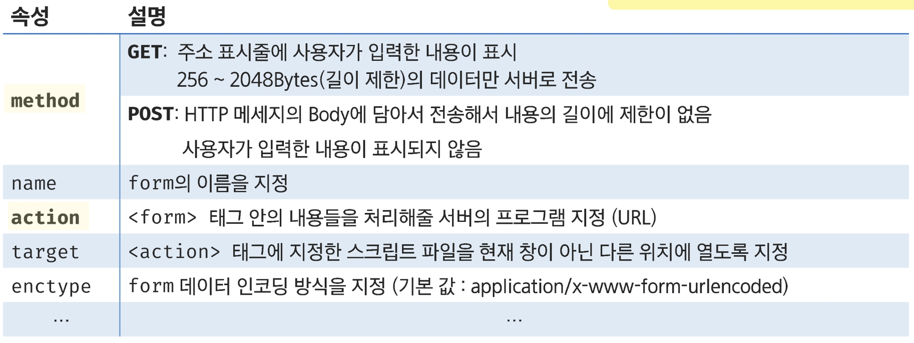
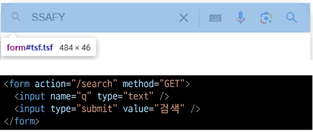
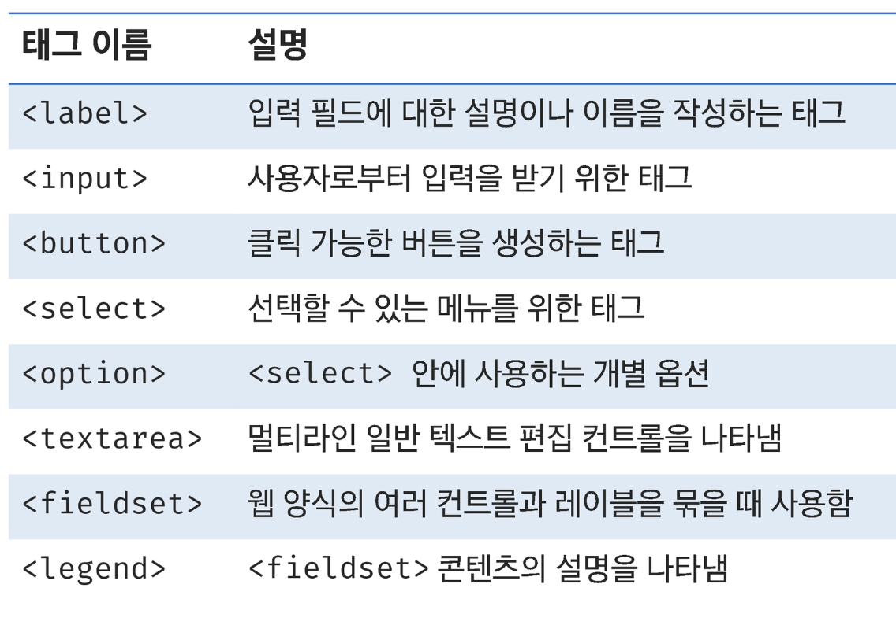
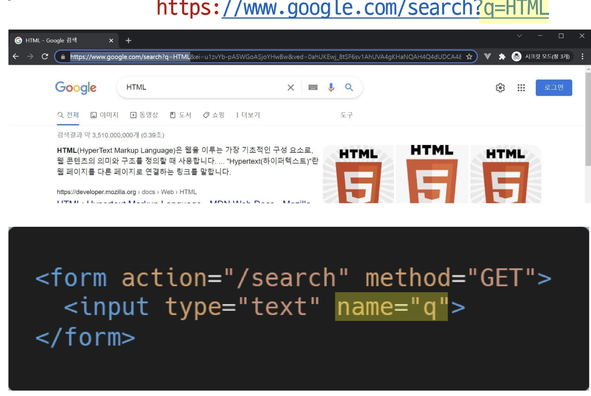
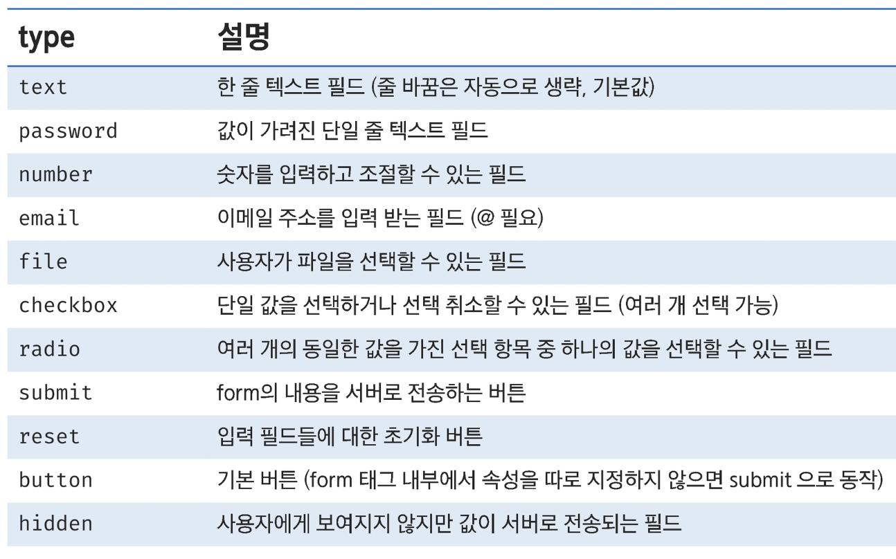

# form 태그

## form

- 사용자로부터 **정보(데이터)**를 입력 받아 **서버로 제출하기 위한 요소**
- “어디 위치(action)로 어떤 방식(method)을 통해 보내겠다”  
  → 위치 = 나의 서버주소/페이지 (기본값 : 나자신에게)  
  → 방식 : Get / Post
- 로그인/회원강비, 검색 기능, 설문 조사, 주문, 게시글 등등..

> key=value 형태로 전달
>

## form 태그 속성

- 사용자가 작성한 데이터를 서버로 전송 (submit)

  

### form 태그 예시

## form의 하위 태그

## input

- 사용자의 입력을 받는 다양한 입력 필드를 만드는 태그 (**주로 form 태그 안에서 활용**)

## input 태그 type

## input 태그 속성

- 요소의 동작은 type 속성에 따라 달라짐

  

## label

- label을 클릭하여 input 자체의 초점을 맞추거나 활성화 시킬 수 있음
- 사용자는 선택할 수 있는 영역이 늘어나 웹/모바일(터치) 환경에서도 편하게 사용 가능
- label과 input 입력의 관계가 시각적으로 늘어날 뿐만 아니라  
  스크린 리더에서도 label을 읽으므로 구조 파악에 쉽도록 보조하는 역할을 수행하기도 함
- `<input>` 의 id 속성 ↔ `<label>` 의 for 속성으로 결합될 요소 명시