# Box model

- **텍스트, 이미지** 등의 모든 HTML 요소는 콘텐츠를 박스(사각) 형태로 관리하는 모델
- 모든 요소는 네모(박스모델)이고, 위에서부터 아래로, 왼쪽에서 오른쪽으로 쌓인다.
    - margin : 테두리 바깥의 외부 여백 배경색으로 지정할 수 없음
    - border : 테두리 영역
    - padding : 테두리 안쪽의 내부 여백 요소에 적용된 **배경색, 이미지**는 이 영역에도 적용
    - content : 글이나 이미지 등의 요소 내 실제 내용

## margin

- margin 속성은 box의 마진영역의 너비를 지정 (상하좌우 - top, bottom, left, right)
- Margin Collapse(마진 상쇄 현상)이 일어날 수 있음.
    - 인접한 블록 요소들(주로 수직)끼리 margin이 겹치는 경우 **더 큰 쪽의 margin으로 상쇄되는 현상**

## margin/padding 속성

- 단축(shorthand) 속정 (*서로 다른 여러가지 CSS 속성의 값을 한번에 지정할 수 있는 속성)
- 시계방향으로 값이 적용 (top → right → bottom → left)
- 값이 생략된 경우에는 반대쪽 값을 사용

- 값 1개 → 모든 면 적용
- 값 2개 → {top, bottom}, {right, left}
- 값 3개 → {top}, {right, left}, {bottom}
- 값 4개 → top, right, bottom, left 순으로 적용

## border 속성

- border-style : 선의 모양
- border-width : 선의 굵기
- border-color : 선의 색상
- border : 위의 세 속성을 줄인 단축 속성
- border-radius : 선의 모서리를 둥글게 만드는 속성
- box-shadow : 그림자 효과

## box-sizing

- 기본적으로 모든 요소의 **box-sizing은 content-box**  
  padding을 제외한 순수 contents 영역만은 box로 지정
- 일반적인 관점으로, border까지 너비를 100px 계산으로 보고 싶다면  
  **box-sizing을 border-box**으로 설정
- border까지의 너비를 크기로 보기 원할 때  
  `box-sizing: border-box;`

---

# CSS Display

- 웹페이지의 레이아웃을 결정하는 속성
- display에 따라 크기와 배치가 달라짐

## display : block

- 줄 바꿈이 일어나는 요소
- 화면 크기 **전체의 가로 폭을 차지** (기본 값, 너비 지정 가능)
- **높이** 지정 가능, **패딩**, **마진** 지정(상,하,좌,우) 가능
- 대표적인 블록 레벨 요소
    - `div`
    - `ul`, `ol`, `li`
    - `p`
    - `hr`, `br`
    - `form`
    - …

## display : inline

- 줄 바꿈이 일어나지 않는 행의 일부 요소
- content 너비만큼 가로 폭을 차지
- width, height, margin-top, margin-bottom을 지정할 수 없음
- 상하 여백은 line-height로 지정
- 대표적인 인라인 레벨 요소
    - span
    - a
    - input, label
    - b, em, i, strong
    - …

## display 속성에 따른 수평 정렬

- 내가(inline) 정렬 하는 게 아닌 부모가 (block) 정렬해 주는 것
    - 기본적으로 나의 content 영역 안에 있는 것은 text-align을 통해 정렬
    - 요소 자체의 여백을 만들어서 요소를 밀어 붙이는 형태로 margin을 통해 정렬

## display : inline-block

- block과 inline 레벨 요소의 특징을 모두 갖고 있음
- inline 처럼 한 줄에 표시 가능
- block 처럼 width, height, margin 속성 지정 가능

## display : none(★★★)

- 해당 요소를 화면에 표시하지 않음 (공간X, 화면X)
- `visibility: hidden;` 은 해당 요소(공간O, 화면X)

---

# CSS Position

## position

- 요소를 문서 내에 배치하는 방법을 지정하는 속성
- static : (기본) 일반적인 배치 순서를 따름 (normal flow, 좌측상단)

  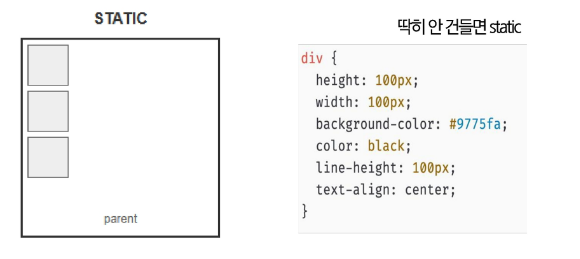

- relative : 자기 자신의 static 위치를 기준으로 이동 (원래 요소가 차지하는 공간은 static과 동일)

  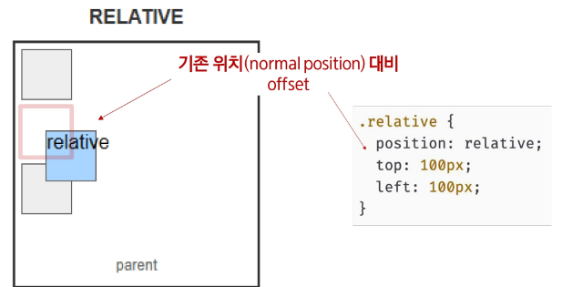

- absolute : static이 아닌 가장 가까운 부모/조상 요소를 기준으로 이동 (normal flow에서 벗어남)

  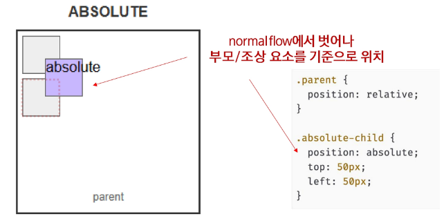

- fixed : 부모요소와 관계없이 viewport를 기준으로 이동 (normal flow에서 벗어남)

  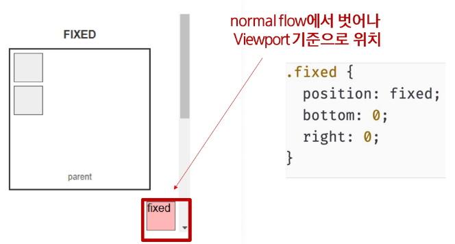

- sticky : 스크롤에 따라 static → fixed으로 변경

  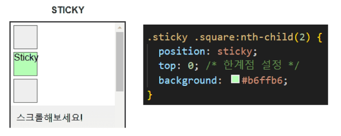

- z-index : 박스가 쌓인 순서(겹친 경우) 지정 (높은 숫자가 위에 배치)

---

# Flexbox

## float

- **float 속성**은 어느 위치에 배치할 것인지를 결정하기 위해 사용  
  (요소가 normal flow 에서 벗어나 배치하도록 함)
- none : 기본 값
- left : 요소를 왼쪽으로 띄움
- right : 요소를 오른쪽으로 띄움

## clear

- float 속성이 가지고 있는 값을 초기화 하기 위해 사용
- left, right : 각각의 속성 값을 취소할 수 있음
- both : 양쪽의 float 속성 값을 취소할 수 있음
- none : 기본 값

## Flexbox의 시작

- Flexible Box module은 인터페이스 내의 아이템 간 공간 배분과 강력한 정렬 기능을 제공하기 위한 1차원 레이아웃 모델로 설계
- 각각 아이템의 저마다의 높이를 가지고 있다면 flex는 자동으로 맞춰준다 (레이아웃 배치가 매우 ez)

### 축

- Main Axis(주축)
- Cross Axis(교차축)

### 구성요소

- Flex Container
- Flex item

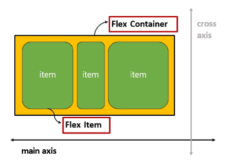

### Flex Container(부모요소)

- flexbox 레이아웃을 형성하는 가장 기본적인 모델
- flex item 들이 놓여있는 영역
- dispalay 속성을 이용하여 container를 생성
    - display: flex; → block 성격의 container
    - display: inlin-flex; → inline 성격의 container

### Flex Item(자식요소)

- 컨테이너에 속에 있는 컨텐츠 (요소, 아이템, 박스)

## Flex Container

- flex-direction : container 안의 item들의 나열되는 방향
- flex-wrap : container 안의 item들의 크기가 container의 크기 보다 클 때 줄 넘김
- flex-flow : 방향과 줄 넘김을 동시에 설정
- justify-content : 메인 축(main axis)의 정렬을 제어
- align-items : 교차 축(cross axis)의 정렬을 제어
- align-content : wrap 속성에 의해서 여러 줄이 발생한 경우의 교차 축(cross axis) 정렬

### flex-direction

- 주축(Main axis) 기준으로 방향을 설정
- 역방향인 경우 태그 선언 순서와 보이는 순서가 다르니 유의

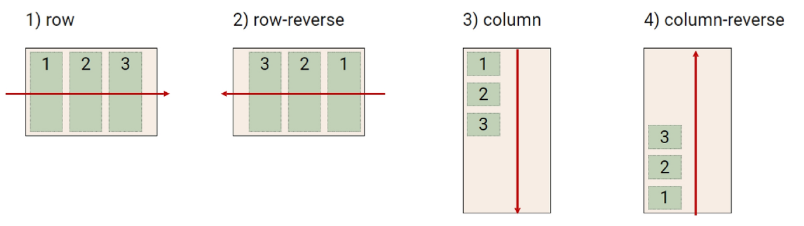

### flex-wrap

- 아이템이 테이너를 벗어나는 경우 해당 영역 내에 배치되도록 설정  
  (기본 컨테이너 영역을 벗어나지 않도록 함)
- nowrap : 너비 조정 처리 / wrap : 줄바꿈 처리

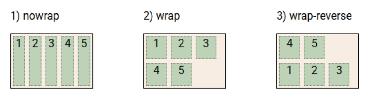

### flex-flow

- flex-direction와 flex-wrap의 축약(shorthand) 속성
- flex-flow : flex-direction flex-wrap

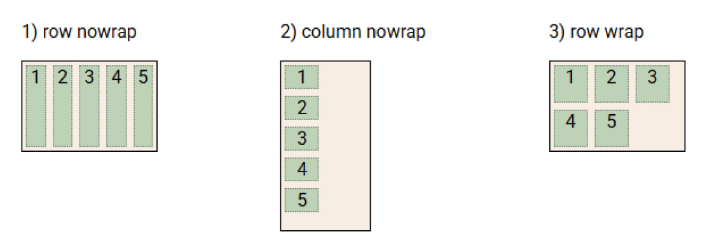

### justify-content

- 주축(main axis)를 기준으로 공간 배분

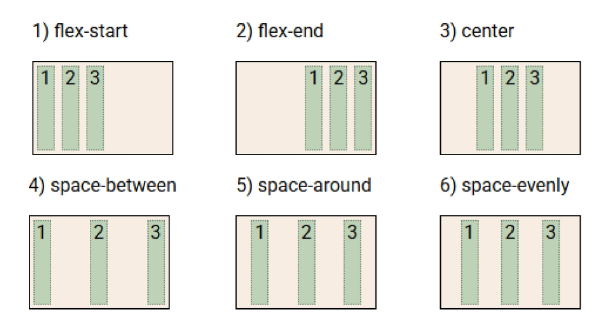

### align-content

- 교차축(cross axis)를 기준으로 공간 배분 (아이템이 두줄 이상 배치되는 경우에만 확인 가능)

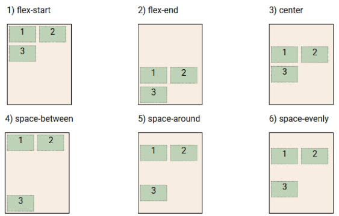

### align-items

- 모든 아이템을 교차축(cross axis) 기준으로 정렬

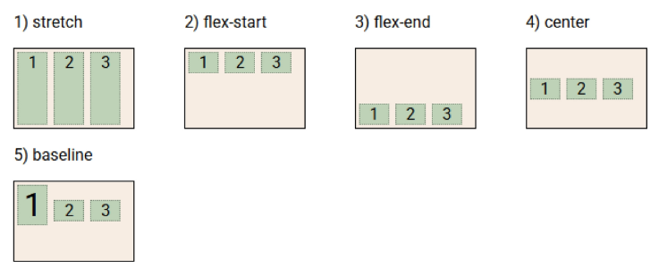

### align-self

- 개별 아이템을 교차축(cross axis) 기준으로 정렬
- 주의 : 해당 속성은 컨테이너가 아닌 개별 아이템에 적용하는 속성

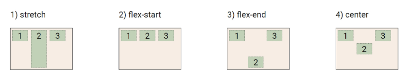

---

# Appendix(부록)

## Flex Item

- order : item의 배치 순서 제어
- flex-basis  : item의 너비를 지정
- flex-grow : item의 팽창 제어
- flex-shrink : item의 수축 제어
- flex : flex-grow, flex-shrink, flex-basis의 속성을 단축 지정

### order

- 아이템들의 배치 순서를 결정, 순자가 작을 수록 먼저 배치됩니다. (기본값: 0)

  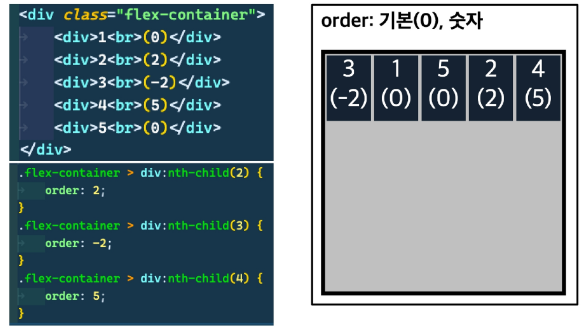

### flex-basis

- flex 아이템의 초기 크기를 설정 (기본값: auto - 내용물 만큼)               flex에 존재하는 너비 속성

  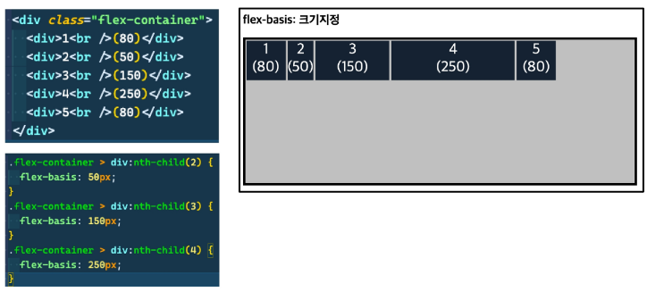

### flex-grow

- flex 컨테이너에 여분의 공간이 있을 때 아이템 증가 비율을 지정, 1 이상이면 해당 비율 만큼 차지 (기본값 0 - 확장 x)

  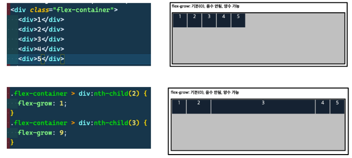

### flex-shrink

- flex 컨테이너가 아이템을 수용하기에 공간이 부족할 때 아이템의 축소 비율 지정 (기본값1 - 균등축소)

  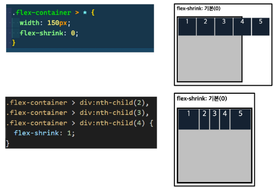

### flex

- flex-grow, flex-shink, flex-basis의 축약(shorthand) 속성

  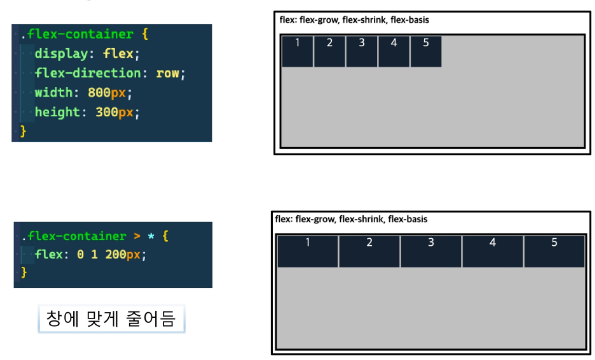

  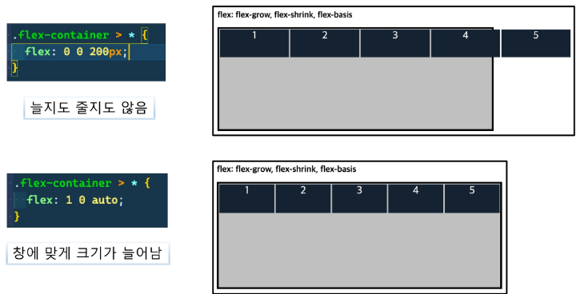