# JavaScript

## 자바스크립트의 탄생 배경

- 웹의 초기 상황, 정적인 웹 텍스트 페이지만을 지원 (1990년대 초)
- HTML만으로는 사용자와 상호작용이 불가능
- 페이지 내 동적 기능 추가 필요성

## 자바스크립트 탄생

- 당시 Netscape에서 웹의 동적 기능 개발을 초점으로 프로젝트 진행
- Netscape 소속 개발자, 브랜든 아이크가 스크립트 언어 Mocha 개발(1995)
- LiveScript로 이름을 변경하여 Netscape Navigator 2.0 에 공식 탑재
- 차후 당시 가장 인기있던 프로그래밍 언어인 Java의 명성에 기대보고자 JavaScript로 이름 변경(ㅋㅋㅋ)

## 자바스크립트의 표준화, ECMAScript

- Netscape에서 만든 JavaScript 가 인기를 얻자, 마이크로스프트에서는 인터넷 익스플로러(IE)에 자체 버전인 JScript를 제작
- 이 과정에서 많은 회사들이 독자적으로 JavaScript를 변경하고 자체 브라우저에 탑재
    - JavaScript의 파편화 시작
- ECMA International : 정보 통신에 대한 **표준을 제정하는 비영리 표준화 기구**
- ECMAScript : **ECMA-262** 기술 규격에 의해 정의된 범용 스크립트 언어
- **ECMAScript6 (ES6)** : ECMA에서 제안하는 6번째 표준 명세 (2015년 발표)

## 자바스크립트 란?

- 웹 페이지에 **“동작”**을 넣어주는 프로그래밍 언어
- 웹 브라우저에서 주로 사용, **Node.js**를 이용하여 콘솔 환경에서 사용
- 자바와 기본 구문이 비슷하다

## 브라우저 엔진

- 브라우저가 작동하는데 필요한 기반 기술을 모두 포함하는 엔진
- 단순 markup이 아니라 자바스크립트나 통신 모듈을 실행하기 위해서 필요
- 각 브라우저마다 **자체 JavaScipt Engine을 개발, 사용**하고 있음
    - V8 - Chrome
    - Chakra - Microsoft Edge
    - JSC - Apple (Safari)
    - SpiderMoneky - Firefox

---

# 기본 문법

## HTML 자바스크립트 사용

- `<script>` `</script>` 태그를 사용
- **문서 내의 위치의 제약이 없다**

> 한 줄 마무리에 세미콜론(;)을 사용하지 않아도 동작  
스크립트 엔진이 잘못 해석하는 경우가 있으므로 작성 권장
>

## 외부스크립트 참조하기

- **.js확장자**를 가진 파일을 생성
    - outer.js

    ```jsx
    console.log('hello');
    ```

    - html

    ```html
    <body>
    	<h1>외부 스크립트 파일 참조</h1>
    	<script src="outer.js">console.log("실행되지 않는 부분임");</script>
    	<script>
    		console.log("파일 호출과 별도의 태그를 만들어서 실행");
    	</script>
    </body>
    ```


## 주석 (Comment)

- `//`  한 줄 주석
- `/* */` 여러 줄 주석

## 변수 (Variable)

- 자바스크립트의 변수 타입은 가리키는 값에 대한 타입을 나타냄
- `var`, `let`, `const` 키워드를 이용해서 변수를 선언  
  (생략 시 전역 객체 window의 멤버 변수 취급 → 사용 지양)
- `undefined` 는 변수에 아무 값도 없어서 타입을 알 수 없는 경우를 말함
- **동적 타입** : 대입되는 값에 따라서 용도가 변경되는 방식
- **문자, $, _** 로 시작, 대소문자 구분, 예약어 사용 x

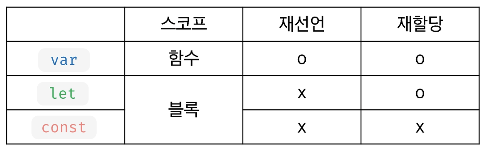

### var

- **재 선언 가능**, **재 할당 가능**
- ES6 이전에 변수 선언 시 사용
- 호이스팅 (Hoisting) 특성이 있음
- 함수 스코프

### let

- **재 선언 불가**, **재 할당 가능**
- 블록 스코프

### const

- **재 선언 불가, 재 할당 불가**
- 블록 스코프
- 대문자 SNAKE_CASE 사용
- **선언 시 값을 할당해야 함**
- 상수로 사용

### undefined

- 변수에 값이 대입되지 **않은** 상태

## 데이터 타입 (Data Type)

- 기본 데이터 타입 (Primitive type)
    - String, Number, Boolean, null, undefined
- 객체 타입 (Reference Type)
    - Object - function, array 등
- 값을 할당할 때 타입 결정
- 타입 간의 변환이 자유로움 → 자동 연산 수행

## typeof - 변수의 자료형 검사

- typeof 데이터
- typeof 의 결과는 문자열 반환
- null의 데이터 타입은 object (설계 실수)
- function 은 기능을 가진 객체
- *es6 추가된 타입
    - Symbol(변경 불가능한 기본 타입)

## 동적 데이터 타입 - 다양한 값의 대입이 가능

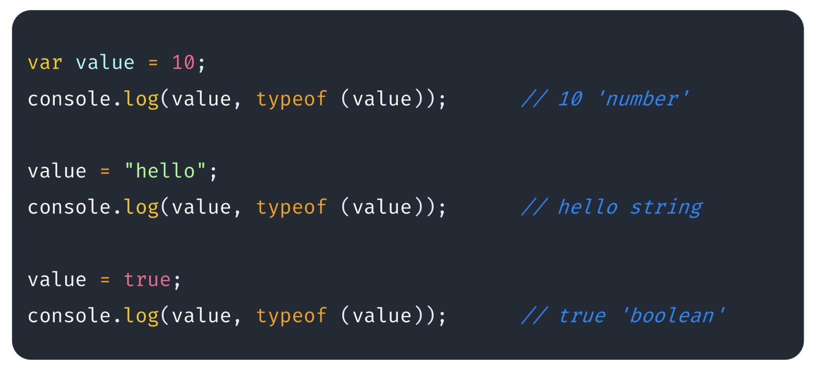

## 숫자형 (Number)

- 정수와 실수로 **나누어 구분하지 않음** (부동 소수점 형식)
- 일반적인 숫자 외 특수 숫자 포함 (Infinity, NaN …)
- e 를 활용하여 거듭제곱 표현 가능

## 문자열 (String)

- “”로 감싼다
- ‘’로 감싼다
- Template Literal (ES6) → `` (backtick) 으로 감싼다.
    - **여러 줄 입력이 가능** - 공백, 줄 넘김 유지  
      문자열 내 **${변수명}을 이용하여 변수와 문자열을 결합**
- UTF-16 코드 유닛으로 저장 및 처리

## 문자열 연산

- 문자열과 숫자 타입의 + 연산 → 문자열
- 문자열과 숫자 타입의 + 연산 이외 → 숫자

## 자바스크립트 false

- 논리 값 false로 인식
    - false
    - null
    - undefined
    - 0
    - ‘’ (빈 문자열)
    - NaN (Not a Number)
- 나머지 값은 true로 인식

## 연산자 (Operator)

- \+ (덧셈), 단 항 사용시 Number() 와 동일한 역할
- \- (뺄셈)
- \* (곱셉)
- / (나눗셈)
- % (나머지)
- \* \* (거듭제곱)
- = (할당 연산자)
- +=, -=, *=, … (복합 할당 연산자)
- ++, — (증감연산자)

## 일치 연산자

- **값**과 **타입**이 일치하는지 체크
- ===, !==

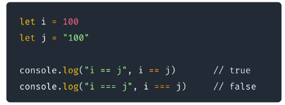

## 제어문 (Java 유사)

- 조건문 (Condition)
    - if, else if, else
    - switch
- 반복문 (Loop)
    - for
    - while
    - do…while
    - for…of
    - for…in

## 배열 (Array)

- 배열의 생성 : **[]** 또는 **Array()** 활용
- 배열의 크기는 동적으로 변경된다
- 크기가 지정되어 있지 않은 경우에도 데이터의 입력 가능
- 배열은 여러가지의 데이터 타입을 하나의 배열에 입력할 수 있음

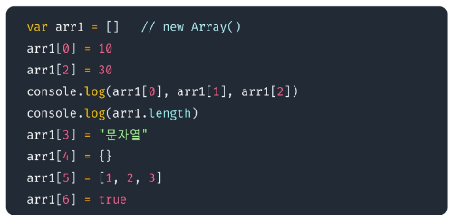

- 함수를 이용하여 데이터 추가 기능
    - .pop
    - .push
    - .unshift
    - .shift
    - .splice
    - .slice
    - .join
    - .reverse
    - .concat
    - …

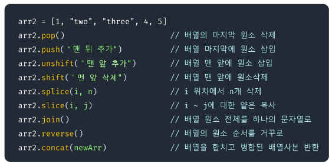

---

# 반복문

- while
- do…while
- for
- for…of
- for…in
- foreach

## while

- 조건이 true 인 동안 반복

## do…while

- 조건을 나중에 검사하여, 무조건 한번은 실행되는 while 문

## for

- 가장 일반적인 반복문
- for 문 안에 사용할 변수를 정의하고, 해당 변수를 기준으로 조건이 false 가 될 때까지 반복

## for…of

- 배열에서 요소를 하나씩 순회하며 반복하는 반복문
- 꺼내지는 모든 요소는 블록 내에서 변수로 선언되기 때문에 변수 선언 키워드 작성 필수

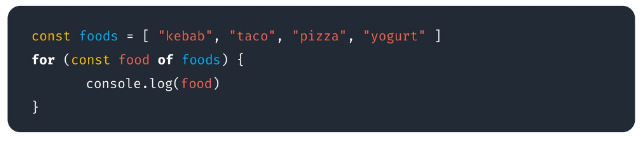

## for … in

- `object` → `key` || `Array` → `index` 를 순회하는 반복문
- object

  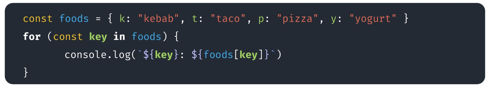

- Array

  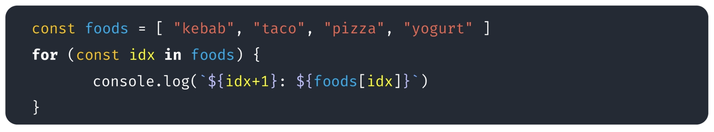


---

# 객체 (Object)

- 객체는 **문자열로 이름을 붙인 값들의 집합체** (Key : Value)
- 객체에 저장하는 **값을 프로퍼티**(Property) 라고 함
- 객체는 **prototype 이라는 특별한 프로퍼티**를 가지고 있음

## 객체 만들기

- 객체 리터럴 이용 : {}
- Object 생성자 이용 : new Object()
- 생성자 함수 이용

## 객체 프로퍼티 (Object Property)

- 생성자 함수를 사용해서 Property 추가 기능 & this 키워드 사용 가능

  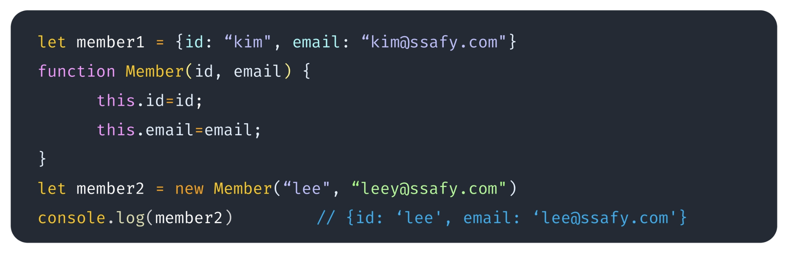

- .(dot) 또는 []를 이용하여 프로퍼티의 조회 및 변경을 처리

  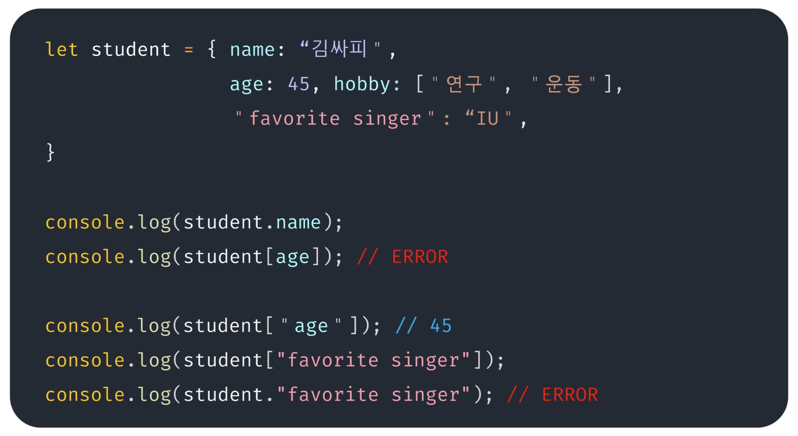


### 추가/수정/삭제

- 동적 프로퍼티 추가

  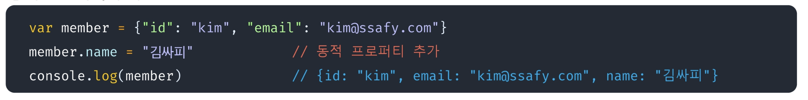

- 동적 프로퍼티 수정

  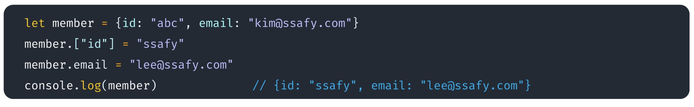

- 동적 프로퍼티 삭제

  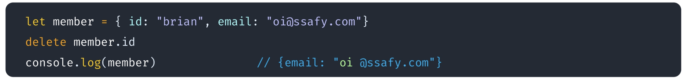


## 객체 변수에는 주소가 저장되어 공유 가능

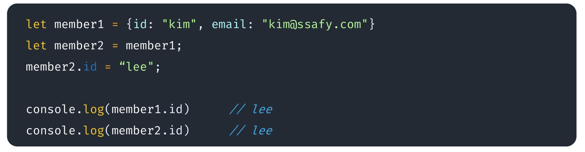

## 함수안에서의 this는 함수를 호출한 객체

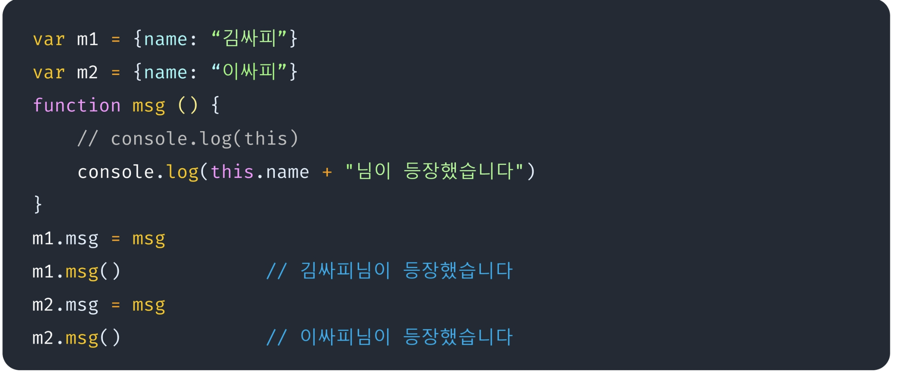