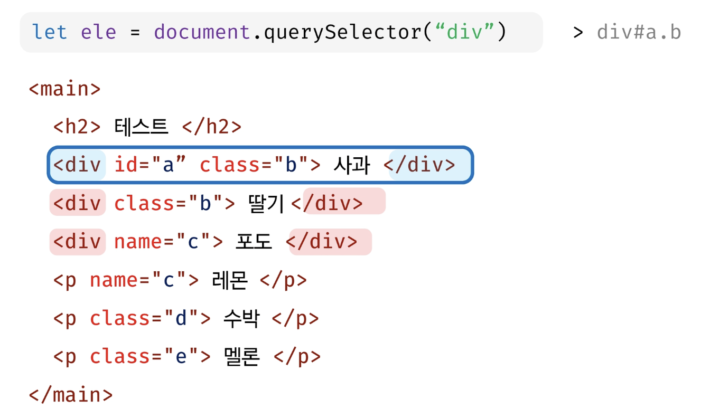
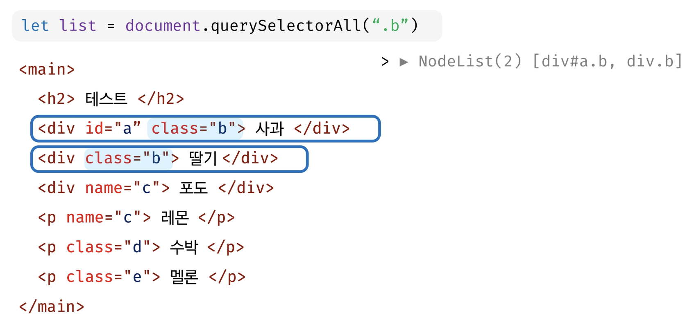
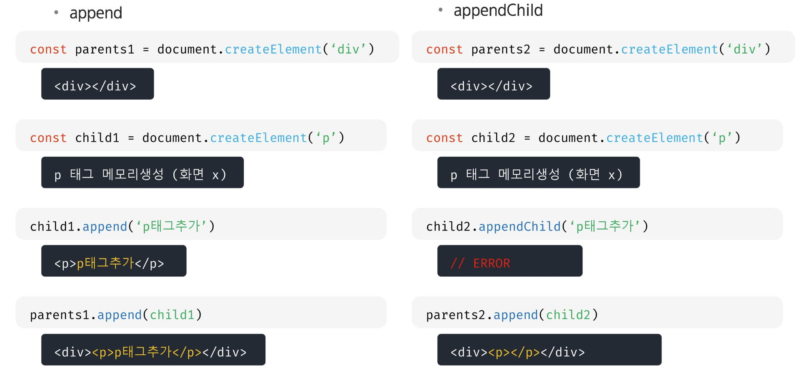

# 함수 (Function)

- 자바스크립트에서 함수는 **객체 타입으로 값처럼 사용이 가능**
- 함수를 변수에 대입하거나 매개변수로 넘길 수 있음
- **배열의 요소에 넣거나** 객체의 프로퍼티로 설정이 가능
- 매개변수의 개수가 일치하지 않아도 호출이 가능
- JavaScript의 함수는 **일급 객체(First-class citizen)에 해당**

> **일급 객체(First-class citizen)**
> - 변수에 할당 가능
> - 함수의 **매개변수로 전달 가능**
> - 함수의 **반환 값으로 사용가능**
>

- `function` 키워드 사용
- 함수의 블록은 중괄호 `{}` 사용
- 선언식, 표현식, 화살표 함수

## 함수만들기

- 함수 선언식
    - 일반적인 프로그래밍 언어의 함수 정의 방식

    ```jsx
    function 함수명() { 함수 내용 }
    ```

- 함수 표현식
    - JavaScript의 특징을 활용한 함수 정의 방식

    ```jsx
    let 함수명 = function() { 함수 내용 }
    ```


### 함수 선언식 (Function Declaration)

- 일반적인 프로그래밍 언어의 함수 정의 방식
- 함수의 이름과 함께 정의하는 방식
- **함수의 이름**
- **매개 변수**
- **내용**
- **호이스팅**

```jsx
function 함수명() { 함수 내용 }
/////////////////////////////////////////
function greeting(name) {
	return `Welcome, ${name}`
}

console.log(greeting("SSAFY"))
```

### 함수 표현식 (Function Expression)

- **익명함수**로 정의가능
- 매개 변수
- 내용

```jsx
let 함수명 = function() { 함수 내용 }
////////////////////////////////////////////
let greeting = function(name) {
	return `Welcome, ${name}`
}

console.log(greeting("SSAFY"))
```

### 선언식 vs 표현식

- **선언식 함수는** 호이스팅의 영향을 받아 함수 **선언 이전에 호출이 가능**
- **표현식 함수는** 선언 이전에 **호출이 불가능**


## 함수의 리턴

- 함수의 실행 결과로 **함수를 반환할 수 있음**
- 함수가 특별한 값을 리턴 하지 않는 경우 undefined가 반환됨


## 함수의 호출

- 정의된 함수를 **호출 시 함수 값으로 넘길 수 있음**


## 함수 매개변수

- 함수는 호출 시 **매개변수의 영향을 받지 않음**  
  → 있든 없든… no 상관
- `arguments` 라는 함수 내부의 프로퍼티를 이용하여 **매개변수의 처리가 가능**
- **기본 인자 (default arguments)를 사용할 수 있음**


- 자바스크립트의 함수는 **오버로딩 개념을 지원하지 않음**


## 화살표 함수 (Arrow Function)

```jsx
let arrow = function(name) { return `hello ${name}` }
```

1. `function` 키워드 생략 가능

```jsx
let arrow = (name) => { return `hello ${name}` }
```

1. 함수의 매개변수가 오직 한 개라면 `()` 도 생략 가능  
   일관성을 위해서 인자를 담는 `()` 괄호를 포함하는 것을 권장

```jsx
let arrow = name => { return `hello ${name}` }
```

1. 함수의 내용이 한 줄이라면 `{}`와 `return` 도 생략 가능

```jsx
let arrow = name => `hello ${name}`
```

1. 인자가 없다면, `()` || `_` 으로 표시 가능

```jsx
let arrow_ = () => { return `No Arguments` }
arrow = _ => { return `No Arguments` }
```

## Array Helper Method


---

# DOM

## DOM 이란?

- 문서 객체 모델 (Document Object Medel)
- XML, HTML 문서의 **각 항목을 계층으로 표현**하여 **생성, 변형, 삭제**할 수 있도록 돕는 인터페이스
- DOM은 문서 요소 집합을 트리 형태의 계층 구조로 HTML 표현
- HTML 문서의 요소를 제어하기 위해 지원
- 상단의 document 노드를 통해 접근

## DOM의 주요 객체

- `window`
- `document`


## window

- DOM을 표현하는 창
- **가장 최상위 객체**
- `window` 키워드 생략 가능


## window 제공 메소드

- alert
- confirm
- prompt
- open
- parseInt, parseFloat
- setTimeout, clearTimeout
- setInterval, clearInterval

## document

- document는 window의 속성
- 브라우저에 렌더링된 웹 페이지
- 우리가 보고 있는 **웹페이지의 최상단**
- `document` 키워드로 접근

```jsx
window.document.title
document.title
document.title("싸피월드")
```


## DOM 조작

- Document가 제공하는 기능을 사용해서 웹 문서를 조작
- DOM 조작 순서
    1. **접근 (Select)**  
       → 선택자를 알고있으면 아주아주 좋다!
    2. **조작 (Manipulation)**
        - 생성
        - 추가
        - 수정
        - 삭제
        - …

## 문서 접근 방식 이해

`getElementById("string")`

`querySelector("css selector")`

`querySelectorAll("css selector")`

### `getElementById("string")`

- id의 이름으로 요소에 접근


- 존재하지 않는 id값인 경우 null을 반환


### `querySelector("#id")`

- id의 기호와 이름으로 첫번째 요소를 반환


### `querySelector(".class")`

- class의 기호와 이름으로 첫번째 요소를 반환


### `querySelector("tag")`

- tag 이름으로 첫번째 요소를 반환



### `querySelector("[property]")`

- 속성이름과 값으로 첫번째 요소를 반환


### `querySelector("css selector")`

- id, class, tag, property 모두 섞고, 결합자를 활용해서도 사용 가능


### `querySelectorAll("css selector")`

- querySelector(…)와 사용방식은 동일
- **NodeList** 를 반환하고 **배열처럼 사용 가능** - 유사 배열. ~~배열은 아님~~(반복문 사용 가능)


### `querySelectorAll("#id")`

- id의 기호와 이름으로 해당되는 모든 요소를 반환


### `querySelectorAll(".class")`

- class의 기호와 이름으로 해당되는 모든 요소를 반환



### `querySelectorAll("tag")`

- tag 이름으로 해당되는 요소를 반환


### `querySelectorAll("[property]")`

- 속성이름과 값으로 해당되는 모든 요소 반환


## 문서 조작 방식 이해

`createElement("tagName")`

`createTextNode("text")`

`append("string"|"node")` `appendChild("node")`

`remove()` `removeChild("node")`

`setAttribute("attributeName", value)` `getAttribute("attributeName")`

`innerHTML`

`innerText`

### `createElement("tagName")`

- 작성한 tagName의 HTML 요소를 생성해서 반환
1. element 생성

```jsx
let ele = document.createElement("img")
```

1. 추가할 기존 element 접근

```jsx
let parent = document.getElementById("ele")
```

1. element 추가

```jsx
parent.append(ele)
```

- append.appendChild 둘다 가능

### `createTextNode("text")`

- 텍트 노드 생성함, appendChild를 사용해서 노드 요소에 텍스트를 추가
1. text node 생성

```jsx
let myText = document.createTextNode("SSAFY")
```

1. element 접근

```jsx
let pTag = document.getElementById("p")
```

1. element에 node 추가

```jsx
pTag.appendChild(myText)
```

## append, appendChild

- 부모 노드에 자식 노드를 추가하는 메소드




## remove, removeChild

- 요소 삭제, 노드 삭제


### `setAttribute("attributeName", value)`

- 지정된 속성의 값을 설정
- 속성이 이미 존재하면서 값을 갱신 & 존재 하지 않았던 속성이라면 이름과 값으로 새 속성을 추가
1. element 생성

```jsx
let ele = document.createElement("img")
```

1. 생성된 img element 속성에 추가

```jsx
ele.setAttribute("src", "./img/ssafy.png")
ele.src = "./img/ssafy.png"

ele.setAttribute("width", 200)
ele.width = 200

ele.setAttribute("height", 200)
ele.height = 200
```

### `getAttribute("attributeName")`

- 지정된 요소의 값을 반환
- 매개변수에 담은 속성이 존재하지 않는 경우 null을 반환


### `innerHTML`

- 요소 내용을 HTML 내용 그대로 변경
1. 조작할 element 접근

```jsx
let list = document.getElementById("list")
```

1. 처리할 작업 진행

```jsx
list.innerHTML(")
```

### `innerText`

- Node 객체와 그 자손의 텍스트 컨텐츠(DOM String)를 표현
- element 접근 후 innerText로 값 확인

  

- innerText로 값 변경

  