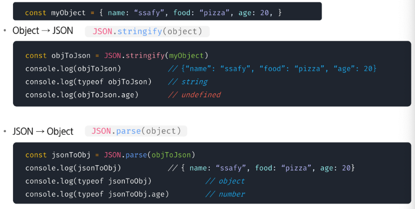
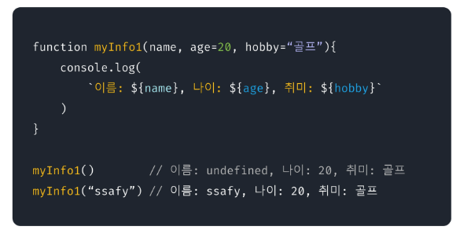
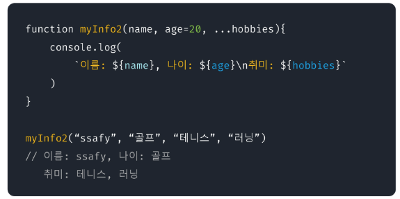
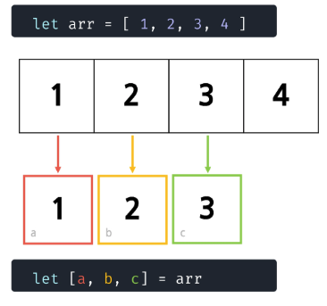
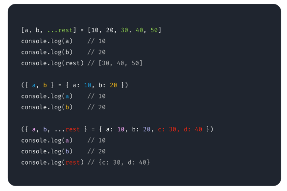
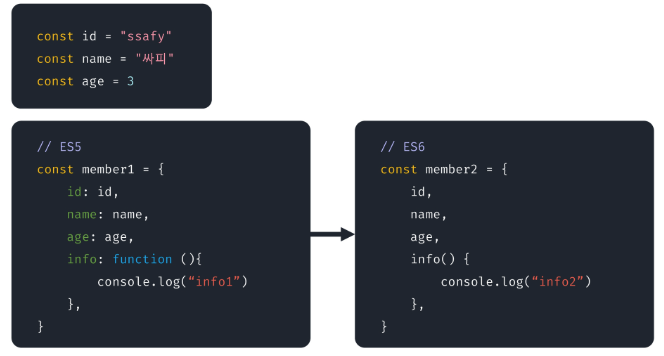

# Event

- (특히 중요한) 사건\[일]
- 웹 페이지에서 **여러 종류의 상호작용**이 있을 때 마다 이벤트가 발생
- 마우스를 이용했을 때, 키보드를 눌렀을 때 등 많은 이벤트가 존재
- **JavaScript를 사용하여** DOM에서 발생하는 이벤트를 감지하고 대응하는 작업을 수행할 수 있음

## Event의 종류

- Keyboard → keyup, keydown, keypress
- Mouse → click, mousemove, mouseup, mousedown, mouseenter, mouseleave
- Loading → load, unload
- Form → input, change, blur, focus, submit

## Event 객체 (Object)

- 네트워크 활동이나 사용자와의 상호작용 같은 사건(Action) | 발생(Occurrence) 의 발생을 알리기 위한 **객체**
- Event 발생
    - 마우스를 클릭하거나 키보드를 누르는 등 사용자 행동으로 발생 가능
    - **특정 메서드를 호출**하여 **프로그래밍적으로 표현 가능**

## Event 처리 | 통신

- DOM 요소는
    - Event를 “수신”할 수 있음
    - Event를 “처리”할 수 있음
- Event는 주로 `addEventListener()` 를 사용함
- 다양한 HTML 요소에 **이벤트 처리기 (Event Handler)를 “붙여서”** 처리함

## Event 처리 방식의 이해

- 고전 이벤트 처리 방식 : attribute / property 방식으로 등록
- 표준 이벤트 처리 방식 : `addEventListener()` 메서드 이용

## 고전 이벤트 처리 방식

### 고전 이벤트 처리 방식 - 1

- **인라인 이벤트** 설정 → 엘리먼트에 직접 지정
- 설정하려는 이벤트를 정하고 on이벤트종류의 형식으로 지정

```html
<button onclick="changeColor()">change</button>
```

### 고전 이벤트 처리 방식 - 2

- 엘리먼트에서 이벤트를 직접 설정하지 않고 **스크립트에서 이벤트 설정**

```jsx
h1.onclick = function(){
		alert('클릭');
		h1.onclick = null;
}
```

## 표준 이벤트 처리 방식

- `addEventListener()`
    - **Event 추가**
    - EventTarget.addEventListener(type, listener, [option])
- `preventDefault()`
    - 현재 Event의 기본 동작을 **중단 | 취소**
    - HTML 요소의 **기본 동작을 작동하지 않게 함**

> “ 특정 요소에 특정 이벤트가 발생하면, 할 일을 등록하자 “
> `EventTarget.addEventListener(Type, Listener)`
>
- EventTarget
    - 특정 이벤트가 목표물에 전달될 때마다 호출할 함수를 설정
    - Event를 지원하는 모든 객체(Element, Document, Window …)를 **EventTarget으로 지정 가능**
- Type
    - **반응할 Event 유형**을 나타내는 대소문자 구분 문자열
    - e.g. input, **click**, submit
- Listener
    - 지정된 타입의 **Event를 수신할 객체**
    - 자바스크립트 **함수 객체 (콜백 함수)이여야만 함**
    - 콜백 함수는 발생한 Event의 데이터를 가진 **Event객체를 유일한 매개변수로** 받음

> “ 특정 이벤트 의 이벤트의 기본 동작을 중단 “
>`EventTarget.preventDefault()`
>

---

# Web Storage

## JSON

- { key : value } 형태로 이루어진 자료 표기법
- JavaScript의 Object와 유사한 형태를 가지고 있지만
    - Object는 타입(Type)
    - JSON은 형식이 있는 **문자열 (String)**
- JSON을 Object로 사용하기 위해서는 변환 작업이 필요

### 변환



## Web Sotrage API

- `key : value` 키 : 값 쌍으로 값을 저장  
  → 둘다 문자열..이면 좋다
- `sessionStorage` 는 각각의 출처에 대해 독집적인 저장 공간을 **페이지 세션이 유지되는 동안**
    - 브라우저가 열려 있는 동안 제공
    - 세션에 한정해, 즉 브라우저 또는 **탭이 닫힐 때 까지만** 데이터를 저장
    - 데이터를 절대 서버로 전송하지 않음
    - 저장 공간이 **cookie보다 큼** (최대 5MB)
- `localStorage` 도 위와 같지만, **브라우저를 닫았다 열어도 데이터가 남아있음**
    - 유효기간 없이 데이터를 저장하고, JavaScript를 사용하거나  
      브라우저 캐시 또는 로컬 저장 데이터를 지워야만 사라짐
    - **저장 공간이** cookie, session과 비교했을 때 **가장 큼**

## Storage

- 속성 (property)
    - `length` : 객체에 저장된 데이터 항목의 수를 반환
- 메서드 (method)
    - key(index) : index 번째의 키를 반환
    - getItem(key) : key에 해당하는 값 반환
    - setItem(key, value) : key가 존재하는 경우 재설정, 존재하지 않는 경우 value 추가
    - removeItem(key) : key를 저장소에서 제거
    - clear() : 모든 키를 저장소에서 제거

---

# ES6 문법

## ES6 (ECMAScript 6)

- ECMAScript는 ECMA-262 기술 규격에 정의된 표준화된 스크립트 프로그래밍 언어
- JavaScript 언어 등을 표준화 하기 위해 만들어짐
- ES5(2009) → ES6(2015): 추가적인 문법 요소들 등장

## 기본 파라미터 (Default Parameter)

- 함수 파라미터의 **기본값을 지정할 수 있음**
- 변수와 함수 모두 다 가능

  


## 나머지 파라미터 (Rest Parameter)

- 여러 개의 파라미터 값을 **배열**로 전달 받을 수 있음
- 매개변수 앞에 세개의 점 `…` 을 붙여서 사용 가능 / 마지막에 `,` 붙이면 StntaxError 발생

  

- 기본 파라미터와 함께 사용할 수 없음
- 가변 파라미터는 항상 가장 마지막에 작성해야 함

## 구조분해 할당 (Destructuring Assignment)

- 배열, 객체의 값들을 추출하여 한번에 여러 변수에 할당할 수 있음

  

- 나머지, 배열, 객체 모두 할당 가능

  


## 객체 속성 표기법 개선

- shorthand properties
- concise method



## 모듈 (Module)

- 독립성을 가진 재사용 가능한 코드 블록
- 여러 개의 코드 블록을 각각의 파일로 분리할 후 필요한 모듈을 조합하여 사용 가능
- import / export 구문을 이용하여 가져오거나 내보낼 수 있음

## 전개 연산자 (Spread Operator)

- 나머지 파라미터와 동일한 기호 `...` 사용
- 배열이나 객체를 연산자와 함께 객체/배열 리터럴에서 사용하면 객체/배열 내의 값을 분해된 형태로 전달
- 깊은 복사 수행 시 자주 사용