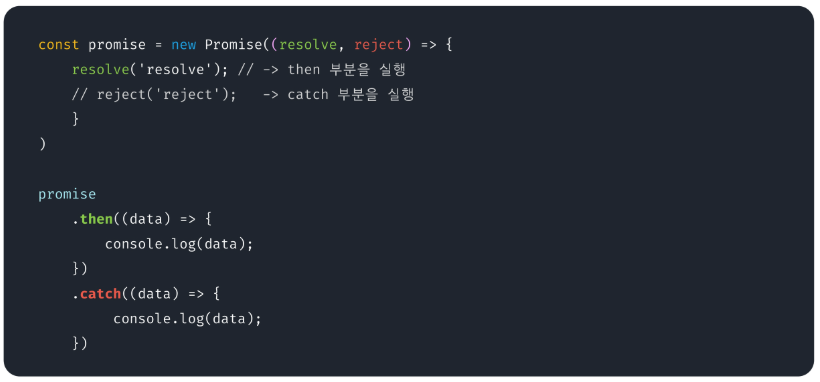

# AJAX

## 집안일 목록

- 세탁기 돌리기 → 건조기 돌리기 → 빨래 개기
- 치킨 주문하기 → 치킨 먹기 → 치킨 정리하기
- 로봇청소기 돌리기 → 로봇청소기 비우기
- 쓰레기 분리수거 하기

## AJAX (Asynchronous JavaScript and XML)

- 서버와 통신을 하기 위해서 `XMLHttpRequest` 객체를 활용
- JSON, XML, HTML 그리고 일반 텍스트 형식 등을 포함한 **다양한 포맷을 주고 받을 수 있음.**
- 페이지 전체를 ‘~~새로고침~~’ 하지 않고서도 수행 되는 **“비동기성” (일 부분만 업데이트 가능)**

## 동작방식

- 동기 (synchronous)
    - 서버에 요청한 데이터가 도착할 때 까지 **클라이언트는 대기**

      

- 비동기 (asynchronous)
    - 서버에 요청한 데이터가 도착할 동안 **클라이언트는 멈추지 않고 동작**

      


## 순차적인 비동기 처리하기

- Web API로 들어오는 순서는 중요하지 않고, 어떤 이벤트가 먼저 처리되느냐가 중요 **(실행 순서 불명확)**

1. Async Callbacks
    - 백그라운드에서 실행을 시작할 함수를 호출할 때 인자로 지정
    - ex) addEventListener()의 두 번째 인자

1. Promise-Style
    - Modern Web APIs에서의 새로운 코드 스타일
    - XMLHttpRequest 객체를 사용하는 구조보다 조금 더 현대적인 버전

## XMLHttpRequest 객체

- **AJAX 요청을 생성**하는 JavaScript API
- 서버와 **상호작용하기 위해 사용**
- 전체 페이지의 새로고침 없이도 **URL로 부터 데이터를 받아 올 수 있음**
- 사용자의 **작업을 방해하지 않고 페이지의 일부를 업데이트** 할 수 있음
- AJAX 프로그래밍에 주로 사용
- XML이라는 이름과는 다르게 **모든 종류의 데이터를 받아 오는데 사용 가능**
- **http 이외의 프로토콜도 지원** (file, ftp 포함)
- 대부분의 브라우저에서 지원

## XMLHttpRequest 객체의 메서드 (method)

- `open("HTTP method", "URL", sync/async)`
    - 요청의 초기화 작업
    - GET / POST  지정
    - 서버 URL 지정
    - 동기 / 비동기 설정
- `send(content)`
    - GET 방식은 URL에 필요 정보를 추가 하기 때문에 null 적용
    - POST 방식에서 파라미터 설정 처리

## XMLHttpRequest 프로퍼티 (property)

- `onreadystatechange`
    - 서버에서 응답이 도착했을 때 호출될 콜백함수 지정
    - 콜백함수는 상태(readtState)가 변경될 때 마다 호출


- `readyState`

| 0 | UNSET | 객체 생성 후 open 매서드 호출 전 |
| --- | --- | --- |
| 1 | OPENED | open 매서드가 호출되고 send 호출 전 |
| 2 | HEADERS_RECEIVED | send 메서드가 호출되었지만 서버 응답 전, 헤더와 상태 확인 가능 |
| 3 | LOADING | 다운로드 중, 데이터의 일부가 전송된 상태 |
| **4** | **DONE** | **모든 데이터 전송 완료** |


- `status`
    - 서버 처리 결과 상태 코드

  | 200 | OK | 요청 성공 |
      | --- | --- | --- |
  | 404 | Not Found | 페이지를 못 찾을 경우 |
  | 500 | Server Error | 서버에서 결과 생성시 오류 발생 |
- `responseText`
    - 서버의 응답결과를 문자열로 받기
- `responseXML`
    - 서버의 응답결과를 XML Document로 받기

## AJAX 프로그래밍 순서

1. 클라이언트 이벤트 발생
2. XMLHttpRequest 객체 생성
3. XMLHttpRequest 객체 콜백함수 설정
4. XMLHttpRequest 객체를 통한 비동기화 요청
5. 서버 응답결과를 생성하여 클라이언트로 전송
6. XMLHttpRequest 객체는 서버 결과를 처리할 콜백함수 호출
7. 결과를 클라이언트 화면에 반영

## XMLHttpRequest로 AJAX 발생시켜보기

- index.html
- script.js || inlin scipt
- profile.json

### 1. 클라이언트 이벤트 발생

- 이벤트 발생 → 사용자가 버튼을 클릭 시 js 함수 - requestMsg를 호출한다.
    - html

  

    - script

  


### 2. XMLHttpRequest 객체 생성

- requestMsg 함수 구현부에 작성


### 3. XMLHttpRequest 콜백함수 설정

- onreadystatechange 에 콜백함수의 이름 지정


### 4. XMLHttpRequest 객체를 통한 비동기화 요청

- open 매서드에 요청방식, 호출페이지 등록


- send 메서드로 전송


### 5,6,7. 서버 응답 결과를 처리할 콜백함수 호출

- readyState가 4 이면 모든 데이터 전송 완료
- status가 200이면 서버 데이터 요청 결과 성공
- 결과 출력


---

# Promise

## 순차적인 비동기 처리하기

## 순차적인 비동기 처리하기

- Web API로 들어오는 순서는 중요하지 않고, 어떤 이벤트가 먼저 처리되느냐가 중요 **(실행 순서 불명확)**

1. ~~Async Callbacks~~
    - ~~백그라운드에서 실행을 시작할 함수를 호출할 때 인자로 지정~~
    - ~~ex) addEventListener()의 두 번째 인자~~

1. Promise-Style
    - Modern Web APIs에서의 **새로운 코드 스타일**
    - XMLHttpRequest 객체를 사용하는 구조보다 **조금 더 현대적인 버전**

## 콜백(Callback) 이란?

- 함수를 매개변수로 전달하여, 나중에 실행하도록 하는 것
- 콜백이 중첩되면, 콜백 헬이 되어 해석하고 유지보수하기 힘든 코드가 될 우려 (스파게티 코드)

```jsx
function fun(successCallback, failureCallback) {
	if(작업 성공시) {
		successCallback();
	} else {
		failureCallback();
	}
}
```

## Promise Object

- 비동기 작업을 마치 동기 작업처럼 값을 반환해서 사용 형태
- 미래의 완료 또는 실패와 그 결과 값을 나타냄
- 미래의 어떤 상황에 대한 약속
- `new Promise ( function (resolve, reject) {} )`
- `resolve` - 성공 시 사용
- `reject` - 실패 시 사용



## Promise Methods

- `.then(callback)`
    - Promise 객체를 리턴하고 두 개의 콜백 함수를 인수로 받는다. (이행 했을 때, 거부 했을 때)
    - 콜백 함수는 이전 작업의 성공 결과를 인자로 전달 받음.
- `.catch(callback)`
    - .then 이 하나라도 실패하면(거부 되면) 동작 (예외 처리 구문 유사)
    - 이전 작업의 실패로 인해 생성된 error 객체는 catch 블록 안에서 사용 가능
- `.finally(callback)`
    - Promise 객체 반환
    - 결과 상관없이 무조건 실행
- 체이닝 가능

---

# Fetch

## fetch API

- XMLHttpRequest보다 강력하고 유연한 조작이 가능
- Promise를 지원하므로 콜백 패턴에서 자유로움
- ES6문법은 아니고, BOM (Browser Object Model) 객체 중의 하나임
- `fetch()` 메서드를 사용함
- `fetch()` HTTP 응답을 나타내는 Response 객체를 래핑한 Promise 객체를 반환

### `fetch(resource, option)` 메서드

- resource: 리소스가 위치한 URL 지정L
- options: 옵션을 지정
    - method: HTTP method
    - headers: 요청 헤더 지정
    - body: 요청 본문 지정
- fetch 메서드는 Promise 객체를 반환

### `fetch()` 가 반환하는 Promise 객체

- 성공시 then() 을 이용해 처리
- 실패시 catch() 를 이용해 처리

## fetch 사용 예

- fetch 메서드는 HTTP 응답을 나타내는 Response 객체를 래핑한 Promise 객체를 반환
- `response.text()` : Response의 Body를 텍스트의 형태로 반환
- `response.json()` : Response의 Body를 JSON 파싱하여 반환


---

# Appendix

## async & await

- Promise 더욱 편하게 사용할 수 있는 문법
- then 체이닝을 제거하고 비동기 코드를 동기 코드 처럼 표현하는 방법

### async

- function 앞에 위치
- 항상 Promise 반환


### await

- await 키워드를 만나면 Promise가 처리될 때까지 기다린다.

## JavaScript 함수에서의 `this`

- JavaScript에서는 모든 함수에서는 this 키워드를 사용할 수 있음
- JavaScript는 함수 호출 방식에 따라 this에 바인딩되는 객체가 달라짐
- 함수를 호출할 때 함수가 어떻게 호출 되었는지에 따라 **동적으로 결정됨**
- **전역** vs **함수**

## 전역 문맥

- 전역 객체는 모든 객체의 유일한 최상위 객체를 의미

```jsx
cosole.log(this) // window
```

## 함수 문맥

- 함수를 호출하는 방법에 의해 `this` 가 결정됨
1. 단순호출
2. 객체 안에서의 메서드 호출
3. 중첩
    1. 일반 함수
    2. 화살표 함수

### 1. 단순 호출

- 함수를 호출하는 방법에 의해 `this` 가 결정됨
- 브라우저에서 호출 시에는 **window**를 의미

  


### 2. 객체 안에서의 메서드(method) 호출

- 객체 안에 정의된 메서드(method)를 호출하면 **해당 객체가 바인딩** 됨
- 메서드 내부에서 `this` 로 객체에 접근할 수 있음

  


### 3. 중첩

1. 일반 함수
    - `forEach` 의 콜백 함수에서의 this가 메서드의 객체를 가리키지 못하고 **전역 객체 window**를 가리킴
    - 단순 호출 방식으로 사용됐기 때문에 window를 가리킴

   

2. 화살표 함수
    - 일반 함수와 달리 메서드의 객체를 가리킴
    - 화살표 함수에서 `this` 는 자기 자신을 포함하는 **정적 범위** (lexical scope)를 가리킴
    - 자동으로 **한 단계 상위**의 scope의 context를 **바인딩**
    - 화살표 함수는 일반 함수와는 달리 본인만의 this를 갖지 않음

   